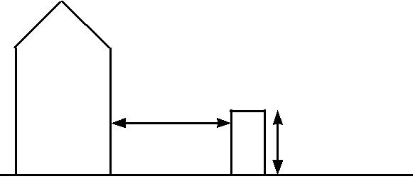
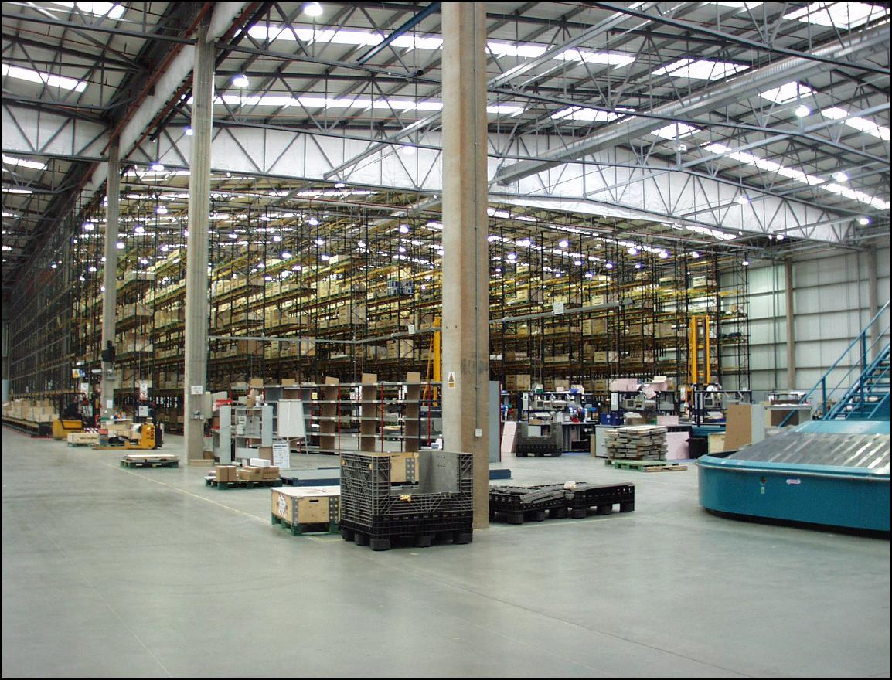
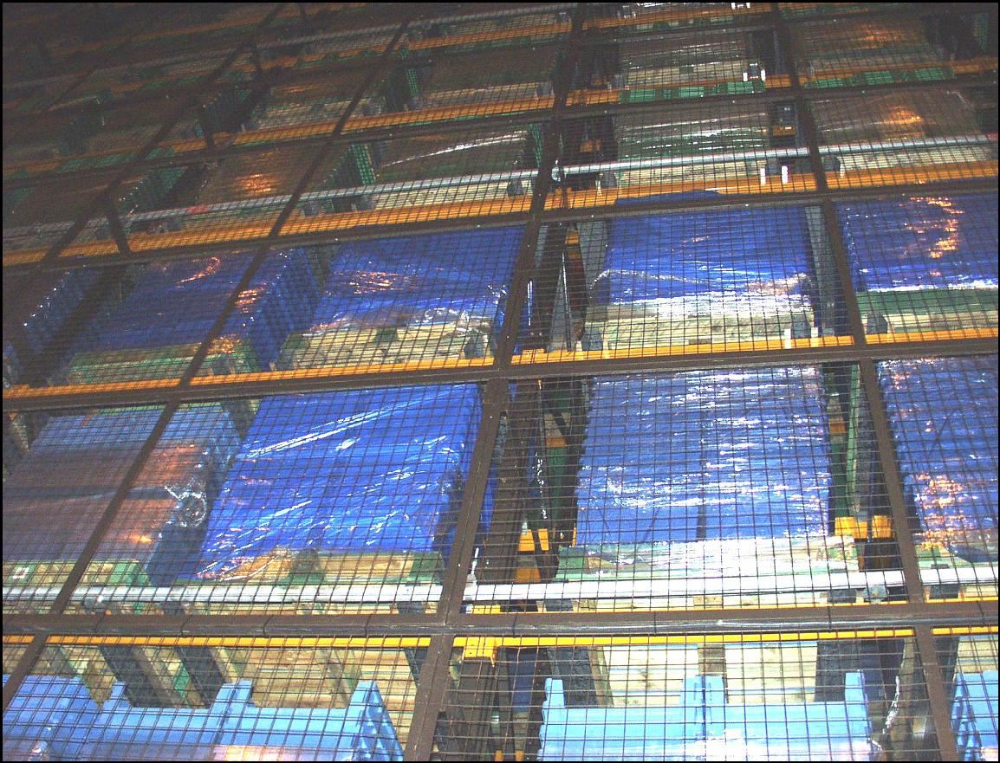
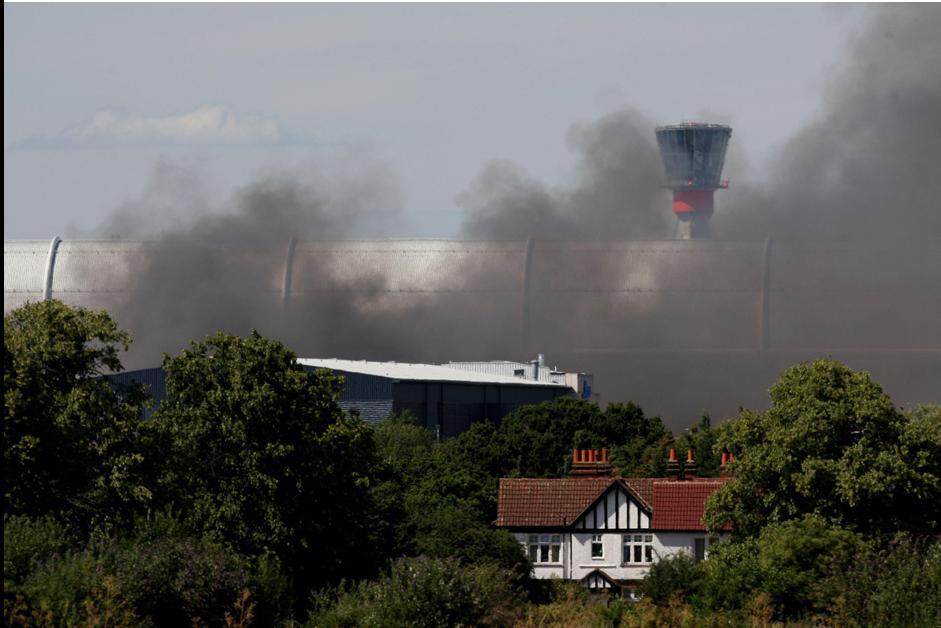

Risk Control

**  
RC18**

First published 1989 Version 03

Fire safety in warehouses

administered by

 IMPORTANT NOTICE

> This document has been developed through the RISCAuthority and
> published by the Fire Protection Association (FPA). RISCAuthority
> membership comprises a group of UK insurers that actively support a
> number of expert working groups developing and promulgating best
> practice for the protection of people, property, business and the
> environment from loss due to fire and other risks. The technical
> expertise for this document has been provided by the Technical
> Directorate of the FPA, external consultants, and experts from the
> insurance industry who together form the various RISCAuthority Working
> Groups. Although produced with insurer input it does not (and is not
> intended to) represent a pan-insurer perspective. Individual insurance
> companies will have their own requirements which may be different from
> or not reflected in the content of this document.
> 
> The FPA has made extensive efforts to check the accuracy of the
> information and advice contained in this document and it is believed
> to be accurate at the time of printing. However, the FPA makes no
> guarantee, representation or warranty (express or implied) as to the
> accuracy or completeness of any information or advice contained in
> this document. All advice and recommendations are presented in good
> faith on the basis of information, knowledge and technology as at the
> date of publication of this document.
> 
> Without prejudice to the generality of the foregoing, the FPA makes no
> guarantee, representation or warranty (express or implied) that this
> document considers all systems, equipment and procedures or
> state-of-the-art technologies current at the date of this document.
> 
> Use of, or reliance upon, this document, or any part of its content,
> is voluntary and is at the user’s own risk. Anyone considering using
> or implementing any recommendation or advice within this document
> should rely on his or her own personal judgement or, as appropriate,
> seek the advice of a competent professional and rely on that
> professional’s advice. Nothing in this document replaces or excludes
> (nor is intended to replace or exclude), entirely or in part,
> mandatory and/or legal requirements howsoever arising (including
> without prejudice to the generality of the foregoing any such
> requirements for maintaining health and safety in the workplace).
> 
> Except to the extent that it is unlawful to exclude any liability, the
> FPA accepts no liability whatsoever for any direct, indirect or
> consequential loss or damage arising in any way from the publication
> of this document or any part of it, or any use of, or reliance placed
> on, the content of this document or any part of it.

 CONTENTS

<table>
<tbody>
<tr class="odd">
<td>Scope</td>
<td></td>
<td>3</td>
</tr>
<tr class="even">
<td>Synopsis</td>
<td></td>
<td>3</td>
</tr>
<tr class="odd">
<td><blockquote>

Definitions

</blockquote></td>
<td>3</td>
<td></td>
</tr>
<tr class="even">
<td>Introduction</td>
<td>3</td>
<td></td>
</tr>
<tr class="odd">
<td><blockquote>

Recommendations

</blockquote></td>
<td>3</td>
<td></td>
</tr>
<tr class="even">
<td><blockquote>

1. Compliance with fire safety legislation

</blockquote></td>
<td>3</td>
<td></td>
</tr>
<tr class="odd">
<td>2.</td>
<td>Business continuity</td>
<td>4</td>
</tr>
<tr class="even">
<td>3.</td>
<td><blockquote>

Fire safety management

</blockquote></td>
<td>4</td>
</tr>
<tr class="odd">
<td>4.</td>
<td>Arson prevention</td>
<td>6</td>
</tr>
<tr class="even">
<td>5.</td>
<td>Compartmentation</td>
<td>7</td>
</tr>
<tr class="odd">
<td><blockquote>

6. Electricity, gas and other services

</blockquote></td>
<td>7</td>
<td></td>
</tr>
<tr class="even">
<td>7.</td>
<td>Fire protection</td>
<td>7</td>
</tr>
<tr class="odd">
<td>Checklist</td>
<td></td>
<td>11</td>
</tr>
<tr class="even">
<td><blockquote>

References

</blockquote></td>
<td>20</td>
<td></td>
</tr>
</tbody>
</table>

2

 SCOPE

> These recommendations concentrate on the key aspects of property
> protection in warehouses and storage premises and are intended to
> supplement the life safety issues that are addressed elsewhere, for
> example in HM Government Fire Safety Risk Assessment–Factories and
> Warehouses (ref 1).
> 
> Warehouse accommodation considered in this document includes
> commercial storage buildings on manufacturing sites and business parks
> but does not extend to retail warehouses which are routinely visited
> by members of the public or to premises designed to be let in small
> areas for the storage of personal effects.
> 
> Additional hazards may be associated with specialist warehouses, such
> as automated high bay warehouses, cold stores and premises used
> primarily for the storage of chemicals and other hazardous materials,
> and these are not specifically addressed in this document. Additional
> guidance should be sought regarding these premises, in addition to the
> material set out in this document.
> 
> Details of styles and construction of racking are outside the scope of
> this publication.
> 
> When new warehouse premises are being planned, reference should be
> made to the FPA Design Guide for the Fire Protection of Buildings:
> Warehouse and storage buildings 1: Design Principles (ref 2). Details
> regarding the planning and construction of new warehouse facilities
> set out in the Design Principles are not repeated in this publication.

 SYNOPSIS

> These recommendations concentrate on key aspects of property
> protection in warehouses and storage premises.
> 
> The provisions apply to forms of ambient temperature warehouse
> accommodation including storage buildings on manufacturing sites.
> 
> An emphasis is made on the need for the potential for and
> prevention/mitigation of arson to be a key element of the fire risk
> assessment for the premises, and for careful consideration to be given
> to the provisions for the fire and rescue service.
> 
> These recommendations refer to a number of other RISCAuthority
> documents which should be consulted for further advice.

 DEFINITIONS

> Arson
> 
> The deliberate setting of fires by intruders or people with legitimate
> access to the premises, which is referred to as wilful fire raising in
> Scotland.
> 
> Compartment
> 
> An area within a building defined by impervious boundaries that
> provides a designated degree of fire resistance.
> 
> Composite panel
> 
> A panel composed of an insulating core material encapsulated by steel
> facings. Insulating cores may comprise polyurethane, polyisocyanurate,
> modified phenolic, polystyrene or mineral wool.

 INTRODUCTION

> Over the past few years the number and size of warehouses has
> increased dramatically, especially in locations on key transport hubs
> or adjacent to motorway junctions. The materials stored in
> 
> these facilities range from small electronic items to books, CDs and
> engineering products for example. The number and wide variety of items
> of stock, activities which may be undertaken (for example heated
> shrink wrapping and charging of electric vehicles) and the associated
> numbers of vehicle movements present numerous opportunities for
> incidents to occur in the absence of a rigorous fire safety management
> regime.
> 
> Whilst the incidence of fires in warehouses is generally low, the size
> of the buildings and the volumes of combustible material in storage
> within result in many of the fires becoming major conflagrations which
> pose challenges for fire and rescue services and result in significant
> property losses and disruption to business continuity.
> 
> A detailed fire risk assessment to take account of property
> protection, as well as life safety, is a key element of an effective
> fire safety strategy. In some cases an assessment in compliance with
> the Dangerous Substances and Explosive Atmospheres (DSEAR) Regulations
> 2002 will also need to be undertaken. These assessments will identify
> the fire hazards and the potential for property and business
> interruption losses and lead to the preparation of an effective risk
> control programme for the premises. The assessment should consider the
> structure of the building and the combustibility and/or flammability
> of the products stored both within and outside the premises. Vigilance
> with regard to deliberate fire setting must also be maintained, with
> arson prevention also being an important part of the assessment.
> 
> It is important to recognise that in many warehouses the products
> stored and the mode of storage, together with the associated fire
> hazards, may change over remarkably short periods of time and thus the
> fire risk assessment process needs to be an ongoing activity. This
> will ensure that any alterations to the overall fire risk are
> correctly identified so that the fire safety strategy may be modified
> as necessary.
> 
> Particular attention needs to be given to some common activities that
> are carried out in existing warehouses and thus the recommendations
> set out in this document should be read together with those relating
> to hot work (RC7), fork-lift trucks (RC11), shrink wrapping (RC17) and
> the charging of electric vehicles (RC59) (refs 3-6)

RECOMMENDATIONS

> 1\. Compliance with fire safety legislation

1.  > A suitable and sufficient fire risk assessment for the premises
    > should be undertaken in compliance with the Regulatory Reform
    > (Fire Safety) Order 2005 (or equivalent legislation in Scotland
    > and Northern Ireland) (refs 7-11). The combustibility of the stock
    > and packaging, the nature of the operations, the internal layout
    > and the method of storage have a major influence on the hazards
    > presented. Measures that should be considered include:
    
      - > physical segregation of the warehouse from manufacturing areas
        > and other operations being carried out on site;
    
      - > suitable fire detection and warning systems in case of fire
        > (see section 7.1);
    
      - > the installation of sprinkler and other fixed fire suppression
        > systems;

3

  - > the provision of appropriate portable fire fighting equipment;

  - > development of an emergency action plan to protect life and
    > property and ensure the continuing functioning of the business in
    > the case of fire; and

  - > staff training in the actions to take in the event of fire,
    > including the safe shut down of conveyors or similar equipment
    > used in the area, and evacuation of the premises.

<!-- end list -->

1.  An assessment in compliance with the Dangerous Substances and
    Explosive Atmospheres Regulations 2002 (DSEAR) (ref 12) should be
    undertaken where hazardous materials such as significant quantities
    of flammable liquids, oils, compressed gases or dusts are being
    stored. The operation of the warehouse should take into account the
    findings of the DSEAR assessment which should identify the hazardous
    materials that are present and relevant hazard zones where there may
    be potential for explosible quantities of flammable liquid vapours
    or dusts to accumulate.

> 2\. Business continuity
> 
> Even a small fire in a warehouse can have a disproportionate effect on
> a business and in some cases contamination from such an event can be
> sufficiently severe to result in severe disruption, with associated
> loss of orders, jobs, income and profit.

1.  > All organisations should take steps to ensure the continued smooth
    > running of their business by making a suitable emergency plan.
    > Guidance for this is set out in Business Resilience: A Guide to
    > protecting your business and its People (ref 13). The emergency
    > plan should address the implications of a fire, flood or other
    > perceived disaster on all facets of the business model. It should
    > indicate the lines of communication that should be followed and
    > the contact details for specialist assistance, providers of
    > alternative accommodation and suppliers of manufacturing plant.

2.  > When complete, the emergency plan should be tested either fully or
    > by means of a table top exercise, with the results being assessed
    > and amendments made to the plan as necessary.

3.  > Consideration may be given to applying commercially available
    > computer programmes, such as the ROBUST software (Resilient
    > Business Software Toolkit) that is available free of charge (ref
    > 14), or other appropriate products, to develop and check the
    > adequacy of the plan.

> 3\. Fire safety management

1.  > Close liaison should be established with the fire and rescue
    > service from the time of the planning stage, especially in cases
    > where storage is being planned at high level. The service will
    > need to visit the site to establish the location and extent of
    > water supplies available in the locality. They will also need to
    > be provided with details of water sprinklers and any other
    > automatic fire suppression systems that have been installed.

2.  > The benefits of a comprehensive fire safety management regime
    > coupled with appropriate fire safety procedures and adequate staff
    > training that are observed and embraced by all staff cannot be
    > over-emphasised.

<!-- end list -->

3.  Each goods inwards and despatch area should be clearly defined.
    Where the risk assessment identifies an increased fire hazard,
    separation should be provided from the warehouse by compartment
    walls, floors and ceilings with an appropriate level of fire
    resistance.

> *Housekeeping*

4.  The premises should be kept in a clean and orderly condition at all
    times and goods or waste materials should not be stored in aisles
    and other designated clear areas.

5.  Stocks of combustible packaging materials in the open warehouse
    should be kept to a minimum; bulk supplies should be stored in a
    separate building or in a separate fire compartment within the main
    warehouse.

6.  All loose-fill combustible packaging such as shredded paper,
    wood-wool and polystyrene beads should be contained in steel bins
    fitted with steel lids which are kept closed when the container is
    not in use.

7.  The internal storage of idle pallets should be kept to a minimum,
    unless external storage is impracticable or there is a significant
    risk of external items being the target for an arson attack.

8.  All waste materials should be swept up and removed at the end of
    each working period. Particular attention should be given to goods
    inwards and despatch areas.

9.  Combustible materials or items awaiting delivery should not be
    allowed to remain on loading docks or beneath external canopies when
    the premises are unoccupied.

10. Combustible materials, including idle pallets, stored outside should
    not be stacked more than 4m high or be stored within 10m of a
    building. Where these conditions cannot be met, the insurer should
    be consulted.

> Combustible Warehouse 10m minimum goods not
> 
> stacked more than 4m high

11. Where plastic pallets are in use, the storage arrangements should be
    subject to a specific fire risk assessment.

12. External storage should be sited at least 15m from hazardous
    installations such as transformers, flammable liquid stores and
    liquefied petroleum gas tanks.

13. All combustible waste removed from the warehouse should be contained
    in secure, enclosed metal skips or bins with a compactor being used
    where necessary. Where the use of open-topped skips is necessary,
    they should be located 10m clear of the buildings and any external
    storage. Further advice regarding fire safety and waste materials is
    set out in an FPA publication with this title (ref 15).

14. The area within 10m of the building(s) and external storage should
    be kept clear of undergrowth. The use of chemical weed control
    formulations containing chlorates should be avoided.

4

15. > Combustible materials should be located at least 2m from boundary
    > walls or fences.

16. > The burning of rubbish in the open should be strictly prohibited.

17. > Defined areas should be provided for parking cars. Similar
    > provisions should be available for delivery vehicles and trailers
    > to indicate where they should be parked except when loading or
    > unloading. Parking should be at least 10m away from buildings,
    > hazardous installations and loading areas.

*Closing time inspections*

18. > Most major fires in industrial and commercial premises occur
    > outside normal working hours; closing time inspections should
    > therefore be instituted to form a key element of an effective risk
    > control programme.

19. > A detailed inspection of the warehouse should be completed and
    > logged by a responsible person at the end of each period of work
    > to ensure that the premises are left in a safe and secure
    > condition. In particular, this will include checks that:
    
      - > any conveyors and packing process have been stopped and made
        > safe;
    
      - > all accumulated rubbish has been removed;
    
      - > plant and services have been isolated as required;
    
      - > fire doors and shutters are closed; and
    
      - > security measures are in place.

> *Hot work*

20. > Unless unavoidable, hot work such as welding, flame cutting and
    > similar activities should not take place in a warehouse. If for
    > justified reasons this cannot be achieved, all hot work activities
    > should be conducted under an effective Permit to Work system and
    > in strict accordance with the RISCAuthority document RC7:
    > Recommendations for hot work (ref 3).

> 3.21 All shrink wrapping operations should be carried out in
> accordance with the requirements of RC17:
> 
> Recommendations for fire safety in shrink wrapping processes (ref 5).

22. > As well as the hazards directly associated with hot work, other
    > contractors’ operations (such as the laying of flooring

> with volatile adhesives) may result in an increase in risk to the
> premises if allowed to proceed without suitable management controls.
> An additional assessment of the hazards posed by all contractors’
> operations should be carried out and any necessary control measures
> introduced before the operations commence.
> 
> *Heating*

23. > Space heating systems should be designed, installed and maintained
    > in accordance with the manufacturer’s instructions.

24. > The use of portable heaters and fans should be
avoided.

|                                   |                                         |                          |
| --------------------------------- | --------------------------------------- | ------------------------ |
| 3.25 Central heating              | boilers should preferably be located in |                          |
| a separate fire                   | compartment,                            | clear of all combustible |
| materials, and providing at least | 60 minutes’ fire separation             |                          |

> from the remainder of the premises. Where this is not possible, fixed
> gas or oil fired heat exchange units should
> 
> be located near an external wall and be provided with guard rails,
> allowing a clear space of at least 1m from all surfaces of the
> appliance. Further information regarding oil fired boilers is set out
> in RISCAuthority document RC9:
> 
> Recommendations for oil-fired heating installations
> 
> (ref 17).

26. Flue pipes from heating appliances should take the most direct route
    from the building and should not penetrate fire compartment walls
    unless absolutely unavoidable. Where it is necessary for flues to
    pass through fire compartment walls or floors, proprietary sleeves,
    penetration seals and dampers should be fitted as set out in the FPA
    Design Guide: Protection of Openings and service penetrations from
    fire (ref 18). Where flues pass through combustible material, it
    should be cut away for a distance of at least 150mm from the duct
    and the space filled with non-combustible insulation.

27. Where it is necessary to route flue pipes through or near to storage
    racking or mezzanine floors, suitable guards should be fitted to
    provide a clear space of at least 1m from combustible or flammable
    materials.

28. Outlets from flues should be positioned so as to avoid tarry
    deposits, especially those from biomass boilers, accumulating on
    roofs.

29. Overhead heaters should be sited so as to provide at

> least 2m clearance from combustible materials. Heaters should not be
> positioned so as to direct the hot air towards nearby composite panel
> walls, whether these form internal or external elements of structure.
> The siting of overhead heaters should be reassessed when alterations
> to storage arrangements or the type of stock or its packaging are
> being considered and at times when the fire risk assessment for the
> warehouse is being reviewed.
> 
> *Smoking*

30. In accordance with legislation in England, Wales, Scotland and
    Northern Ireland, smoking in warehouses should be strictly
    prohibited and notices to this effect prominently displayed. A
    designated safe smoking area should be provided, and where
    practicable this should be at least 10m from the building and other
    combustible items. Further guidance is set out in RISCAuthority
    publication RC51:

> Recommendations regarding smoking at work (ref 19).

31. The designated smoking area should be remote from entrances to the
    building and not be located beneath a canopy or low slung eaves.

> *Staff procedures and training*

32. The correct procedures for raising the alarm and summoning the fire
    and rescue service should be established and form part of the staff
    fire safety training programme.

33. Induction and periodic refresher training courses should be provided
    in the use of fire extinguishers and the procedures to be followed
    when discovering a fire and responding to a fire alarm.

34. Where staff do not have English as a first language it should be
    established that fire safety training has been properly understood.
    Where necessary, interpreters may need to be provided at training
    events and supporting

5

> literature and notices be produced in appropriate languages.

35. > Training should be given to selected personnel in the checking and
    > operation of the sprinkler and/or other fixed fire fighting
    > systems where appropriate in accordance with manufacturers
    > instructions.

36. > An auditing programme should be established in which all fire
    > protection measures and procedures are monitored. Any deficiencies
    > arising from the audit should be reported and actioned as soon as
    > possible.

37. > Staff should be instructed to report to a named authority any
    > impairment in fire protection and safety systems. This is
    > particularly important where dealing with sprinkler installations.
    > Where the latter have become, or are to be, impaired, insurers and
    > the fire and rescue service should be informed immediately. Any
    > additional fire precautions, as identified by the insurers and a
    > fire risk assessment carried out for this purpose, should be
    > maintained throughout the period of impairment.

*Lift trucks*

38. > Lift trucks of various styles are commonly used in warehouse
    > operations. Whether powered by petrol, diesel fuel, batteries or
    > liquefied petroleum gas (LPG), significant fire hazards may arise.
    > Relevant staff should be trained in their use. For further
    > guidance, reference should be made to RC11: Recommendations for
    > the use of fork-lift trucks (ref 4).

39. > All trucks should be designed to be safe for use in any hazard
    > zones identified in the warehouse as a result of the DSEAR
    > assessment.

40. > The charging of battery powered vehicles and the management of
    > fork lift trucks and similar mechanisms designed for use within
    > warehouses should be in accordance with RISCAuthority document
    > RC11:

> Recommendations for the use of fork-lift trucks (ref 4).

41. > Where trucks are powered by LPG, cylinders should be changed in
    > the open air outside the buildings.

*Hazardous goods*

42. > Hazardous materials should be identified and be subject to a DSEAR
    > assessment (see paragraph 1.2 and ref 12).

43. > Where gas cylinders are stored or in use, the guidance in RC8:
    > Recommendations for the storage, use and handling of common
    > industrial gases in cylinders including LPG and RC49:
    > Recommendations for reducing business interruption, Part 1:
    > Acetylene cylinders involved in fires should be observed (refs 16
    > and 20).

44. > Where significant quantities of hazardous materials such as
    > oxidising chemicals, flammable liquids and aerosol products are
    > stored, information regarding their quantities, locations and mode
    > of storage should be readily available to the emergency services.
    > Before storing such materials the insurers should be consulted, in
    > order that necessary risk control measures can be clearly
    > established and implemented. (Further information regarding the
    > storage of oxidising chemicals, flammable liquids and aerosol

> products are set out in RISCAuthority Recommendations refs 21, 22 and
> 23 respectively.)

45. > Only the minimum volumes of flammable liquids should be held
    > within warehouse premises. Where it is necessary to store
    > flammable liquids within buildings, use should be made of bunded
    > pallets or similar provisions to retain any spillage.

46. > Hazardous goods should be thoroughly inspected on arrival. A safe
    > and secure holding area at least 10m from any building or plant
    > should be available to quarantine any defective or damaged
    > containers pending their safe disposal. Provisions to deal with
    > spillages and leakage should be available and staff trained in
    > their use.

<!-- end list -->

4.  > Arson prevention

<!-- end list -->

1.  Arson is the most significant cause of major fires in industrial and
    commercial premises and should therefore form a key element of the
    warehouse fire risk assessment. Further background material and
    information regarding arson risk assessments is available in an FPA
    publication,

> The Prevention and Control of Arson (ref 24).

2.  The possibility of deliberate fire raising from outside the
    building, by intruders or by staff should not be forgotten. Further
    advice is provided in RC48: The protection of premises from
    deliberate fire raising (ref 25).

3.  In many premises work continues during nights and over weekends when
    fewer staff may be present to receive deliveries and despatch goods.
    At these times consideration may need to be given to heightened
    security measures to detect intruders and potential fire setters
    outside the premises.

4.  External storage should be kept to a minimum but where it is
    necessary (see paragraphs 3.8 and 3.9), the amount of goods, idle
    pallets, tote boxes, trays and similar items should not be unduly
    exposed to malicious ignition.

5.  Fuel dispensing pumps, oil and other flammable liquid tanks should
    be secured out of working hours.
    
    6.  > The security threat to the building(s) and the site as a whole
        > should be one of the focal points of the arson risk
        > assessment. On the basis of this, decisions should be taken on
        > the nature of the protection required, which should be
        > proportionate to the risks identified. This will have a dual
        > effect of reducing the risk of theft and of arson. In

> most cases, effective security will comprise a combination of
> measures. Typically, this will involve a combination of physical
> protection and electronic security systems, such as intruder alarms
> and security lighting, tailored to the needs of the individual
> premises or site concerned. For high security warehouses, measures
> including total perimeter fencing, manned guarding and closed circuit
> television (CCTV) equipment will need to be considered.

7.  Personnel access control should be carefully considered as an
    essential component of the security programme. In the case of high
    value or high risk warehouses the need for the premises to be secure
    from the outside during business hours may need to be considered and
    the measures implemented will need to be compatible with the
    requirements for means of escape from within in case of fire.

6

8.  Toilet and refreshment facilities should be provided for delivery
    drivers and other visitors without the need for them to enter or
    pass through the warehouse. In some cases provision should also be
    made for a meeting room in this area.

9.  Shutters on vehicle bays should be closed when vehicles have left.

> 5 Compartmentation

1.  > New buildings should be constructed in accordance with the
    > guidance set out in The FPA Design Guide for the fire protection
    > of buildings. Warehouse and storage buildings: 1 Design principles
    > (ref 2).

2.  > Care must be taken to ensure that all holes around piped services
    > and cables passing through fire compartment walls, floor and
    > ceilings of a warehouse are suitably fire stopped:

> 5.2.1 Any holes or openings made to permit the passage of services
> should be protected as set out in the FPA Design Guide: Protection of
> openings and service penetrations from fire (ref 26).

2.  > Particular attention should be paid to stopping penetrations
    > through composite panels. Specific recommendations are contained
    > in section 4.2 of the Code of Practice for Fire risk minimisation
    > guidance for the food industry (ref 27).

<!-- end list -->

3.  > External oil tanks for boilers should be located as set out in
    > RC57: Storage and use of highly flammable liquids in external
    > fixed tanks (ref 28). Valves controlling the fuel supply from the
    > tanks should cut off the oil supply automatically in the event of
    > a fire, or on actuation of the fire alarm.
    
    4.  > Hazardous and business critical areas should be identified.
        > Such areas may include packing operations, plant rooms, boiler
        > rooms, electrical transformer rooms and switchrooms, IT
        > facilities, vehicle maintenance bays and truck charging areas.
        > Where these areas are identified from a risk assessment,
        > consideration should be given to enclosing them with elements
        > of structure providing at least 60 minutes’ fire resistance.

> 6 Electricity, gas and other services
> 
> 6.1 Electrical installations should be designed, installed and
> periodically tested by a competent electrician in accordance with the
> current edition of BS 7671 (the IET Wiring Regulations) (ref 29).
> Inspections should be carried out on a risk assessed basis as
> recommended in the Periodic Inspection Report.

2.  > Lighting should be installed so that luminaires are suspended over
    > walkways rather than directly above combustible stock. Wherever
    > practicable, luminaires should be located at least 0.5m from
    > stored goods.

3.  > The use of light fittings with integral containment barriers made
    > of tempered or borosilicate glass is recommended. High intensity
    > discharge (HID) lamps are commonly encountered in warehouses and
    > should always be fully enclosed even where shatter protected lamps
    > are fitted. This is to prevent pieces of glass from dropping onto
    > combustible materials below in the event of a lamp shattering.
    > Further information regarding lighting installations is set out in
    > RC37: Recommendations for

> the control of fire hazards arising from electrical lighting in
> commercial and industrial premises (ref 30).

4.  > Portable electrical equipment should be inspected and tested at
    > least in accordance with HS(G) 107 (ref. 31) and/ or the IET Code
    > of Practice for in-service inspection and testing of electrical
    > equipment (ref. 32). A risk assessment should determine the
    > periodicity of the actual programme of inspection and testing.

5.  > Portable electrical appliances must be powered from electrical
    > sockets provided for this purpose; temporary arrangements should
    > not be made to allow powering of appliances directly from control
    > panels.

6.  > Transformers and associated electrical switchgear should be
    > located in fire compartments kept clear of all storage and
    > separated from the warehouse so as to provide at least 60 minutes’
    > fire resistance.

7.  > Ancillary switchgear and plant rooms should be kept clear of all
    > storage; notices to this effect should be displayed prominently.
    > Plant rooms should be kept locked with access only available to
    > authorised personnel.

8.  > Control units should be located in non-combustible cabinets
    > providing at least 60 minutes fire resistance and be protected by
    > suitable guard rails to prevent damage by lift trucks and the
    > like.

9.  > Electrical fittings should be mounted on a non-combustible board
    > and not be attached directly to a composite panel.

10. > Electrical cables passing through composite panels should be
    > carried in non-conductive conduit.

11. > Where electrical cables and service pipes are considered to be
    > vulnerable to impact from fork-lift trucks or other mechanical
    > damage, protection should be provided. This is particularly
    > relevant to oil and gas services and water pipes.

12. > All service pipes should be correctly identified in accordance
    > with BS 1710 (ref 33) and be provided with suitable isolation
    > valves as required.

13. > Where practicable, oil and gas services should be run externally.
    > Suitable protection such as plastic grommets or sleeves should be
    > provided to prevent chaffing where electrical cables enter
    > buildings through metal clad composite panels.

14. > Measures should be taken to prevent frost damage to water pipes,
    > thus water pipes in unheated areas should be lagged or trace
    > heated. Portable heaters should not be provided for this purpose.

<!-- end list -->

7.  > Fire protection

<!-- end list -->

1.  The warehouse should be protected by an automatic fire detection and
    alarm system designed to take into account the need for property
    protection, and be installed by an engineer certificated by an
    independent UKAS accredited third party certification body as
    complying with the requirements of LPS 1014 (ref 34) or equivalent
    standard. The installation should be to a recognised category of
    installation in accordance with BS 5839-1 (ref 35) as determined by
    a risk assessment and in consultation with the insurer.

7

2.  The automatic fire detection and alarm system should be monitored
    either on-site or by an off-site alarm receiving centre certificated
    by an independent UKAS accredited third party certification body as
    complying with the requirements of LPS 1020 (ref. 36) or equivalent
    standard, and operating in accordance with a Category II facility as
    defined in BS 5979 (ref 37).

3.  The installation should be periodically serviced and maintained by a
    competent engineer certificated by an independent UKAS accredited
    third party certification body as complying with the requirements of
    LPS 1014 (ref. 34) or equivalent standard, in accordance with BS
    5839-1 (ref 35).

4.  Where conveyors, automatic packaging or similar equipment is in use,
    these should be linked to the automatic fire detection and alarm
    system so as to halt the movement of items when the system actuates.

5.  It is important that arrangements are made to provide the best
    possible access for firefighting. Arrangements should be made to
    provide prompt access to the site on the arrival of the fire and
    rescue service. Firefighters should be met by security personnel or
    a designated member of staff who should have the gates or barriers
    open awaiting their arrival.

6.  Externally, a clear route should be maintained to allow high reach
    vehicles and pumping appliances to gain suitable access to the
    warehouse(s). In the case of small

> buildings (up to 2000m2) access should be available to
> within 45m of all parts of the perimeter of the building;
> alternatively, access should be available to 15% of the perimeter. The
> requirements for larger warehouses are set out in BS 9999 (ref 38) and
> Approved Document B (Fire Safety) Incorporating Insurers’ Requirements
> for Property Protection (ref 39).

7.  > Within the warehouse, a clear pathway no less than 0.5m wide
    > should be maintained along the external walls and, where
    > achievable, aisles should be at least 2.5m wide. The areas of
    > undivided free standing storage should be limited so as not to
    > restrict access for fire fighting and be determined by risk
    > assessment.

<!-- end list -->

8.  Fire doorsets and shutters should be installed by a competent
    engineer certificated by an independent UKAS accredited third party
    certification body as complying with the requirements of LPS 1271
    (ref. 40) or equivalent standard.

9.  Where fire doors are installed for the protection of openings in
    compartment walls, a clear radius on each side of the opening should
    be created in which no combustible goods are placed, to prevent the
    spread of fire by radiated heat when the doors are opened. The safe
    distances involved will vary considerably, depending on the size and
    type of door or shutter. Guidance is given in Part 4 of the Design
    Guide for the Fire Protection of Buildings (ref 2). Goods must not
    obstruct the free movement of fire doors.

10. Information should be provided for the fire and rescue service at a
    prominent location to include:
    
      - > the layout of the site, including plans of the building;
    
      - > the location of emergency shutdown points for conveyors and/or
        > automated operations;
    
      - > the location of the indicator panel for the automatic fire
        > detection and alarm installation;
    
      - > details of any automatic fire suppression system(s) and the
        > location of their controls (eg stop valves for the sprinkler
        > system);
    
      - > details of ventilation systems;

Clear pathways and aisles should be maintained within the warehouse
(7.7)

8

  - > the nature and location of any hazardous substances on the
    > premises;

  - > contact details for staff who may need to be consulted; and

  - > the location of hydrants, rising mains or other sources of water
    > on site or nearby for firefighting purposes.

<!-- end list -->

10. Water supplies should be in the form of one or more of the
    following:
    
      - > hydrants provided by a water company on street mains;
    
      - > private hydrants designed in accordance with BS 750 (ref 41),
        > ideally forming part of a ring main system. Hydrant outlets
        > should be positioned not more than 70m from an entry to a
        > building on the site and not more than 150m apart. They should
        > preferably be sited immediately adjacent to roadways or hard
        > standing facilities provided for fire service appliances and
        > not less than 6m from the building or risk so that they remain
        > usable during a fire;
    
      - > a static or natural water supply capable of providing a
        > minimum capacity of 67,500 litres.

11. Serious consideration should be given to the installation of a water
    sprinkler installation when the facility is at the design stage.
    Sprinkler systems should be designed, installed, commissioned and
    maintained in accordance with the LPC Sprinkler Rules incorporating
    BS EN 12845 (ref 42) by a company certificated by an independent
    UKAS accredited third party certification body as complying with the
    requirements of LPS 1048 and 1050 (refs 43 and 44) or equivalent
    standards.

12. In-rack sprinkler heads should be installed where

> appropriate and where plastic pallets are in use a foam enhanced
> sprinkler installation should be utilised.

14. Consideration should be given to installing local fire suppression
    systems where they may be beneficial, such as to protect the
    electric motors of auto-stacker systems.

15. In addition to an automatic sprinkler installation or other fixed
    fire suppression system, a suitable number of appropriate portable
    fire extinguishers should be available and immediately accessible in
    the case of a fire. Such portable extinguishers should be approved
    and certified by an independent, third party certification body and
    be installed in accordance with BS 5306-8 (ref. 45) and inspected
    and maintained in compliance with BS 5306-3 (ref 46).

> 7.16 Fire extinguishing appliances should be positioned at prominent
> fire points, usually sited on an exit route. Extinguishers should be
> prominently signed and in a warehouse high level signs may also be
> needed to indicate their location to staff. A weekly inspection of all
> fire points should be carried out, to ensure that extinguishers are in
> place, undamaged and readily accessible.

17. Smoke venting systems may be installed in warehouses for life safety
    and property protection purposes, and may be a requirement of the
    fire and rescue service. Venting helps to prevent smoke logging,
    thereby assisting the means of escape and the fire and rescue
    service in their firefighting efforts.

18. When smoke venting is installed within a sprinkler-protected
    building, expert guidance should be sought to ensure that it does
    not interact adversely with the operation of the sprinklers.

In rack sprinkler heads should be installed where appropriate (7.13)

9

<table>
<tbody>
<tr class="odd">
<td><blockquote>

Clothing warehouse fire

</blockquote></td>
<td></td>
<td><blockquote>

Thanks to their well practised safety procedures, staff were

</blockquote></td>
<td></td>
<td></td>
<td></td>
</tr>
<tr class="even">
<td><blockquote>

Up to half of the stock of a major UK clothing retailer was

</blockquote></td>
<td><blockquote>

quickly evacuated from the building and no-one was hurt.

</blockquote></td>
<td></td>
<td></td>
<td></td>
<td></td>
</tr>
<tr class="odd">
<td></td>
<td><blockquote>

Disruption to the customer’s distribution network was kept to

</blockquote></td>
<td></td>
<td></td>
<td></td>
<td></td>
</tr>
<tr class="even">
<td><blockquote>

destroyed in a fire at a huge distribution centre. Fire fighters with

</blockquote></td>
<td></td>
<td></td>
<td></td>
<td></td>
<td></td>
</tr>
<tr class="odd">
<td></td>
<td><blockquote>

a minimum.

</blockquote></td>
<td></td>
<td></td>
<td></td>
<td></td>
</tr>
<tr class="even">
<td><blockquote>

some 15 fire engines from Warwickshire and Leicestershire

</blockquote></td>
<td></td>
<td></td>
<td></td>
<td></td>
<td></td>
</tr>
<tr class="odd">
<td></td>
<td></td>
<td></td>
<td></td>
<td></td>
<td></td>
</tr>
<tr class="even">
<td><blockquote>

fought the fire at the 440,000 sq ft warehouse, which was

</blockquote></td>
<td></td>
<td></td>
<td></td>
<td></td>
<td></td>
</tr>
<tr class="odd">
<td></td>
<td></td>
<td></td>
<td></td>
<td></td>
<td></td>
</tr>
<tr class="even">
<td><blockquote>

extensively damaged.

</blockquote></td>
<td></td>
<td></td>
<td></td>
<td></td>
<td></td>
</tr>
<tr class="odd">
<td><blockquote>

A spokesman for the company said arrangements were being

</blockquote></td>
<td></td>
<td></td>
<td></td>
<td></td>
<td></td>
</tr>
<tr class="even">
<td><blockquote>

made to continue supplies to its UK stores. Contingency

</blockquote></td>
<td></td>
<td></td>
<td></td>
<td></td>
<td></td>
</tr>
<tr class="odd">
<td><blockquote>

planning had resulted in about half of the clothing chain’s

</blockquote></td>
<td></td>
<td></td>
<td></td>
<td></td>
<td></td>
</tr>
<tr class="even">
<td><blockquote>

stock in the UK being located elsewhere, including at a smaller

</blockquote></td>
<td></td>
<td></td>
<td></td>
<td></td>
<td></td>
</tr>
<tr class="odd">
<td><blockquote>

warehouse on the same site, and was undamaged. Some lines

</blockquote></td>
<td></td>
<td></td>
<td></td>
<td></td>
<td></td>
</tr>
<tr class="even">
<td><blockquote>

were, however, expected to be in short supply at certain stores.

</blockquote></td>
<td></td>
<td></td>
<td></td>
<td></td>
<td></td>
</tr>
<tr class="odd">
<td><blockquote>

The facility destroyed by the fire

</blockquote></td>
<td><blockquote>

was opened in 2000. It

</blockquote></td>
<td><blockquote>

Rui

</blockquote></td>
<td></td>
<td></td>
<td></td>
</tr>
<tr class="even">
<td><blockquote>

consisted of a single-storey, steel-constructed warehouse and

</blockquote></td>
<td></td>
<td></td>
<td></td>
<td></td>
<td></td>
</tr>
<tr class="odd">
<td></td>
<td><blockquote>

Vieira/PA

</blockquote></td>
<td></td>
<td></td>
<td></td>
<td></td>
</tr>
<tr class="even">
<td><blockquote>

a two-storey office block.

</blockquote></td>
<td></td>
<td></td>
<td></td>
<td></td>
<td></td>
</tr>
<tr class="odd">
<td></td>
<td></td>
<td></td>
<td></td>
<td></td>
<td></td>
</tr>
<tr class="even">
<td></td>
<td></td>
<td></td>
<td></td>
<td></td>
<td></td>
</tr>
</tbody>
</table>

Fire at Heathrow warehouse

A blaze broke out in a warehouse at lunchtime and fire crews from
stations in the area surrounding the UK’s busiest airport were called to
assist the airport fire fighting crews. In all, more than 20 appliances
and more than 100 firefighters were in attendance. The fire was rapidly
brought under control.

The LFB added that the cause of the warehouse blaze was unknown, but
media reports suggested a forklift truck caught fire, leading to a
number of gas cylinders it was carrying exploding. No-one was believed
to have been hurt but witnesses reported a small number of explosions,
probably from gas cylinders on the vehicle.

|                                                |
| ---------------------------------------------- |
| Steve Parsons/PA Wire |

Smoke from the fire could be seen from several

miles away and roads around the cargo area were closed, leading to
serious traffic problems.

Despite the size of the blaze and the amount of smoke, services from
Heathrow and access to the terminals were unaffected. The only
disruption was to people heading to Terminal 4, who were requested to
use a different route to get there.

10

8.  > Checklist

<table>
<tbody>
<tr class="odd">
<td></td>
<td></td>
<td><blockquote>

<strong>Yes</strong>

</blockquote></td>
<td><blockquote>

<strong>No</strong>

</blockquote></td>
<td><blockquote>

<strong>N/A</strong>

</blockquote></td>
<td><blockquote>

<strong>Action required</strong>

</blockquote></td>
<td><blockquote>

<strong>Due date</strong>

</blockquote></td>
<td><strong>Sign</strong></td>
</tr>
<tr class="even">
<td></td>
<td></td>
<td></td>
<td></td>
<td></td>
<td></td>
<td></td>
<td><strong>on completion</strong></td>
</tr>
<tr class="odd">
<td></td>
<td></td>
<td></td>
<td></td>
<td></td>
<td></td>
<td></td>
<td></td>
</tr>
<tr class="even">
<td><blockquote>

8.1

</blockquote></td>
<td><blockquote>

Compliance with fire safey legislation

</blockquote></td>
<td></td>
<td></td>
<td></td>
<td></td>
<td></td>
<td></td>
</tr>
<tr class="odd">
<td></td>
<td></td>
<td></td>
<td></td>
<td></td>
<td></td>
<td></td>
<td></td>
</tr>
<tr class="even">
<td><blockquote>

8.1.1

</blockquote></td>
<td><blockquote>

Has a suitable and sufficient fire risk assessment for the premises been undertaken

</blockquote></td>
<td></td>
<td></td>
<td></td>
<td></td>
<td></td>
<td></td>
</tr>
<tr class="odd">
<td></td>
<td><blockquote>

in compliance with the Regulatory Reform (Fire Safety) Order 2005 (or equivalent

</blockquote></td>
<td></td>
<td></td>
<td></td>
<td></td>
<td></td>
<td></td>
</tr>
<tr class="even">
<td></td>
<td><blockquote>

legislation in Scotland and Northern Ireland)? (1.1)

</blockquote></td>
<td></td>
<td></td>
<td></td>
<td></td>
<td></td>
<td></td>
</tr>
<tr class="odd">
<td></td>
<td></td>
<td></td>
<td></td>
<td></td>
<td></td>
<td></td>
<td></td>
</tr>
<tr class="even">
<td><blockquote>

8.1.2

</blockquote></td>
<td><blockquote>

Has an assessment been undertaken in compliance with the Dangerous

</blockquote></td>
<td></td>
<td></td>
<td></td>
<td></td>
<td></td>
<td></td>
</tr>
<tr class="odd">
<td></td>
<td><blockquote>

Substances and Explosive Atmospheres Regulations 2002 (DSEAR) where

</blockquote></td>
<td></td>
<td></td>
<td></td>
<td></td>
<td></td>
<td></td>
</tr>
<tr class="even">
<td></td>
<td><blockquote>

necessary? (1.2)

</blockquote></td>
<td></td>
<td></td>
<td></td>
<td></td>
<td></td>
<td></td>
</tr>
<tr class="odd">
<td></td>
<td></td>
<td></td>
<td></td>
<td></td>
<td></td>
<td></td>
<td></td>
</tr>
<tr class="even">
<td><blockquote>

8.2

</blockquote></td>
<td><blockquote>

Business continuity

</blockquote></td>
<td></td>
<td></td>
<td></td>
<td></td>
<td></td>
<td></td>
</tr>
<tr class="odd">
<td></td>
<td></td>
<td></td>
<td></td>
<td></td>
<td></td>
<td></td>
<td></td>
</tr>
<tr class="even">
<td><blockquote>

8.2.1

</blockquote></td>
<td><blockquote>

Have steps been taken to ensure the continued smooth running of the business by

</blockquote></td>
<td></td>
<td></td>
<td></td>
<td></td>
<td></td>
<td></td>
</tr>
<tr class="odd">
<td></td>
<td><blockquote>

making a suitable emergency plan? (2.1)

</blockquote></td>
<td></td>
<td></td>
<td></td>
<td></td>
<td></td>
<td></td>
</tr>
<tr class="even">
<td></td>
<td></td>
<td></td>
<td></td>
<td></td>
<td></td>
<td></td>
<td></td>
</tr>
<tr class="odd">
<td><blockquote>

8.2.2

</blockquote></td>
<td><blockquote>

Has the completed emergency plan been tested either fully or by means of a table

</blockquote></td>
<td></td>
<td></td>
<td></td>
<td></td>
<td></td>
<td></td>
</tr>
<tr class="even">
<td></td>
<td><blockquote>

top exercise, with the results being assessed and amendments made to the plan

</blockquote></td>
<td></td>
<td></td>
<td></td>
<td></td>
<td></td>
<td></td>
</tr>
<tr class="odd">
<td></td>
<td><blockquote>

as necessary? (2.2)

</blockquote></td>
<td></td>
<td></td>
<td></td>
<td></td>
<td></td>
<td></td>
</tr>
<tr class="even">
<td></td>
<td></td>
<td></td>
<td></td>
<td></td>
<td></td>
<td></td>
<td></td>
</tr>
<tr class="odd">
<td><blockquote>

8.2.3

</blockquote></td>
<td><blockquote>

Has consideration been given to applying commercially available computer

</blockquote></td>
<td></td>
<td></td>
<td></td>
<td></td>
<td></td>
<td></td>
</tr>
<tr class="even">
<td></td>
<td><blockquote>

programmes, such as the ROBUST software, or other appropriate products, to

</blockquote></td>
<td></td>
<td></td>
<td></td>
<td></td>
<td></td>
<td></td>
</tr>
<tr class="odd">
<td></td>
<td><blockquote>

develop and check the adequacy of the plan? (2.3)

</blockquote></td>
<td></td>
<td></td>
<td></td>
<td></td>
<td></td>
<td></td>
</tr>
<tr class="even">
<td></td>
<td></td>
<td></td>
<td></td>
<td></td>
<td></td>
<td></td>
<td></td>
</tr>
<tr class="odd">
<td><blockquote>

8.3

</blockquote></td>
<td><blockquote>

Fire safety management

</blockquote></td>
<td></td>
<td></td>
<td></td>
<td></td>
<td></td>
<td></td>
</tr>
<tr class="even">
<td></td>
<td></td>
<td></td>
<td></td>
<td></td>
<td></td>
<td></td>
<td></td>
</tr>
<tr class="odd">
<td><blockquote>

8.3.1

</blockquote></td>
<td><blockquote>

Has close liaison been established with the fire and rescue service from the time

</blockquote></td>
<td></td>
<td></td>
<td></td>
<td></td>
<td></td>
<td></td>
</tr>
<tr class="even">
<td></td>
<td><blockquote>

of the planning stage, especially in cases where storage is being planned at high

</blockquote></td>
<td></td>
<td></td>
<td></td>
<td></td>
<td></td>
<td></td>
</tr>
<tr class="odd">
<td></td>
<td><blockquote>

level? (3.1)

</blockquote></td>
<td></td>
<td></td>
<td></td>
<td></td>
<td></td>
<td></td>
</tr>
<tr class="even">
<td></td>
<td></td>
<td></td>
<td></td>
<td></td>
<td></td>
<td></td>
<td></td>
</tr>
<tr class="odd">
<td><blockquote>

8.3.2

</blockquote></td>
<td><blockquote>

Have the benefits of a comprehensive fire safety management regime coupled with

</blockquote></td>
<td></td>
<td></td>
<td></td>
<td></td>
<td></td>
<td></td>
</tr>
<tr class="even">
<td></td>
<td><blockquote>

appropriate fire safety procedures and adequate staff training that is observed and

</blockquote></td>
<td></td>
<td></td>
<td></td>
<td></td>
<td></td>
<td></td>
</tr>
<tr class="odd">
<td></td>
<td><blockquote>

embraced by all staff been fully appreciated? (3.2)

</blockquote></td>
<td></td>
<td></td>
<td></td>
<td></td>
<td></td>
<td></td>
</tr>
<tr class="even">
<td></td>
<td></td>
<td></td>
<td></td>
<td></td>
<td></td>
<td></td>
<td></td>
</tr>
<tr class="odd">
<td><blockquote>

8.3.3

</blockquote></td>
<td><blockquote>

Is each goods inwards and despatch area clearly defined? (3.3)

</blockquote></td>
<td></td>
<td></td>
<td></td>
<td></td>
<td></td>
<td></td>
</tr>
<tr class="even">
<td></td>
<td></td>
<td></td>
<td></td>
<td></td>
<td></td>
<td></td>
<td></td>
</tr>
<tr class="odd">
<td><blockquote>

8.3.4

</blockquote></td>
<td><blockquote>

Are the premises kept in a clean and orderly condition at all times with the aisles

</blockquote></td>
<td></td>
<td></td>
<td></td>
<td></td>
<td></td>
<td></td>
</tr>
<tr class="even">
<td></td>
<td><blockquote>

and other designated clear areas clear of goods and waste materials? (3.4)

</blockquote></td>
<td></td>
<td></td>
<td></td>
<td></td>
<td></td>
<td></td>
</tr>
<tr class="odd">
<td></td>
<td></td>
<td></td>
<td></td>
<td></td>
<td></td>
<td></td>
<td></td>
</tr>
<tr class="even">
<td><blockquote>

8.3.5

</blockquote></td>
<td><blockquote>

Are stocks of combustible packaging materials in the open warehouse kept to a

</blockquote></td>
<td></td>
<td></td>
<td></td>
<td></td>
<td></td>
<td></td>
</tr>
<tr class="odd">
<td></td>
<td><blockquote>

minimum with bulk supplies being stored in a separate building or in a separate fire

</blockquote></td>
<td></td>
<td></td>
<td></td>
<td></td>
<td></td>
<td></td>
</tr>
<tr class="even">
<td></td>
<td><blockquote>

compartment within the main warehouse? (3.5)

</blockquote></td>
<td></td>
<td></td>
<td></td>
<td></td>
<td></td>
<td></td>
</tr>
<tr class="odd">
<td></td>
<td></td>
<td></td>
<td></td>
<td></td>
<td></td>
<td></td>
<td></td>
</tr>
<tr class="even">
<td><blockquote>

8.3.6

</blockquote></td>
<td><blockquote>

Is all loose-fill combustible packaging such as shredded paper, wood-wool and

</blockquote></td>
<td></td>
<td></td>
<td></td>
<td></td>
<td></td>
<td></td>
</tr>
<tr class="odd">
<td></td>
<td><blockquote>

polystyrene beads contained in steel bins fitted with steel lids which are kept

</blockquote></td>
<td></td>
<td></td>
<td></td>
<td></td>
<td></td>
<td></td>
</tr>
<tr class="even">
<td></td>
<td><blockquote>

closed when the container is not in use? (3.6)

</blockquote></td>
<td></td>
<td></td>
<td></td>
<td></td>
<td></td>
<td></td>
</tr>
<tr class="odd">
<td></td>
<td></td>
<td></td>
<td></td>
<td></td>
<td></td>
<td></td>
<td></td>
</tr>
</tbody>
</table>

|    |
| -- |
| 11 |

|    |
| -- |
| 12 |

<table>
<tbody>
<tr class="odd">
<td></td>
<td></td>
<td><blockquote>

<strong>Yes</strong>

</blockquote></td>
<td><blockquote>

<strong>No</strong>

</blockquote></td>
<td><blockquote>

<strong>N/A</strong>

</blockquote></td>
<td><blockquote>

<strong>Action required</strong>

</blockquote></td>
<td><blockquote>

<strong>Due date</strong>

</blockquote></td>
<td><strong>Sign</strong></td>
</tr>
<tr class="even">
<td></td>
<td></td>
<td></td>
<td></td>
<td></td>
<td></td>
<td></td>
<td><strong>on completion</strong></td>
</tr>
<tr class="odd">
<td></td>
<td></td>
<td></td>
<td></td>
<td></td>
<td></td>
<td></td>
<td></td>
</tr>
<tr class="even">
<td><blockquote>

8.3.7

</blockquote></td>
<td><blockquote>

Is the internal storage of idle pallets kept to a minimum, unless external storage is

</blockquote></td>
<td></td>
<td></td>
<td></td>
<td></td>
<td></td>
<td></td>
</tr>
<tr class="odd">
<td></td>
<td><blockquote>

impracticable or there is a significant risk of external items being the target for an

</blockquote></td>
<td></td>
<td></td>
<td></td>
<td></td>
<td></td>
<td></td>
</tr>
<tr class="even">
<td></td>
<td><blockquote>

arson attack? (3.7)

</blockquote></td>
<td></td>
<td></td>
<td></td>
<td></td>
<td></td>
<td></td>
</tr>
<tr class="odd">
<td></td>
<td></td>
<td></td>
<td></td>
<td></td>
<td></td>
<td></td>
<td></td>
</tr>
<tr class="even">
<td><blockquote>

8.3.8

</blockquote></td>
<td><blockquote>

Are all waste materials swept up and removed at the end of each working period,

</blockquote></td>
<td></td>
<td></td>
<td></td>
<td></td>
<td></td>
<td></td>
</tr>
<tr class="odd">
<td></td>
<td><blockquote>

with particular attention being given to goods inwards and despatch areas? (3.8)

</blockquote></td>
<td></td>
<td></td>
<td></td>
<td></td>
<td></td>
<td></td>
</tr>
<tr class="even">
<td></td>
<td></td>
<td></td>
<td></td>
<td></td>
<td></td>
<td></td>
<td></td>
</tr>
<tr class="odd">
<td><blockquote>

8.3.9

</blockquote></td>
<td><blockquote>

When the premises are unoccupied are loading bays and areas beneath external

</blockquote></td>
<td></td>
<td></td>
<td></td>
<td></td>
<td></td>
<td></td>
</tr>
<tr class="even">
<td></td>
<td><blockquote>

canopies free of combustible materials and items awaiting delivery? (3.9)

</blockquote></td>
<td></td>
<td></td>
<td></td>
<td></td>
<td></td>
<td></td>
</tr>
<tr class="odd">
<td></td>
<td></td>
<td></td>
<td></td>
<td></td>
<td></td>
<td></td>
<td></td>
</tr>
<tr class="even">
<td><blockquote>

8.3.10

</blockquote></td>
<td><blockquote>

Are combustible materials, including idle pallets, outside stacked no more than 4m

</blockquote></td>
<td></td>
<td></td>
<td></td>
<td></td>
<td></td>
<td></td>
</tr>
<tr class="odd">
<td></td>
<td><blockquote>

high or stored over 10m away from all buildings? (3.10) (Where these conditions

</blockquote></td>
<td></td>
<td></td>
<td></td>
<td></td>
<td></td>
<td></td>
</tr>
<tr class="even">
<td></td>
<td><blockquote>

cannot be met, the insurer should be consulted.)

</blockquote></td>
<td></td>
<td></td>
<td></td>
<td></td>
<td></td>
<td></td>
</tr>
<tr class="odd">
<td></td>
<td></td>
<td></td>
<td></td>
<td></td>
<td></td>
<td></td>
<td></td>
</tr>
<tr class="even">
<td><blockquote>

8.3.11

</blockquote></td>
<td><blockquote>

Where plastic pallets are in use, are the storage arrangements subject to a specific

</blockquote></td>
<td></td>
<td></td>
<td></td>
<td></td>
<td></td>
<td></td>
</tr>
<tr class="odd">
<td></td>
<td><blockquote>

fire risk assessment? (3.11)

</blockquote></td>
<td></td>
<td></td>
<td></td>
<td></td>
<td></td>
<td></td>
</tr>
<tr class="even">
<td></td>
<td></td>
<td></td>
<td></td>
<td></td>
<td></td>
<td></td>
<td></td>
</tr>
<tr class="odd">
<td><blockquote>

8.3.12

</blockquote></td>
<td><blockquote>

Is external storage sited at least 15m from hazardous installations such as

</blockquote></td>
<td></td>
<td></td>
<td></td>
<td></td>
<td></td>
<td></td>
</tr>
<tr class="even">
<td></td>
<td><blockquote>

transformers, flammable liquid stores and liquefied petroleum gas tanks? (3.12)

</blockquote></td>
<td></td>
<td></td>
<td></td>
<td></td>
<td></td>
<td></td>
</tr>
<tr class="odd">
<td></td>
<td></td>
<td></td>
<td></td>
<td></td>
<td></td>
<td></td>
<td></td>
</tr>
<tr class="even">
<td><blockquote>

8.3.13

</blockquote></td>
<td><blockquote>

Is all combustible waste removed from the warehouse contained in secure, enclosed

</blockquote></td>
<td></td>
<td></td>
<td></td>
<td></td>
<td></td>
<td></td>
</tr>
<tr class="odd">
<td></td>
<td><blockquote>

metal skips or bins with a compactor being used where necessary? Where the use

</blockquote></td>
<td></td>
<td></td>
<td></td>
<td></td>
<td></td>
<td></td>
</tr>
<tr class="even">
<td></td>
<td><blockquote>

of open-topped skips is necessary, are they located 10m clear of the buildings and

</blockquote></td>
<td></td>
<td></td>
<td></td>
<td></td>
<td></td>
<td></td>
</tr>
<tr class="odd">
<td></td>
<td><blockquote>

any external storage? (3.13)

</blockquote></td>
<td></td>
<td></td>
<td></td>
<td></td>
<td></td>
<td></td>
</tr>
<tr class="even">
<td></td>
<td></td>
<td></td>
<td></td>
<td></td>
<td></td>
<td></td>
<td></td>
</tr>
<tr class="odd">
<td><blockquote>

8.3.14

</blockquote></td>
<td><blockquote>

Is the area within 10m of the building(s) and external storage kept clear of

</blockquote></td>
<td></td>
<td></td>
<td></td>
<td></td>
<td></td>
<td></td>
</tr>
<tr class="even">
<td></td>
<td><blockquote>

undergrowth? (3.14)

</blockquote></td>
<td></td>
<td></td>
<td></td>
<td></td>
<td></td>
<td></td>
</tr>
<tr class="odd">
<td></td>
<td></td>
<td></td>
<td></td>
<td></td>
<td></td>
<td></td>
<td></td>
</tr>
<tr class="even">
<td><blockquote>

8.3.15

</blockquote></td>
<td><blockquote>

Are combustible materials stored externally located at least 2m from boundary

</blockquote></td>
<td></td>
<td></td>
<td></td>
<td></td>
<td></td>
<td></td>
</tr>
<tr class="odd">
<td></td>
<td><blockquote>

walls or fences? (3.15)

</blockquote></td>
<td></td>
<td></td>
<td></td>
<td></td>
<td></td>
<td></td>
</tr>
<tr class="even">
<td></td>
<td></td>
<td></td>
<td></td>
<td></td>
<td></td>
<td></td>
<td></td>
</tr>
<tr class="odd">
<td><blockquote>

8.3.16

</blockquote></td>
<td><blockquote>

Are gas cylinders and liquids stored outside kept in secure cages which are

</blockquote></td>
<td></td>
<td></td>
<td></td>
<td></td>
<td></td>
<td></td>
</tr>
<tr class="even">
<td></td>
<td><blockquote>

prominently labelled? (3.16)

</blockquote></td>
<td></td>
<td></td>
<td></td>
<td></td>
<td></td>
<td></td>
</tr>
<tr class="odd">
<td></td>
<td></td>
<td></td>
<td></td>
<td></td>
<td></td>
<td></td>
<td></td>
</tr>
<tr class="even">
<td><blockquote>

8.3.17

</blockquote></td>
<td><blockquote>

Is the burning of rubbish in the open strictly prohibited? (3.16)

</blockquote></td>
<td></td>
<td></td>
<td></td>
<td></td>
<td></td>
<td></td>
</tr>
<tr class="odd">
<td></td>
<td></td>
<td></td>
<td></td>
<td></td>
<td></td>
<td></td>
<td></td>
</tr>
<tr class="even">
<td><blockquote>

8.3.18

</blockquote></td>
<td><blockquote>

Are defined areas provided for parking cars, with similar provisions being available

</blockquote></td>
<td></td>
<td></td>
<td></td>
<td></td>
<td></td>
<td></td>
</tr>
<tr class="odd">
<td></td>
<td><blockquote>

for delivery vehicles and trailers to indicate where they should be parked except

</blockquote></td>
<td></td>
<td></td>
<td></td>
<td></td>
<td></td>
<td></td>
</tr>
<tr class="even">
<td></td>
<td><blockquote>

when loading or unloading? (3.17)

</blockquote></td>
<td></td>
<td></td>
<td></td>
<td></td>
<td></td>
<td></td>
</tr>
<tr class="odd">
<td></td>
<td></td>
<td></td>
<td></td>
<td></td>
<td></td>
<td></td>
<td></td>
</tr>
<tr class="even">
<td><blockquote>

8.3.19

</blockquote></td>
<td><blockquote>

Is parking located at least 10m away from buildings, hazardous installations and

</blockquote></td>
<td></td>
<td></td>
<td></td>
<td></td>
<td></td>
<td></td>
</tr>
<tr class="odd">
<td></td>
<td><blockquote>

loading areas? (3.17)

</blockquote></td>
<td></td>
<td></td>
<td></td>
<td></td>
<td></td>
<td></td>
</tr>
<tr class="even">
<td></td>
<td></td>
<td></td>
<td></td>
<td></td>
<td></td>
<td></td>
<td></td>
</tr>
<tr class="odd">
<td><blockquote>

8.3.20

</blockquote></td>
<td><blockquote>

As most major fires in industrial premises occur outside normal working hours,

</blockquote></td>
<td></td>
<td></td>
<td></td>
<td></td>
<td></td>
<td></td>
</tr>
<tr class="even">
<td></td>
<td><blockquote>

do closing time inspections form a key element of an effective risk control

</blockquote></td>
<td></td>
<td></td>
<td></td>
<td></td>
<td></td>
<td></td>
</tr>
<tr class="odd">
<td></td>
<td><blockquote>

programme? (3.18)

</blockquote></td>
<td></td>
<td></td>
<td></td>
<td></td>
<td></td>
<td></td>
</tr>
<tr class="even">
<td></td>
<td></td>
<td></td>
<td></td>
<td></td>
<td></td>
<td></td>
<td></td>
</tr>
</tbody>
</table>

<table>
<tbody>
<tr class="odd">
<td></td>
<td></td>
<td><blockquote>

<strong>Yes</strong>

</blockquote></td>
<td><blockquote>

<strong>No</strong>

</blockquote></td>
<td><blockquote>

<strong>N/A</strong>

</blockquote></td>
<td><blockquote>

<strong>Action required</strong>

</blockquote></td>
<td><blockquote>

<strong>Due date</strong>

</blockquote></td>
<td><strong>Sign</strong></td>
</tr>
<tr class="even">
<td></td>
<td></td>
<td></td>
<td></td>
<td></td>
<td></td>
<td></td>
<td><strong>on completion</strong></td>
</tr>
<tr class="odd">
<td></td>
<td></td>
<td></td>
<td></td>
<td></td>
<td></td>
<td></td>
<td></td>
</tr>
<tr class="even">
<td>8.3.21</td>
<td><blockquote>

Is a detailed inspection of the warehouse completed and logged by a responsible

</blockquote></td>
<td></td>
<td></td>
<td></td>
<td></td>
<td></td>
<td></td>
</tr>
<tr class="odd">
<td></td>
<td><blockquote>

person at the end of each period of work to ensure that the premises are left in a

</blockquote></td>
<td></td>
<td></td>
<td></td>
<td></td>
<td></td>
<td></td>
</tr>
<tr class="even">
<td></td>
<td><blockquote>

safe and secure condition? (3.19)

</blockquote></td>
<td></td>
<td></td>
<td></td>
<td></td>
<td></td>
<td></td>
</tr>
<tr class="odd">
<td></td>
<td></td>
<td></td>
<td></td>
<td></td>
<td></td>
<td></td>
<td></td>
</tr>
<tr class="even">
<td>8.3.22</td>
<td><blockquote>

Unless unavoidable, do hot work such as welding, flame cutting and similar

</blockquote></td>
<td></td>
<td></td>
<td></td>
<td></td>
<td></td>
<td></td>
</tr>
<tr class="odd">
<td></td>
<td><blockquote>

activities take place away from the warehouse? (3.20)

</blockquote></td>
<td></td>
<td></td>
<td></td>
<td></td>
<td></td>
<td></td>
</tr>
<tr class="even">
<td></td>
<td></td>
<td></td>
<td></td>
<td></td>
<td></td>
<td></td>
<td></td>
</tr>
<tr class="odd">
<td>8.3.23</td>
<td><blockquote>

Are all shrink wrapping operations carried out in accordance with the requirements

</blockquote></td>
<td></td>
<td></td>
<td></td>
<td></td>
<td></td>
<td></td>
</tr>
<tr class="even">
<td></td>
<td><blockquote>

of RC17? (3.21)

</blockquote></td>
<td></td>
<td></td>
<td></td>
<td></td>
<td></td>
<td></td>
</tr>
<tr class="odd">
<td></td>
<td></td>
<td></td>
<td></td>
<td></td>
<td></td>
<td></td>
<td></td>
</tr>
<tr class="even">
<td>8.3.24</td>
<td><blockquote>

Are other contractors’ operations (such as the laying of flooring with volatile

</blockquote></td>
<td></td>
<td></td>
<td></td>
<td></td>
<td></td>
<td></td>
</tr>
<tr class="odd">
<td></td>
<td><blockquote>

adhesives) subject to an assessment of the additional hazards introduced and any

</blockquote></td>
<td></td>
<td></td>
<td></td>
<td></td>
<td></td>
<td></td>
</tr>
<tr class="even">
<td></td>
<td><blockquote>

necessary control measures introduced before the operations commence? (3.22)

</blockquote></td>
<td></td>
<td></td>
<td></td>
<td></td>
<td></td>
<td></td>
</tr>
<tr class="odd">
<td></td>
<td></td>
<td></td>
<td></td>
<td></td>
<td></td>
<td></td>
<td></td>
</tr>
<tr class="even">
<td>8.3.25</td>
<td><blockquote>

Are space heating systems designed, installed and maintained in accordance with

</blockquote></td>
<td></td>
<td></td>
<td></td>
<td></td>
<td></td>
<td></td>
</tr>
<tr class="odd">
<td></td>
<td><blockquote>

the manufacturer’s instructions? (3.23)

</blockquote></td>
<td></td>
<td></td>
<td></td>
<td></td>
<td></td>
<td></td>
</tr>
<tr class="even">
<td></td>
<td></td>
<td></td>
<td></td>
<td></td>
<td></td>
<td></td>
<td></td>
</tr>
<tr class="odd">
<td>8.3.26</td>
<td><blockquote>

Is the use of portable heaters and fans avoided? (3.24)

</blockquote></td>
<td></td>
<td></td>
<td></td>
<td></td>
<td></td>
<td></td>
</tr>
<tr class="even">
<td></td>
<td></td>
<td></td>
<td></td>
<td></td>
<td></td>
<td></td>
<td></td>
</tr>
<tr class="odd">
<td>8.3.27</td>
<td><blockquote>

Are central heating boilers located in a separate fire compartment kept clear of

</blockquote></td>
<td></td>
<td></td>
<td></td>
<td></td>
<td></td>
<td></td>
</tr>
<tr class="even">
<td></td>
<td><blockquote>

combustible materials and providing at least 60 minutes’ fire separation from the

</blockquote></td>
<td></td>
<td></td>
<td></td>
<td></td>
<td></td>
<td></td>
</tr>
<tr class="odd">
<td></td>
<td><blockquote>

remainder of the premises? (Where this is not possible, are fixed gas or oil fired

</blockquote></td>
<td></td>
<td></td>
<td></td>
<td></td>
<td></td>
<td></td>
</tr>
<tr class="even">
<td></td>
<td><blockquote>

heat exchange units located near an external wall and provided with guard rails,

</blockquote></td>
<td></td>
<td></td>
<td></td>
<td></td>
<td></td>
<td></td>
</tr>
<tr class="odd">
<td></td>
<td><blockquote>

allowing a clear space of at least 1m from all surfaces of the appliance? (3.25)

</blockquote></td>
<td></td>
<td></td>
<td></td>
<td></td>
<td></td>
<td></td>
</tr>
<tr class="even">
<td></td>
<td></td>
<td></td>
<td></td>
<td></td>
<td></td>
<td></td>
<td></td>
</tr>
<tr class="odd">
<td>8.3.28</td>
<td><blockquote>

Do flue pipes from heating appliances take the most direct route from the building

</blockquote></td>
<td></td>
<td></td>
<td></td>
<td></td>
<td></td>
<td></td>
</tr>
<tr class="even">
<td></td>
<td><blockquote>

without penetrating fire compartment walls unless absolutely unavoidable? (Where

</blockquote></td>
<td></td>
<td></td>
<td></td>
<td></td>
<td></td>
<td></td>
</tr>
<tr class="odd">
<td></td>
<td><blockquote>

it is necessary for flues to pass through fire compartment walls or floors, are

</blockquote></td>
<td></td>
<td></td>
<td></td>
<td></td>
<td></td>
<td></td>
</tr>
<tr class="even">
<td></td>
<td><blockquote>

proprietary sleeves, penetration seals and dampers fitted as set out in the FPA

</blockquote></td>
<td></td>
<td></td>
<td></td>
<td></td>
<td></td>
<td></td>
</tr>
<tr class="odd">
<td></td>
<td><blockquote>

Design Guide?) (3.26)

</blockquote></td>
<td></td>
<td></td>
<td></td>
<td></td>
<td></td>
<td></td>
</tr>
<tr class="even">
<td></td>
<td></td>
<td></td>
<td></td>
<td></td>
<td></td>
<td></td>
<td></td>
</tr>
<tr class="odd">
<td>8.3.29</td>
<td><blockquote>

Where it is necessary to route flue pipes through or near to storage racking or

</blockquote></td>
<td></td>
<td></td>
<td></td>
<td></td>
<td></td>
<td></td>
</tr>
<tr class="even">
<td></td>
<td><blockquote>

mezzanine floors, are suitable guards fitted to provide a clear space of at least 1m

</blockquote></td>
<td></td>
<td></td>
<td></td>
<td></td>
<td></td>
<td></td>
</tr>
<tr class="odd">
<td></td>
<td><blockquote>

from combustible or flammable materials? (3.27)

</blockquote></td>
<td></td>
<td></td>
<td></td>
<td></td>
<td></td>
<td></td>
</tr>
<tr class="even">
<td></td>
<td></td>
<td></td>
<td></td>
<td></td>
<td></td>
<td></td>
<td></td>
</tr>
<tr class="odd">
<td>8.3.30</td>
<td><blockquote>

Are the outlets of flues positioned so as to avoid the accumulation of tarry deposits

</blockquote></td>
<td></td>
<td></td>
<td></td>
<td></td>
<td></td>
<td></td>
</tr>
<tr class="even">
<td></td>
<td><blockquote>

on roofs? (3.28)

</blockquote></td>
<td></td>
<td></td>
<td></td>
<td></td>
<td></td>
<td></td>
</tr>
<tr class="odd">
<td></td>
<td></td>
<td></td>
<td></td>
<td></td>
<td></td>
<td></td>
<td></td>
</tr>
<tr class="even">
<td>8.3.31</td>
<td><blockquote>

Are overhead heaters sited so as to provide at least 2m clearance from

</blockquote></td>
<td></td>
<td></td>
<td></td>
<td></td>
<td></td>
<td></td>
</tr>
<tr class="odd">
<td></td>
<td><blockquote>

combustible materials? (3.29)

</blockquote></td>
<td></td>
<td></td>
<td></td>
<td></td>
<td></td>
<td></td>
</tr>
<tr class="even">
<td></td>
<td></td>
<td></td>
<td></td>
<td></td>
<td></td>
<td></td>
<td></td>
</tr>
<tr class="odd">
<td>8.3.32</td>
<td><blockquote>

In accordance with legislation in England, Wales, Scotland and Northern Ireland,

</blockquote></td>
<td></td>
<td></td>
<td></td>
<td></td>
<td></td>
<td></td>
</tr>
<tr class="even">
<td></td>
<td><blockquote>

is smoking in warehouses strictly prohibited and notices to this effect prominently

</blockquote></td>
<td></td>
<td></td>
<td></td>
<td></td>
<td></td>
<td></td>
</tr>
<tr class="odd">
<td></td>
<td><blockquote>

displayed? (Is a designated safe smoking area provided at least 10m from the

</blockquote></td>
<td></td>
<td></td>
<td></td>
<td></td>
<td></td>
<td></td>
</tr>
<tr class="even">
<td></td>
<td><blockquote>

building and other combustible items?) (3.30)

</blockquote></td>
<td></td>
<td></td>
<td></td>
<td></td>
<td></td>
<td></td>
</tr>
<tr class="odd">
<td></td>
<td></td>
<td></td>
<td></td>
<td></td>
<td></td>
<td></td>
<td></td>
</tr>
<tr class="even">
<td>8.3.33</td>
<td><blockquote>

Is the designated smoking area remote from entrances to the building and not

</blockquote></td>
<td></td>
<td></td>
<td></td>
<td></td>
<td></td>
<td></td>
</tr>
<tr class="odd">
<td></td>
<td><blockquote>

located beneath a canopy or low slung eaves? (3.31)

</blockquote></td>
<td></td>
<td></td>
<td></td>
<td></td>
<td></td>
<td></td>
</tr>
<tr class="even">
<td></td>
<td></td>
<td></td>
<td></td>
<td></td>
<td></td>
<td></td>
<td></td>
</tr>
</tbody>
</table>

|    |
| -- |
| 13 |

|    |
| -- |
| 14 |

<table>
<tbody>
<tr class="odd">
<td></td>
<td></td>
<td><blockquote>

<strong>Yes</strong>

</blockquote></td>
<td><blockquote>

<strong>No</strong>

</blockquote></td>
<td><blockquote>

<strong>N/A</strong>

</blockquote></td>
<td><blockquote>

<strong>Action required</strong>

</blockquote></td>
<td><blockquote>

<strong>Due date</strong>

</blockquote></td>
<td><strong>Sign</strong></td>
</tr>
<tr class="even">
<td></td>
<td></td>
<td></td>
<td></td>
<td></td>
<td></td>
<td></td>
<td><strong>on completion</strong></td>
</tr>
<tr class="odd">
<td></td>
<td></td>
<td></td>
<td></td>
<td></td>
<td></td>
<td></td>
<td></td>
</tr>
<tr class="even">
<td>8.3.34</td>
<td><blockquote>

Are the correct procedures for raising the alarm and summoning the fire and

</blockquote></td>
<td></td>
<td></td>
<td></td>
<td></td>
<td></td>
<td></td>
</tr>
<tr class="odd">
<td></td>
<td><blockquote>

rescue service established and do they form part of the staff fire safety training

</blockquote></td>
<td></td>
<td></td>
<td></td>
<td></td>
<td></td>
<td></td>
</tr>
<tr class="even">
<td></td>
<td><blockquote>

programme? (3.32)

</blockquote></td>
<td></td>
<td></td>
<td></td>
<td></td>
<td></td>
<td></td>
</tr>
<tr class="odd">
<td></td>
<td></td>
<td></td>
<td></td>
<td></td>
<td></td>
<td></td>
<td></td>
</tr>
<tr class="even">
<td>8.3.35</td>
<td><blockquote>

Are induction and periodic refresher training courses provided in the use of fire

</blockquote></td>
<td></td>
<td></td>
<td></td>
<td></td>
<td></td>
<td></td>
</tr>
<tr class="odd">
<td></td>
<td><blockquote>

extinguishers and the procedures to be followed when discovering a fire and

</blockquote></td>
<td></td>
<td></td>
<td></td>
<td></td>
<td></td>
<td></td>
</tr>
<tr class="even">
<td></td>
<td><blockquote>

responding to a fire alarm? (3.33)

</blockquote></td>
<td></td>
<td></td>
<td></td>
<td></td>
<td></td>
<td></td>
</tr>
<tr class="odd">
<td></td>
<td></td>
<td></td>
<td></td>
<td></td>
<td></td>
<td></td>
<td></td>
</tr>
<tr class="even">
<td>8.3.36</td>
<td><blockquote>

Where staff do not have English as a first language is it established that fire safety

</blockquote></td>
<td></td>
<td></td>
<td></td>
<td></td>
<td></td>
<td></td>
</tr>
<tr class="odd">
<td></td>
<td><blockquote>

training has been properly understood? (3.34)

</blockquote></td>
<td></td>
<td></td>
<td></td>
<td></td>
<td></td>
<td></td>
</tr>
<tr class="even">
<td></td>
<td></td>
<td></td>
<td></td>
<td></td>
<td></td>
<td></td>
<td></td>
</tr>
<tr class="odd">
<td>8.3.37</td>
<td><blockquote>

Is training given to selected personnel in the checking and operation of the

</blockquote></td>
<td></td>
<td></td>
<td></td>
<td></td>
<td></td>
<td></td>
</tr>
<tr class="even">
<td></td>
<td><blockquote>

sprinkler and/or other fixed fire fighting systems where appropriate in accordance

</blockquote></td>
<td></td>
<td></td>
<td></td>
<td></td>
<td></td>
<td></td>
</tr>
<tr class="odd">
<td></td>
<td><blockquote>

with manufacturers instructions? (3.35)

</blockquote></td>
<td></td>
<td></td>
<td></td>
<td></td>
<td></td>
<td></td>
</tr>
<tr class="even">
<td></td>
<td></td>
<td></td>
<td></td>
<td></td>
<td></td>
<td></td>
<td></td>
</tr>
<tr class="odd">
<td>8.3.38</td>
<td><blockquote>

Has an auditing programme been established in which all fire protection measures

</blockquote></td>
<td></td>
<td></td>
<td></td>
<td></td>
<td></td>
<td></td>
</tr>
<tr class="even">
<td></td>
<td><blockquote>

and procedures are monitored? (3.36)

</blockquote></td>
<td></td>
<td></td>
<td></td>
<td></td>
<td></td>
<td></td>
</tr>
<tr class="odd">
<td></td>
<td></td>
<td></td>
<td></td>
<td></td>
<td></td>
<td></td>
<td></td>
</tr>
<tr class="even">
<td>8.3.39</td>
<td><blockquote>

Are staff instructed to report to a named authority any impairment in fire protection

</blockquote></td>
<td></td>
<td></td>
<td></td>
<td></td>
<td></td>
<td></td>
</tr>
<tr class="odd">
<td></td>
<td><blockquote>

and safety systems? (3.37)

</blockquote></td>
<td></td>
<td></td>
<td></td>
<td></td>
<td></td>
<td></td>
</tr>
<tr class="even">
<td></td>
<td></td>
<td></td>
<td></td>
<td></td>
<td></td>
<td></td>
<td></td>
</tr>
<tr class="odd">
<td>8.3.40</td>
<td><blockquote>

Are relevant staff trained in the use of lift trucks of various styles that are used in

</blockquote></td>
<td></td>
<td></td>
<td></td>
<td></td>
<td></td>
<td></td>
</tr>
<tr class="even">
<td></td>
<td><blockquote>

the warehouse? (3.38)

</blockquote></td>
<td></td>
<td></td>
<td></td>
<td></td>
<td></td>
<td></td>
</tr>
<tr class="odd">
<td></td>
<td></td>
<td></td>
<td></td>
<td></td>
<td></td>
<td></td>
<td></td>
</tr>
<tr class="even">
<td>8.3.41</td>
<td><blockquote>

Are all trucks designed to be safe for use in any hazard zones identified in the

</blockquote></td>
<td></td>
<td></td>
<td></td>
<td></td>
<td></td>
<td></td>
</tr>
<tr class="odd">
<td></td>
<td><blockquote>

warehouse as a result of the DSEAR assessment? (3.39)

</blockquote></td>
<td></td>
<td></td>
<td></td>
<td></td>
<td></td>
<td></td>
</tr>
<tr class="even">
<td></td>
<td></td>
<td></td>
<td></td>
<td></td>
<td></td>
<td></td>
<td></td>
</tr>
<tr class="odd">
<td>8.3.42</td>
<td><blockquote>

Are the charging of battery powered vehicles and the management of fork lift

</blockquote></td>
<td></td>
<td></td>
<td></td>
<td></td>
<td></td>
<td></td>
</tr>
<tr class="even">
<td></td>
<td><blockquote>

trucks and similar mechanisms designed for use within warehouses in accordance

</blockquote></td>
<td></td>
<td></td>
<td></td>
<td></td>
<td></td>
<td></td>
</tr>
<tr class="odd">
<td></td>
<td><blockquote>

with RISCAuthority document RC11? (3.40)

</blockquote></td>
<td></td>
<td></td>
<td></td>
<td></td>
<td></td>
<td></td>
</tr>
<tr class="even">
<td></td>
<td></td>
<td></td>
<td></td>
<td></td>
<td></td>
<td></td>
<td></td>
</tr>
<tr class="odd">
<td>8.3.43</td>
<td><blockquote>

Where trucks are powered by LPG, are cylinders changed in the open air outside

</blockquote></td>
<td></td>
<td></td>
<td></td>
<td></td>
<td></td>
<td></td>
</tr>
<tr class="even">
<td></td>
<td><blockquote>

the buildings? (3.41)

</blockquote></td>
<td></td>
<td></td>
<td></td>
<td></td>
<td></td>
<td></td>
</tr>
<tr class="odd">
<td></td>
<td></td>
<td></td>
<td></td>
<td></td>
<td></td>
<td></td>
<td></td>
</tr>
<tr class="even">
<td>8.3.44</td>
<td><blockquote>

Are hazardous materials identified and be subject to a DSEAR assessment? (3.42)

</blockquote></td>
<td></td>
<td></td>
<td></td>
<td></td>
<td></td>
<td></td>
</tr>
<tr class="odd">
<td></td>
<td></td>
<td></td>
<td></td>
<td></td>
<td></td>
<td></td>
<td></td>
</tr>
<tr class="even">
<td>8.3.45</td>
<td><blockquote>

Where gas cylinders, including acetylene cylinders, are stored or in use, is the

</blockquote></td>
<td></td>
<td></td>
<td></td>
<td></td>
<td></td>
<td></td>
</tr>
<tr class="odd">
<td></td>
<td><blockquote>

guidance in RC8: Part 1and RC49: Part 1 observed? (3.43)

</blockquote></td>
<td></td>
<td></td>
<td></td>
<td></td>
<td></td>
<td></td>
</tr>
<tr class="even">
<td></td>
<td></td>
<td></td>
<td></td>
<td></td>
<td></td>
<td></td>
<td></td>
</tr>
<tr class="odd">
<td>8.3.46</td>
<td><blockquote>

Where significant quantities of hazardous materials such as oxidising chemicals,

</blockquote></td>
<td></td>
<td></td>
<td></td>
<td></td>
<td></td>
<td></td>
</tr>
<tr class="even">
<td></td>
<td><blockquote>

flammable liquids and aerosol products are stored, is information regarding their

</blockquote></td>
<td></td>
<td></td>
<td></td>
<td></td>
<td></td>
<td></td>
</tr>
<tr class="odd">
<td></td>
<td><blockquote>

quantities, locations and mode of storage readily available to the emergency

</blockquote></td>
<td></td>
<td></td>
<td></td>
<td></td>
<td></td>
<td></td>
</tr>
<tr class="even">
<td></td>
<td><blockquote>

services? (3.44)

</blockquote></td>
<td></td>
<td></td>
<td></td>
<td></td>
<td></td>
<td></td>
</tr>
<tr class="odd">
<td></td>
<td></td>
<td></td>
<td></td>
<td></td>
<td></td>
<td></td>
<td></td>
</tr>
<tr class="even">
<td>8.3.47</td>
<td><blockquote>

Are only the minimum volumes of flammable liquids held within warehouse

</blockquote></td>
<td></td>
<td></td>
<td></td>
<td></td>
<td></td>
<td></td>
</tr>
<tr class="odd">
<td></td>
<td><blockquote>

premises? (3.45)

</blockquote></td>
<td></td>
<td></td>
<td></td>
<td></td>
<td></td>
<td></td>
</tr>
<tr class="even">
<td></td>
<td></td>
<td></td>
<td></td>
<td></td>
<td></td>
<td></td>
<td></td>
</tr>
</tbody>
</table>

<table>
<tbody>
<tr class="odd">
<td></td>
<td></td>
<td><blockquote>

<strong>Yes</strong>

</blockquote></td>
<td><blockquote>

<strong>No</strong>

</blockquote></td>
<td><blockquote>

<strong>N/A</strong>

</blockquote></td>
<td><blockquote>

<strong>Action required</strong>

</blockquote></td>
<td><blockquote>

<strong>Due date</strong>

</blockquote></td>
<td><strong>Sign</strong></td>
</tr>
<tr class="even">
<td></td>
<td></td>
<td></td>
<td></td>
<td></td>
<td></td>
<td></td>
<td><strong>on completion</strong></td>
</tr>
<tr class="odd">
<td></td>
<td></td>
<td></td>
<td></td>
<td></td>
<td></td>
<td></td>
<td></td>
</tr>
<tr class="even">
<td><blockquote>

8.3.48

</blockquote></td>
<td><blockquote>

Are hazardous goods thoroughly inspected on arrival, with a safe and secure

</blockquote></td>
<td></td>
<td></td>
<td></td>
<td></td>
<td></td>
<td></td>
</tr>
<tr class="odd">
<td></td>
<td><blockquote>

holding area at least 10m from any building or plant available to quarantine any

</blockquote></td>
<td></td>
<td></td>
<td></td>
<td></td>
<td></td>
<td></td>
</tr>
<tr class="even">
<td></td>
<td><blockquote>

defective or damaged containers pending their safe disposal? (3.46)

</blockquote></td>
<td></td>
<td></td>
<td></td>
<td></td>
<td></td>
<td></td>
</tr>
<tr class="odd">
<td></td>
<td></td>
<td></td>
<td></td>
<td></td>
<td></td>
<td></td>
<td></td>
</tr>
<tr class="even">
<td><blockquote>

8.3.49

</blockquote></td>
<td><blockquote>

Are provisions in place to deal with spillages and leakage with staff trained in their

</blockquote></td>
<td></td>
<td></td>
<td></td>
<td></td>
<td></td>
<td></td>
</tr>
<tr class="odd">
<td></td>
<td><blockquote>

use? (3.46)

</blockquote></td>
<td></td>
<td></td>
<td></td>
<td></td>
<td></td>
<td></td>
</tr>
<tr class="even">
<td></td>
<td></td>
<td></td>
<td></td>
<td></td>
<td></td>
<td></td>
<td></td>
</tr>
<tr class="odd">
<td><blockquote>

8.4

</blockquote></td>
<td><blockquote>

Arson prevention

</blockquote></td>
<td></td>
<td></td>
<td></td>
<td></td>
<td></td>
<td></td>
</tr>
<tr class="even">
<td></td>
<td></td>
<td></td>
<td></td>
<td></td>
<td></td>
<td></td>
<td></td>
</tr>
<tr class="odd">
<td><blockquote>

8.4.1

</blockquote></td>
<td><blockquote>

Does the consideration of deliberate fire raising form a key element of the

</blockquote></td>
<td></td>
<td></td>
<td></td>
<td></td>
<td></td>
<td></td>
</tr>
<tr class="even">
<td></td>
<td><blockquote>

warehouse fire risk assessment? (4.1)

</blockquote></td>
<td></td>
<td></td>
<td></td>
<td></td>
<td></td>
<td></td>
</tr>
<tr class="odd">
<td></td>
<td></td>
<td></td>
<td></td>
<td></td>
<td></td>
<td></td>
<td></td>
</tr>
<tr class="even">
<td><blockquote>

8.4.2

</blockquote></td>
<td><blockquote>

Has the possibility of deliberate fire raising from outside the building, by intruders or

</blockquote></td>
<td></td>
<td></td>
<td></td>
<td></td>
<td></td>
<td></td>
</tr>
<tr class="odd">
<td></td>
<td><blockquote>

by staff been remembered? (4.2)

</blockquote></td>
<td></td>
<td></td>
<td></td>
<td></td>
<td></td>
<td></td>
</tr>
<tr class="even">
<td></td>
<td></td>
<td></td>
<td></td>
<td></td>
<td></td>
<td></td>
<td></td>
</tr>
<tr class="odd">
<td><blockquote>

8.4.3

</blockquote></td>
<td><blockquote>

Where work continues during nights and over weekends with fewer staff present

</blockquote></td>
<td></td>
<td></td>
<td></td>
<td></td>
<td></td>
<td></td>
</tr>
<tr class="even">
<td></td>
<td><blockquote>

to receive deliveries and despatch goods, is consideration given to heightened

</blockquote></td>
<td></td>
<td></td>
<td></td>
<td></td>
<td></td>
<td></td>
</tr>
<tr class="odd">
<td></td>
<td><blockquote>

security measures to detect intruders and potential fire setters outside the

</blockquote></td>
<td></td>
<td></td>
<td></td>
<td></td>
<td></td>
<td></td>
</tr>
<tr class="even">
<td></td>
<td><blockquote>

premises? (4.3)

</blockquote></td>
<td></td>
<td></td>
<td></td>
<td></td>
<td></td>
<td></td>
</tr>
<tr class="odd">
<td></td>
<td></td>
<td></td>
<td></td>
<td></td>
<td></td>
<td></td>
<td></td>
</tr>
<tr class="even">
<td><blockquote>

8.4.4

</blockquote></td>
<td><blockquote>

Where external storage is necessary, is the minimum amount of goods, idle pallets,

</blockquote></td>
<td></td>
<td></td>
<td></td>
<td></td>
<td></td>
<td></td>
</tr>
<tr class="odd">
<td></td>
<td><blockquote>

tote boxes, trays and similar items exposed to malicious ignition? (4.4)

</blockquote></td>
<td></td>
<td></td>
<td></td>
<td></td>
<td></td>
<td></td>
</tr>
<tr class="even">
<td></td>
<td></td>
<td></td>
<td></td>
<td></td>
<td></td>
<td></td>
<td></td>
</tr>
<tr class="odd">
<td><blockquote>

8.4.5

</blockquote></td>
<td><blockquote>

Are fuel dispensing pumps, oil and other flammable liquid tanks secured out of

</blockquote></td>
<td></td>
<td></td>
<td></td>
<td></td>
<td></td>
<td></td>
</tr>
<tr class="even">
<td></td>
<td><blockquote>

working hours? (4.5)

</blockquote></td>
<td></td>
<td></td>
<td></td>
<td></td>
<td></td>
<td></td>
</tr>
<tr class="odd">
<td></td>
<td></td>
<td></td>
<td></td>
<td></td>
<td></td>
<td></td>
<td></td>
</tr>
<tr class="even">
<td><blockquote>

8.4.6

</blockquote></td>
<td><blockquote>

Are decisions taken on the nature of the protection required, which should be

</blockquote></td>
<td></td>
<td></td>
<td></td>
<td></td>
<td></td>
<td></td>
</tr>
<tr class="odd">
<td></td>
<td><blockquote>

proportionate to the risks identified? (This will have a dual effect of reducing the

</blockquote></td>
<td></td>
<td></td>
<td></td>
<td></td>
<td></td>
<td></td>
</tr>
<tr class="even">
<td></td>
<td><blockquote>

risk of theft and of arson.) (4.6)

</blockquote></td>
<td></td>
<td></td>
<td></td>
<td></td>
<td></td>
<td></td>
</tr>
<tr class="odd">
<td></td>
<td></td>
<td></td>
<td></td>
<td></td>
<td></td>
<td></td>
<td></td>
</tr>
<tr class="even">
<td><blockquote>

8.4.7

</blockquote></td>
<td><blockquote>

Is personnel access control carefully considered as an essential component of the

</blockquote></td>
<td></td>
<td></td>
<td></td>
<td></td>
<td></td>
<td></td>
</tr>
<tr class="odd">
<td></td>
<td><blockquote>

security programme? (4.7)

</blockquote></td>
<td></td>
<td></td>
<td></td>
<td></td>
<td></td>
<td></td>
</tr>
<tr class="even">
<td></td>
<td></td>
<td></td>
<td></td>
<td></td>
<td></td>
<td></td>
<td></td>
</tr>
<tr class="odd">
<td><blockquote>

8.4.8

</blockquote></td>
<td><blockquote>

Are toilet and refreshment facilities provided for delivery drivers and other visitors

</blockquote></td>
<td></td>
<td></td>
<td></td>
<td></td>
<td></td>
<td></td>
</tr>
<tr class="even">
<td></td>
<td><blockquote>

without the need for them to enter or pass through the warehouse? (4.8)

</blockquote></td>
<td></td>
<td></td>
<td></td>
<td></td>
<td></td>
<td></td>
</tr>
<tr class="odd">
<td></td>
<td></td>
<td></td>
<td></td>
<td></td>
<td></td>
<td></td>
<td></td>
</tr>
<tr class="even">
<td><blockquote>

8.4.9

</blockquote></td>
<td><blockquote>

Are shutters on vehicle bays closed when vehicles have left? (4.9)

</blockquote></td>
<td></td>
<td></td>
<td></td>
<td></td>
<td></td>
<td></td>
</tr>
<tr class="odd">
<td></td>
<td></td>
<td></td>
<td></td>
<td></td>
<td></td>
<td></td>
<td></td>
</tr>
<tr class="even">
<td><blockquote>

8.5

</blockquote></td>
<td><blockquote>

Compartmentation

</blockquote></td>
<td></td>
<td></td>
<td></td>
<td></td>
<td></td>
<td></td>
</tr>
<tr class="odd">
<td></td>
<td></td>
<td></td>
<td></td>
<td></td>
<td></td>
<td></td>
<td></td>
</tr>
<tr class="even">
<td><blockquote>

8.5.1

</blockquote></td>
<td><blockquote>

Are new buildings constructed in accordance with the guidance set out in The

</blockquote></td>
<td></td>
<td></td>
<td></td>
<td></td>
<td></td>
<td></td>
</tr>
<tr class="odd">
<td></td>
<td><blockquote>

FPA Design Guide for the fire protection of buildings: Warehouse and storage

</blockquote></td>
<td></td>
<td></td>
<td></td>
<td></td>
<td></td>
<td></td>
</tr>
<tr class="even">
<td></td>
<td><blockquote>

buildings: 1 Design principles? (5.1)

</blockquote></td>
<td></td>
<td></td>
<td></td>
<td></td>
<td></td>
<td></td>
</tr>
<tr class="odd">
<td></td>
<td></td>
<td></td>
<td></td>
<td></td>
<td></td>
<td></td>
<td></td>
</tr>
<tr class="even">
<td><blockquote>

8.5.2

</blockquote></td>
<td><blockquote>

Is care taken to ensure that all holes around piped services and cables passing

</blockquote></td>
<td></td>
<td></td>
<td></td>
<td></td>
<td></td>
<td></td>
</tr>
<tr class="odd">
<td></td>
<td><blockquote>

through fire compartment walls, floor and ceilings of a warehouse are suitably fire

</blockquote></td>
<td></td>
<td></td>
<td></td>
<td></td>
<td></td>
<td></td>
</tr>
<tr class="even">
<td></td>
<td><blockquote>

stopped? (5.2)

</blockquote></td>
<td></td>
<td></td>
<td></td>
<td></td>
<td></td>
<td></td>
</tr>
<tr class="odd">
<td></td>
<td></td>
<td></td>
<td></td>
<td></td>
<td></td>
<td></td>
<td></td>
</tr>
</tbody>
</table>

|    |
| -- |
| 15 |

|    |
| -- |
| 16 |

<table>
<tbody>
<tr class="odd">
<td></td>
<td></td>
<td><blockquote>

<strong>Yes</strong>

</blockquote></td>
<td><blockquote>

<strong>No</strong>

</blockquote></td>
<td><blockquote>

<strong>N/A</strong>

</blockquote></td>
<td><blockquote>

<strong>Action required</strong>

</blockquote></td>
<td><blockquote>

<strong>Due date</strong>

</blockquote></td>
<td><strong>Sign</strong></td>
</tr>
<tr class="even">
<td></td>
<td></td>
<td></td>
<td></td>
<td></td>
<td></td>
<td></td>
<td><strong>on completion</strong></td>
</tr>
<tr class="odd">
<td></td>
<td></td>
<td></td>
<td></td>
<td></td>
<td></td>
<td></td>
<td></td>
</tr>
<tr class="even">
<td><blockquote>

8.5.3

</blockquote></td>
<td><blockquote>

Is particular attention paid to stopping penetrations through composite panels?

</blockquote></td>
<td></td>
<td></td>
<td></td>
<td></td>
<td></td>
<td></td>
</tr>
<tr class="odd">
<td></td>
<td><blockquote>

(5.2.2)

</blockquote></td>
<td></td>
<td></td>
<td></td>
<td></td>
<td></td>
<td></td>
</tr>
<tr class="even">
<td></td>
<td></td>
<td></td>
<td></td>
<td></td>
<td></td>
<td></td>
<td></td>
</tr>
<tr class="odd">
<td><blockquote>

8.5.4

</blockquote></td>
<td><blockquote>

Are external oil tanks for boilers located as set out in RC57, with valves controlling

</blockquote></td>
<td></td>
<td></td>
<td></td>
<td></td>
<td></td>
<td></td>
</tr>
<tr class="even">
<td></td>
<td><blockquote>

the fuel supply from the tanks able to cut off the oil supply automatically in the

</blockquote></td>
<td></td>
<td></td>
<td></td>
<td></td>
<td></td>
<td></td>
</tr>
<tr class="odd">
<td></td>
<td><blockquote>

event of a fire, or on actuation of the fire alarm? (5.3)

</blockquote></td>
<td></td>
<td></td>
<td></td>
<td></td>
<td></td>
<td></td>
</tr>
<tr class="even">
<td></td>
<td></td>
<td></td>
<td></td>
<td></td>
<td></td>
<td></td>
<td></td>
</tr>
<tr class="odd">
<td><blockquote>

8.5.5

</blockquote></td>
<td><blockquote>

Are hazardous and business critical areas identified from a risk assessment

</blockquote></td>
<td></td>
<td></td>
<td></td>
<td></td>
<td></td>
<td></td>
</tr>
<tr class="even">
<td></td>
<td><blockquote>

enclosed with elements of structure providing at least 60 minutes’ fire resistance?

</blockquote></td>
<td></td>
<td></td>
<td></td>
<td></td>
<td></td>
<td></td>
</tr>
<tr class="odd">
<td></td>
<td><blockquote>

(5.4)

</blockquote></td>
<td></td>
<td></td>
<td></td>
<td></td>
<td></td>
<td></td>
</tr>
<tr class="even">
<td></td>
<td></td>
<td></td>
<td></td>
<td></td>
<td></td>
<td></td>
<td></td>
</tr>
<tr class="odd">
<td><blockquote>

8.6

</blockquote></td>
<td><blockquote>

Electricity, gas and other services

</blockquote></td>
<td></td>
<td></td>
<td></td>
<td></td>
<td></td>
<td></td>
</tr>
<tr class="even">
<td></td>
<td></td>
<td></td>
<td></td>
<td></td>
<td></td>
<td></td>
<td></td>
</tr>
<tr class="odd">
<td><blockquote>

8.6.1

</blockquote></td>
<td><blockquote>

Are electrical installations designed, installed and periodically tested by a

</blockquote></td>
<td></td>
<td></td>
<td></td>
<td></td>
<td></td>
<td></td>
</tr>
<tr class="even">
<td></td>
<td><blockquote>

competent electrician in accordance with the current edition of BS 7671 with

</blockquote></td>
<td></td>
<td></td>
<td></td>
<td></td>
<td></td>
<td></td>
</tr>
<tr class="odd">
<td></td>
<td><blockquote>

inspections carried out on a risk assessed basis as recommended in the Periodic

</blockquote></td>
<td></td>
<td></td>
<td></td>
<td></td>
<td></td>
<td></td>
</tr>
<tr class="even">
<td></td>
<td><blockquote>

Inspection Report? (6.1)

</blockquote></td>
<td></td>
<td></td>
<td></td>
<td></td>
<td></td>
<td></td>
</tr>
<tr class="odd">
<td></td>
<td></td>
<td></td>
<td></td>
<td></td>
<td></td>
<td></td>
<td></td>
</tr>
<tr class="even">
<td><blockquote>

8.6.2

</blockquote></td>
<td><blockquote>

Is lighting installed so that luminaires are suspended over walkways rather than

</blockquote></td>
<td></td>
<td></td>
<td></td>
<td></td>
<td></td>
<td></td>
</tr>
<tr class="odd">
<td></td>
<td><blockquote>

directly above combustible stock and with luminaires located at least 0.5m from

</blockquote></td>
<td></td>
<td></td>
<td></td>
<td></td>
<td></td>
<td></td>
</tr>
<tr class="even">
<td></td>
<td><blockquote>

stored goods? (6.2)

</blockquote></td>
<td></td>
<td></td>
<td></td>
<td></td>
<td></td>
<td></td>
</tr>
<tr class="odd">
<td></td>
<td></td>
<td></td>
<td></td>
<td></td>
<td></td>
<td></td>
<td></td>
</tr>
<tr class="even">
<td><blockquote>

8.6.3

</blockquote></td>
<td><blockquote>

Do light fittings have integral containment barriers made of tempered or borosilicate

</blockquote></td>
<td></td>
<td></td>
<td></td>
<td></td>
<td></td>
<td></td>
</tr>
<tr class="odd">
<td></td>
<td><blockquote>

glass? (6.3)

</blockquote></td>
<td></td>
<td></td>
<td></td>
<td></td>
<td></td>
<td></td>
</tr>
<tr class="even">
<td></td>
<td></td>
<td></td>
<td></td>
<td></td>
<td></td>
<td></td>
<td></td>
</tr>
<tr class="odd">
<td><blockquote>

8.6.4

</blockquote></td>
<td><blockquote>

Is portable electrical equipment inspected and tested at least in accordance with

</blockquote></td>
<td></td>
<td></td>
<td></td>
<td></td>
<td></td>
<td></td>
</tr>
<tr class="even">
<td></td>
<td><blockquote>

HS(G) 107 and/or the IET Code of Practice for in-service inspection and testing of

</blockquote></td>
<td></td>
<td></td>
<td></td>
<td></td>
<td></td>
<td></td>
</tr>
<tr class="odd">
<td></td>
<td><blockquote>

electrical equipment? (6.4)

</blockquote></td>
<td></td>
<td></td>
<td></td>
<td></td>
<td></td>
<td></td>
</tr>
<tr class="even">
<td></td>
<td></td>
<td></td>
<td></td>
<td></td>
<td></td>
<td></td>
<td></td>
</tr>
<tr class="odd">
<td><blockquote>

8.6.5

</blockquote></td>
<td><blockquote>

Are all portable electrical appliances powered from socket outlets? (6.5)

</blockquote></td>
<td></td>
<td></td>
<td></td>
<td></td>
<td></td>
<td></td>
</tr>
<tr class="even">
<td></td>
<td></td>
<td></td>
<td></td>
<td></td>
<td></td>
<td></td>
<td></td>
</tr>
<tr class="odd">
<td><blockquote>

8.6.6

</blockquote></td>
<td><blockquote>

Are transformers and associated electrical switchgear located in fire, compartments

</blockquote></td>
<td></td>
<td></td>
<td></td>
<td></td>
<td></td>
<td></td>
</tr>
<tr class="even">
<td></td>
<td><blockquote>

separated from the warehouse so as to provide at least 60 minutes fire resistance?

</blockquote></td>
<td></td>
<td></td>
<td></td>
<td></td>
<td></td>
<td></td>
</tr>
<tr class="odd">
<td></td>
<td><blockquote>

(6.6)

</blockquote></td>
<td></td>
<td></td>
<td></td>
<td></td>
<td></td>
<td></td>
</tr>
<tr class="even">
<td></td>
<td></td>
<td></td>
<td></td>
<td></td>
<td></td>
<td></td>
<td></td>
</tr>
<tr class="odd">
<td><blockquote>

8.6.7

</blockquote></td>
<td><blockquote>

Are ancillary switchgear and plant rooms kept clear of all storage with notices to this

</blockquote></td>
<td></td>
<td></td>
<td></td>
<td></td>
<td></td>
<td></td>
</tr>
<tr class="even">
<td></td>
<td><blockquote>

effect displayed prominently? (6.7)

</blockquote></td>
<td></td>
<td></td>
<td></td>
<td></td>
<td></td>
<td></td>
</tr>
<tr class="odd">
<td></td>
<td></td>
<td></td>
<td></td>
<td></td>
<td></td>
<td></td>
<td></td>
</tr>
<tr class="even">
<td><blockquote>

8.6.8

</blockquote></td>
<td><blockquote>

Are plant rooms kept locked with access only available to authorised personnel?

</blockquote></td>
<td></td>
<td></td>
<td></td>
<td></td>
<td></td>
<td></td>
</tr>
<tr class="odd">
<td></td>
<td><blockquote>

(6.7)

</blockquote></td>
<td></td>
<td></td>
<td></td>
<td></td>
<td></td>
<td></td>
</tr>
<tr class="even">
<td></td>
<td></td>
<td></td>
<td></td>
<td></td>
<td></td>
<td></td>
<td></td>
</tr>
<tr class="odd">
<td><blockquote>

8.6.9

</blockquote></td>
<td><blockquote>

Are control units located in non-combustible cabinets that provide at least 60

</blockquote></td>
<td></td>
<td></td>
<td></td>
<td></td>
<td></td>
<td></td>
</tr>
<tr class="even">
<td></td>
<td><blockquote>

minutes fire resistance and are protected by suitable guard rails to prevent

</blockquote></td>
<td></td>
<td></td>
<td></td>
<td></td>
<td></td>
<td></td>
</tr>
<tr class="odd">
<td></td>
<td><blockquote>

damage by lift trucks and the like? (6.8)

</blockquote></td>
<td></td>
<td></td>
<td></td>
<td></td>
<td></td>
<td></td>
</tr>
<tr class="even">
<td></td>
<td></td>
<td></td>
<td></td>
<td></td>
<td></td>
<td></td>
<td></td>
</tr>
<tr class="odd">
<td><blockquote>

8.6.10

</blockquote></td>
<td><blockquote>

Are electrical fittings mounted on non-combustible board rather than being

</blockquote></td>
<td></td>
<td></td>
<td></td>
<td></td>
<td></td>
<td></td>
</tr>
<tr class="even">
<td></td>
<td><blockquote>

attached directly to a composite panel? (6.9)

</blockquote></td>
<td></td>
<td></td>
<td></td>
<td></td>
<td></td>
<td></td>
</tr>
<tr class="odd">
<td></td>
<td></td>
<td></td>
<td></td>
<td></td>
<td></td>
<td></td>
<td></td>
</tr>
</tbody>
</table>

<table>
<tbody>
<tr class="odd">
<td></td>
<td></td>
<td><blockquote>

<strong>Yes</strong>

</blockquote></td>
<td><blockquote>

<strong>No</strong>

</blockquote></td>
<td><blockquote>

<strong>N/A</strong>

</blockquote></td>
<td><blockquote>

<strong>Action required</strong>

</blockquote></td>
<td><blockquote>

<strong>Due date</strong>

</blockquote></td>
<td><strong>Sign</strong></td>
</tr>
<tr class="even">
<td></td>
<td></td>
<td></td>
<td></td>
<td></td>
<td></td>
<td></td>
<td><strong>on completion</strong></td>
</tr>
<tr class="odd">
<td></td>
<td></td>
<td></td>
<td></td>
<td></td>
<td></td>
<td></td>
<td></td>
</tr>
<tr class="even">
<td><blockquote>

8.6.11

</blockquote></td>
<td><blockquote>

Are all electrical cables that pass through composite panels carried in non-

</blockquote></td>
<td></td>
<td></td>
<td></td>
<td></td>
<td></td>
<td></td>
</tr>
<tr class="odd">
<td></td>
<td><blockquote>

combustible conduit? (6.10)

</blockquote></td>
<td></td>
<td></td>
<td></td>
<td></td>
<td></td>
<td></td>
</tr>
<tr class="even">
<td></td>
<td></td>
<td></td>
<td></td>
<td></td>
<td></td>
<td></td>
<td></td>
</tr>
<tr class="odd">
<td><blockquote>

8.6.12

</blockquote></td>
<td><blockquote>

Is protection provided where electrical cables and service pipes are considered to

</blockquote></td>
<td></td>
<td></td>
<td></td>
<td></td>
<td></td>
<td></td>
</tr>
<tr class="even">
<td></td>
<td><blockquote>

be vulnerable to impact from fork-lift trucks and other mechanical damage? (6.11)

</blockquote></td>
<td></td>
<td></td>
<td></td>
<td></td>
<td></td>
<td></td>
</tr>
<tr class="odd">
<td></td>
<td></td>
<td></td>
<td></td>
<td></td>
<td></td>
<td></td>
<td></td>
</tr>
<tr class="even">
<td><blockquote>

8.6.13

</blockquote></td>
<td><blockquote>

Are all service pipes correctly identified in accordance with BS 1710 and provided

</blockquote></td>
<td></td>
<td></td>
<td></td>
<td></td>
<td></td>
<td></td>
</tr>
<tr class="odd">
<td></td>
<td><blockquote>

with suitable isolation valves as required? (6.12)

</blockquote></td>
<td></td>
<td></td>
<td></td>
<td></td>
<td></td>
<td></td>
</tr>
<tr class="even">
<td></td>
<td></td>
<td></td>
<td></td>
<td></td>
<td></td>
<td></td>
<td></td>
</tr>
<tr class="odd">
<td><blockquote>

8.6.14

</blockquote></td>
<td><blockquote>

Are oil and gas services run externally with suitable protection such as plastic

</blockquote></td>
<td></td>
<td></td>
<td></td>
<td></td>
<td></td>
<td></td>
</tr>
<tr class="even">
<td></td>
<td><blockquote>

grommets or sleeves provided to prevent chaffing where electrical cables enter

</blockquote></td>
<td></td>
<td></td>
<td></td>
<td></td>
<td></td>
<td></td>
</tr>
<tr class="odd">
<td></td>
<td><blockquote>

buildings through metal clad composite panels? (6.13)

</blockquote></td>
<td></td>
<td></td>
<td></td>
<td></td>
<td></td>
<td></td>
</tr>
<tr class="even">
<td></td>
<td></td>
<td></td>
<td></td>
<td></td>
<td></td>
<td></td>
<td></td>
</tr>
<tr class="odd">
<td><blockquote>

8.6.15

</blockquote></td>
<td><blockquote>

Are water pipes in unheated areas lagged or trace heated to prevent frost damage?

</blockquote></td>
<td></td>
<td></td>
<td></td>
<td></td>
<td></td>
<td></td>
</tr>
<tr class="even">
<td></td>
<td><blockquote>

(6.14)

</blockquote></td>
<td></td>
<td></td>
<td></td>
<td></td>
<td></td>
<td></td>
</tr>
<tr class="odd">
<td></td>
<td></td>
<td></td>
<td></td>
<td></td>
<td></td>
<td></td>
<td></td>
</tr>
<tr class="even">
<td><blockquote>

8.7

</blockquote></td>
<td><blockquote>

Fire protection

</blockquote></td>
<td></td>
<td></td>
<td></td>
<td></td>
<td></td>
<td></td>
</tr>
<tr class="odd">
<td></td>
<td></td>
<td></td>
<td></td>
<td></td>
<td></td>
<td></td>
<td></td>
</tr>
<tr class="even">
<td><blockquote>

8.7.1

</blockquote></td>
<td><blockquote>

Is the warehouse protected by an automatic fire detection and alarm system

</blockquote></td>
<td></td>
<td></td>
<td></td>
<td></td>
<td></td>
<td></td>
</tr>
<tr class="odd">
<td></td>
<td><blockquote>

designed to take into account the need for property protection, which has been

</blockquote></td>
<td></td>
<td></td>
<td></td>
<td></td>
<td></td>
<td></td>
</tr>
<tr class="even">
<td></td>
<td><blockquote>

installed by an engineer certificated by an independent UKAS accredited third party

</blockquote></td>
<td></td>
<td></td>
<td></td>
<td></td>
<td></td>
<td></td>
</tr>
<tr class="odd">
<td></td>
<td><blockquote>

certification body as complying with the requirements of LPS 1014 or equivalent

</blockquote></td>
<td></td>
<td></td>
<td></td>
<td></td>
<td></td>
<td></td>
</tr>
<tr class="even">
<td></td>
<td><blockquote>

standard? (7.1)

</blockquote></td>
<td></td>
<td></td>
<td></td>
<td></td>
<td></td>
<td></td>
</tr>
<tr class="odd">
<td></td>
<td></td>
<td></td>
<td></td>
<td></td>
<td></td>
<td></td>
<td></td>
</tr>
<tr class="even">
<td><blockquote>

8.7.2

</blockquote></td>
<td><blockquote>

Is the automatic fire detection and alarm system to a recognised category of

</blockquote></td>
<td></td>
<td></td>
<td></td>
<td></td>
<td></td>
<td></td>
</tr>
<tr class="odd">
<td></td>
<td><blockquote>

installation in accordance with BS 5839-1 as determined by a risk assessment and

</blockquote></td>
<td></td>
<td></td>
<td></td>
<td></td>
<td></td>
<td></td>
</tr>
<tr class="even">
<td></td>
<td><blockquote>

in consultation with the insurer? (7.1)

</blockquote></td>
<td></td>
<td></td>
<td></td>
<td></td>
<td></td>
<td></td>
</tr>
<tr class="odd">
<td></td>
<td></td>
<td></td>
<td></td>
<td></td>
<td></td>
<td></td>
<td></td>
</tr>
<tr class="even">
<td><blockquote>

8.7.3

</blockquote></td>
<td><blockquote>

Is the automatic fire detection and alarm system monitored either on-site or by

</blockquote></td>
<td></td>
<td></td>
<td></td>
<td></td>
<td></td>
<td></td>
</tr>
<tr class="odd">
<td></td>
<td><blockquote>

an off-site alarm receiving centre certificated by an independent UKAS accredited

</blockquote></td>
<td></td>
<td></td>
<td></td>
<td></td>
<td></td>
<td></td>
</tr>
<tr class="even">
<td></td>
<td><blockquote>

third party certification body as complying with the requirements of LPS 1020 or

</blockquote></td>
<td></td>
<td></td>
<td></td>
<td></td>
<td></td>
<td></td>
</tr>
<tr class="odd">
<td></td>
<td><blockquote>

equivalent standard, and operating in accordance with a Category II facility as

</blockquote></td>
<td></td>
<td></td>
<td></td>
<td></td>
<td></td>
<td></td>
</tr>
<tr class="even">
<td></td>
<td><blockquote>

defined in BS 5979? (7.2)

</blockquote></td>
<td></td>
<td></td>
<td></td>
<td></td>
<td></td>
<td></td>
</tr>
<tr class="odd">
<td></td>
<td></td>
<td></td>
<td></td>
<td></td>
<td></td>
<td></td>
<td></td>
</tr>
<tr class="even">
<td><blockquote>

8.7.4

</blockquote></td>
<td><blockquote>

Is the installation periodically serviced and maintained by a competent engineer

</blockquote></td>
<td></td>
<td></td>
<td></td>
<td></td>
<td></td>
<td></td>
</tr>
<tr class="odd">
<td></td>
<td><blockquote>

certificated by an independent UKAS accredited third party certification body as

</blockquote></td>
<td></td>
<td></td>
<td></td>
<td></td>
<td></td>
<td></td>
</tr>
<tr class="even">
<td></td>
<td><blockquote>

complying with the requirements of LPS 1014 or equivalent standard, in accordance

</blockquote></td>
<td></td>
<td></td>
<td></td>
<td></td>
<td></td>
<td></td>
</tr>
<tr class="odd">
<td></td>
<td><blockquote>

with BS 5839-1? (7.3)

</blockquote></td>
<td></td>
<td></td>
<td></td>
<td></td>
<td></td>
<td></td>
</tr>
<tr class="even">
<td></td>
<td></td>
<td></td>
<td></td>
<td></td>
<td></td>
<td></td>
<td></td>
</tr>
<tr class="odd">
<td><blockquote>

8.7.5

</blockquote></td>
<td><blockquote>

Where conveyors, automatic packaging or similar equipment is in use, are these

</blockquote></td>
<td></td>
<td></td>
<td></td>
<td></td>
<td></td>
<td></td>
</tr>
<tr class="even">
<td></td>
<td><blockquote>

linked to the automatic fire detection and alarm system so as to halt the movement

</blockquote></td>
<td></td>
<td></td>
<td></td>
<td></td>
<td></td>
<td></td>
</tr>
<tr class="odd">
<td></td>
<td><blockquote>

of items when the system actuates? (7.4)

</blockquote></td>
<td></td>
<td></td>
<td></td>
<td></td>
<td></td>
<td></td>
</tr>
<tr class="even">
<td></td>
<td></td>
<td></td>
<td></td>
<td></td>
<td></td>
<td></td>
<td></td>
</tr>
<tr class="odd">
<td><blockquote>

8.7.6

</blockquote></td>
<td><blockquote>

Have arrangements been made to provide prompt access to the site on the arrival

</blockquote></td>
<td></td>
<td></td>
<td></td>
<td></td>
<td></td>
<td></td>
</tr>
<tr class="even">
<td></td>
<td><blockquote>

of the fire and rescue service, with firefighters being met by security personnel or

</blockquote></td>
<td></td>
<td></td>
<td></td>
<td></td>
<td></td>
<td></td>
</tr>
<tr class="odd">
<td></td>
<td><blockquote>

a designated member of staff who has the gates or barriers open awaiting their

</blockquote></td>
<td></td>
<td></td>
<td></td>
<td></td>
<td></td>
<td></td>
</tr>
<tr class="even">
<td></td>
<td><blockquote>

arrival? (7.5)

</blockquote></td>
<td></td>
<td></td>
<td></td>
<td></td>
<td></td>
<td></td>
</tr>
<tr class="odd">
<td></td>
<td></td>
<td></td>
<td></td>
<td></td>
<td></td>
<td></td>
<td></td>
</tr>
</tbody>
</table>

|    |
| -- |
| 17 |

|    |
| -- |
| 18 |

<table>
<tbody>
<tr class="odd">
<td></td>
<td></td>
<td><blockquote>

<strong>Yes</strong>

</blockquote></td>
<td><blockquote>

<strong>No</strong>

</blockquote></td>
<td><blockquote>

<strong>N/A</strong>

</blockquote></td>
<td><blockquote>

<strong>Action required</strong>

</blockquote></td>
<td><blockquote>

<strong>Due date</strong>

</blockquote></td>
<td><strong>Sign</strong></td>
</tr>
<tr class="even">
<td></td>
<td></td>
<td></td>
<td></td>
<td></td>
<td></td>
<td></td>
<td><strong>on completion</strong></td>
</tr>
<tr class="odd">
<td></td>
<td></td>
<td></td>
<td></td>
<td></td>
<td></td>
<td></td>
<td></td>
</tr>
<tr class="even">
<td><blockquote>

8.7.7

</blockquote></td>
<td><blockquote>

Is a clear route maintained externally to allow high reach vehicles and pumping

</blockquote></td>
<td></td>
<td></td>
<td></td>
<td></td>
<td></td>
<td></td>
</tr>
<tr class="odd">
<td></td>
<td><blockquote>

appliances to gain suitable access to the warehouse(s)? (7.6)

</blockquote></td>
<td></td>
<td></td>
<td></td>
<td></td>
<td></td>
<td></td>
</tr>
<tr class="even">
<td></td>
<td></td>
<td></td>
<td></td>
<td></td>
<td></td>
<td></td>
<td></td>
</tr>
<tr class="odd">
<td><blockquote>

8.7.8

</blockquote></td>
<td><blockquote>

Within the warehouse, is a clear pathway no less than 0.5m wide maintained along

</blockquote></td>
<td></td>
<td></td>
<td></td>
<td></td>
<td></td>
<td></td>
</tr>
<tr class="even">
<td></td>
<td><blockquote>

the external walls, and are aisles at least 2.5m wide? (7.7)

</blockquote></td>
<td></td>
<td></td>
<td></td>
<td></td>
<td></td>
<td></td>
</tr>
<tr class="odd">
<td></td>
<td></td>
<td></td>
<td></td>
<td></td>
<td></td>
<td></td>
<td></td>
</tr>
<tr class="even">
<td><blockquote>

8.7.9

</blockquote></td>
<td><blockquote>

Are the areas of undivided free standing storage determined by risk assessment so

</blockquote></td>
<td></td>
<td></td>
<td></td>
<td></td>
<td></td>
<td></td>
</tr>
<tr class="odd">
<td></td>
<td><blockquote>

as not to restrict access for fire fighting? (7.7)

</blockquote></td>
<td></td>
<td></td>
<td></td>
<td></td>
<td></td>
<td></td>
</tr>
<tr class="even">
<td></td>
<td></td>
<td></td>
<td></td>
<td></td>
<td></td>
<td></td>
<td></td>
</tr>
<tr class="odd">
<td><blockquote>

8.7.10

</blockquote></td>
<td><blockquote>

Are fire doorsets and shutters installed by a competent engineer certificated by an

</blockquote></td>
<td></td>
<td></td>
<td></td>
<td></td>
<td></td>
<td></td>
</tr>
<tr class="even">
<td></td>
<td><blockquote>

independent UKAS accredited third party certification body as complying with the

</blockquote></td>
<td></td>
<td></td>
<td></td>
<td></td>
<td></td>
<td></td>
</tr>
<tr class="odd">
<td></td>
<td><blockquote>

requirements of LPS 1271 or equivalent standard? (7.8)

</blockquote></td>
<td></td>
<td></td>
<td></td>
<td></td>
<td></td>
<td></td>
</tr>
<tr class="even">
<td></td>
<td></td>
<td></td>
<td></td>
<td></td>
<td></td>
<td></td>
<td></td>
</tr>
<tr class="odd">
<td><blockquote>

8.7.11

</blockquote></td>
<td><blockquote>

Where fire doors are installed for the protection of openings in compartment walls,

</blockquote></td>
<td></td>
<td></td>
<td></td>
<td></td>
<td></td>
<td></td>
</tr>
<tr class="even">
<td></td>
<td><blockquote>

is a clear radius on each side of the opening created in which no combustible

</blockquote></td>
<td></td>
<td></td>
<td></td>
<td></td>
<td></td>
<td></td>
</tr>
<tr class="odd">
<td></td>
<td><blockquote>

goods are placed, to prevent the spread of fire by radiated heat when the doors are

</blockquote></td>
<td></td>
<td></td>
<td></td>
<td></td>
<td></td>
<td></td>
</tr>
<tr class="even">
<td></td>
<td><blockquote>

opened? (7.9)

</blockquote></td>
<td></td>
<td></td>
<td></td>
<td></td>
<td></td>
<td></td>
</tr>
<tr class="odd">
<td></td>
<td></td>
<td></td>
<td></td>
<td></td>
<td></td>
<td></td>
<td></td>
</tr>
<tr class="even">
<td><blockquote>

8.7.12

</blockquote></td>
<td><blockquote>

Is suitable information provided for the fire and rescue service at a prominent

</blockquote></td>
<td></td>
<td></td>
<td></td>
<td></td>
<td></td>
<td></td>
</tr>
<tr class="odd">
<td></td>
<td><blockquote>

location? (7.10)

</blockquote></td>
<td></td>
<td></td>
<td></td>
<td></td>
<td></td>
<td></td>
</tr>
<tr class="even">
<td></td>
<td></td>
<td></td>
<td></td>
<td></td>
<td></td>
<td></td>
<td></td>
</tr>
<tr class="odd">
<td><blockquote>

8.7.13

</blockquote></td>
<td><blockquote>

Are suitable water supplies available for fire fighting? (7.11)

</blockquote></td>
<td></td>
<td></td>
<td></td>
<td></td>
<td></td>
<td></td>
</tr>
<tr class="even">
<td></td>
<td></td>
<td></td>
<td></td>
<td></td>
<td></td>
<td></td>
<td></td>
</tr>
<tr class="odd">
<td><blockquote>

8.7.14

</blockquote></td>
<td><blockquote>

Has serious consideration been given to the installation of a water sprinkler

</blockquote></td>
<td></td>
<td></td>
<td></td>
<td></td>
<td></td>
<td></td>
</tr>
<tr class="even">
<td></td>
<td><blockquote>

installation at the design stage? (7.12)

</blockquote></td>
<td></td>
<td></td>
<td></td>
<td></td>
<td></td>
<td></td>
</tr>
<tr class="odd">
<td></td>
<td></td>
<td></td>
<td></td>
<td></td>
<td></td>
<td></td>
<td></td>
</tr>
<tr class="even">
<td><blockquote>

8.7.15

</blockquote></td>
<td><blockquote>

Have sprinkler systems been designed, installed, commissioned and maintained in

</blockquote></td>
<td></td>
<td></td>
<td></td>
<td></td>
<td></td>
<td></td>
</tr>
<tr class="odd">
<td></td>
<td><blockquote>

accordance with the LPC Sprinkler Rules incorporating BS EN 12845 by a company

</blockquote></td>
<td></td>
<td></td>
<td></td>
<td></td>
<td></td>
<td></td>
</tr>
<tr class="even">
<td></td>
<td><blockquote>

certificated by an independent UKAS accredited third party certification body as

</blockquote></td>
<td></td>
<td></td>
<td></td>
<td></td>
<td></td>
<td></td>
</tr>
<tr class="odd">
<td></td>
<td><blockquote>

complying with the requirements of LPS 1048 and 1050 or equivalent standards?

</blockquote></td>
<td></td>
<td></td>
<td></td>
<td></td>
<td></td>
<td></td>
</tr>
<tr class="even">
<td></td>
<td><blockquote>

(7.12)

</blockquote></td>
<td></td>
<td></td>
<td></td>
<td></td>
<td></td>
<td></td>
</tr>
<tr class="odd">
<td></td>
<td></td>
<td></td>
<td></td>
<td></td>
<td></td>
<td></td>
<td></td>
</tr>
<tr class="even">
<td><blockquote>

8.7.16

</blockquote></td>
<td><blockquote>

Are in-rack sprinkler heads installed where appropriate? (7.13)

</blockquote></td>
<td></td>
<td></td>
<td></td>
<td></td>
<td></td>
<td></td>
</tr>
<tr class="odd">
<td></td>
<td></td>
<td></td>
<td></td>
<td></td>
<td></td>
<td></td>
<td></td>
</tr>
<tr class="even">
<td><blockquote>

8.7.17

</blockquote></td>
<td><blockquote>

Where plastic pallets are in use is a foam enhanced sprinkler installation utilised?

</blockquote></td>
<td></td>
<td></td>
<td></td>
<td></td>
<td></td>
<td></td>
</tr>
<tr class="odd">
<td></td>
<td><blockquote>

(7.13)

</blockquote></td>
<td></td>
<td></td>
<td></td>
<td></td>
<td></td>
<td></td>
</tr>
<tr class="even">
<td></td>
<td></td>
<td></td>
<td></td>
<td></td>
<td></td>
<td></td>
<td></td>
</tr>
<tr class="odd">
<td><blockquote>

8.7.18

</blockquote></td>
<td><blockquote>

Has consideration been given to installing local fire suppression systems where they

</blockquote></td>
<td></td>
<td></td>
<td></td>
<td></td>
<td></td>
<td></td>
</tr>
<tr class="even">
<td></td>
<td><blockquote>

may be beneficial? (7.14)

</blockquote></td>
<td></td>
<td></td>
<td></td>
<td></td>
<td></td>
<td></td>
</tr>
<tr class="odd">
<td></td>
<td></td>
<td></td>
<td></td>
<td></td>
<td></td>
<td></td>
<td></td>
</tr>
<tr class="even">
<td><blockquote>

8.7.19

</blockquote></td>
<td><blockquote>

Is there a suitable number of appropriate portable fire extinguishers available and

</blockquote></td>
<td></td>
<td></td>
<td></td>
<td></td>
<td></td>
<td></td>
</tr>
<tr class="odd">
<td></td>
<td><blockquote>

immediately accessible in the case of a fire? (7.15)

</blockquote></td>
<td></td>
<td></td>
<td></td>
<td></td>
<td></td>
<td></td>
</tr>
<tr class="even">
<td></td>
<td></td>
<td></td>
<td></td>
<td></td>
<td></td>
<td></td>
<td></td>
</tr>
<tr class="odd">
<td><blockquote>

8.7.20

</blockquote></td>
<td><blockquote>

Are portable extinguishers approved and certified by an independent, third party

</blockquote></td>
<td></td>
<td></td>
<td></td>
<td></td>
<td></td>
<td></td>
</tr>
<tr class="even">
<td></td>
<td><blockquote>

certification body and be installed in accordance with BS 5306-8 and inspected and

</blockquote></td>
<td></td>
<td></td>
<td></td>
<td></td>
<td></td>
<td></td>
</tr>
<tr class="odd">
<td></td>
<td><blockquote>

maintained in compliance with BS 5306-3? (7.15)

</blockquote></td>
<td></td>
<td></td>
<td></td>
<td></td>
<td></td>
<td></td>
</tr>
<tr class="even">
<td></td>
<td></td>
<td></td>
<td></td>
<td></td>
<td></td>
<td></td>
<td></td>
</tr>
</tbody>
</table>

<table>
<tbody>
<tr class="odd">
<td></td>
<td></td>
<td><blockquote>

<strong>Yes</strong>

</blockquote></td>
<td><blockquote>

<strong>No</strong>

</blockquote></td>
<td><blockquote>

<strong>N/A</strong>

</blockquote></td>
<td><blockquote>

<strong>Action required</strong>

</blockquote></td>
<td><blockquote>

<strong>Due date</strong>

</blockquote></td>
<td><strong>Sign</strong></td>
</tr>
<tr class="even">
<td></td>
<td></td>
<td></td>
<td></td>
<td></td>
<td></td>
<td></td>
<td><strong>on completion</strong></td>
</tr>
<tr class="odd">
<td></td>
<td></td>
<td></td>
<td></td>
<td></td>
<td></td>
<td></td>
<td></td>
</tr>
<tr class="even">
<td>8.7.21</td>
<td><blockquote>

Are fire extinguishing appliances positioned at prominent fire points, are they

</blockquote></td>
<td></td>
<td></td>
<td></td>
<td></td>
<td></td>
<td></td>
</tr>
<tr class="odd">
<td></td>
<td><blockquote>

prominently signed? (7.16)

</blockquote></td>
<td></td>
<td></td>
<td></td>
<td></td>
<td></td>
<td></td>
</tr>
<tr class="even">
<td></td>
<td></td>
<td></td>
<td></td>
<td></td>
<td></td>
<td></td>
<td></td>
</tr>
<tr class="odd">
<td>8.7.22</td>
<td><blockquote>

Is a weekly inspection of all fire points carried out, to ensure that extinguishers are

</blockquote></td>
<td></td>
<td></td>
<td></td>
<td></td>
<td></td>
<td></td>
</tr>
<tr class="even">
<td></td>
<td><blockquote>

in place, undamaged and readily accessible? (7.16)

</blockquote></td>
<td></td>
<td></td>
<td></td>
<td></td>
<td></td>
<td></td>
</tr>
<tr class="odd">
<td></td>
<td></td>
<td></td>
<td></td>
<td></td>
<td></td>
<td></td>
<td></td>
</tr>
<tr class="even">
<td>8.7.23</td>
<td><blockquote>

Are smoke venting systems installed for life safety and property protection purposes?

</blockquote></td>
<td></td>
<td></td>
<td></td>
<td></td>
<td></td>
<td></td>
</tr>
<tr class="odd">
<td></td>
<td><blockquote>

(7.17)

</blockquote></td>
<td></td>
<td></td>
<td></td>
<td></td>
<td></td>
<td></td>
</tr>
<tr class="even">
<td></td>
<td></td>
<td></td>
<td></td>
<td></td>
<td></td>
<td></td>
<td></td>
</tr>
<tr class="odd">
<td>8.7.24</td>
<td><blockquote>

When smoke venting is installed within a sprinkler-protected building, has expert

</blockquote></td>
<td></td>
<td></td>
<td></td>
<td></td>
<td></td>
<td></td>
</tr>
<tr class="even">
<td></td>
<td><blockquote>

guidance been sought to ensure that it does not interact adversely with the operation

</blockquote></td>
<td></td>
<td></td>
<td></td>
<td></td>
<td></td>
<td></td>
</tr>
<tr class="odd">
<td></td>
<td><blockquote>

of the sprinklers? (7.18)

</blockquote></td>
<td></td>
<td></td>
<td></td>
<td></td>
<td></td>
<td></td>
</tr>
<tr class="even">
<td></td>
<td></td>
<td></td>
<td></td>
<td></td>
<td></td>
<td></td>
<td></td>
</tr>
</tbody>
</table>

|    |
| -- |
| 19 |

Fire Protection Association London Road, Moreton in Marsh
Gloucestershire GL56 0RH, UK

Tel: +44 (0)1608 812500 Fax: +44 (0)1608 812501 Email:
administrator@riscauthority.co.uk Website: www.riscauthority.co.uk

2013 © The Fire Protection Association on behalf of RISCAuthority

Hard copies of this document may be obtained from the publications
department of the FPA at the above address.

Electronic copies may be obtained from www.riscauthority.co.uk.

Printed by: Quorum 0.6/10.13

administered by

