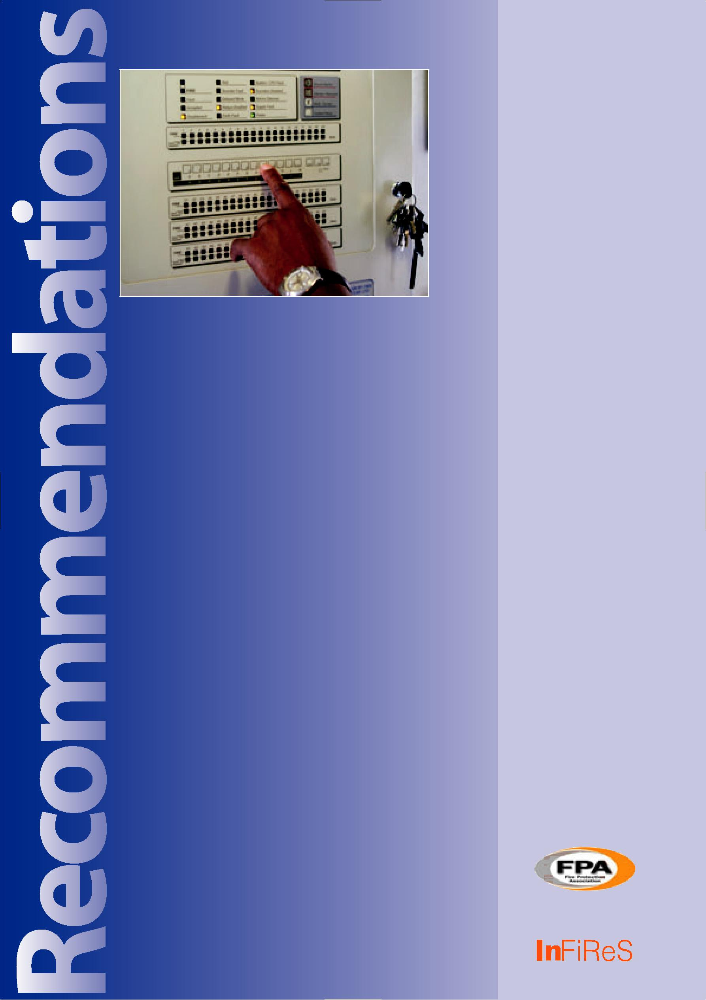
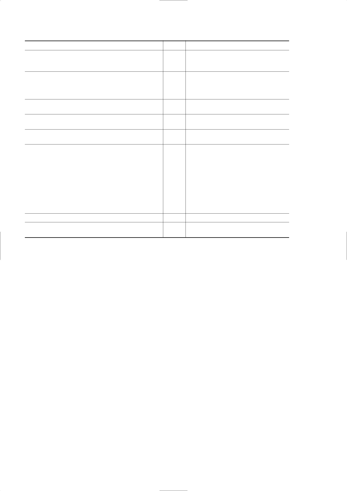
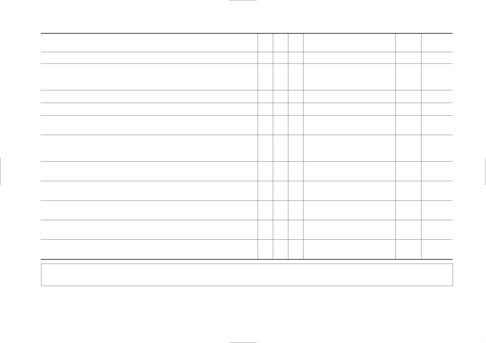

for the management of fire detection and alarm systems

in the workplace

**LOSS PREVENTION RECOMMENDATIONS**

The aim of the FPA series of Recommendations is to provide loss
prevention guidance for industrial and commercial premises and systems.
The series continues a long tradition of providing authoritative
guidance on loss prevention issues started by the Fire Offices’
Committee (FOC) of the British insurance industry more than a hundred
years ago and builds upon earlier publications from the Loss Prevention
Council and the Association of British Insurers.

Lists of other publications on loss control including other documents in
the RC series are available at www.thefpa.co.uk and from the FPA at
London Road, Moreton-in-Marsh, Gloucestershire GL56 0RH. Copies of
publications can be purchased from the FPA at that address or else by
calling 01608 812524 or by e-mailing sales@thefpa.co.uk.

**Technical contact:**

Adair Lewis

Fire Protection Association, 3rd Floor, Hampton House, 20 Albert
Embankment, London SE1 7TJ

E-mail: alewis@thefpa.co.uk

> **IMPORTANT NOTICE**
> 
> Insurers’ Fire Research Strategy scheme (InFiReS) membership comprises
> a group of UK insurers that actively support a number of expert
> working groups developing and promulgating best practice for the
> protection of people, property, business and the environment from loss
> due to fire and other risks. The technical expertise for this document
> has been provided by the Technical Directorate of the Fire Protection
> Association (FPA), external consultants, and experts from the
> insurance industry who together form the various InFiReS Steering
> Groups. Although produced with insurer input it does not (and is not
> intended to) represent a pan-insurer perspective. Individual insurance
> companies will have their own requirements which may be different from
> or not reflected in the content of this document.
> 
> The FPA have made extensive efforts to check the accuracy of the
> information and advice contained in this document and it is believed
> to be accurate at the time of printing. However, the FPA make no
> guarantee, representation or warranty (express or implied) as to the
> accuracy or completeness of any information or advice contained in
> this document. All advice and recommendations are presented in good
> faith on the basis of information, knowledge and technology as at the
> date of publication of this document.
> 
> Without prejudice to the generality of the foregoing, the FPA make no
> guarantee, representation or warranty (express or implied) that this
> document considers all systems, equipment and procedures or state of
> the art technologies current at the date of this document.
> 
> Use of, or reliance upon, this document or any part of its content is
> voluntary and is at the user’s own risk. Anyone considering using or
> implementing any recommendation or advice within this document should
> rely on his or her own personal judgement or, as appropriate, seek the
> advice of a competent professional and rely on that professional’s
> advice. Nothing in this document replaces or excludes (nor is intended
> to replace or exclude) entirely or in part mandatory and/or legal
> requirements howsoever arising (including without prejudice to the
> generality of the foregoing any such requirements for maintaining
> health and safety in the workplace).
> 
> Except to the extent that it is unlawful to exclude any liability, the
> FPA accept no liability whatsoever for any direct, indirect or
> consequential loss or damage arising in any way from the publication
> of this document or any part of it or any use of or reliance placed on
> the content of this document or any part of it.

First published by

Fire Protection Association

London Road

Moreton in Marsh

Gloucestershire GL56 0RH

*Tel: +44 (0)1608 812500 Fax: +44 (0)1608 812501 E-mail:
sales@thefpa.co.uk Website: www.thefpa.co.uk*

2007 © The Fire Protection Association, on behalf of Insurers’ Fire
Research Strategy

Copies of this document may be obtained from the publications department
of the FPA, at the above address.

Printed by Modern Colour Solutions 1.5/11.07

2

> **CONTENTS**
> 
> Scope
> 
> Synopsis
> 
> Definitions
> 
> Introduction
> 
> Recommendations

1.  Design and installation standards and codes of practice

2.  Unwanted and false alarms

3.  Site control and responsibilities

4.  System testing, inspection and maintenance

5.  Site control self assessment checklist References

> Further reading
> 
> **SCOPE**
> 
> **INTRODUCTION**
> 
> 3 Automatic fire detection systems are designed to give

3.  > early warning of a fire condition and are installed to meet both
    > life safety and property protection fire safety

> 3 objectives.

3.  > In practice, the response of a detector to a fire condition

4.  > or the activation of a call-point is transformed into a visual
    > and/or audible signal. The signal provides early warning to
    > building occupants to facilitate evacuation

> 4 and to initiate a manual firefighting response, including

4.  > calling the fire brigade if necessary. If the system is directly
    > connected to an alarm receiving centre, the fire

<!-- end list -->

7.  > brigade will automatically be summoned and, assuming

8.  > adequate and effective response, enhanced property

<table>
<tbody>
<tr class="odd">
<td>10</td>
<td><blockquote>

protection can be anticipated in the event of a fire.

</blockquote></td>
<td></td>
</tr>
<tr class="even">
<td></td>
<td><blockquote>

The need to provide effective means of giving early

</blockquote></td>
<td></td>
</tr>
<tr class="odd">
<td>11</td>
<td></td>
<td></td>
</tr>
<tr class="even">
<td></td>
<td><blockquote>

warning of a fire may result from:

</blockquote></td>
<td></td>
</tr>
<tr class="odd">
<td></td>
<td></td>
<td></td>
</tr>
</tbody>
</table>

11. • a need to meet the requirements of the Building Regulations,
    either by way of prescriptive or deemed to satisfy requirements such
    as Approved Document B (ref. 3), or as a result of a fire engineered
    solution;

This document provides guidance to insurance surveyors and system users
on the requirements for the effective management of fire detection and
alarm systems in the workplace.

Guidance is provided on the accepted standards to which systems should
be designed and installed; the need for suitable system installation
certificates; testing, inspection and maintenance guidelines; the use of
third-party accredited service providers; the control of unwanted alarms
as outlined in BS 5839-1: 2002: *Fire* *detection and fire alarm systems
for buildings. Code of practice for system design, installation,
commissioning and maintenance* (ref. 1) and the Chief Fire Officers’
Association (CFOA) *Model Agreement between Fire and* *Rescue
Authorities and Users of Remotely Monitored Fire Alarm Systems,* 2004
(ref. 2).

**SYNOPSIS**

These recommendations introduce the Chief Fire Officers’ Association
(CFOA) *Model Agreement between* *Fire and Rescue Authorities and Users
of Remotely Monitored Fire Alarm Systems* and explain the users’
obligations to conform to this document.

Emphasis is given to the need to minimise unwanted and false fire alarm
signals and how this may be carried out in practice.

**DEFINITIONS**

**False alarm:** A fire signal resulting from causes other than fire
(for example, resulting from steam).

**Unwanted alarm:** A fire signal caused by a fire-like phenomenon (for
example, smoke from bread in a toaster).

  - the findings of fire risk assessments conducted to meet the
    requirements of UK fire safety legislation under the Regulatory
    Reform (Fire Safety) Order 2005 in England and Wales (ref. 4) and
    equivalent legislation in Scotland and Northern Ireland (refs. 5 to
    7); or assessments to address specific fire safety objectives, such
    as the protection of property and high value assets and business
    continuity;

  - other relevant legislation, such as licensing, Dangerous Substances
    and Explosive Atmospheres Regulations 2002 (DSEAR) (ref. 8), housing
    and local Acts;

  - requirements or recommendations from the insurance industry.

> Like most fire engineering disciplines, fire detection and alarm
> system technology has evolved over recent years, resulting in a need
> for the codes and standards addressing their design, installation,
> testing and maintenance to be reviewed regularly in order to keep pace
> with developments within the industry.
> 
> The need to manage and reduce unwanted alarms continues to receive
> attention.
> 
> The volume of unwanted alarm signals relayed via remote alarm
> receiving centres to the fire service and the resulting fire brigade
> response has inevitably impacted on the operational and financial
> effectiveness of fire and rescue services.
> 
> The problem has now escalated to the extent that in the 12 months to
> March 2006 there were 434,300 false alarms attended by the fire
> service in the UK, with malicious false alarms counting for just
> 37,400 of these. In many cases, therefore, a reduction in response by
> the

3

fire and rescue services is now the norm, with some considering the
possibility of a nil response to the worst offenders, or only responding
with pumping appliances if the alarm has been confirmed by an eye
witness.

It is therefore important that users are aware of the official alarm
response policy for their area and are encouraged to contact their local
fire and rescue authority on an annual basis for confirmation in terms
of the brigade’s Integrated Risk Management Plan. (Details of fire cover
are also available, and searchable by postcode, on the InFiReS website,
*www.infires.co.uk*).

The latest revision of BS 5839-1 (ref. 1) addresses the limitation of
false alarms in considerable detail, from both the design and end use
perspective. The Chief Fire Officers’ Association (CFOA) has also
released a policy to minimise the unnecessary burden on fire services as
a result of turning out to unwanted alarms (ref. 2). The issuance of
unique reference numbers for individual automatic fire detection
installations, certification for the design and installation of systems
and alarm receiving centres are all addressed in this policy.

The CFOA policy has been adopted in full or part by most fire brigades.
In the meantime, the initial response to alarm activations has generally
been reduced to one pump to premises other than residential, healthcare
and other high life risk occupancies.

Generally, the reliability and dependability of a system will be
influenced by:

  - > the adequacy of the design;

  - > the reliability of the components used;

  - > the quality of the installation;

  - > how effectively the system is inspected, maintained, tested and
    > managed on a day-to-day basis.

Inspection and maintenance of life safety systems is also a requirement
of certain UK fire safety legislation such as the Regulatory Reform
(Fire Safety) Order 2005 in England and Wales (ref. 4) and the
equivalent legislation in Scotland and Northern Ireland (refs. 5 to 7).

**RECOMMENDATIONS**

1.  > **Design and installation standards and codes of practice**

<!-- end list -->

1.  > Systems should be designed, installed and commissioned in
    > accordance with acceptable standards and codes of practice by
    > third-party certificated suppliers.

2.  > Installations should conform to BS 5839-1. This code addresses
    > general design considerations, the limitation of false alarms,
    > installation requirements, commissioning/ hand-over, maintenance
    > and the responsibility of the user.

> Other codes and standards relevant to the design and installation of
> fire alarm and detection systems include BS 5839, Parts 6, 8 and 9
> (refs. 9 to 11), BS 6266: 2002: *Code of practice for fire*
> *protection for electronic equipment installations*
> 
> (ref. 12) and the BS EN 54: *Fire detection and fire* *alarm systems*
> suite of documents (ref. 13).
> 
> Other supporting codes and standards include those addressing standard
> and enhanced fire-resisting cable, installations in hazardous
> atmospheres, remote centres receiving signals from security systems
> and relevant Health Technical Memorandums.

3.  An introduction to automatic fire alarms, more information on
    unwanted fire signals and the effect on fire service response can be
    found in the InFiReS publication, *Report to Insurers: Remotely*
    *Monitored Fire Alarms: Unwanted Fire Signals and Fire Service
    Response* (ref. 14).

<!-- end list -->

2.  **Unwanted and false alarms**

> High levels of false or unwanted alarms have, for some time, been
> unacceptable to the government, emergency services and standards
> generating bodies, such as the British Standards Institution. Some
> typical causes of false and unwanted alarms are set out in Table 1.
> The issue is addressed in detail in both BS 5839-1: 2002 and the Chief
> Fire Officers’ Association (CFOA) Model Agrement, 2007 (refs. 1 and
> 2).
> 
> BS 5839-1: 2002 addresses the categories of false alarms, acceptable
> rates, causes and measures to limit their occurrence.

1.  Measures to prevent unwanted/false alarms that should be addressed
    at the system design stage include:
    
      - > the selection and siting of fire detectors and call-points;
    
      - > protection against electromagnetic interference;
    
      - > system performance monitoring;
    
      - > filtering measures.

2.  Measures to prevent unwanted/false alarms after a system has been
    installed, commissioned and handed over include:
    
      - > service, inspection and maintenance;
    
      - > effective fire safety management.

3.  The code accepts that false/unwanted alarm rates will be influenced
    by several factors, but also recognises that the anticipated
    unwanted alarm rate is likely to be proportional to the number of
    automatic detectors incorporated in the system. As a result, this
    code of practice recommends the following:
    
      - > for systems incorporating more than 40 detectors in any
        > rolling year, the average false

4

> alarm rate should not exceed one false alarm per 20 detectors, or not
> more than two false alarms from any single detector or call-point.

  - > for systems with 40 detectors or less, no more than two false
    > alarms should occur in any rolling year.

> Where these rates are exceeded, an in-depth investigation into the
> cause should be initiated and suitable mitigating action taken.

4.  Nevertheless, the code recommends that a preliminary investigation
    should be conducted as part of the service work and the user
    informed accordingly if any of the following occurs:
    
      - > the rate of false alarms over the 12 month period exceeded one
        > alarm per 25 detectors;
    
      - > more than 10 false alarms have occurred since the last service
        > visit;
    
      - > two or more false alarms have arisen from any single detector
        > or call-point;
    
      - > any persistent cause of a false alarm is identified.

> All alarm activations should therefore be accurately recorded for
> periodic review and analysis.

5.  Malicious false alarms are most likely to involve manual call-point
    activation. Occupancies prone to this may include schools,
    universities, public car-parks, shopping centres and public
    entertainment venues, such as cinemas, theatres, public houses and
    night-clubs. Measures to avoid

> Table 1: Examples of causes of false and unwanted alarms
> 
> these include fitting call-points with hinged plastic covers that need
> to be raised before the glass can be broken, thus eliminating the
> alarm being raised by accidental collision with the device.

6.  Subject to the approval of the enforcing authority, consideration
    could be given to the following to help reduce potential malicious
    false alarms involving call-points:
    
      - > not siting call-points within the mall areas of covered
        > shopping centres;
    
      - > subject to adequate surveillance of the premises by persons or
        > CCTV, siting call-points at staffed locations and in areas
        > only accessible to authorised persons, or the use of
        > call-points with hinged covers thereby requiring a dual action
        > before the alarm is raised;
    
      - > the use of an emergency voice communication system linked to a
        > permanently manned location, such as a security control room
        > in lieu of the provision of call-points in public car parks.

7.  A staff alarm arrangement is sometimes used in large and complex
    buildings to filter potential false alarms. This provides a period
    after activation of a detector to investigate, prior to the
    operation of the alarm. Where the alert signal is not silenced
    within a limited period – usually a maximum of six minutes – the
    system will automatically revert to an alarm condition. Signals from
    manual call-points normally produce an alarm condition and are not
    subject to the staff alarm arrangement.

<table>
<tbody>
<tr class="odd">
<td>Potential sources of smoke other than a fire in the building</td>
<td><blockquote>

Other potential causes of false or unwanted alarms

</blockquote></td>
</tr>
<tr class="even">
<td></td>
<td></td>
</tr>
<tr class="odd">
<td>Cooking fumes</td>
<td><blockquote>

Dust

</blockquote></td>
</tr>
<tr class="even">
<td></td>
<td></td>
</tr>
<tr class="odd">
<td>Tobacco smoke</td>
<td><blockquote>

Insects

</blockquote></td>
</tr>
<tr class="even">
<td></td>
<td></td>
</tr>
<tr class="odd">
<td>Smoke from sources other than a fire in the building such</td>
<td><blockquote>

Aerosol sprays

</blockquote></td>
</tr>
<tr class="even">
<td>as smoke entering from outside</td>
<td></td>
</tr>
<tr class="odd">
<td></td>
<td></td>
</tr>
<tr class="even">
<td>Cutting/welding</td>
<td><blockquote>

High humidity/steam

</blockquote></td>
</tr>
<tr class="odd">
<td></td>
<td></td>
</tr>
<tr class="even">
<td>Smoke producing commercial or industrial processes</td>
<td><blockquote>

Ingress of moisture/water

</blockquote></td>
</tr>
<tr class="odd">
<td></td>
<td></td>
</tr>
<tr class="even">
<td>Candles/incense</td>
<td><blockquote>

Cooking (eg toasters)

</blockquote></td>
</tr>
<tr class="odd">
<td></td>
<td></td>
</tr>
<tr class="even">
<td>Cosmetic smoke (places of assembly/entertainment)</td>
<td><blockquote>

Fumes (eg vehicle exhausts/candles/manufacturing activities

</blockquote></td>
</tr>
<tr class="odd">
<td></td>
<td><blockquote>

such as welding)

</blockquote></td>
</tr>
<tr class="even">
<td></td>
<td></td>
</tr>
<tr class="odd">
<td></td>
<td><blockquote>

Temperature fluctuations

</blockquote></td>
</tr>
<tr class="even">
<td></td>
<td></td>
</tr>
<tr class="odd">
<td></td>
<td><blockquote>

Accidental damage

</blockquote></td>
</tr>
<tr class="even">
<td></td>
<td></td>
</tr>
<tr class="odd">
<td></td>
<td><blockquote>

System testing without isolation or warning

</blockquote></td>
</tr>
<tr class="even">
<td></td>
<td></td>
</tr>
<tr class="odd">
<td></td>
<td><blockquote>

Pressure fluctuations where systems are interfaced with sprinklers

</blockquote></td>
</tr>
<tr class="even">
<td></td>
<td></td>
</tr>
<tr class="odd">
<td></td>
<td><blockquote>

Faulty system components

</blockquote></td>
</tr>
<tr class="even">
<td></td>
<td></td>
</tr>
<tr class="odd">
<td></td>
<td><blockquote>

Electromagnetic interference

</blockquote></td>
</tr>
<tr class="even">
<td></td>
<td></td>
</tr>
<tr class="odd">
<td></td>
<td><blockquote>

Malicious false alarms

</blockquote></td>
</tr>
<tr class="even">
<td></td>
<td></td>
</tr>
</tbody>
</table>

5

Table 2: User false/unwanted alarm prevention checklist

<table>
<tbody>
<tr class="odd">
<td>Control function</td>
<td><blockquote>

Yes/No

</blockquote></td>
<td><blockquote>

Recommendation

</blockquote></td>
</tr>
</tbody>
</table>

1.  > Are staff and visitors aware of AFD protection and the potential
    > causes of false/unwanted alarms and the precautions to prevent
    > them?

2.  > Is company policy regarding the causes and prevention of
    > false/unwanted alarm activations included in tender documents and
    > hot work permit procedures and contractors informed and controlled
    > accordingly?

3.  > Are the staff and the alarm receiving centre (where applicable)
    > suitably notified prior to testing or work on the system?

4.  > Are all false alarms identified, actioned, recorded and regularly
    > reviewed?

5.  > Are building defects that could result in false/unwanted alarms
    > identified and resolved without undue delay?

6.  > Are appropriate precautions taken where work/maintenance involves
    > paint, duct or smoke that may activate system?

> Appropriate steps that can be taken, depending on the type of
> detectors used, include:

  - > temporary replacement of detectors with a different type;

  - > provision of a screen between the detectors and work being
    > undertaken;

  - > the use of temporary brightly-coloured covers on detectors in the
    > affected area.

<!-- end list -->

7.  > Are detectors in the affected area disabled or isolated?

8.  > Are appropriate staff trained in the procedure for reinstating the
    > alarm?

<table>
<tbody>
<tr class="odd">
<td><blockquote>

Staff alarms should only be considered where a

</blockquote></td>
<td><blockquote>

2.9

</blockquote></td>
<td><blockquote>

The process

</blockquote></td>
<td>outlined</td>
<td>in</td>
<td></td>
<td><blockquote>

the

</blockquote></td>
<td>Model Agreement</td>
<td></td>
<td></td>
<td></td>
<td></td>
<td></td>
<td></td>
<td></td>
<td></td>
<td></td>
<td></td>
</tr>
<tr class="even">
<td><blockquote>

sufficient number of suitably trained staff are

</blockquote></td>
<td></td>
<td><blockquote>

involves:

</blockquote></td>
<td></td>
<td></td>
<td></td>
<td></td>
<td></td>
<td></td>
<td></td>
<td></td>
<td></td>
<td></td>
<td></td>
<td></td>
<td></td>
<td></td>
<td></td>
</tr>
<tr class="odd">
<td><blockquote>

available and after consultation with the fire and

</blockquote></td>
<td></td>
<td><blockquote>

•

</blockquote></td>
<td><blockquote>

the issuing of unique reference numbers to

</blockquote></td>
<td></td>
<td></td>
<td></td>
<td></td>
<td></td>
<td></td>
<td></td>
<td></td>
<td></td>
<td></td>
<td></td>
<td></td>
<td></td>
<td></td>
</tr>
<tr class="even">
<td><blockquote>

rescue authority and insurers.

</blockquote></td>
<td></td>
<td></td>
<td></td>
<td></td>
<td></td>
<td></td>
<td></td>
<td></td>
<td></td>
<td></td>
<td></td>
<td></td>
<td></td>
<td></td>
<td></td>
<td></td>
<td></td>
</tr>
<tr class="odd">
<td></td>
<td></td>
<td></td>
<td></td>
<td></td>
<td></td>
<td><blockquote>

all systems in non-domestic premises;

</blockquote></td>
<td></td>
<td></td>
<td></td>
<td></td>
<td></td>
<td></td>
<td></td>
<td></td>
<td></td>
<td></td>
<td></td>
</tr>
<tr class="even">
<td></td>
<td></td>
<td></td>
<td></td>
<td></td>
<td></td>
<td></td>
<td></td>
<td></td>
<td></td>
<td></td>
<td></td>
<td></td>
<td></td>
<td></td>
<td></td>
<td></td>
<td></td>
</tr>
<tr class="odd">
<td>2.8 The</td>
<td><blockquote>

CFOA

</blockquote></td>
<td><blockquote>

Model

</blockquote></td>
<td>Agreement</td>
<td>provides a</td>
<td></td>
<td><blockquote>

•

</blockquote></td>
<td><blockquote>

ensuring that systems are designed, installed,

</blockquote></td>
<td></td>
<td></td>
<td></td>
<td></td>
<td></td>
<td></td>
<td></td>
<td></td>
<td></td>
<td></td>
</tr>
<tr class="even">
<td><blockquote>

suggested framework for agreement between the

</blockquote></td>
<td></td>
<td></td>
<td></td>
<td></td>
<td></td>
<td></td>
<td></td>
<td></td>
<td></td>
<td></td>
<td></td>
<td></td>
<td></td>
<td></td>
<td></td>
<td></td>
<td></td>
</tr>
<tr class="odd">
<td></td>
<td></td>
<td></td>
<td><blockquote>

commissioned and maintained by companies

</blockquote></td>
<td></td>
<td></td>
<td></td>
<td></td>
<td></td>
<td></td>
<td></td>
<td></td>
<td></td>
<td></td>
<td></td>
<td></td>
<td></td>
<td></td>
</tr>
<tr class="even">
<td><blockquote>

protected premises, alarm receiving centre (where

</blockquote></td>
<td></td>
<td></td>
<td></td>
<td></td>
<td></td>
<td></td>
<td></td>
<td></td>
<td></td>
<td></td>
<td></td>
<td></td>
<td></td>
<td></td>
<td></td>
<td></td>
<td></td>
</tr>
<tr class="odd">
<td></td>
<td></td>
<td></td>
<td><blockquote>

certificated by a UKAS-accredited company

</blockquote></td>
<td></td>
<td></td>
<td></td>
<td></td>
<td></td>
<td></td>
<td></td>
<td></td>
<td></td>
<td></td>
<td></td>
<td></td>
<td></td>
<td></td>
</tr>
<tr class="even">
<td><blockquote>

applicable) and the fire and rescue service.

</blockquote></td>
<td></td>
<td></td>
<td></td>
<td></td>
<td></td>
<td></td>
<td></td>
<td></td>
<td></td>
<td></td>
<td></td>
<td></td>
<td></td>
<td></td>
<td></td>
<td></td>
<td></td>
</tr>
<tr class="odd">
<td></td>
<td></td>
<td></td>
<td></td>
<td><blockquote>

in accordance with an acceptable standard;

</blockquote></td>
<td></td>
<td></td>
<td></td>
<td></td>
<td></td>
<td></td>
<td></td>
<td></td>
<td></td>
<td></td>
<td></td>
<td></td>
<td></td>
</tr>
<tr class="even">
<td></td>
<td></td>
<td></td>
<td></td>
<td></td>
<td></td>
<td></td>
<td></td>
<td></td>
<td></td>
<td></td>
<td></td>
<td></td>
<td></td>
<td></td>
<td></td>
<td></td>
<td></td>
</tr>
<tr class="odd">
<td><blockquote>

The aim of the policy is to reduce the number

</blockquote></td>
<td></td>
<td><blockquote>

•

</blockquote></td>
<td><blockquote>

using an alarm receiving centre certificated

</blockquote></td>
<td></td>
<td></td>
<td></td>
<td></td>
<td></td>
<td></td>
<td></td>
<td></td>
<td></td>
<td></td>
<td></td>
<td></td>
<td></td>
<td></td>
</tr>
<tr class="even">
<td><blockquote>

of

</blockquote></td>
<td><blockquote>

false/unwanted

</blockquote></td>
<td>alarms</td>
<td>and</td>
<td>subsequent</td>
<td></td>
<td></td>
<td></td>
<td></td>
<td></td>
<td></td>
<td></td>
<td></td>
<td></td>
<td></td>
<td></td>
<td></td>
<td></td>
</tr>
<tr class="odd">
<td></td>
<td></td>
<td></td>
<td></td>
<td></td>
<td></td>
<td></td>
<td><blockquote>

by

</blockquote></td>
<td><blockquote>

a

</blockquote></td>
<td><blockquote>

UKAS-accredited

</blockquote></td>
<td><blockquote>

company

</blockquote></td>
<td>in</td>
<td></td>
<td></td>
<td></td>
<td></td>
<td></td>
<td></td>
</tr>
<tr class="even">
<td><blockquote>

transmission of unwanted fire signals by:

</blockquote></td>
<td></td>
<td></td>
<td></td>
<td></td>
<td></td>
<td></td>
<td></td>
<td></td>
<td></td>
<td></td>
<td></td>
<td></td>
<td></td>
<td></td>
<td></td>
<td></td>
<td></td>
</tr>
<tr class="odd">
<td></td>
<td></td>
<td></td>
<td></td>
<td><blockquote>

accordance with an acceptable standard;

</blockquote></td>
<td></td>
<td></td>
<td></td>
<td></td>
<td></td>
<td></td>
<td></td>
<td></td>
<td></td>
<td></td>
<td></td>
<td></td>
<td></td>
</tr>
<tr class="even">
<td></td>
<td></td>
<td></td>
<td></td>
<td></td>
<td></td>
<td></td>
<td></td>
<td></td>
<td></td>
<td></td>
<td></td>
<td></td>
<td></td>
<td></td>
<td></td>
<td></td>
<td></td>
</tr>
<tr class="odd">
<td><blockquote>

•

</blockquote></td>
<td><blockquote>

ensuring

</blockquote></td>
<td><blockquote>

that

</blockquote></td>
<td>remotely</td>
<td>monitored systems</td>
<td></td>
<td><blockquote>

•

</blockquote></td>
<td><blockquote>

the

</blockquote></td>
<td><blockquote>

availability

</blockquote></td>
<td><blockquote>

of

</blockquote></td>
<td><blockquote>

keyholders

</blockquote></td>
<td>for</td>
<td>the</td>
<td></td>
<td></td>
<td></td>
<td></td>
<td></td>
</tr>
<tr class="even">
<td></td>
<td><blockquote>

are designed,

</blockquote></td>
<td>installed,</td>
<td>commissioned</td>
<td>and</td>
<td></td>
<td></td>
<td></td>
<td></td>
<td></td>
<td></td>
<td></td>
<td></td>
<td></td>
<td></td>
<td></td>
<td></td>
<td></td>
</tr>
<tr class="odd">
<td></td>
<td></td>
<td></td>
<td></td>
<td></td>
<td></td>
<td></td>
<td><blockquote>

premises;

</blockquote></td>
<td></td>
<td></td>
<td></td>
<td></td>
<td></td>
<td></td>
<td></td>
<td></td>
<td></td>
<td></td>
</tr>
<tr class="even">
<td></td>
<td><blockquote>

maintained to a high standard;

</blockquote></td>
<td></td>
<td></td>
<td></td>
<td></td>
<td></td>
<td></td>
<td></td>
<td></td>
<td></td>
<td></td>
<td></td>
<td></td>
<td></td>
<td></td>
<td></td>
<td></td>
</tr>
<tr class="odd">
<td></td>
<td></td>
<td></td>
<td></td>
<td></td>
<td><blockquote>

•

</blockquote></td>
<td><blockquote>

the

</blockquote></td>
<td><blockquote>

monitoring

</blockquote></td>
<td><blockquote>

of

</blockquote></td>
<td></td>
<td>performance</td>
<td>levels</td>
<td>on</td>
<td></td>
<td></td>
<td></td>
<td></td>
<td></td>
</tr>
<tr class="even">
<td><blockquote>

•

</blockquote></td>
<td><blockquote>

improving fire safety management on the

</blockquote></td>
<td></td>
<td></td>
<td></td>
<td></td>
<td></td>
<td></td>
<td></td>
<td></td>
<td></td>
<td></td>
<td></td>
<td></td>
<td></td>
<td></td>
<td></td>
<td></td>
</tr>
<tr class="odd">
<td></td>
<td></td>
<td></td>
<td></td>
<td><blockquote>

a monthly

</blockquote></td>
<td><blockquote>

basis

</blockquote></td>
<td><blockquote>

and

</blockquote></td>
<td><blockquote>

the

</blockquote></td>
<td><blockquote>

tailoring

</blockquote></td>
<td>of</td>
<td></td>
<td></td>
<td></td>
<td></td>
<td></td>
<td></td>
<td></td>
<td></td>
</tr>
<tr class="even">
<td></td>
<td><blockquote>

protected site;

</blockquote></td>
<td></td>
<td></td>
<td></td>
<td></td>
<td></td>
<td></td>
<td></td>
<td><blockquote>

fire brigade attendance accordingly. This may

</blockquote></td>
<td></td>
<td></td>
<td></td>
<td></td>
<td></td>
<td></td>
<td></td>
<td></td>
</tr>
<tr class="odd">
<td><blockquote>

•

</blockquote></td>
<td><blockquote>

reducing the impact of false alarms on

</blockquote></td>
<td></td>
<td></td>
<td><blockquote>

vary from an immediate response appropriate

</blockquote></td>
<td></td>
<td></td>
<td></td>
<td></td>
<td></td>
<td></td>
<td></td>
<td></td>
<td></td>
<td></td>
<td></td>
<td></td>
<td></td>
</tr>
<tr class="even">
<td></td>
<td><blockquote>

business;

</blockquote></td>
<td></td>
<td></td>
<td></td>
<td></td>
<td></td>
<td></td>
<td></td>
<td></td>
<td><blockquote>

to the risk (Attendance Level One under the

</blockquote></td>
<td></td>
<td></td>
<td></td>
<td></td>
<td></td>
<td></td>
<td></td>
</tr>
<tr class="odd">
<td><blockquote>

•

</blockquote></td>
<td><blockquote>

reducing

</blockquote></td>
<td><blockquote>

the

</blockquote></td>
<td>number of false</td>
<td>alarms</td>
<td>and</td>
<td></td>
<td></td>
<td><blockquote>

CFOA agreement); to an attendance based

</blockquote></td>
<td></td>
<td></td>
<td></td>
<td></td>
<td></td>
<td></td>
<td></td>
<td></td>
<td></td>
</tr>
<tr class="even">
<td></td>
<td></td>
<td></td>
<td></td>
<td></td>
<td></td>
<td></td>
<td></td>
<td><blockquote>

on

</blockquote></td>
<td><blockquote>

the

</blockquote></td>
<td><blockquote>

risk

</blockquote></td>
<td><blockquote>

but

</blockquote></td>
<td><blockquote>

under

</blockquote></td>
<td>non-emergency</td>
<td></td>
<td></td>
<td></td>
<td></td>
</tr>
<tr class="odd">
<td></td>
<td><blockquote>

subsequent transmission

</blockquote></td>
<td>of unwanted</td>
<td>fire</td>
<td></td>
<td></td>
<td></td>
<td></td>
<td></td>
<td></td>
<td></td>
<td></td>
<td></td>
<td></td>
<td></td>
<td></td>
<td></td>
<td></td>
</tr>
<tr class="even">
<td></td>
<td></td>
<td></td>
<td></td>
<td></td>
<td></td>
<td><blockquote>

conditions (Attendance Level

</blockquote></td>
<td><blockquote>

Two); to

</blockquote></td>
<td>no</td>
<td></td>
<td></td>
<td></td>
<td></td>
<td></td>
<td></td>
<td></td>
<td></td>
<td></td>
</tr>
<tr class="odd">
<td></td>
<td><blockquote>

signals to the fire and rescue service;

</blockquote></td>
<td></td>
<td></td>
<td></td>
<td></td>
<td></td>
<td></td>
<td></td>
<td></td>
<td></td>
<td></td>
<td></td>
<td></td>
<td></td>
<td></td>
<td></td>
<td></td>
</tr>
<tr class="even">
<td></td>
<td></td>
<td></td>
<td></td>
<td></td>
<td><blockquote>

response until the confirmation of a fire has

</blockquote></td>
<td></td>
<td></td>
<td></td>
<td></td>
<td></td>
<td></td>
<td></td>
<td></td>
<td></td>
<td></td>
<td></td>
<td></td>
</tr>
<tr class="odd">
<td></td>
<td></td>
<td></td>
<td></td>
<td></td>
<td></td>
<td></td>
<td></td>
<td></td>
<td></td>
<td></td>
<td></td>
<td></td>
<td></td>
<td></td>
<td></td>
<td></td>
<td></td>
</tr>
<tr class="even">
<td><blockquote>

•

</blockquote></td>
<td><blockquote>

facilitating a risk-based approach to the

</blockquote></td>
<td></td>
<td></td>
<td><blockquote>

been received from the premises (Attendance

</blockquote></td>
<td></td>
<td></td>
<td></td>
<td></td>
<td></td>
<td></td>
<td></td>
<td></td>
<td></td>
<td></td>
<td></td>
<td></td>
<td></td>
</tr>
<tr class="odd">
<td></td>
<td><blockquote>

deployment of fire service resources and

</blockquote></td>
<td></td>
<td></td>
<td><blockquote>

Level Three). Confirmed fires will always

</blockquote></td>
<td></td>
<td></td>
<td></td>
<td></td>
<td></td>
<td></td>
<td></td>
<td></td>
<td></td>
<td></td>
<td></td>
<td></td>
<td></td>
</tr>
<tr class="even">
<td></td>
<td><blockquote>

reducing the waste of resources due to false

</blockquote></td>
<td></td>
<td></td>
<td><blockquote>

attract a full response in relation to the risk.

</blockquote></td>
<td></td>
<td></td>
<td></td>
<td></td>
<td></td>
<td></td>
<td></td>
<td></td>
<td></td>
<td></td>
<td></td>
<td></td>
<td></td>
</tr>
<tr class="odd">
<td></td>
<td><blockquote>

alarms;

</blockquote></td>
<td></td>
<td></td>
<td></td>
<td></td>
<td></td>
<td></td>
<td><blockquote>

2.10

</blockquote></td>
<td><blockquote>

It

</blockquote></td>
<td><blockquote>

should be

</blockquote></td>
<td><blockquote>

noted

</blockquote></td>
<td>that</td>
<td><blockquote>

the

</blockquote></td>
<td><blockquote>

false

</blockquote></td>
<td>alarm rates</td>
<td></td>
<td></td>
</tr>
<tr class="even">
<td></td>
<td></td>
<td></td>
<td></td>
<td></td>
<td></td>
<td></td>
<td></td>
<td></td>
<td></td>
<td></td>
<td></td>
<td></td>
<td></td>
<td></td>
<td></td>
<td></td>
<td></td>
</tr>
<tr class="odd">
<td><blockquote>

•

</blockquote></td>
<td><blockquote>

reducing complacency in the workplace due

</blockquote></td>
<td></td>
<td><blockquote>

determining the performance level of the system in

</blockquote></td>
<td></td>
<td></td>
<td></td>
<td></td>
<td></td>
<td></td>
<td></td>
<td></td>
<td></td>
<td></td>
<td></td>
<td></td>
<td></td>
<td></td>
</tr>
<tr class="even">
<td></td>
<td><blockquote>

to repeated false alarms.

</blockquote></td>
<td></td>
<td></td>
<td></td>
<td></td>
<td><blockquote>

accordance with the CFOA Model Agreement are

</blockquote></td>
<td></td>
<td></td>
<td></td>
<td></td>
<td></td>
<td></td>
<td></td>
<td></td>
<td></td>
<td></td>
<td></td>
</tr>
</tbody>
</table>

6

> less generous than those indicated in BS 5839-1: 2002 (ref.1). This is
> because the CFOA Model Agreement adopts the principle that the
> frequency of unwanted alarms per detector is expected to fall as the
> number of detectors in the system increases.
> 
> For example, under the CFOA agreement, a system with 400 detectors
> would attract:

  - > an Attendance Level One for a performance level of seven or less
    > false alarms in a 12 month period;

  - > an Attendance Level Two for a performance level of between seven
    > and ten false alarms in a 12 month period;

  - > an Attendance Level Three where the number of false alarms in 12
    > months exceeds ten.

> By comparison, under BS 5839-1, the user would instigate an in-depth
> investigation if, over a rolling year, more than 20 false alarms
> occurred for a system with 400 detectors, or if more than two false
> alarms were received from any single detector or call-point.

*Note: The CFOA Model Agreement is currently under review and it is
likely that a new edition will be published in early 2008. Readers
should however be aware that the aims and general processes outlined
here will not change.*

3.  **Site control and responsibilities**

<!-- end list -->

1.  Key requirements for the effective site control of fire detection
    and alarm systems include:
    
      - > a named responsible person appointed to supervise the system.
        > This would be a ‘competent person’ appointed by the
        > ‘responsible person’ in terms of UK fire legislation;
    
      - > control and indicating equipment checked every 24 hours to
        > confirm no faults indicated;
    
      - > system log book up-to-date and available for inspection.
        > Recommend a copy of the design, installation, commissioning
        > and acceptance certificate be kept in the log book;
    
      - > all occupants have received suitable instruction regarding the
        > system including interpretation of alarm conditions and faults
        > and the actions to be taken in accordance with the company’s
        > emergency plan and the measures to avoid false/unwanted
        > alarms;
    
      - > records regularly reviewed including false/unwanted alarm
        > rates;
    
      - > regular visual inspections to ensure that manual call-points
        > remain unobstructed and that a clear space of 500mm is
        > maintained around all detectors;
    
    <!-- end list -->
    
      - > records, drawings etc are updated in the event of any changes
        > to the system;
    
      - > suitable quantities of spare parts are kept available,
        > including tools and frangible elements for manual call-points
        > and spare printer cartridges and paper as deemed necessary for
        > the control and indicating equipment;
    
      - > records kept in the system log book should include the name of
        > the responsible person, details of the maintenance
        > arrangements, details of all signals, causes of false/unwanted
        > alarms, full details of all tests/maintenance, and details of
        > all faults and defects;
    
      - > copies of the following system certificates should be kept
        > readily available on site:
        
          - > design certificate;
        
          - > installation certificate;
        
          - > commissioning certificate;
        
          - > acceptance certificate;
        
          - > verification and modification certificates as relevant;
        
          - > inspection and servicing certificates.

<!-- end list -->

1.  UK fire legislation requires that the ‘responsible person’ in terms
    of the Regulatory Reform Order (and similar legislation in other
    parts of the UK) appoint one or more competent persons to assist in
    undertaking the required preventive and protective measures.

> This implies that competent persons will need to be appointed to
> conduct the testing, inspection and maintenance of the fire detection
> and alarm system.

2.  Routine testing can be conducted in-house by suitably knowledgeable
    and experienced persons. Suitable training to improve these skills
    should be available from the supplier/installer, or short courses
    available from fire safety training organisations.

> However, unless specialist knowledge is available within an
> organisation, periodic inspection and testing is likely to be carried
> out by a specialist service provider. Competency can be assured by
> using an organisation that is third-party certificated by a
> UKAS-accredited certification body. The Loss Prevention Certification
> Board sets out *Requirements for* *Certificated Fire Detection and
> Alarm System Firms* in LPS 1014 (ref. 15) and BAFE operates SP203-1:
> *Fire Detection, Alarm and Suppression* *Systems Scheme* (ref. 16).

7

4.  Routine testing and inspection frequencies should be based on the
    outcome of a fire risk assessment that has taken into consideration
    the type of system and environment in which it is installed. BS
    5839-1: 2002 recommends a maximum period of six months between
    inspections, but more frequent inspection where determined necessary
    by the risk assessment.

5.  When a user is changing service providers, the servicing
    organisation is likely to conduct a special inspection to obtain
    sufficient information for future servicing and to determine areas
    of non-compliance such as:
    
      - > inadequate provision of call-points;
    
      - > inadequate detector coverage;
    
      - > sound pressure level deficiencies;
    
      - > inadequate stand-by power supplies;
    
      - > cabling not meeting the requirements of BS 5839-1: 2002;

> **4** **System testing, inspection and maintenance**
> 
> Table 3: System testing, inspection and maintenance routines

  - > non-compliance regarding monitoring of circuits;

  - > unsatisfactory standards of electrical safety;

  - > excessive unwanted/false alarm ratios;

  - > structural changes that may adversely affect the efficiency of the
    > system;

  - > system log book and record-keeping deficiencies.

<!-- end list -->

5.  To facilitate arrangements for the repair of any faults or damage,
    it is recommended that suitable arrangements for emergency call-out
    be agreed with the supplier (24 hour coverage with attendance of a
    technician within 8 hours of notification from the end user). The
    contact details of the service provider should also be prominently
    displayed at the main control and indicating equipment.

6.  The insurance broker/company for the property should be informed in
    the event of the fire alarm system being inoperative, or with
    remotely monitored systems, the level of fire and rescue service
    response being reduced or withdrawn.

<table>
<tbody>
<tr class="odd">
<td>Maintenance function</td>
<td><blockquote>

Frequency

</blockquote></td>
<td><blockquote>

Details

</blockquote></td>
</tr>
<tr class="even">
<td></td>
<td></td>
<td></td>
</tr>
<tr class="odd">
<td>Routine testing by user</td>
<td><blockquote>

Weekly

</blockquote></td>
<td><blockquote>

• Audible alarm test during normal working hours by operation of a

</blockquote></td>
</tr>
<tr class="even">
<td></td>
<td></td>
<td><blockquote>

different call-point by rotation. (The purpose is to test that the panel

</blockquote></td>
</tr>
<tr class="odd">
<td><em>To be carried out by a competent</em></td>
<td></td>
<td><blockquote>

processes the signal and results in the activation of sounders.

</blockquote></td>
</tr>
<tr class="even">
<td><em>person, normally a suitably-trained</em></td>
<td></td>
<td><blockquote>

The test should be conducted at the same time each week and the

</blockquote></td>
</tr>
<tr class="odd">
<td><em>employee</em></td>
<td></td>
<td><blockquote>

duration of sounding the alarm should not exceed one minute)

</blockquote></td>
</tr>
<tr class="even">
<td></td>
<td></td>
<td></td>
</tr>
<tr class="odd">
<td></td>
<td><blockquote>

Monthly

</blockquote></td>
<td><blockquote>

• Additional tests organised monthly, for staff that work outside of

</blockquote></td>
</tr>
<tr class="even">
<td></td>
<td></td>
<td><blockquote>

normal working hours

</blockquote></td>
</tr>
<tr class="odd">
<td></td>
<td><blockquote>

Monthly

</blockquote></td>
<td><blockquote>

• If a generator forms part of the stand-by power supply, it should be

</blockquote></td>
</tr>
<tr class="even">
<td></td>
<td></td>
<td><blockquote>

started by simulating a power failure and run under load for one

</blockquote></td>
</tr>
<tr class="odd">
<td></td>
<td></td>
<td><blockquote>

hour. Check and top-up fuel, oil and coolant as necessary

</blockquote></td>
</tr>
<tr class="even">
<td></td>
<td></td>
<td><blockquote>

• Conduct a visual inspection of any vented batteries for condition

</blockquote></td>
</tr>
<tr class="odd">
<td></td>
<td></td>
<td><blockquote>

and electrolyte levels

</blockquote></td>
</tr>
<tr class="even">
<td></td>
<td></td>
<td><blockquote>

• Check link to alarm receiving centre and the interface with other

</blockquote></td>
</tr>
<tr class="odd">
<td></td>
<td></td>
<td><blockquote>

systems as necessary

</blockquote></td>
</tr>
<tr class="even">
<td></td>
<td></td>
<td></td>
</tr>
<tr class="odd">
<td>Inspection and servicing</td>
<td><blockquote>

Quarterly

</blockquote></td>
<td><blockquote>

• Examine all connections on vented batteries. Check and top-up

</blockquote></td>
</tr>
<tr class="even">
<td></td>
<td></td>
<td><blockquote>

electrolyte as necessary

</blockquote></td>
</tr>
<tr class="odd">
<td><em>To be carried out by a competent</em></td>
<td><blockquote>

At each service visit

</blockquote></td>
<td><blockquote>

• Log book checked for outstanding actions

</blockquote></td>
</tr>
<tr class="even">
<td><em>person with specialist knowledge</em></td>
<td><blockquote>

(at least twice a year

</blockquote></td>
<td></td>
</tr>
<tr class="odd">
<td><em>of fire alarm and detection</em></td>
<td><blockquote>

or more frequently

</blockquote></td>
<td><blockquote>

• A structural/occupancy visual inspection to confirm:

</blockquote></td>
</tr>
<tr class="even">
<td><em>systems, normally a specialist</em></td>
<td><blockquote>

as indicated by risk

</blockquote></td>
<td></td>
</tr>
<tr class="odd">
<td><em>service organisation.</em></td>
<td><blockquote>

assessment)

</blockquote></td>
<td><blockquote>

- call-points unobstructed and conspicuous

</blockquote></td>
</tr>
<tr class="even">
<td></td>
<td></td>
<td><blockquote>

- any new exits provided with an adjacent call-point

</blockquote></td>
</tr>
<tr class="odd">
<td></td>
<td></td>
<td><blockquote>

- no new or relocated partitions within 500mm horizontally of any

</blockquote></td>
</tr>
<tr class="even">
<td></td>
<td></td>
<td><blockquote>

detector

</blockquote></td>
</tr>
<tr class="odd">
<td></td>
<td></td>
<td><blockquote>

- storage does not reach closer than 300mm to ceilings, unless

</blockquote></td>
</tr>
<tr class="even">
<td></td>
<td></td>
<td><blockquote>

detectors provided in each aisle

</blockquote></td>
</tr>
<tr class="odd">
<td></td>
<td></td>
<td><blockquote>

- a clear space of 500mm is maintained below detectors

</blockquote></td>
</tr>
<tr class="even">
<td></td>
<td></td>
<td><blockquote>

- any changes of occupancy that may have affected the suitability

</blockquote></td>
</tr>
<tr class="odd">
<td></td>
<td></td>
<td><blockquote>

of the detectors

</blockquote></td>
</tr>
<tr class="even">
<td></td>
<td></td>
<td><blockquote>

- extensions requiring the installation of detection and alarm

</blockquote></td>
</tr>
<tr class="odd">
<td></td>
<td></td>
<td><blockquote>

devices

</blockquote></td>
</tr>
<tr class="even">
<td></td>
<td></td>
<td></td>
</tr>
</tbody>
</table>

8

<table>
<tbody>
<tr class="odd">
<td>Maintenance function</td>
<td><blockquote>

Frequency

</blockquote></td>
<td><blockquote>

Details

</blockquote></td>
<td></td>
</tr>
<tr class="even">
<td></td>
<td></td>
<td></td>
<td></td>
</tr>
<tr class="odd">
<td></td>
<td></td>
<td><blockquote>

• False alarm records for the last 12 months reviewed and suitable

</blockquote></td>
<td></td>
</tr>
<tr class="even">
<td></td>
<td></td>
<td><blockquote>

action taken if required

</blockquote></td>
<td></td>
</tr>
<tr class="odd">
<td></td>
<td></td>
<td><blockquote>

• Batteries disconnected and full alarm load simulated

</blockquote></td>
<td></td>
</tr>
<tr class="even">
<td></td>
<td></td>
<td><blockquote>

• Batteries and their connectors to be momentarily load-tested (other

</blockquote></td>
<td></td>
</tr>
<tr class="odd">
<td></td>
<td></td>
<td><blockquote>

than those in radio-linked system components) to help ensure that

</blockquote></td>
<td></td>
</tr>
<tr class="even">
<td></td>
<td></td>
<td><blockquote>

they will not fail before the next test. Ensure specific gravity of

</blockquote></td>
<td></td>
</tr>
<tr class="odd">
<td></td>
<td></td>
<td><blockquote>

vented batteries correct

</blockquote></td>
<td></td>
</tr>
<tr class="even">
<td></td>
<td></td>
<td><blockquote>

• Control and indicating equipment alarm functions to be checked by

</blockquote></td>
<td></td>
</tr>
<tr class="odd">
<td></td>
<td></td>
<td><blockquote>

operation of at least one detector, or call-point on each circuit and

</blockquote></td>
<td></td>
</tr>
<tr class="even">
<td></td>
<td></td>
<td><blockquote>

full details recorded

</blockquote></td>
<td></td>
</tr>
<tr class="odd">
<td></td>
<td></td>
<td><blockquote>

• Operation of fire alarm devices checked

</blockquote></td>
<td></td>
</tr>
<tr class="even">
<td></td>
<td></td>
<td><blockquote>

• Control and indicating equipment controls and visual indicators

</blockquote></td>
<td></td>
</tr>
<tr class="odd">
<td></td>
<td></td>
<td><blockquote>

checked for correct operation

</blockquote></td>
<td></td>
</tr>
<tr class="even">
<td></td>
<td></td>
<td><blockquote>

• Automatic transmission of fire alarm signals to alarm receiving

</blockquote></td>
<td></td>
</tr>
<tr class="odd">
<td></td>
<td></td>
<td><blockquote>

centres tested

</blockquote></td>
<td></td>
</tr>
<tr class="even">
<td></td>
<td></td>
<td><blockquote>

• All ancillary functions of the control and indicating equipment

</blockquote></td>
<td></td>
</tr>
<tr class="odd">
<td></td>
<td></td>
<td><blockquote>

tested

</blockquote></td>
<td></td>
</tr>
<tr class="even">
<td></td>
<td></td>
<td><blockquote>

• All fault indicators and their circuits tested

</blockquote></td>
<td></td>
</tr>
<tr class="odd">
<td></td>
<td></td>
<td><blockquote>

• Printers tested to ensure reports are legible

</blockquote></td>
<td></td>
</tr>
<tr class="even">
<td></td>
<td></td>
<td><blockquote>

• Radio systems serviced in accordance with manufacturers’

</blockquote></td>
<td></td>
</tr>
<tr class="odd">
<td></td>
<td></td>
<td><blockquote>

recommendations

</blockquote></td>
<td></td>
</tr>
<tr class="even">
<td></td>
<td></td>
<td><blockquote>

• All further checks conducted as may be recommended by the

</blockquote></td>
<td></td>
</tr>
<tr class="odd">
<td></td>
<td></td>
<td><blockquote>

manufacturer

</blockquote></td>
<td></td>
</tr>
<tr class="even">
<td></td>
<td></td>
<td><blockquote>

• On completion of work, defects to be reported to the responsible

</blockquote></td>
<td></td>
</tr>
<tr class="odd">
<td></td>
<td></td>
<td><blockquote>

person, documented in the system log book and a service

</blockquote></td>
<td></td>
</tr>
<tr class="even">
<td></td>
<td></td>
<td><blockquote>

certificate issued

</blockquote></td>
<td></td>
</tr>
<tr class="odd">
<td></td>
<td></td>
<td></td>
<td></td>
</tr>
<tr class="even">
<td></td>
<td><blockquote>

Over a 12-month period

</blockquote></td>
<td><blockquote>

• Test the switch mechanism of every call-point by removing

</blockquote></td>
<td></td>
</tr>
<tr class="odd">
<td></td>
<td><blockquote>

(may be carried out over

</blockquote></td>
<td><blockquote>

the frangible element, using a test key or operating the unit as

</blockquote></td>
<td></td>
</tr>
<tr class="even">
<td></td>
<td><blockquote>

two or more service visits

</blockquote></td>
<td><blockquote>

would be operated in a fire

</blockquote></td>
<td></td>
</tr>
<tr class="odd">
<td></td>
<td><blockquote>

within the 12-month

</blockquote></td>
<td></td>
<td></td>
</tr>
<tr class="even">
<td></td>
<td><blockquote>

period)

</blockquote></td>
<td><blockquote>

• Check all detectors for signs of damage, painting or similar and

</blockquote></td>
<td></td>
</tr>
<tr class="odd">
<td></td>
<td></td>
<td><blockquote>

functionally test each detector using a product and method

</blockquote></td>
<td></td>
</tr>
<tr class="even">
<td></td>
<td></td>
<td><blockquote>

approved by the manufacturer of the equipment

</blockquote></td>
<td></td>
</tr>
<tr class="odd">
<td></td>
<td></td>
<td><blockquote>

• Where relevant, check the analogue value is within the range

</blockquote></td>
<td></td>
</tr>
<tr class="even">
<td></td>
<td></td>
<td><blockquote>

specified by the manufacturer

</blockquote></td>
<td></td>
</tr>
<tr class="odd">
<td></td>
<td></td>
<td><blockquote>

• Check all fire alarm devices for correct operation

</blockquote></td>
<td></td>
</tr>
<tr class="even">
<td></td>
<td></td>
<td><blockquote>

• Replace all unmonitored, permanently illuminated filament lamps

</blockquote></td>
<td></td>
</tr>
<tr class="odd">
<td></td>
<td></td>
<td><blockquote>

at the control and indicating equipment

</blockquote></td>
<td></td>
</tr>
<tr class="even">
<td></td>
<td></td>
<td><blockquote>

• For radio-linked systems, check radio signal for adequacy

</blockquote></td>
<td></td>
</tr>
<tr class="odd">
<td></td>
<td></td>
<td><blockquote>

• A visual inspection of accessible cable fixings to ensure they are

</blockquote></td>
<td></td>
</tr>
<tr class="even">
<td></td>
<td></td>
<td><blockquote>

secure and undamaged

</blockquote></td>
<td></td>
</tr>
<tr class="odd">
<td></td>
<td></td>
<td><blockquote>

• Power supply capacity checked and confirmed as adequate

</blockquote></td>
<td></td>
</tr>
<tr class="even">
<td></td>
<td></td>
<td></td>
<td></td>
</tr>
</tbody>
</table>

*Due to the automatic monitoring of some system functions, some of the
above recommendations may be modified or even omitted if deemed
unnecessary by the equipment supplier and if it can be demonstrated that
the automatic test achieves the same objective.*

9

|    |
| -- |
| 10 |

5.  > **  
    > Site control self assessment checklist**

> **5.1** **Control function** **Yes** **No** **N/A** **Action
> required** **Due date** **Sign on**

**completion**

1.  Has a named person been appointed to supervise the system?

2.  Does this named person meet the requirements for a ‘competent
    person’ under the Regulatory Reform Order and for implementing the
    preventive/protective measures related to routine testing?

3.  Is a system log book available, complete and up-to-date?

4.  Is the control and indicating equipment checked every 24 hours?

5.  Are weekly audible alarm test(s) of the alarm system carried out by
    the competent person?

6.  Is a regular visual inspection conducted to ensure call-points are
    unobstructed and a clear space of 500mm maintained around detector
    heads – with the results being suitably recorded?

7.  Are suitable quantities of consumables for the installation
    available on site (printer rolls, spare frangible units for
    call-points etc)?

8.  Has a service provider with suitable third party accreditation from
    a UKAS-accredited certification body been appointed for routine
    maintenance and inspection?

9.  Does the service contract include provision for 24 hour coverage and
    attendance within

> 8 hours of notification by user?

10. Is the frequency for periodic inspection visits based on a suitable
    risk assessmen (minimum of two within a 12-month period)?

11. Are the records of unwanted/false alarms reviewed regularly and
    suitable action taken where necessary?

> **Signature** **Name**
**Date**

|                                                                                               |
| --------------------------------------------------------------------------------------------- |
| RC47: Recommendations for the management of fire detection and alarm systems in the workplace |

**REFERENCES**

1.  > BS 5839-1: 2002: *Fire detection and fire alarm* *systems for
    > buildings. Code of practice for system design, installation,
    > commissioning and maintenance,* British Standards Institution.

2.  > CFOA *Model Agreement between Fire and Rescue* *Authorities and
    > Users of Remotely Monitored Fire Alarm Systems,* Chief Fire
    > Officers’ Association, 2004.

3.  > Approved Document B to the Building Regulations 2000: Fire Safety:
    > Volume 2: Buildings other than dwelling houses, Communities and
    > Local Government, NBS (RIBA Enterprises Ltd), 2007.

4.  > Regulatory Reform (Fire Safety) Order 2005, SI 2005 No. 1541, The
    > Stationery Office.

5.  > Fire (Scotland) Act 2005, 2005 asp 5, The Stationery Office.

6.  > Fire Safety (Scotland) Regulations 2006, Scottish SI 2006 No. 456,
    > The Stationery Office.

7.  > Fire and Rescue Services (Northern Ireland) Order 2006, SI 2006
    > No. 1254 (NI9), The Stationery

> Office.

8.  > Dangerous Substances and Explosive Atmospheres Regulations 2002,
    > SI 2002 No. 2776, The Stationery Office.

<!-- end list -->

11. > BS 5839-6: 2004: *Fire detection and fire alarm* *systems for
    > buildings. Code of practice for the design, installation and
    > maintenance of fire detection and fire alarm systems for
    > dwellings,* British Standards Institution.

12. > BS 6266: 2002: *Code of practice for fire protection* *for
    > electronic equipment installations,* British Standards
    > Institution.

13. > BS EN 54: *Fire detection and fire alarm systems,* various
    > sections address fire alarm and detection system components such
    > as sounders, various types of detector, manual call points, and
    > control and indicating equipment, British Standards Institution.

14. > *Report to Insurers: Remotely Monitored Fire Alarms - Unwanted
    > Fire Signals and Fire Service Response*, Fire Protection
    > Association, 2004.

15. > LPS 1014: Issue 5.1: *Requirements for Certificated* *Fire
    > Detection and Alarm System Firms,* BRE Certification, 2005.

16. > BAFE SP203-1: *Fire Detection, Alarm and* *Suppression Systems
    > Scheme*, BAFE, 2006.

**FURTHER READING**

*Fire Safety Guidance Booklet: Are You Aware of Your Responsibilities?*,
Scottish Executive, 2006.

9.  BS 5839-8: 1998: *Fire detection and fire alarm* *systems for
    buildings. Code of practice for the design, installation,
    commissioning and maintenance of voice alarm systems,* British
    Standards Institution.

10. BS 5839-9: 2003: *Fire detection and alarm systems* *for buildings.
    Code of practice for the design, installation, commissioning and
    maintenance of emergency voice communications systems,* British
    Standards Institution.

11

> for the management of fire detection and alarm systems in the
> workplace
