RC65: Recommendations for fire safety with 3D printing

Version 1 Published 2018

*Cover image: ThinkStock/tonaquatic (modified)*

IMPORTANT NOTICE

> This document has been developed through the RISCAuthority and
> published by the Fire Protection Association (FPA). RISCAuthority
> membership comprises a group of UK insurers that actively support a
> number
> 
> of expert working groups developing and promulgating best practice for
> the protection of people, property, business and the environment from
> loss due to fire
> 
> and other risks. The technical expertise for this document has been
> provided by the Technical Directorate of the FPA, external
> consultants, and experts from the insurance industry who together form
> the various RISCAuthority Working Groups. Although produced with
> insurer input it does not (and is not intended to) represent a
> pan-insurer perspective. Individual insurance companies will have
> their own requirements which may be different from or not reflected in
> the content of this document.

The FPA has made extensive efforts to check the accuracy of the
information and advice contained in this document and it is believed to
be accurate at the time of printing. However, the FPA makes no
guarantee, representation or warranty (express or implied) as to the
accuracy or completeness of any information or advice contained in this
document. All advice and recommendations are presented in good

faith on the basis of information, knowledge and technology as at the
date of publication of this document.

Without prejudice to the generality of the foregoing, the FPA makes no
guarantee, representation or warranty (express or implied) that this
document considers all systems, equipment and procedures or state
-of-the -art technologies current at the date of this document.

Use of, or reliance upon, this document, or any part of its content, is
voluntary and is

at the user’s own risk. Anyone considering using or implementing any
recommendation or advice within this document should rely on his or her
own personal judgement or, as appropriate, seek the advice of a
competent professional and rely on that professional’s advice. Nothing
in this document replaces or excludes (nor is intended to replace or
exclude), entirely or in part, mandatory and/ or legal requirements
howsoever arising (including without prejudice to the generality of the
foregoing any such requirements

for maintaining health and safety in the workplace).

Except to the extent that it is unlawful to exclude any liability, the
FPA accepts no liability whatsoever for any direct, indirect or
consequential loss or damage arising in any way from the publication of
this document or any part of it, or any use of, or reliance placed on,
the content of this document or any part of it.

**1** Introduction 3 1.1 The technology 3 1.2 Selecting the process 9

<table>
<tbody>
<tr class="odd">
<td><strong>2</strong></td>
<td>Scope</td>
<td></td>
<td></td>
<td>10</td>
<td></td>
</tr>
<tr class="even">
<td><strong>3</strong></td>
<td>Synopsis</td>
<td></td>
<td></td>
<td>10</td>
<td></td>
</tr>
<tr class="odd">
<td><strong>4</strong></td>
<td>Definitions</td>
<td></td>
<td></td>
<td>10</td>
<td></td>
</tr>
<tr class="even">
<td><strong>5</strong></td>
<td>Recommendations</td>
<td></td>
<td></td>
<td>10</td>
<td></td>
</tr>
<tr class="odd">
<td></td>
<td><blockquote>

5.1

</blockquote></td>
<td>Compliance with fire safety legislation</td>
<td></td>
<td>10</td>
<td></td>
</tr>
<tr class="even">
<td></td>
<td><blockquote>

5.2

</blockquote></td>
<td>Business continuity</td>
<td></td>
<td></td>
<td>10</td>
</tr>
<tr class="odd">
<td></td>
<td><blockquote>

5.3

</blockquote></td>
<td>Fire safety management</td>
<td></td>
<td></td>
<td>11</td>
</tr>
<tr class="even">
<td></td>
<td><blockquote>

5.4

</blockquote></td>
<td>Location</td>
<td></td>
<td></td>
<td>13</td>
</tr>
<tr class="odd">
<td></td>
<td><blockquote>

5.5

</blockquote></td>
<td>Staff training</td>
<td></td>
<td></td>
<td>13</td>
</tr>
<tr class="even">
<td></td>
<td><blockquote>

5.6

</blockquote></td>
<td>Fire protection</td>
<td></td>
<td></td>
<td>13</td>
</tr>
</tbody>
</table>

**6** Checklist 16

**7** References 20

**8** Further reading 21

RC65: Recommendations for fire safety with three dimensional printing 1

The table below summarises the key points of the document.

<table>
<tbody>
<tr class="odd">
<td><blockquote>

Select the most appropriate

</blockquote></td>
<td><blockquote>

• Prior to purchase consider criteria such as the choice of material(s) to be used,

</blockquote></td>
</tr>
<tr class="even">
<td><blockquote>

equipment to purchase

</blockquote></td>
<td><blockquote>

production cycle times, speed of production and post-production processing and

</blockquote></td>
</tr>
<tr class="odd">
<td></td>
<td><blockquote>

costs (1.2)

</blockquote></td>
</tr>
<tr class="even">
<td></td>
<td></td>
</tr>
<tr class="odd">
<td></td>
<td></td>
</tr>
<tr class="even">
<td><blockquote>

Understand the process

</blockquote></td>
<td><blockquote>

• Understand the way that the equipment operates and the facilities that need to be

</blockquote></td>
</tr>
<tr class="odd">
<td></td>
<td><blockquote>

provided to allow fire hazards to be adequately assessed, and appropriate protection

</blockquote></td>
</tr>
<tr class="even">
<td></td>
<td><blockquote>

measures identified (5.3.1)

</blockquote></td>
</tr>
<tr class="odd">
<td></td>
<td></td>
</tr>
<tr class="even">
<td></td>
<td></td>
</tr>
<tr class="odd">
<td><blockquote>

Maintain business continuity

</blockquote></td>
<td><blockquote>

• Hold duplicate copies of computer software, CAD or 3D modelling files that drive the

</blockquote></td>
</tr>
<tr class="even">
<td></td>
<td><blockquote>

printers off site in case of fire, flood or other emergency (5.2.2)

</blockquote></td>
</tr>
<tr class="odd">
<td></td>
<td></td>
</tr>
<tr class="even">
<td></td>
<td></td>
</tr>
<tr class="odd">
<td><blockquote>

Avoid leaving the printing

</blockquote></td>
<td><blockquote>

• Before being left unattended, a new 3D printing process should be fully developed

</blockquote></td>
</tr>
<tr class="even">
<td><blockquote>

process unattended until

</blockquote></td>
<td><blockquote>

and run for a prolonged period with staff in attendance (5.3.5)

</blockquote></td>
</tr>
<tr class="odd">
<td><blockquote>

proven to be reliable

</blockquote></td>
<td></td>
</tr>
<tr class="even">
<td></td>
<td></td>
</tr>
<tr class="odd">
<td></td>
<td></td>
</tr>
<tr class="even">
<td><blockquote>

Assess the process before

</blockquote></td>
<td><blockquote>

• If it is intended that equipment is to be left operating without staff in attendance, then

</blockquote></td>
</tr>
<tr class="odd">
<td><blockquote>

unattended operation

</blockquote></td>
<td><blockquote>

a specific risk assessment for the process should be undertaken and appropriate

</blockquote></td>
</tr>
<tr class="even">
<td></td>
<td><blockquote>

control measures introduced (5.2.3)

</blockquote></td>
</tr>
<tr class="odd">
<td></td>
<td></td>
</tr>
<tr class="even">
<td></td>
<td></td>
</tr>
<tr class="odd">
<td><blockquote>

Provide environmental controls

</blockquote></td>
<td><blockquote>

• Some 3D printing processes are carried out in controlled atmospheres. Measures for

</blockquote></td>
</tr>
<tr class="even">
<td><blockquote>

where necessary

</blockquote></td>
<td><blockquote>

monitoring and controlling the composition of the atmosphere should be planned and

</blockquote></td>
</tr>
<tr class="odd">
<td></td>
<td><blockquote>

put in place (5.3.1)

</blockquote></td>
</tr>
<tr class="even">
<td></td>
<td></td>
</tr>
<tr class="odd">
<td></td>
<td></td>
</tr>
</tbody>
</table>

> Symbols used in this guide

<table>
<tbody>
<tr class="odd">
<td>Good</td>
<td><blockquote>

Bad

</blockquote></td>
<td><blockquote>

Discussion

</blockquote></td>
<td><blockquote>

Frequently asked

</blockquote></td>
</tr>
<tr class="even">
<td>practice</td>
<td><blockquote>

practice

</blockquote></td>
<td><blockquote>

topic

</blockquote></td>
<td><blockquote>

question

</blockquote></td>
</tr>
</tbody>
</table>

2 Risk Control

 Introduction

How may a fire originate in a 3D process that is allowed to operate
unattended?

> 3D printing has come of age remarkably quickly. A few years ago it was
> only considered for concept models and prototypes, whereas it is now
> used daily in routine manufacturing processes.
> 
> Whereas traditional manufacturing processes were based on casting,
> moulding or subtractive technologies, 3D printing is a creative
> approach based on the incremental addition of layers of material by a
> process (additive manufacturing) allied to printing but using a
> variety of materials in place of ink, which results in the formation
> of a three dimensional object in a single process. At the heart of the
> process is a computer using data originating from CAD drawings, 3D
> scanners or 3D modeling software which controls the laying down of the
> layers of material. For some medical products the data may originate
> from MRI scanners and similar sources.
> 
> Since the first prototype printers were manufactured in the mid-1980s,
> developments have been rapid, with printers using such diverse
> materials as plastics, polymers, wax, glass, metal, sand and glue
> mixtures, edible food and human tissue. Fire resistant products for
> use in the aerospace industry may also be manufactured using 3D
> printing technologies. There are many forms of printers which, due to
> the differences in the properties of the materials that they employ,
> may introduce a variety of fire hazards into the workplace. Because of
> this, and the continuing rapid development of the process, the
> recommendations that follow reflect somewhat a snapshot in time and
> should be interpreted in the light of the specific processes and
> materials employed in the workplace.
> 
> The wide range of products that can be manufactured on site by a 3D
> printing process may
> 
> – in the near future – have a significant impact on the volumes and
> nature of stored materials in some factories and warehouses. Although
> this may result in the reduction of some fire hazards, new and novel
> hazards may be introduced in their place.

1.  The technology

> Three dimensional representations of an object may be formed from
> designs produced by CAD software or by scanning an existing object.
> This data may then be used to control a 3D printing process which is
> akin to a conventional printer, but builds up layers of substrate one
> on top of another, until a reproduction of the object is formed in the
> substrate material. The accuracy of the 3D image is dependent on the
> quality of the information provided by the CAD software or scanning
> technique. Printers are available that can print using plastics,
> metals, food and organic materials.
> 
> While the first printers built in the 1970 were large – and being
> prototypes were expensive – modern printers are available that sit on
> a desktop and are even suitable for use in the home.
> 
> While most printers create plastic parts using hot plastic, plastic
> powder-based technologies can also generate thermoplastic parts in a
> range of engineered production plastics such as polyamide, as well as
> being used to produce heat resistant materials. When printing with
> metal the particle size that is utilised is especially critical, as it
> directly influences the part density as well as the accuracy, surface
> quality and feature resolution.
> 
> Not all 3D printers use the same technology. There are several ways to
> print, but all are additive, differing in the way layers are built to
> create the final object. Some methods use melted or soft material to
> produce the layers: selective laser sintering (SLS) and fused
> deposition modeling (FDM) are the most common of these technologies.
> Another method involves curing a photo-reactive resin with a UV laser
> or similar power source one layer at a time. The most common
> technology using this method is called stereolithography (SLA).
> 
> The American Society for Testing and Materials (ASTM) has developed a
> series of standards (see further reading) that classifies additive
> manufacturing processes under seven headings:

RC65: Recommendations for fire safety with three dimensional printing 3

> **1.1.1** **Vat photopolymerisation**
> 
> The most commonly used, but not the only technology employed in this
> process, is Stereolithography (SLA). This technology uses a vat of
> liquid ultraviolet curable photopolymer resin and an ultraviolet laser
> to build the object’s layers one at a time. For each layer, the laser
> beam traces a cross-section of the part pattern on the surface of the
> liquid resin. Exposure to the ultraviolet laser light cures and
> solidifies the pattern traced on the resin, prior to a platform
> descending by an incremental distance and the process being repeated
> continuously to create a large number of joined layers.

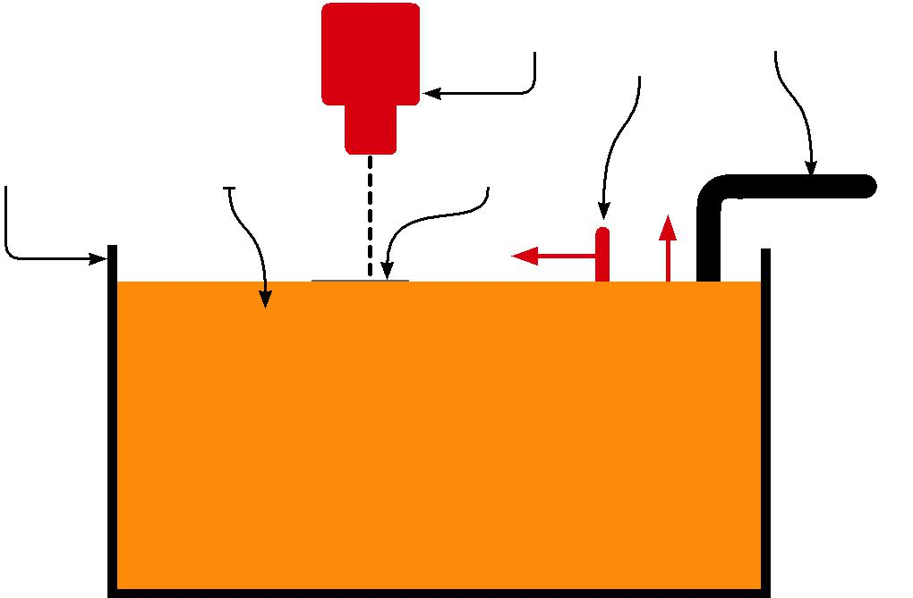

> Laser Levelling
> Platform
> 
> blade
> 
> Vat Photo resin Object
> (cured)
> 
> Figure 1: Vat photopolymerisation
> 
> **1.1.2 Material jetting**
> 
> This is the process most akin to conventional printing. Material is
> applied in droplets through a small diameter nozzle in a similar way
> to an inkjet paper printer, but it is applied layer-by-layer to a
> build platform, making a 3D object which may then be cured by UV
> light.

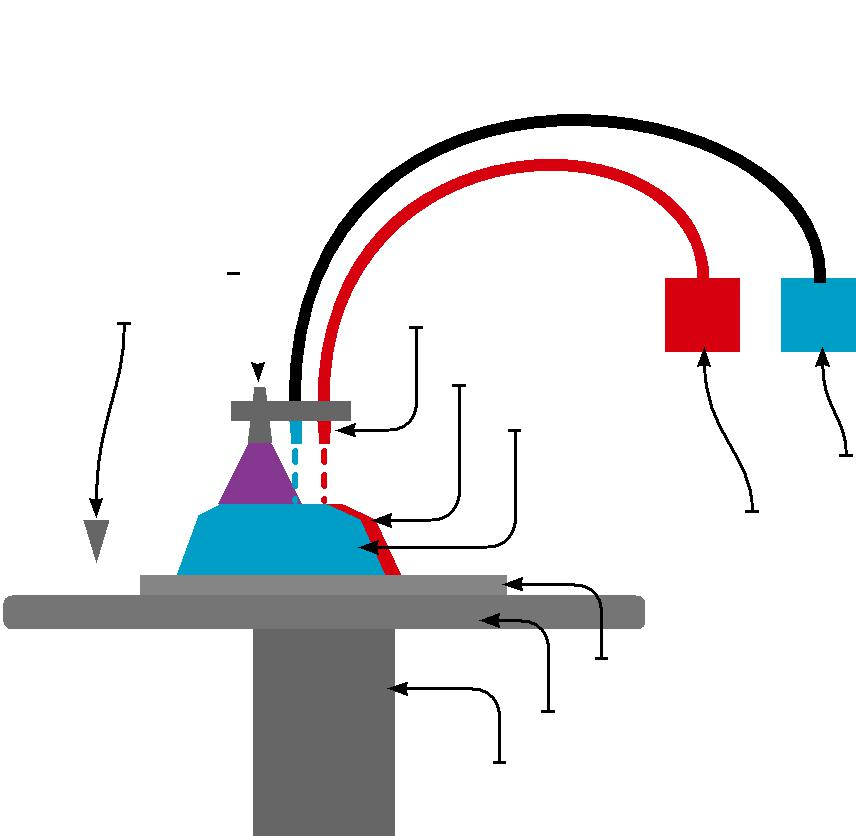

> UV curing lamp
> 
> Levelling blade 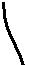 Print heads
> 
> Support
> 
> Printed object
> 
> Build material
> 
> Support material
> 
> Build substrate
> 
> Build platform
> 
> Elevator
> 
> Figure 2: Material jetting

4 Risk Control

**1.1.3 Binder jetting**

Two materials are used in this process, a powder base material and a
liquid binder. Powder is spread in a powder bed build chamber in
sequential layers followed by a binder which is applied through jet
nozzles. The programming of the nozzles and lowering of the powder bed
has the action of building up the shape of a programmed 3D object. After
the print is finished, the remaining powder is cleaned off and may be
reused for printing the next object.

<table>
<tbody>
<tr class="odd">
<td>Levelling roller</td>
<td><blockquote>

Liquid adhesive supply

</blockquote></td>
<td></td>
<td></td>
<td></td>
<td></td>
<td></td>
<td></td>
<td></td>
<td></td>
<td></td>
<td></td>
</tr>
<tr class="even">
<td></td>
<td></td>
<td><blockquote>

Powder feed supply

</blockquote></td>
<td></td>
<td></td>
<td></td>
<td></td>
<td></td>
<td></td>
<td></td>
<td></td>
<td></td>
</tr>
<tr class="odd">
<td></td>
<td></td>
<td></td>
<td><blockquote>

Inkjet print head

</blockquote></td>
<td></td>
<td></td>
<td></td>
<td></td>
<td></td>
<td></td>
<td></td>
<td></td>
</tr>
<tr class="even">
<td></td>
<td></td>
<td></td>
<td></td>
<td></td>
<td></td>
<td></td>
<td></td>
<td></td>
<td></td>
<td></td>
<td></td>
</tr>
<tr class="odd">
<td></td>
<td></td>
<td></td>
<td></td>
<td></td>
<td></td>
<td></td>
<td></td>
<td></td>
<td></td>
<td></td>
<td></td>
</tr>
<tr class="even">
<td></td>
<td></td>
<td></td>
<td></td>
<td></td>
<td></td>
<td></td>
<td></td>
<td></td>
<td></td>
<td></td>
<td></td>
</tr>
</tbody>
</table>

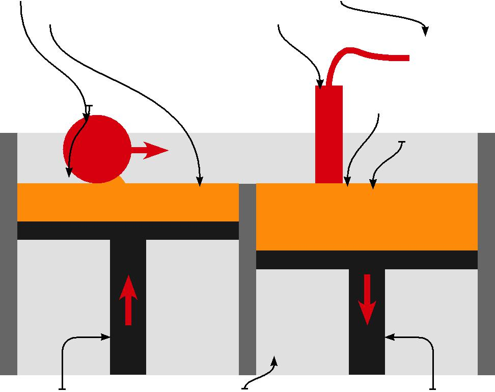

> Part
> 
> Powder bed
> 
> Powder feed piston Build chamber Build piston

Figure 3: Binder jetting

RC65: Recommendations for fire safety with three dimensional printing 5

What is the most appropriate fire protection system for my 3D printing
enclosure?

**  
1.1.4 Material extrusion**

The most commonly used technology in this process is fused deposition
modeling (this term and its abbreviation FDM are registered trademarks).
FDM technology uses a plastic filament or metal wire, which is unwound
from a coil and supplies material to a controllable extrusion nozzle.
The nozzle is heated to melt the material, and can be moved both
horizontally and vertically by a mechanism directly controlled by a
computer-aided manufacturing software package. The extruding material
forms layers as it hardens immediately after deposition from the nozzle.
This technology is most widely used with two plastic filament material
types, ABS (acrylonitrile butadiene styrene) and PLA (polylactic acid),
but many other materials

are available (including nylon, thermoplastic polurethane and
polycarbonate), allowing the manufactured object to have various
physical properties.

> Material spool 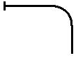

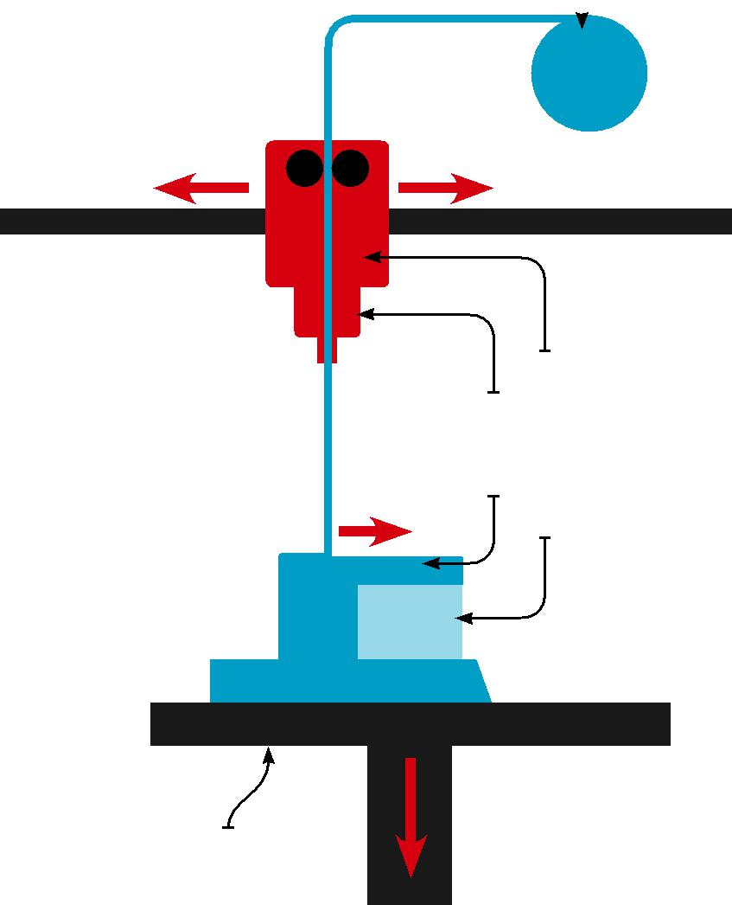

> Heater element
> 
> Nozzle
> 
> Object/model
> 
> Support material
> 
> Build platform

Figure 4: Material extrusion

6 Risk Control

**1.1.5 Powder bed fusion**

The most commonly used technology in this process is selective laser
sintering (SLS). The process uses a high-power laser to fuse small
particles of plastic, metal, ceramic or glass powders into a mass that
has the desired three dimensional shape. The laser selectively fuses the
powdered material on the surface of a powder bed by scanning the
cross-sections (or layers) generated by a 3D modelling program. After
each cross-section is scanned,

the powder bed is lowered by one layer thickness, and the process is
repeated until the object is complete.

The unfused powder acts as a support for the object being created and
thus no further support is required. All unused powder can be used for
the next print.

> Laser

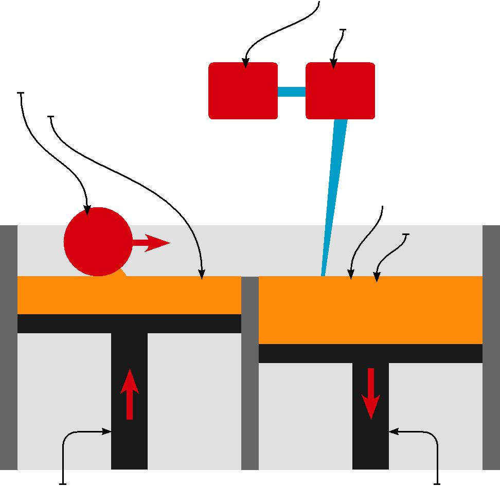

> Scanner system
> 
> Levelling roller
> 
> Powder feed supply
> 
> Part/object
> 
> Powder bed
> 
> Powder delivery piston Build piston

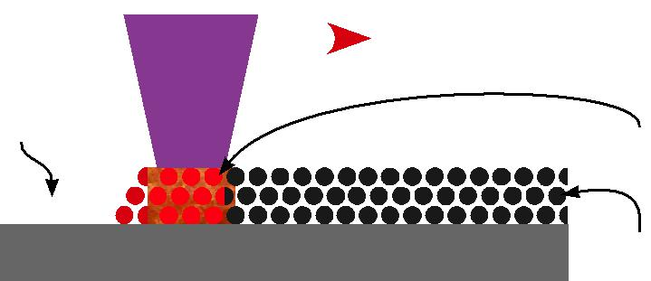

<table>
<tbody>
<tr class="odd">
<td>Sintered</td>
<td><blockquote>

Laser

</blockquote></td>
<td></td>
<td></td>
<td><blockquote>

Laser scanning direction

</blockquote></td>
<td></td>
<td></td>
<td></td>
<td></td>
<td></td>
</tr>
<tr class="even">
<td>powder</td>
<td></td>
<td></td>
<td></td>
<td></td>
<td></td>
<td></td>
<td></td>
<td></td>
<td></td>
</tr>
<tr class="odd">
<td></td>
<td></td>
<td></td>
<td></td>
<td></td>
<td></td>
<td></td>
<td></td>
<td></td>
<td></td>
</tr>
<tr class="even">
<td></td>
<td><blockquote>

beam

</blockquote></td>
<td></td>
<td></td>
<td></td>
<td></td>
<td></td>
<td></td>
<td></td>
<td></td>
</tr>
<tr class="odd">
<td>particles</td>
<td></td>
<td></td>
<td></td>
<td></td>
<td></td>
<td></td>
<td></td>
<td></td>
<td></td>
</tr>
<tr class="even">
<td></td>
<td></td>
<td></td>
<td></td>
<td></td>
<td></td>
<td></td>
<td></td>
<td></td>
<td></td>
</tr>
<tr class="odd">
<td>(brown</td>
<td></td>
<td></td>
<td></td>
<td></td>
<td></td>
<td></td>
<td></td>
<td></td>
<td></td>
</tr>
<tr class="even">
<td>state)</td>
<td></td>
<td></td>
<td></td>
<td></td>
<td></td>
<td></td>
<td></td>
<td></td>
<td></td>
</tr>
<tr class="odd">
<td></td>
<td></td>
<td></td>
<td></td>
<td><blockquote>

Laser

</blockquote></td>
<td></td>
<td></td>
<td></td>
<td></td>
<td></td>
</tr>
<tr class="even">
<td></td>
<td></td>
<td></td>
<td></td>
<td></td>
<td></td>
<td></td>
<td></td>
<td></td>
<td></td>
</tr>
<tr class="odd">
<td></td>
<td></td>
<td></td>
<td></td>
<td></td>
<td></td>
<td></td>
<td></td>
<td></td>
<td></td>
</tr>
<tr class="even">
<td></td>
<td></td>
<td></td>
<td></td>
<td></td>
<td></td>
<td><blockquote>

sintering

</blockquote></td>
<td></td>
<td></td>
<td></td>
</tr>
<tr class="odd">
<td></td>
<td></td>
<td></td>
<td></td>
<td></td>
<td></td>
<td></td>
<td></td>
<td></td>
<td></td>
</tr>
<tr class="even">
<td></td>
<td></td>
<td></td>
<td></td>
<td></td>
<td></td>
<td></td>
<td></td>
<td></td>
<td></td>
</tr>
<tr class="odd">
<td></td>
<td></td>
<td></td>
<td></td>
<td></td>
<td></td>
<td></td>
<td></td>
<td></td>
<td></td>
</tr>
</tbody>
</table>

> Pre-placed powder bed (green state)

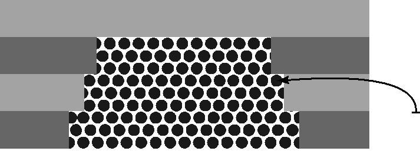

> Unsintered material in previous layers

Figure 5: Selective laser sintering

RC65: Recommendations for fire safety with three dimensional printing 7

> **1.1.6 Sheet lamination**
> 
> Although classified as an additive technology, this is a quite
> different process which may not be considered to be printing. Sheet
> lamination involves material in sheets bound together with external
> force. Sheets can be metal, paper or a form of polymer. Metal sheets
> are welded together by ultrasonic welding in layers and then milled
> into a proper shape. Paper sheets can also be used, but they are glued
> by adhesive glue and cut into shape by precise blades.
> 
> Rotating Ultrasonic cylindrical oscillation sonotrode

> Clamping force from sonotrode
> 
> Ultrasonic oscillation
> 
> Foil/foil interface and solid state bond

Reaction force from anvil and base plate

> 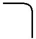 Base plate
> 
> Anvil
> 
> Metal foils
> 
> Figure 6: Sheet lamination

8 Risk Control

> **1.1.7 Directed energy deposition**
> 
> This process is an elaborate technology, mostly used in the high-tech
> metal industry and in rapid manufacturing applications. The 3D
> printing apparatus is usually attached to a multi-axis robotic arm,
> and consists of a nozzle that deposits metal powder or wire on a
> surface and an energy source such as a laser, electron beam or plasma
> arc that melts it, forming a solid object.

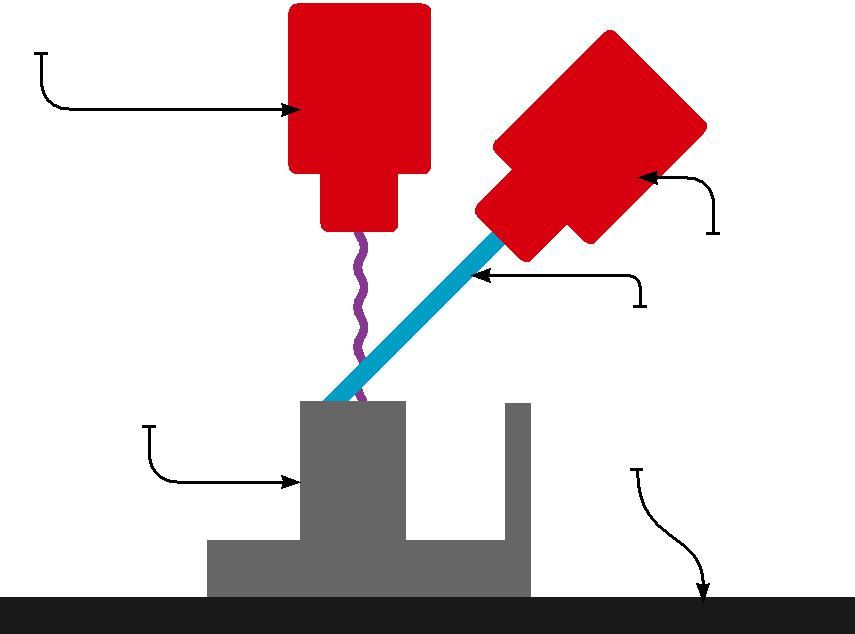

> Electron beam
> 
> Material (metal) wire supply
> 
> Metal wire
> 
> Object
> 
> Build platform
> 
> Figure 7: Directed energy deposition printing

2.  Selecting the process

> Prior to considering which technology to employ, criteria such as the
> choice of material(s) to be used need to be considered, together with
> production cycle times, the speed of
> 
> production, any post-production processing and costs. Specialist
> advice may be needed as part of this process.
> 
> The main variable is the ‘speed’ of printing, but this may have
> several definitions. Often considered simply as the vertical build
> speed, an alternative approach is to consider the time required to
> build a specific part or to print a specific volume. This may be
> important where
> 
> a technology that may print a single, geometrically simple part quite
> quickly slows down when additional parts are added to a print job, or
> when the complexity and/or size of the geometry increases.
> 
> Each 3D printing technology requires a different level of
> post-processing once the parts have been printed, although some of
> these steps can be automated. Powder-based technologies tend to
> require the least post-processing as they only need to be de-powdered,
> and no supports or supporting materials have to be removed. On the
> other hand, some plastic
> 
> 3D printed parts may require processes such as rinsing, UV curing and
> the removal of manual supports.
> 
> Other criteria that have to be considered include the maximum size of
> the product that can be produced by the equipment, and the ability to
> produce coloured objects, when the ability to dither colour
> information may be the defining factor in the choice of product.

RC65: Recommendations for fire safety with three dimensional printing 9

Scope

> These recommendations have been produced to minimise the likelihood
> and consequences of a fire involving a 3D printer in commerce and
> industry. The term 3D printing relates to a wide range of processes
> using diverse equipment and a broad spectrum of applied materials. The
> advice is not intended to apply to 3D printing undertaken in a
> domestic environment.

3 Synopsis

> 3D printing technologies are becoming increasingly utilised in
> industry. These recommendations are not directed to any industrial
> sector and are concerned with the need for 3D printers to operate in a
> fire safe environment, whether it is permanently attended or being
> left unattended due to the length of time required to build a large
> object.
> 
> The recommendations in this publication present guidance for fire
> safety when using three dimensional (3D) printers; because of the
> rapidly developing and increasingly diverse nature of the processes
> employed, the guidance is of necessity of a general nature. The
> 
> recommendations should be applied in conjunction with the
> manufacturer’s instructions and the fire risk assessment for the
> premises.

4 Definitions

> Unattended process
> 
> An unattended process is one that, once set up, is required to
> continue for a prolonged period of time without intervention or
> periodic monitoring by personnel.
> 
> Dither
> 
> Dithering is the attempt by a computer program to approximate a colour
> from a mixture of other colours when the required colour is not
> available.

5.  > Recommendations
    
    1.  > Compliance with fire safety legislation

What actions can be taken to maintain business continuity in the event
of a fire where a 3D printer is being used?

1.  A suitable and sufficient fire risk assessment should be undertaken
    for all premises to which the Regulatory Reform (Fire Safety) Order
    2005 (or equivalent legislation in Scotland and Northern Ireland)
    applies (refs 1-5).

2.  The potential hazards associated with 3D printing processes should
    be considered when undertaking assessments in compliance with the
    Dangerous Substances and Explosive Atmospheres Regulations (DSEAR
    (as amended 2015) (ref. 6). DSEAR assessments should be undertaken
    by a competent person.

3.  Risk assessments should be subject to periodic review, including at
    the time when any changes to the machinery, plant or materials being
    employed in the printing process or in the layout of the workplace
    are being considered.

10 Risk Control

Duplicate copies of the CAD or 3D modelling files should be

available off site in case of fire or flood at the workplace

When considering purchasing 3D printing facilities ensure that the most
appropriate equipment is purchased,

and the fire hazards that are introduced into the workplace are
adequately assessed

3D printers should not be allowed to operate unattended without the
process being fully developed and run for a prolonged period of time
with staff in attendance

2.  Business continuity

<!-- end list -->

1.  Even a small fire can have a disproportionate effect on a business
    if it occurs in a critical area. The 3D printing process must
    therefore be carefully managed to avoid unnecessary disruption to
    the efficient functioning of the business.

2.  It is important that the computer software, CAD or 3D modelling
    files that drive the printers are duplicated off-site together with
    other company records, so that the electronic instructions for the
    printers are not lost in the event of fire. Software files that form
    off-site back ups should be tested to ensure that they can be
    recovered from the archive to operate the printer. Primary samples
    of products should also be kept off site to allow them to be
    available for scanning if necessary.

3.  All businesses should take steps to maintain the continuity of their
    operations by making a suitable emergency plan. Guidance for this is
    set out in Business resilience: A guide to protecting your business
    and its people (ref 7). The emergency plan should address the
    implications of a fire, flood or other perceived disaster on all
    facets of

> the business model. It should indicate the lines of communication that
> should be followed and the contact details for specialist assistance,
> providers of alternative accommodation and suppliers of replacement 3D
> printing and other equipment.

4.  Tabletop exercises should be held periodically to test the
    effectiveness and suitability of the emergency plan.

5.  Consideration may be given to applying commercially available
    computer programs such as the ROBUST software (Resilient Business
    Software Toolkit) that is available free of charge (ref 8), or
    similar, to develop and check the adequacy of the plan.

6.  Where parts are purchased that are known to be produced by 3D
    printing then the organisation’s emergency plan should identify
    alternative suppliers. It should be recognised that there may be
    limited alternative sources, and complications may arise due to
    possible legal protection of the printing programme or process.
    Supplies may also be dependent on the fire safety management regime
    of the supplying company.

<!-- end list -->

3.  Fire safety management

<!-- end list -->

1.  There are a wide range of 3D printers available utilising different
    modes of operation and materials. Care should be taken when
    considering purchasing 3D printing facilities that the most
    appropriate equipment is purchased. The way that the equipment
    operates and the facilities that need to be provided should be fully
    understood, to allow fire hazards that are introduced into the
    workplace to be adequately assessed, and appropriate prevention and
    protection measures identified and implemented where necessary.

2.  Any areas of heat production in the process should be identified to
    allow safety controls, including thermostats and upper temperature
    limit temperature sensors, to be identified and put in place.

3.  The response by fire and rescue services to 999/112 calls and
    signals routed via fire alarm monitoring organisations varies widely
    throughout the UK, and differs from day to night-time. Fire safety
    managers should refer to the relevant fire and rescue service to
    make themselves aware of the levels of response in the areas in
    which their premises are located, and consider this information when
    undertaking and reviewing their fire risk assessments.

4.  Site plans should be available for the emergency services: these
    should show the locations of the printing equipment and associated
    installations, and any other relevant fire hazards such as flammable
    liquid or compressed gas stores.

5.  Unattended operation of 3D printers should be avoided where
    possible. Where this is not practicable, new 3D printing processes
    should be fully developed and run for a

> prolonged period with staff in attendance prior to the possibility of
> unattended operation being assessed. This is to ensure that the
> equipment is working satisfactorily, and that all foreseeable
> potential safety issues and fire hazards have been identified and
> addressed.

RC65: Recommendations for fire safety with three dimensional printing 11

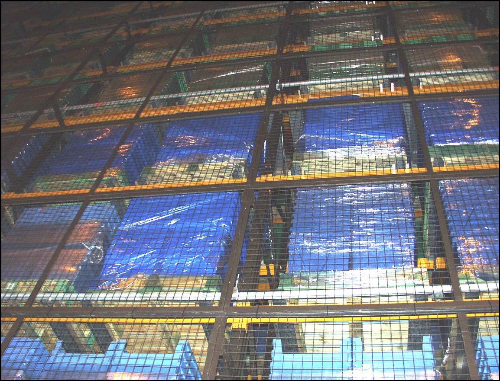

The use of flammable liquids as part of 3D printing processes or for
maintenance purposes should be avoided

6.  In commercial premises where 3D printing is undertaken, the fire
    hazards and thus the threat to the business are increased if the
    processes are allowed to continue unattended. If it is intended that
    equipment is to be left operating without staff in attendance, then
    a specific risk assessment for the process should be undertaken and
    appropriate control measures introduced. Further information
    regarding unattended processes is set out in RC42: Recommendations
    for fire safety of unattended processes (ref 9).

7.  Where equipment is left to run, unattended notices should be
    displayed prominently outside the door(s) to the compartment in
    which the process is located, giving the contact details of staff
    who should be contacted in an emergency.

8.  The fire risk assessment undertaken during the planning stage should
    consider the nature of the materials used in the process; any
    powders, flammable liquids or other hazardous materials should be
    identified to allow suitable measures to be adopted for their safe
    storage, handling and use.

9.  Where powders are used in the process, as a powder bed or a support
    material, the guidance presented in RC12: Recommendations for the
    prevention and control of dust explosions (ref 10) should be
    observed. In particular, care must be taken to avoid disturbing
    powder beds that could form dispersions of powder in the air.

10. The use of flammable liquids should be avoided wherever possible.
    Where this is unavoidable as part of a process or for servicing and
    maintenance purposes, the minimum quantities consistent with
    effective working should be introduced into the building. Flammable
    liquids should be stored, handled and used in accordance with the
    guidance set out in RC55: Recommendations for fire safety in the
    storage, handling and use of flammable and highly flammable liquids
    (ref 11).

11. Any spillage of flammable liquid should be addressed immediately
    using suitable absorbent materials. The process may have to be
    halted in the event of a significant spillage.

12. Some 3D printing processes are carried out in controlled
    atmospheres. Measures for monitoring and controlling the gas supply
    and composition of the atmosphere should be planned and put in
    place. The storage, use and handling of gases in cylinders should be
    in accordance with the recommendations set out in RC8:
    Recommendations for the storage, use and handling of common
    industrial gases in cylinders (ref 12).

13. Enclosures should be kept shut during operations if this is required
    in the manufacturer’s instructions. No objects should be allowed in
    the vicinity of moving parts which could form an obstruction, thus
    affecting the quality of the product or potentially leading to
    overheating of components or materials.

14. Appropriate devices should be in place to ensure the continued
    running or safe shut down of the equipment in the event of failure
    of the mains electrical supply.

15. All equipment, including safety cut out devices, should be
    installed, used and maintained in accordance with the manufacturer’s
    instructions. Servicing and maintenance should be carried out by a
    competent engineer.

16. Electrical installations should be designed, installed and
    periodically tested by a competent electrician in accordance with
    the current edition of BS 7671 (the Institution of Electrical
    Engineers Wiring Regulations) (ref. 13). Inspections should be
    carried out on a risk assessed basis as recommended in the Periodic
    Inspection Report.

17. High level cables should be carried on cable trays or be securely
    attached to an element of construction, so as not to drop and cause
    a hazard to firefighters in the event of a fire. Where wiring is run
    in escape routes, non-metallic clips, ties or trunking should not be
    used as the sole means of support.

18. Where the risk assessment indicates that a hazard from static
    electricity could develop then appropriate earthing and bonding of
    the printer and any extraneous metal parts should be introduced and
    regular inspections of the arrangements be undertaken and recorded.

12 Risk Control

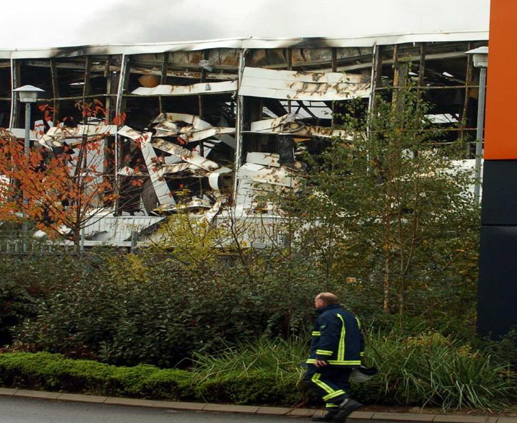

Where a 3D printer is located in a fire compartment provided for that
purpose, no combustible materials – whether raw materials, finished
products or packaging – should be stored in that compartment

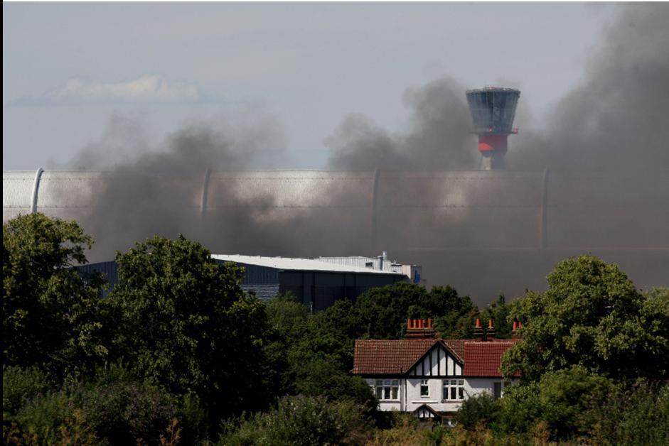

> Combustible materials, whether raw materials, finished products or
> packaging, should not be stored within an area around the process as
> determined by a risk assessment or as agreed with the insurer

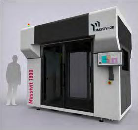

> Figure 8: A large scale industrial 3D printer (picture courtesy
> Massivit 3D/Kitech Design)

> Can water be used to fight a fire in a 3D printer?

4.  Location

<!-- end list -->

1.  Wherever possible, any 3D printing equipment that is to operate
    unattended at any time, or any printer that has been assessed as
    posing a high fire risk, should be located in a separate fire
    compartment designed to provide at least 60 minutes fire resistance
    (integrity and insulation).

2.  Where a 3D printer is located in a fire compartment provided for
    that purpose, no combustible materials – whether raw materials,
    finished products or packaging – should be stored in that
    compartment.

3.  Where a printer is not located in a separate fire compartment, then
    no stored combustible materials should be located within an area
    around the process, as determined by a risk assessment or as agreed
    with the insurer.

<!-- end list -->

5.  Staff training

<!-- end list -->

1.  Staff using a 3D printer should receive appropriate instruction,
    including:
    
      - > the correct method of using the equipment in accordance with
        > the manufacturer’s instructions
    
      - > the importance of routine maintenance and the procedures for
        > undertaking and recording this
    
      - > the safety features that are incorporated into the equipment
        > and the correct method of setting these for the operation that
        > is to be undertaken
    
      - > the maximum period for which printing may be undertaken
        > between checks
    
      - > the method for shutting down the equipment safely in an
        > emergency
    
      - > the emergency procedures in the event of a fire in either the
        > printer or elsewhere in the compartment in which it is housed
    
      - > the mode of operation of the automatic and manual fire
        > protection equipment that is provided

<!-- end list -->

6.  Fire protection

<!-- end list -->

1.  The building in which a 3D printer is installed should be protected
    by an automatic fire detection and alarm (AFD) system designed,
    installed and maintained by an engineer with accreditation by an
    independent UKAS accredited third party certification

> body. The system should be to a recognised category of installation in
> accordance with BS 5839-1 (ref 14) as determined by a risk assessment
> or in consultation with the insurer.

2.  The automatic fire detection and alarm system should be monitored
    either on-site or by an off-site alarm receiving centre, with
    accreditation by an independent UKAS accredited third party
    certification body and operating in accordance with

> BS 5979 (ref 15). As response times to automatic fire alarm systems
> can vary, serious consideration should be given to the installation of
> a fixed fire suppression system if the printer is to run unattended.

3.  The AFD installation should be periodically serviced and maintained
    by a competent engineer with accreditation by an independent UKAS
    accredited third party certification body in accordance with BS
    5839-1 (ref 14).

4.  The installation of an automatic fixed fire suppression system is
    strongly recommended if a printer is to run unattended. The
    installation should be designed to operate within the enclosure or
    compartment in which the printing is being undertaken. It is
    important that proving tests are undertaken at the design stage to
    ensure that the system is suitable and appropriate for the intended
    application.

RC65: Recommendations for fire safety with three dimensional printing 13

5.  Prior to the design of the fire suppression installation, a risk
    assessment should be undertaken to identify all conditions that the
    system must protect against, including idle time, maintenance,
    routine servicing and cleaning operations.

6.  The fire protection system should be designed following consultation
    with the insurer. The most appropriate detection and suppression
    methods should be adopted with the aim of providing effective
    suppression, while minimising unwanted actuation. The system may
    incorporate conventional detector heads, video detection techniques,
    frangible glass bulbs, fusible links or other suitable mechanisms.
    The fire suppression system should be be designed to operate at the
    earliest opportunity, while allowing suitable provisions for life
    safety where necessary.

7.  The most effective extinguishing agent for the application should be
    selected following a risk assessment, taking into consideration the
    effectiveness of the agent as well as toxicity, asphyxiation
    potential, environmental and contamination issues when used with the
    printing equipment. Dry powder is not generally recommended, as it
    can cause contamination of electronic control systems and rail or
    track mechanisms for the printing heads, as well as potentially
    posing a health hazard in a closed environment. The principal
    alternatives are carbon dioxide and other gaseous systems.

8.  In small enclosed printers, proprietary fire suppression systems
    that take the form of a polymer tube linked to a pressurised
    container of extinguishing medium may be appropriate, as they allow
    heat to be detected over a wide area, and release the extinguishing
    agent directly onto the source of heat.

9.  On operation of the fire suppression system, the printer should
    automatically switch off, and remote signaling be activated in a
    manned area.

10. Fixed fire suppression installations should comply with the relevant
    British Standard (see refs. 16-19). Where there is no appropriate
    British Standard, best practice, such as the instructions issued by
    the manufacturer or supplier of the printer, should

> be followed.

11. Fixed fire suppression systems should be designed, installed and
    commissioned by an engineer certificated by an independent UKAS
    accredited third party certification body, in compliance with the
    requirements of national or other recognised standards.

12. The risk assessment and business impact analysis may indicate that
    an automatic sprinkler installation may be appropriate. Sprinkler
    systems should be designed, installed, commissioned and maintained
    in accordance with the LPC Sprinkler Rules incorporating BS EN 12845
    (ref 20), by engineers having accreditation by an independent UKAS
    accredited third party certification body.

13. Suppression systems should be tested and maintained according to the
    requirements of the relevant British Standard and/or the installer’s
    recommendations, by a competent engineer with accreditation by an
    independent UKAS accredited third party certification body. Suitable
    records should be kept.

14. Arrangements should be in place for the prompt recommissioning of an
    automatic fire suppression system that has actuated. Back up
    supplies of extinguishing agents should be kept or arrangements made
    for their immediate replacement.

15. Following actuation of the fire suppression system, the printer
    should not be left working unattended until:
    
      - > the automatic fire suppression system has been fully
        > recommissioned
    
      - > the printer has been inspected and found to be serviceable by
        > a competent person
    
      - > appropriate repairs have been undertaken or replacement parts
        > fitted by a competent person to render the printer serviceable

14 Risk Control

16. In addition to the automatic suppression systems, a suitable number
    of appropriate portable fire extinguishers should be available and
    immediately accessible in the case of a fire. The provision of dry
    powder extinguishers should be avoided (see 5.6.7). Portable
    extinguishers should be approved and certified by an independent,
    third party certification body, be installed in accordance with BS
    5306-8 (ref 21), and inspected and maintained in compliance with BS
    5306-3 (ref 22).

17. Where large 3D printers are in operation, or there are printers that
    have been identified as posing a high fire risk, information should
    be provided for the fire and rescue service at a prominent location
    (often in a box provided for this purpose outside the main entrance)
    to indicate:
    
      - > the layout of the building
    
      - > the location of large or hazardous 3D printers and any other
        > unattended processes
    
      - > the location of emergency shutdown points for the printers
    
      - > the nature of the automatic fire suppression system(s) and the
        > location of any controls
    
      - > the location and quantity of any hazardous materials
    
      - > contact details for specialist staff who may need to be
        > consulted
    
      - > the location of hydrants, rising mains or other sources of
        > water for firefighting purposes

RC65: Recommendations for fire safety with three dimensional printing 15

|    |
| -- |
| 16 |

|              |
| ------------ |
| Risk Control |

> 6 Checklist

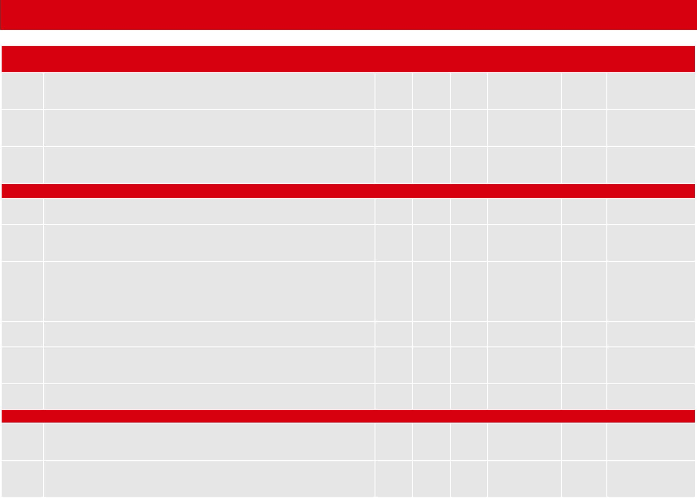

> Yes No N/A Action required Due date Sign on completion

1.  Compliance with fire safey legislation (section 5.1)

<!-- end list -->

1.  Has a suitable and sufficient fire risk assessment been undertaken
    for all premises to which the Regulatory Reform (Fire Safety) Order
    2005 (or equivalent legislation in Scotland and Northern Ireland)
    applies? (5.1.1)

2.  Has an assessment of the processes been undertaken in accordance
    with the requirements of the Dangerous Substances and Explosive
    Atmospheres Regulations (as amended 2015)?

3.  Are risk assessments subject to periodic review, including at the
    time when any changes to the machinery, plant or materials being
    employed in the printing process or in the layout of the workplace
    are being considered? (5.1.2)

<!-- end list -->

2.  Business continuity (Section 5.2)

<!-- end list -->

1.  Is the 3D printing process carefully managed to avoid unnecessary
    disruption to the efficient functioning of the business? (5.2.1)

2.  Is the computer software, CAD or 3D modelling files that drive the
    printers duplicated off site together with other company records so
    that the electronic instructions for the printers are not lost in
    the event of fire? (5.2.2)

3.  Does the emergency plan address the implications of a fire, flood or
    other perceived disaster on all facets of the business model and
    indicate the lines of communication that should be followed, the
    contact details for specialist assistance, providers of alternative
    accommodation and suppliers of replacement 3D printing and other
    equipment? (5.2.3)

4.  Are tabletop exercises held periodically to test the effectiveness
    and suitability of the emergency plan? (5.2.4)

5.  Has consideration been given to applying commercially available
    computer programs, such as the ROBUST software or a similar product
    to develop and check the adequacy of the plan? (5.2.5)

6.  Where parts are purchased that are known to be produced by 3D
    printing then does the organisation’s emergency plan identify
    alternative suppliers? (5.2.6)

<!-- end list -->

3.  Fire safety management (Section 5.3)

<!-- end list -->

1.  Is care taken when considering purchasing 3D printing facilities
    that the most appropriate equipment is purchased and the way that
    the equipment operates and the facilities that need to be provided
    are fully understood? (5.3.1)

2.  Are any areas of heat production in the process identified to allow
    safety controls, including thermostats and upper temperature limit
    temperature sensors to be identified and put in place? (5.3.2)

<table>
<tbody>
<tr class="odd">
<td></td>
<td></td>
<td><blockquote>

Yes

</blockquote></td>
<td><blockquote>

No

</blockquote></td>
<td><blockquote>

N/A

</blockquote></td>
<td><blockquote>

Action required Due date Sign on completion

</blockquote></td>
<td></td>
</tr>
<tr class="even">
<td></td>
<td><blockquote>

6.3.3

</blockquote></td>
<td><blockquote>

Has the fire safety manager referred to the relevant fire and rescue service to become

</blockquote></td>
<td></td>
<td></td>
<td></td>
<td></td>
</tr>
<tr class="odd">
<td></td>
<td></td>
<td><blockquote>

aware of the level of response in the area in which their premises are located and

</blockquote></td>
<td></td>
<td></td>
<td></td>
<td></td>
</tr>
<tr class="even">
<td></td>
<td></td>
<td><blockquote>

considered this when undertaking and reviewing the fire risk assessments? (5.3.3)

</blockquote></td>
<td></td>
<td></td>
<td></td>
<td></td>
</tr>
<tr class="odd">
<td></td>
<td><blockquote>

6.3.4

</blockquote></td>
<td><blockquote>

Are site plans available for the emergency services showing the locations of the printing

</blockquote></td>
<td></td>
<td></td>
<td></td>
<td></td>
</tr>
<tr class="even">
<td></td>
<td></td>
<td><blockquote>

equipment, associated installations and other fire hazards? (5.3.4)

</blockquote></td>
<td></td>
<td></td>
<td></td>
<td></td>
</tr>
<tr class="odd">
<td></td>
<td><blockquote>

6.3.5

</blockquote></td>
<td><blockquote>

Before being left unattended, is a new 3D printing process fully developed and run for

</blockquote></td>
<td></td>
<td></td>
<td></td>
<td></td>
</tr>
<tr class="even">
<td></td>
<td></td>
<td><blockquote>

a prolonged period with staff in attendance? (5.3.5)

</blockquote></td>
<td></td>
<td></td>
<td></td>
<td></td>
</tr>
<tr class="odd">
<td></td>
<td><blockquote>

6.3.6

</blockquote></td>
<td><blockquote>

If equipment is left operating wihthout staff in attendance, has a specific risk

</blockquote></td>
<td></td>
<td></td>
<td></td>
<td></td>
</tr>
<tr class="even">
<td></td>
<td></td>
<td><blockquote>

assessment for the process been undertaken and appropriate control measures

</blockquote></td>
<td></td>
<td></td>
<td></td>
<td></td>
</tr>
<tr class="odd">
<td></td>
<td></td>
<td><blockquote>

introduced in line with the recommendations in RC42? (5.3.6)

</blockquote></td>
<td></td>
<td></td>
<td></td>
<td></td>
</tr>
<tr class="even">
<td></td>
<td><blockquote>

6.3.7

</blockquote></td>
<td><blockquote>

Where equipment is left to run unattended are notices displayed prominently outside

</blockquote></td>
<td></td>
<td></td>
<td></td>
<td></td>
</tr>
<tr class="odd">
<td></td>
<td></td>
<td><blockquote>

the door(s) to the compartment in which the process is located giving the contact

</blockquote></td>
<td></td>
<td></td>
<td></td>
<td></td>
</tr>
<tr class="even">
<td><blockquote>

RC65:

</blockquote></td>
<td></td>
<td><blockquote>

details of staff who should be contacted in an emergency? (5.3.7)

</blockquote></td>
<td></td>
<td></td>
<td></td>
<td></td>
</tr>
<tr class="odd">
<td></td>
<td><blockquote>

6.3.8

</blockquote></td>
<td><blockquote>

Does the fire risk assessment undertaken during the planning stage consider the

</blockquote></td>
<td></td>
<td></td>
<td></td>
<td></td>
</tr>
<tr class="even">
<td></td>
<td></td>
<td><blockquote>

nature of the materials used in the process and identify any powders, flammable liquids

</blockquote></td>
<td></td>
<td></td>
<td></td>
<td></td>
</tr>
<tr class="odd">
<td><blockquote>

Recommendations

</blockquote></td>
<td></td>
<td><blockquote>

or other hazardous materials to allow suitable measures to be adopted for their safe

</blockquote></td>
<td></td>
<td></td>
<td></td>
<td></td>
</tr>
<tr class="even">
<td></td>
<td></td>
<td><blockquote>

storage, handling and use? (5.3.8)

</blockquote></td>
<td></td>
<td></td>
<td></td>
<td></td>
</tr>
<tr class="odd">
<td></td>
<td></td>
<td></td>
<td></td>
<td></td>
<td></td>
<td></td>
</tr>
<tr class="even">
<td></td>
<td><blockquote>

6.3.9

</blockquote></td>
<td><blockquote>

Where powders are used in the process as a powder bed or a support material does

</blockquote></td>
<td></td>
<td></td>
<td></td>
<td></td>
</tr>
<tr class="odd">
<td></td>
<td></td>
<td><blockquote>

the guidance presented in RC12 being observed? (5.3.9)

</blockquote></td>
<td></td>
<td></td>
<td></td>
<td></td>
</tr>
<tr class="even">
<td></td>
<td><blockquote>

6.3.10

</blockquote></td>
<td><blockquote>

Are the recommendations set out in RC55 observed where flammable or highly

</blockquote></td>
<td></td>
<td></td>
<td></td>
<td></td>
</tr>
<tr class="odd">
<td><blockquote>

for

</blockquote></td>
<td></td>
<td><blockquote>

flammable materials are in use? (5.3.10)

</blockquote></td>
<td></td>
<td></td>
<td></td>
<td></td>
</tr>
<tr class="even">
<td></td>
<td><blockquote>

6.3.11

</blockquote></td>
<td><blockquote>

Is the use of flammable liquids avoided wherever possible? Where this is unavoidable

</blockquote></td>
<td></td>
<td></td>
<td></td>
<td></td>
</tr>
<tr class="odd">
<td><blockquote>

fire

</blockquote></td>
<td></td>
<td></td>
<td></td>
<td></td>
<td></td>
<td></td>
</tr>
<tr class="even">
<td></td>
<td></td>
<td><blockquote>

as part of a process or for servicing and maintenance purposes, are the minimum

</blockquote></td>
<td></td>
<td></td>
<td></td>
<td></td>
</tr>
<tr class="odd">
<td><blockquote>

safety

</blockquote></td>
<td></td>
<td></td>
<td></td>
<td></td>
<td></td>
<td></td>
</tr>
<tr class="even">
<td></td>
<td></td>
<td><blockquote>

quantities in the building consistent with effective working? (5.3.10)

</blockquote></td>
<td></td>
<td></td>
<td></td>
<td></td>
</tr>
<tr class="odd">
<td></td>
<td></td>
<td></td>
<td></td>
<td></td>
<td></td>
<td></td>
</tr>
<tr class="even">
<td><blockquote>

with

</blockquote></td>
<td><blockquote>

6.3.12

</blockquote></td>
<td><blockquote>

Are appropriate measures and materials in place to address a spillage of flammable

</blockquote></td>
<td></td>
<td></td>
<td></td>
<td></td>
</tr>
<tr class="odd">
<td></td>
<td></td>
<td><blockquote>

liquid? (5.3.11)

</blockquote></td>
<td></td>
<td></td>
<td></td>
<td></td>
</tr>
<tr class="even">
<td></td>
<td></td>
<td></td>
<td></td>
<td></td>
<td></td>
<td></td>
</tr>
<tr class="odd">
<td><blockquote>

three

</blockquote></td>
<td><blockquote>

6.3.13

</blockquote></td>
<td><blockquote>

Where 3D printing processes are carried out in controlled atmospheres are measures

</blockquote></td>
<td></td>
<td></td>
<td></td>
<td></td>
</tr>
<tr class="even">
<td></td>
<td></td>
<td><blockquote>

for monitoring and controlling the gas supply and composition of the atmosphere

</blockquote></td>
<td></td>
<td></td>
<td></td>
<td></td>
</tr>
<tr class="odd">
<td><blockquote>

dimensional

</blockquote></td>
<td></td>
<td></td>
<td></td>
<td></td>
<td></td>
<td></td>
</tr>
<tr class="even">
<td></td>
<td></td>
<td><blockquote>

planned and put in place? (5.3.12)

</blockquote></td>
<td></td>
<td></td>
<td></td>
<td></td>
</tr>
<tr class="odd">
<td></td>
<td></td>
<td></td>
<td></td>
<td></td>
<td></td>
<td></td>
</tr>
<tr class="even">
<td></td>
<td><blockquote>

6.3.14

</blockquote></td>
<td><blockquote>

Is the storage, use and handling of gases in cylinders being undertaken in accordance

</blockquote></td>
<td></td>
<td></td>
<td></td>
<td></td>
</tr>
<tr class="odd">
<td></td>
<td></td>
<td><blockquote>

with the recommendations in RC8? (5.3.12)

</blockquote></td>
<td></td>
<td></td>
<td></td>
<td></td>
</tr>
<tr class="even">
<td><blockquote>

printing

</blockquote></td>
<td><blockquote>

6.3.15

</blockquote></td>
<td><blockquote>

Are printing enclosures kept shut during operations if this is required in the

</blockquote></td>
<td></td>
<td></td>
<td></td>
<td></td>
</tr>
<tr class="odd">
<td></td>
<td></td>
<td><blockquote>

manufacturer’s instructions? (5.3.13)

</blockquote></td>
<td></td>
<td></td>
<td></td>
<td></td>
</tr>
<tr class="even">
<td></td>
<td></td>
<td></td>
<td></td>
<td></td>
<td></td>
<td></td>
</tr>
<tr class="odd">
<td></td>
<td><blockquote>

6.3.16

</blockquote></td>
<td><blockquote>

Are appropriate devices in place to ensure the continued running or safe shut down of

</blockquote></td>
<td></td>
<td></td>
<td></td>
<td></td>
</tr>
<tr class="even">
<td></td>
<td></td>
<td><blockquote>

the equipment in the event of failure of the mains electrical supply? (5.3.14)

</blockquote></td>
<td></td>
<td></td>
<td></td>
<td></td>
</tr>
<tr class="odd">
<td></td>
<td><blockquote>

6.3.17

</blockquote></td>
<td><blockquote>

Is all equipment, including safety cut out devices, installed, used and maintained in

</blockquote></td>
<td></td>
<td></td>
<td></td>
<td></td>
</tr>
<tr class="even">
<td></td>
<td></td>
<td><blockquote>

accordance with the manufacturer’s instructions with servicing and maintenance

</blockquote></td>
<td></td>
<td></td>
<td></td>
<td></td>
</tr>
<tr class="odd">
<td><blockquote>

17

</blockquote></td>
<td></td>
<td><blockquote>

carried out by a competent engineer? (5.3.15)

</blockquote></td>
<td></td>
<td></td>
<td></td>
<td></td>
</tr>
<tr class="even">
<td></td>
<td></td>
<td></td>
<td></td>
<td></td>
<td></td>
<td></td>
</tr>
</tbody>
</table>

|    |
| -- |
| 18 |

|              |
| ------------ |
| Risk Control |

> Yes No N/A Action required Due date Sign on completion

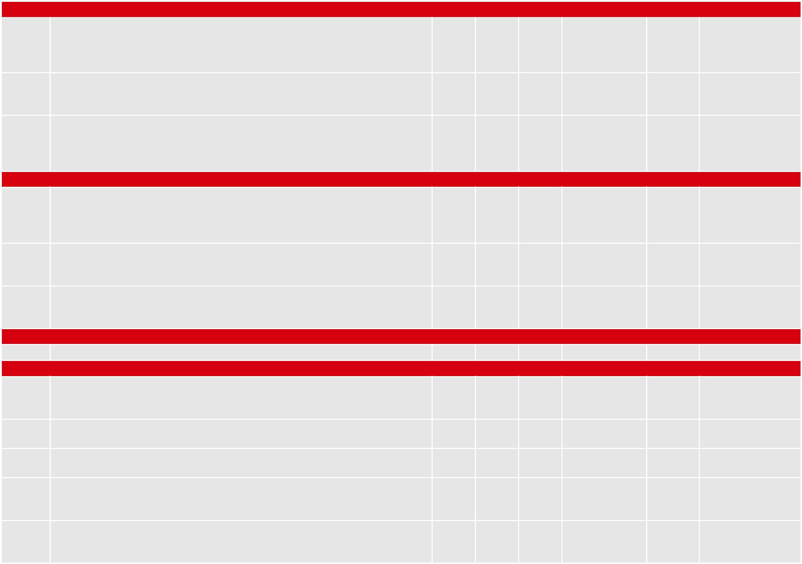

18. Are electrical installations designed, installed and periodically
    tested by a competent electrician in accordance with the current
    edition of BS 7671 with inspections carried out on a risk assessed
    basis as recommended in the Periodic Inspection Report?

> (5.3.16)

19. Are high level cables carried on cable trays or securely attached to
    an element of construction so as not to drop and cause a hazard to
    firefighters in the event of a fire? (5.3.17)

20. Where the risk assessment indicates that a hazard from static
    electricity could develop then has appropriate earthing and bonding
    of the printer and any extraneous metal parts been introduced and
    regular inspections of the arrangements been undertaken and
    recorded? (5.3.18)

<!-- end list -->

4.  Location (Section 5.4)

<!-- end list -->

1.  Wherever possible, is any 3D printing equipment that is to operate
    unattended at any time or any printer that has been assessed as
    posing a high fire risk located in a separate fire compartment
    designed to provide at least 60 minutes fire resistance? (5.4.1)

2.  Where a 3D printer is located in a fire compartment provided for
    that purpose, is the compartment clear of combustible materials,
    including raw materials, finished products and packaging? (5.4.2)

3.  Where a printer is not located in a separate fire compartment is an
    area around the process as determined by risk assessment or as
    agreed with the insurer clear of stored combustible materials?
    (5.4.3)

<!-- end list -->

5.  Staff training (Section 5.5)

> 6.5.1 Do staff using a 3D printer receive appropriate instruction?
> (5.5.1)

6.  Fire protection (Section 5.6)

<!-- end list -->

1.  Is the building in which a 3D printer is installed protected by an
    automatic fire detection and alarm system designed, installed and
    maintained by an engineer with accreditation by an independent UKAS
    accredited third party certification body? (5.6.1)

2.  Is the automatic fire detection and alarm system monitored either
    on-site or by an off-site alarm receiving centre? (5.6.2)

3.  Is the AFD installation periodically serviced and maintained by a
    competent engineer? (5.6.3)

4.  Has the installation of an automatic fixed fire suppression system
    designed to operate within the enclosure or compartment in which the
    printing is being undertaken been considered if a printer is to run
    unattended? (5.6.4)

5.  If a fire suppression installation is being considered is a risk
    assessment to be undertaken to identify all conditions that the
    system must protect against, including idle time, maintenance,
    routine servicing and cleaning operations? (5.6.5)

<table>
<tbody>
<tr class="odd">
<td></td>
<td></td>
<td><blockquote>

Yes

</blockquote></td>
<td><blockquote>

No

</blockquote></td>
<td><blockquote>

N/A

</blockquote></td>
<td><blockquote>

Action required Due date Sign on completion

</blockquote></td>
<td></td>
</tr>
<tr class="even">
<td></td>
<td><blockquote>

6.6.6

</blockquote></td>
<td><blockquote>

If a fire suppression installation is being considered is it to be designed in conjunction

</blockquote></td>
<td></td>
<td></td>
<td></td>
<td></td>
</tr>
<tr class="odd">
<td></td>
<td></td>
<td><blockquote>

with the insurer to minimise the likelihood of an unwanted actuation? (5.6.6)

</blockquote></td>
<td></td>
<td></td>
<td></td>
<td></td>
</tr>
<tr class="even">
<td></td>
<td><blockquote>

6.6.7

</blockquote></td>
<td><blockquote>

Has the most effective extinguishing agent for the application been selected following

</blockquote></td>
<td></td>
<td></td>
<td></td>
<td></td>
</tr>
<tr class="odd">
<td></td>
<td></td>
<td><blockquote>

a risk assessment taking into consideration the effectiveness of the agent as well as

</blockquote></td>
<td></td>
<td></td>
<td></td>
<td></td>
</tr>
<tr class="even">
<td></td>
<td></td>
<td><blockquote>

toxicity, asphyxiation potential, environmental and contamination issues when used

</blockquote></td>
<td></td>
<td></td>
<td></td>
<td></td>
</tr>
<tr class="odd">
<td></td>
<td></td>
<td><blockquote>

with the printing equipment? (5.6.7)

</blockquote></td>
<td></td>
<td></td>
<td></td>
<td></td>
</tr>
<tr class="even">
<td></td>
<td><blockquote>

6.6.8

</blockquote></td>
<td><blockquote>

In small enclosed printers, has consideration been given to proprietary fire suppression

</blockquote></td>
<td></td>
<td></td>
<td></td>
<td></td>
</tr>
<tr class="odd">
<td></td>
<td></td>
<td><blockquote>

systems that take the form of a polymer tube linked to a pressurised container of

</blockquote></td>
<td></td>
<td></td>
<td></td>
<td></td>
</tr>
<tr class="even">
<td></td>
<td></td>
<td><blockquote>

extinguishing medium as these may apply the extinguishing agent directly onto the

</blockquote></td>
<td></td>
<td></td>
<td></td>
<td></td>
</tr>
<tr class="odd">
<td></td>
<td></td>
<td><blockquote>

source of heat? (5.6.8)

</blockquote></td>
<td></td>
<td></td>
<td></td>
<td></td>
</tr>
<tr class="even">
<td></td>
<td><blockquote>

6.6.9

</blockquote></td>
<td><blockquote>

On operation of the fire suppression system, will the printer automatically switch off

</blockquote></td>
<td></td>
<td></td>
<td></td>
<td></td>
</tr>
<tr class="odd">
<td></td>
<td></td>
<td><blockquote>

and remote signaling be activated in a manned area? (5.6.9)

</blockquote></td>
<td></td>
<td></td>
<td></td>
<td></td>
</tr>
<tr class="even">
<td><blockquote>

RC65:

</blockquote></td>
<td><blockquote>

6.6.10

</blockquote></td>
<td><blockquote>

Do fixed fire suppression installations comply with the relevant British Standard, or

</blockquote></td>
<td></td>
<td></td>
<td></td>
<td></td>
</tr>
<tr class="odd">
<td></td>
<td></td>
<td><blockquote>

where there is no appropriate British Standard, do they comply with best practice,

</blockquote></td>
<td></td>
<td></td>
<td></td>
<td></td>
</tr>
<tr class="even">
<td></td>
<td></td>
<td><blockquote>

such as the instructions issued by the manufacturer or supplier of the printer? (5.6.10)

</blockquote></td>
<td></td>
<td></td>
<td></td>
<td></td>
</tr>
<tr class="odd">
<td><blockquote>

Recommendations

</blockquote></td>
<td></td>
<td><blockquote>

or exposed electrical installations has the risk assessment indicated that a water

</blockquote></td>
<td></td>
<td></td>
<td></td>
<td></td>
</tr>
<tr class="even">
<td></td>
<td><blockquote>

6.6.11

</blockquote></td>
<td><blockquote>

Are fixed fire suppression systems designed, installed and commissioned by an

</blockquote></td>
<td></td>
<td></td>
<td></td>
<td></td>
</tr>
<tr class="odd">
<td></td>
<td></td>
<td><blockquote>

engineer certificated by an independent UKAS accredited third party certification

</blockquote></td>
<td></td>
<td></td>
<td></td>
<td></td>
</tr>
<tr class="even">
<td></td>
<td></td>
<td><blockquote>

body in compliance with the requirements of national or other recognised standards?

</blockquote></td>
<td></td>
<td></td>
<td></td>
<td></td>
</tr>
<tr class="odd">
<td></td>
<td></td>
<td><blockquote>

(5.6.11)

</blockquote></td>
<td></td>
<td></td>
<td></td>
<td></td>
</tr>
<tr class="even">
<td></td>
<td><blockquote>

6.6.12

</blockquote></td>
<td><blockquote>

In large areas or where there is no significant hazard from the use of flammable liquids

</blockquote></td>
<td></td>
<td></td>
<td></td>
<td></td>
</tr>
<tr class="odd">
<td><blockquote>

for

</blockquote></td>
<td></td>
<td><blockquote>

sprinkler installation may be appropriate? (5.6.12)

</blockquote></td>
<td></td>
<td></td>
<td></td>
<td></td>
</tr>
<tr class="even">
<td><blockquote>

fire

</blockquote></td>
<td><blockquote>

6.6.13

</blockquote></td>
<td><blockquote>

Are suppression systems tested and maintained according to the requirements of

</blockquote></td>
<td></td>
<td></td>
<td></td>
<td></td>
</tr>
<tr class="odd">
<td><blockquote>

safety

</blockquote></td>
<td></td>
<td><blockquote>

the relevant British Standard and/or the installer’s recommendations by a competent

</blockquote></td>
<td></td>
<td></td>
<td></td>
<td></td>
</tr>
<tr class="even">
<td></td>
<td></td>
<td><blockquote>

engineer with accreditation by an independent UKAS accredited third party certification

</blockquote></td>
<td></td>
<td></td>
<td></td>
<td></td>
</tr>
<tr class="odd">
<td><blockquote>

with

</blockquote></td>
<td></td>
<td><blockquote>

body? (5.6.13)

</blockquote></td>
<td></td>
<td></td>
<td></td>
<td></td>
</tr>
<tr class="even">
<td></td>
<td><blockquote>

6.6.14

</blockquote></td>
<td><blockquote>

Are arrangements in place for the prompt recommissioning of an automatic fire

</blockquote></td>
<td></td>
<td></td>
<td></td>
<td></td>
</tr>
<tr class="odd">
<td><blockquote>

three

</blockquote></td>
<td></td>
<td></td>
<td></td>
<td></td>
<td></td>
<td></td>
</tr>
<tr class="even">
<td></td>
<td></td>
<td><blockquote>

suppression system that has actuated? (5.6.14)

</blockquote></td>
<td></td>
<td></td>
<td></td>
<td></td>
</tr>
<tr class="odd">
<td><blockquote>

dimensional

</blockquote></td>
<td></td>
<td></td>
<td></td>
<td></td>
<td></td>
<td></td>
</tr>
<tr class="even">
<td></td>
<td></td>
<td><blockquote>

competent person or repairs have been made by a competent person to render the

</blockquote></td>
<td></td>
<td></td>
<td></td>
<td></td>
</tr>
<tr class="odd">
<td></td>
<td><blockquote>

6.6.15

</blockquote></td>
<td><blockquote>

Following actuation of a fire suppression system, is the printer only operated with

</blockquote></td>
<td></td>
<td></td>
<td></td>
<td></td>
</tr>
<tr class="even">
<td></td>
<td></td>
<td><blockquote>

staff in attendance until the automatic fire suppression system has been fully

</blockquote></td>
<td></td>
<td></td>
<td></td>
<td></td>
</tr>
<tr class="odd">
<td></td>
<td></td>
<td><blockquote>

recommissioned, the printer has been inspected and found to be serviceable by a

</blockquote></td>
<td></td>
<td></td>
<td></td>
<td></td>
</tr>
<tr class="even">
<td><blockquote>

printing

</blockquote></td>
<td></td>
<td><blockquote>

printer serviceable? (5.6.15)

</blockquote></td>
<td></td>
<td></td>
<td></td>
<td></td>
</tr>
<tr class="odd">
<td></td>
<td><blockquote>

6.6.16

</blockquote></td>
<td><blockquote>

In addition to the automatic suppression systems, is a suitable number of appropriate

</blockquote></td>
<td></td>
<td></td>
<td></td>
<td></td>
</tr>
<tr class="even">
<td></td>
<td></td>
<td></td>
<td></td>
<td></td>
<td></td>
<td></td>
</tr>
<tr class="odd">
<td></td>
<td></td>
<td><blockquote>

portable fire extinguishers available and immediately accessible in the case of a fire?

</blockquote></td>
<td></td>
<td></td>
<td></td>
<td></td>
</tr>
<tr class="even">
<td></td>
<td></td>
<td><blockquote>

(5.6.16)

</blockquote></td>
<td></td>
<td></td>
<td></td>
<td></td>
</tr>
<tr class="odd">
<td></td>
<td><blockquote>

6.6.17

</blockquote></td>
<td><blockquote>

Where large 3D printers are in operation or there are printers that have been identified

</blockquote></td>
<td></td>
<td></td>
<td></td>
<td></td>
</tr>
<tr class="even">
<td></td>
<td></td>
<td><blockquote>

as posing a high fire risk is information provided for the fire and rescue service at a

</blockquote></td>
<td></td>
<td></td>
<td></td>
<td></td>
</tr>
<tr class="odd">
<td><blockquote>

19

</blockquote></td>
<td></td>
<td><blockquote>

prominent location? (5.6.17)

</blockquote></td>
<td></td>
<td></td>
<td></td>
<td></td>
</tr>
<tr class="even">
<td></td>
<td></td>
<td></td>
<td></td>
<td></td>
<td></td>
<td></td>
</tr>
</tbody>
</table>

7.  1.  > Regulatory Reform (Fire Safety) Order 2005, SI 2005 No 1541,
        > The Stationery Office.
    
    2.  > The Fire (Scotland) Act 2005, asp 5, The Stationery Office.
    
    3.  > Fire Safety (Scotland) Regulations 2006, Scottish SI 2006 No
        > 456, The Stationery Office.
    
    4.  > Fire and Rescue Services (Northern Ireland) Order 2006, SI
        > 2006 No 1254 (NI9), The Stationery Office.
    
    5.  > Fire Safety Regulations (Northern Ireland) 2010, SI 2010 No
        > 325 (NI), The Stationery Office.
    
    6.  > Dangerous Substances and Explosive Atmospheres Regulations
        > (DSEAR), 2002, SI 2002 No 2776 (as amended in 2015), The
        > Stationery Office.
    
    7.  > *Business resilience: A guide to protecting your business and
        > its people*, 2005, Fire Protection Association.
    
    8.  > The ROBUST software (Resilient Business Software Toolkit) may
        > be found at https:// robust.riscauthority.co.uk
    
    9.  > RC42: *Recommendations for fire safety of unattended
        > processes*, 2011, Fire Protection Association.
    
    10. > RC12: *Recommendations for the prevention and control of dust
        > explosions*, 2015, Fire Protection Association.
    
    11. > RC55: *Recommendations for fire safety in the storage,
        > handling and use of flammable* *and highly flammable liquids*,
        > 2014, Fire Protection Association.
    
    12. > RC8: *Recommendations for the storage, use and handling of
        > common industrial gases* *in cylinders*, 2016, Fire Protection
        > Association.
    
    13. > BS 7671: 2008 +A3 2015: *Requirements for electrical
        > installations, IET Wiring* *Regulations)*, British Standards
        > Institution.
    
    14. > BS 5839: *Fire detection and fire alarm systems for buildings:
        > Part 1: 2017: Code of* *practice for design, installation,
        > commissioning and maintenance of systems in non-domestic
        > premises*, British Standards Institution.
    
    15. > BS 5979: 2007: *Remote centres receiving signals from fire and
        > security systems.* *Code of practice*, British Standards
        > Institution.
    
    16. > BS 5306: Part 0: 2011, *Fixed firefighting systems. Foam
        > systems. Design, construction* *and maintenance*, British
        > Standards Institution.
    
    17. > BS 5306: Part 4: 2001 + A1 2012, *Fire extinguishing
        > installations and equipment on* *premises. Specification for
        > carbon dioxide systems*, British Standards Institution.
    
    18. > BS EN 13565-2: 2009, *Fixed firefighting systems. Foam
        > systems. Design, construction* *and maintenance*. British
        > Standards Institution
    
    19. > BS EN 12416-2: 2001, *Fixed firefighting systems. Powder
        > systems. Design,* *construction and maintenance*. British
        > Standards Institution.
    
    20. > *LPC Rules for automatic sprinkler installations incorporating
        > BS EN 12845: (Fixed firefighting systems. Automatic sprinkler
        > systems. Design, installation and maintenance, British
        > Standards Institution)*, 2015, Fire Protection Association.
    
    21. > BS 5306-8: 2012: *Fire extinguishing installations and
        > equipment on premises.* *Selection and positioning of portable
        > fire extinguishers. Code of practice*. British Standards
        > Institution.
    
    22. > BS 5306-3: 2017: *Fire extinguishing installations and
        > equipment on premises.* *Commissioning and maintenance of
        > portable fire extinguishers. Code of practice*, British
        > Standards Institution.

20 Risk Control

8.    - > Additive manufacturing technology standards: a number of
        > documents with various designations.
        > www.astm.org/Standards/additive-manufacturing-technology-standards.
        > html

RC65: Recommendations for fire safety with three dimensional printing 21

Fire Protection Association

London Road Moreton in Marsh

Gloucestershire GL56 0RH Tel: +44 (0)1608 812500 Email:
info@riscauthority.co.uk

Website: www.riscauthority.co.uk

2018 © The Fire Protection Association on behalf of RISCAuthority
