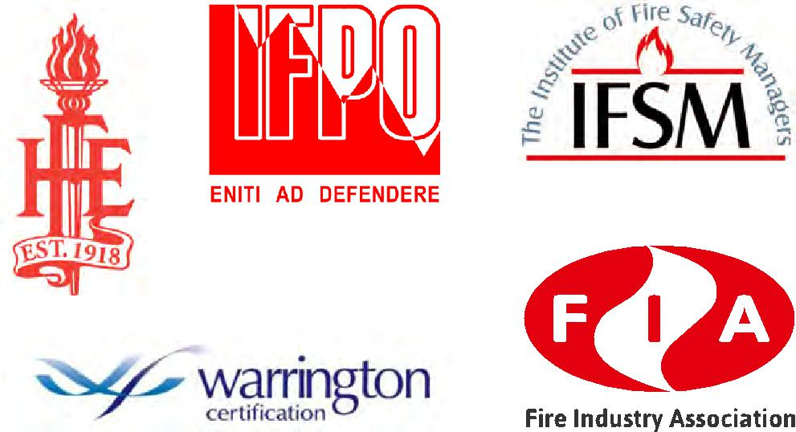
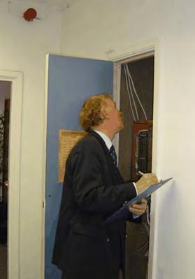
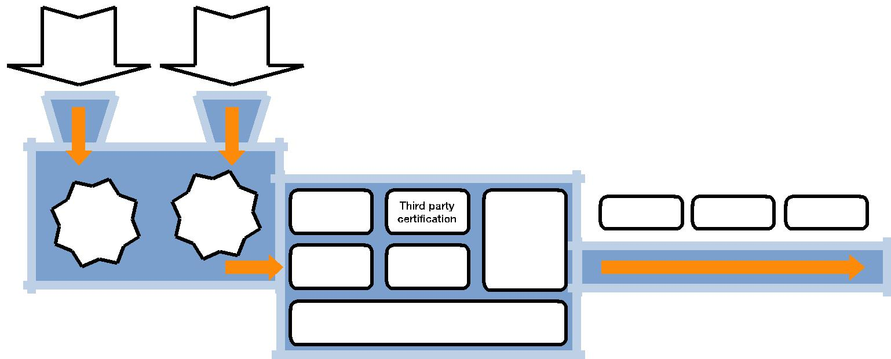
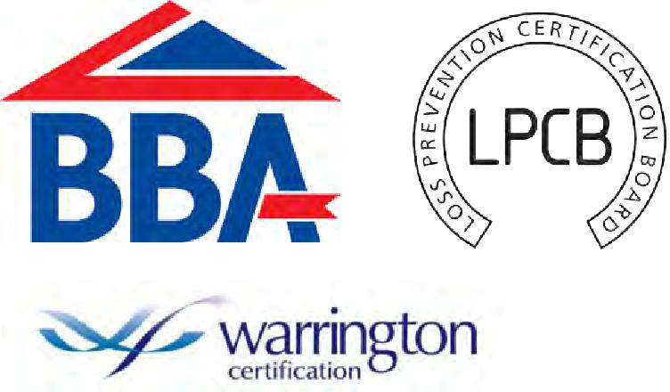
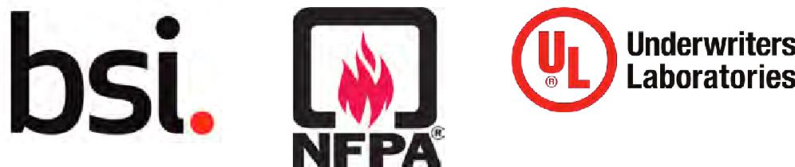
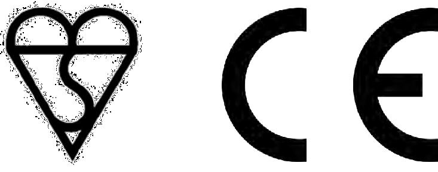
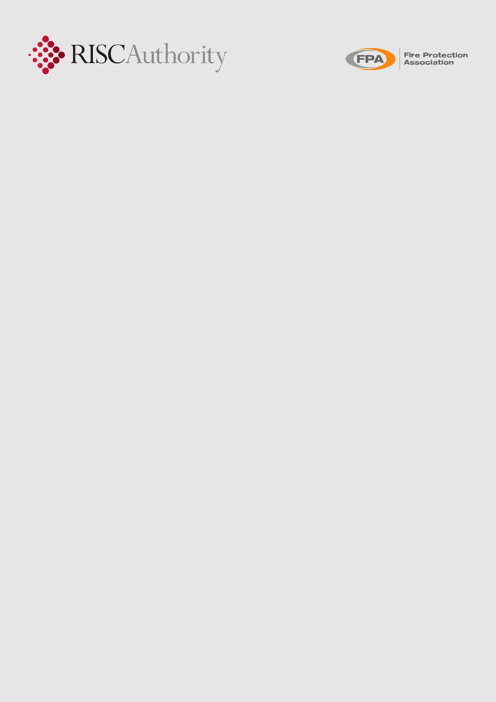

RC66: Recommendations for sourcing fire safety products and services

Version 1 Published 2018

IMPORTANT NOTICE

> This document has been developed through RISCAuthority and published
> by the Fire Protection Association (FPA). RISCAuthority membership
> comprises a group of UK insurers that actively support a number
> 
> of expert working groups developing and promulgating best practice for
> the protection of people, property, business and the environment from
> loss due to fire
> 
> and other risks. The technical expertise for this document has been
> provided by the Technical Directorate of the FPA, external
> consultants, and experts from the insurance industry who together form
> the various RISCAuthority Working Groups. Although produced with
> insurer input it does not (and is not intended to) represent a
> pan-insurer perspective. Individual insurance companies will have
> their own requirements which may be different from or not reflected in
> the content of this document.

FPA has made extensive efforts to check the accuracy of the information
and advice contained in this document and it is believed to be accurate
at the time of printing. However, FPA makes no guarantee, representation
or warranty (express or implied) as to the accuracy or

completeness of any information or advice contained in this document.
All advice and recommendations are presented in good faith on the basis
of information, knowledge and technology as at the date of publication
of this document.

Without prejudice to the generality of the foregoing, FPA makes no
guarantee, representation or warranty (express or implied) that this
document considers all systems, equipment and procedures or

state -of-the -art technologies current at the date of this document.

Use of, or reliance upon, this document, or any part of its content, is
voluntary and is

at the user’s own risk. Anyone considering using or implementing any
recommendation or advice within this document should rely on his or her
own personal judgement or, as appropriate, seek the advice of a
competent professional and rely on that professional’s advice. Nothing
in this document replaces or excludes (nor is intended to replace or
exclude), entirely or in part, mandatory and/ or legal requirements
howsoever arising (including without prejudice to the generality of the
foregoing any such requirements

for maintaining health and safety in the workplace).

Except to the extent that it is unlawful to exclude any liability, FPA
accepts no

liability whatsoever for any direct, indirect or consequential loss or
damage arising in any way from the publication of this document or any
part of it, or any use of, or reliance placed on, the content of this
document or any part of it.

**1** Introduction 3

**2** Scope 3

**3** Synopsis 3

**4** Definitions 3

**5** Recommendations 5

> 5.1 Compliance with fire safety legislation 5 5.2 Business continuity
> 6 5.3 Fire risk assessments 6 5.4 Content and format of a fire risk
> assessment 8 5.5 DSEAR assessments 9 5.6 Significant findings 10 5.7
> Approved fire products and services 10 5.8 Third party certification
> and accreditation 11 5.9 Insurers’ requirements 12 5.10 Standards 12
> 5.11 Markings 13

**6** References 14

RC66: Recommendations for sourcing fire safety products and services 1

> 
> 
> The table below summarises the key points of the document.

<table>
<tbody>
<tr class="odd">
<td><blockquote>

Engage a competent person

</blockquote></td>
<td><blockquote>

• A competent person is someone with: ‘sufficient training and experience or

</blockquote></td>
</tr>
<tr class="even">
<td></td>
<td><blockquote>

knowledge and other qualities to enable him properly to implement the measures...’

</blockquote></td>
</tr>
<tr class="odd">
<td></td>
<td><blockquote>

(4.0)

</blockquote></td>
</tr>
<tr class="even">
<td></td>
<td></td>
</tr>
<tr class="odd">
<td><blockquote>

Maintain business continuity

</blockquote></td>
<td><blockquote>

• One effective way of minimising threats to business continuity is to engage competent

</blockquote></td>
</tr>
<tr class="even">
<td></td>
<td><blockquote>

specialists and installers who utilise products of proven quality (5.2)

</blockquote></td>
</tr>
<tr class="odd">
<td></td>
<td></td>
</tr>
<tr class="even">
<td><blockquote>

Select a competent fire risk

</blockquote></td>
<td><blockquote>

• There is no official registration scheme for fire risk assessors but there is a Guide for

</blockquote></td>
</tr>
<tr class="odd">
<td><blockquote>

assessor

</blockquote></td>
<td><blockquote>

Choosing a Competent Fire Risk Assessor. A number of professional bodies have

</blockquote></td>
</tr>
<tr class="even">
<td></td>
<td><blockquote>

introduced their own recognition schemes and publish a list of registrants which is

</blockquote></td>
</tr>
<tr class="odd">
<td></td>
<td><blockquote>

available on their web site (5.3.2 and 5.3.3)

</blockquote></td>
</tr>
<tr class="even">
<td></td>
<td></td>
</tr>
<tr class="odd">
<td><blockquote>

Ensure that the fire risk

</blockquote></td>
<td><blockquote>

• A fire risk assessment should contain ’prescribed information’ including the general

</blockquote></td>
</tr>
<tr class="even">
<td><blockquote>

assessment addresses the

</blockquote></td>
<td><blockquote>

fire precautions that have been or will be taken and any group of persons especially at

</blockquote></td>
</tr>
<tr class="odd">
<td><blockquote>

appropriate issues

</blockquote></td>
<td><blockquote>

risk (5.4.3)

</blockquote></td>
</tr>
<tr class="even">
<td></td>
<td></td>
</tr>
<tr class="odd">
<td><blockquote>

Source reliable products

</blockquote></td>
<td><blockquote>

• Fire protection products should be carefully selected, manufactured to appropriate

</blockquote></td>
</tr>
<tr class="even">
<td></td>
<td><blockquote>

British or other recognised standards and installed by competent engineers (5.7.1)

</blockquote></td>
</tr>
<tr class="odd">
<td></td>
<td></td>
</tr>
<tr class="even">
<td><blockquote>

Use approved products

</blockquote></td>
<td><blockquote>

• Products with a form of approval provide a higher degree of confidence in their

</blockquote></td>
</tr>
<tr class="odd">
<td></td>
<td><blockquote>

performance than those passing a test (5.7.4)

</blockquote></td>
</tr>
<tr class="even">
<td></td>
<td></td>
</tr>
<tr class="odd">
<td><blockquote>

Seek products and services

</blockquote></td>
<td><blockquote>

• Third party certification is an independent confirmation that a product, service or

</blockquote></td>
</tr>
<tr class="even">
<td><blockquote>

that have independent third

</blockquote></td>
<td><blockquote>

installer meets an appropriate standard. This helps ensure through regular audits that

</blockquote></td>
</tr>
<tr class="odd">
<td><blockquote>

party certification

</blockquote></td>
<td><blockquote>

the product or service continues to comply with appropriate standards throughout the

</blockquote></td>
</tr>
<tr class="even">
<td></td>
<td><blockquote>

life of the product or installation (5.8.1).

</blockquote></td>
</tr>
<tr class="odd">
<td></td>
<td></td>
</tr>
<tr class="even">
<td><blockquote>

Observe your insurers’

</blockquote></td>
<td><blockquote>

• Wherever possible, installers should be certificated to the appropriate standard by a

</blockquote></td>
</tr>
<tr class="odd">
<td><blockquote>

requirements

</blockquote></td>
<td><blockquote>

UKAS accredited third party certification body (5.9.2)

</blockquote></td>
</tr>
<tr class="even">
<td></td>
<td></td>
</tr>
<tr class="odd">
<td><blockquote>

Observe recognised standards

</blockquote></td>
<td><blockquote>

• Where no relevant national or other internationally recognised standard exists for the

</blockquote></td>
</tr>
<tr class="even">
<td></td>
<td><blockquote>

intended purpose, alternative forms of standards may be available (5.10.4)

</blockquote></td>
</tr>
<tr class="odd">
<td></td>
<td></td>
</tr>
</tbody>
</table>

Symbols used in this guide

<table>
<tbody>
<tr class="odd">
<td>Good</td>
<td><blockquote>

Bad

</blockquote></td>
<td><blockquote>

Discussion

</blockquote></td>
<td><blockquote>

Frequently asked

</blockquote></td>
</tr>
<tr class="even">
<td>practice</td>
<td><blockquote>

practice

</blockquote></td>
<td><blockquote>

topic

</blockquote></td>
<td><blockquote>

question

</blockquote></td>
</tr>
</tbody>
</table>

2 Risk Control

 Introduction

> These recommendations concern two subjects that differ in that one
> involves the acquisition and installation of physical products, and
> the other the sourcing of services to safeguard the lives of the
> workforce. Properly sourced and applied, both products and services
> can also serve to minimise the risk to the company’s property and
> continuity of the business. The aim in all cases should be to make
> appropriate purchases that provide quality, reliability and longevity.
> 
> During the past few years an enormous volume of information has become
> available on the internet. While much of this is reliable, in some
> instances it can be confusing or unhelpful. This document aims to
> provide independent explanatory guidance to insurers and their clients
> to assist them to obtain reliable, high quality products and services.
> 
> Where fire risk assessments or other forms of expert fire safety
> advice or guidance are sought, a competent, experienced person with a
> form of professional recognition should be engaged to carry out the
> task. This person may be from within the company or be sourced
> externally. In the case of fire risk assessors, additional confidence
> is provided by assessors being able to provide certification of their
> work from a third party certification body.
> 
> With regard to products, wherever possible, items purchased should be
> manufactured to an appropriate standard and carry relevant markings.
> Systems (such as automatic fire detection and alarm systems) should be
> installed to recognised standards by installers approved by an
> accredited third party certification or approvals body.
> 
> This document aims to explain the terms and procedures to assist in
> the acquisition of reliable fire related products and services.

2.  Scope

3.  Synopsis

These recommendations are directed not only towards managers of large
commercial and industrial organisations that are seeking to acquire
products and services, but equally to those responsible for small and
medium sized enterprises which include healthcare, education and
providers of housing, sheltered accommodation and care homes.

> These recommendations differ in content and style from many in this
> series in that they do not consider mitigating measures for a specific
> form of loss or risk. Rather, the document is designed to provide
> background information to assist a fire safety manager or responsible
> person who has to facilitate the installation of new products or the
> acquisition of fire related services, such as fire risk assessments.
> 
> The objective is not only to comply with relevant legislation and
> satisfy the requirements of insurers, but to purchase a quality
> product, service or installation such that the working environment is
> resilient and safe for both employees and other relevant persons.

4 Definitions

> Accreditation
> 
> A form of recognition given to an organisation by an independent body.
> In the field of fire safety accreditation is provided by the United
> Kingdom Accreditation Service (UKAS) to bodies that aim to provide
> certification of specific products or services (see Figure 1).
> 
> Approval
> 
> In the field of fire safety approval is the confirmation by an expert
> third party that products, systems or companies meet, and continue to
> meet appropriate standards. Approval provides a higher degree of
> confidence in the performance than a one off test or inspection as it
> involves regular auditing to ensure compliance with the prevailing
> standard.

RC66: Recommendations for sourcing fire safety products and services 3

> UKAS
> 
> Accreditation
> 
> Third party certification bodies
> 
> Certification

<table>
<tbody>
<tr class="odd">
<td>Fire risk</td>
<td><blockquote>

Products

</blockquote></td>
<td></td>
</tr>
<tr class="even">
<td>assessors</td>
<td></td>
<td></td>
</tr>
<tr class="odd">
<td></td>
<td></td>
<td></td>
</tr>
</tbody>
</table>

> Installers

Figure 1: The relationship between accreditation and certification

Certification

A written testament which vouches for the quality or truth of a product
or service. In the field of fire safety certification is provided by
UKAS accredited independent third party certification bodies to give
trust and confidence in a product or provider of a service (see Figure
1).

Quality management system

The management of processes and their interactions with the aim of
achieving the intended results in accordance with the quality policy and
strategic direction of the organisation.

Third party certification body

An organisation that provides independent auditing and inspection
functions with the aim of certifying the quality of a specific product
or service.

> Several terms used in this document cannot be adequately defined in a
> short sentence as they have specific interpretations due to the legal
> framework in which they are introduced. The definitions of these terms
> therefore require a degree of discussion and explanation.
> 
> The following terms are relevant in this context:

  - > Competent

  - > Proportionate

  - > Responsible person

  - > Suitable and sufficient

Competent

The concept of competence is inherent in all safety legislation and
regulations but few specifically refer to the need for ‘competent
persons’. There is no clear definition of competence in most
regulations.

When applied to employees, competent persons are specialists who are
appointed to specific areas of responsibility. The Regulatory Reform
(Fire Safety) Order 2005 (ref. 2) provides a definition of a competent
person as someone with: sufficient training and experience or knowledge
and other qualities to enable them properly to implement the measures...

The HSE defines competence as the ability to undertake responsibilities
and perform activities to a recognised standard on a regular basis. It
is a combination of skills, experience and knowledge (ref. 1).

A competent person should know and only work within the limits of their
knowledge and experience. But this works both ways, as those making
appointments have to take

reasonable steps to make sure people who are appointed are competent for
what they are being asked to do. At the time of this appointment a
reasoned judgement should be made of the competence of the candidate
based on evidence.

The evidence will usually be supplied by the person or organisation
quoting or bidding for the work, but wherever possible this should be
supported by third party evidence, such as a form of recognition by a
third party certification/registration scheme (see section 5.8).

Proportionate

The term proportionate is used to relate the level of protection to be
applied to compensate for an identified risk. There is no legal guidance
on this but the level of protection selected should offer a degree of
mitigation which reduces the risk to an acceptable level without over
compensating or under compensating with regard to the potential hazard,
or being too onerous or costly to apply.

The term recognises that risks cannot always be entirely eliminated but
should be reduced to a level that is as low as ‘reasonably practicable’.

Proportionate provisions may need to be considered and provided not only
in terms of life safety to comply with fire safety legislation, but also
in terms of property protection and business continuity.

4 Risk Control

> Responsible Person
> 
> In the Regulatory Reform (Fire Safety) Order 2005 (ref. 2) applicable
> in England and Wales reference is made to a ‘responsible person’, In
> the equivalent Scottish and Northern Ireland legislation (refs. 3-6)
> reference is made to the ‘person with duties’ and the ‘appropriate
> person’ respectively. (Hereafter in this publication the term
> ‘responsible person’ is used throughout in relation to all areas of
> the UK.)
> 
> The Responsible Person is defined in Section 3 of the Regulatory
> Reform (Fire Safety) Order 2005) as follows:

1)  > in relation to a workplace, the employer, if the workplace is to
    > any extent under his control;

2)  > in relation to any premises not falling within paragraph (a)—
    
    1.  > the person who has control of the premises (as occupier or
        > otherwise) in connection with the carrying on by them of a
        > trade, business or other undertaking (for profit or not); or
    
    2.  > the owner, where the person in control of the premises does
        > not have control in connection with the carrying on by that
        > person of a trade, business or other undertaking.

> Where there are people with specific responsibilities for aspects of
> safety such as the maintenance of fire protection systems, they may
> also be deemed to be Responsible Persons as defined by the
> legislation. There may thus be more than one ‘Responsible Person’ for
> a building.
> 
> Suitable and sufficient
> 
> The Management of Health and Safety at Work Regulations 1992 (ref. 6)
> introduced the term ‘suitable and sufficient’ when referring to risk
> assessments but no definition of the term was included in the original
> or subsequent 1999 Regulations (as amended in 2003).
> 
> The term also appears in the Regulatory Reform (Fire Safety) Order
> 2005) (ref. 2), with again no definition. Interestingly, neither the
> equivalent legislation in Scotland (refs. 3 and 4) nor that in
> Northern Ireland (refs. 5 and 6) uses this phrase.
> 
> In the absence of a legal definition the term tends to be interpreted
> somewhat differently by different groups and organisations

5 Recommendations

  - Ensure that your fire risk assessment is ‘suitable and sufficient’
    and subject to periodic review (5.1 and 5.2)

  - Where hazardous materials are present an assessment should also be
    undertaken in accordance with the Dangerous Substances and Explosive
    Atmospheres

> Regulations 2002 (DSEAR) (as amended in 2015) (5.1.3)

1.  > **Compliance with fire safety legislation**

<!-- end list -->

1.  A suitable and sufficient fire risk assessment should be undertaken
    for all premises to which the Regulatory Reform (Fire Safety) Order
    2005 (or equivalent legislation in Scotland and Northern Ireland)
    applies (refs. 2-6).

2.  The assessment should be subject to periodic review, including at
    the time when there are changes in the number, alertness or mobility
    of the persons in the workplace or when plans are being made to make
    changes to the contents or processes carried out. Information
    regarding fire risk assessments and engaging fire risk assessors is
    set out in sections 5.3 and 5.4 of this document.

3.  Where hazardous materials are present in the workplace an assessment
    should be undertaken in accordance with the Dangerous Substances and
    Explosive

> Atmospheres Regulations 2002 (DSEAR) (as amended in 2015) (ref. 6). A
> key feature of this assessment is that it should identify hazard zones
> in the workplace which in turn will impact on the equipment installed
> in those locations. In common with the fire risk assessment, this
> should be undertaken by a competent person. Further information
> regarding engaging specialist DSEAR assessors is set out in section
> 5.5 of this document.

RC66: Recommendations for sourcing fire safety products and services 5

  - All businesses should take steps to maintain the continuity of their
    operations by making a suitable emergency plan (5.2.3)

  - Responsible persons do not have to do the fire risk

> assessment themselves, they should engage a competent person to
> undertake the task (5.3.1)

  - Engage a fire risk assessor that has professional recognition
    (5.3.3)

  - How do we identify a competent fire risk assessor? (5.3.3)

<!-- end list -->

2.  

<!-- end list -->

1.  Even a small fire can have a disproportionate effect on a business
    if it occurs in a critical area and thus every avenue should be
    explored to reduce the risk of a fire occurring, and the extent of
    the damage in the event of such an incident.

2.  Business continuity may be effected by three elements: property loss
    prevention, property loss reduction and business recovery. One
    effective way of minimising threats to business continuity is to
    engage competent specialists and installers who utilise products of
    proven quality.

3.  All businesses should take steps to maintain the continuity of their
    operations by making a suitable emergency plan. Guidance for this is
    set out in Business resilience: A guide to protecting your business
    and its people (ref. 8). The emergency plan should be compiled by a
    competent person and address the implications of a fire, flood

> or other perceived disaster on all facets of the business model. It
> should indicate the lines of communication that should be followed and
> the contact details for
> 
> competent fire safety specialists and approved installers of
> replacement fire protection equipment.

4.  Consideration may be given to applying commercially available
    computer programs, such as ROBUST (Resilient Business Software
    Toolkit), or similar product, by a business or a competent person to
    develop and check the adequacy of the plan. The ROBUST software is
    available free of charge (ref. 10),

<!-- end list -->

3.  > **Fire risk assessments**

<!-- end list -->

1.  As indicated in paragraph 5.1.1 a fire risk assessment should be
    carried out for virtually every workplace in compliance with the
    Regulatory Reform (Fire safety) Order 2005 (ref. 2) or the
    equivalent legislation in Scotland and Northern Ireland (refs. 3-6).

> Responsible persons do not have to do the fire risk assessment
> themselves, but the assessments do have to be ‘suitable and
> sufficient’ and thus by implication should be undertaken by a
> competent person. This person may be an employee or a specialist
> sourced externally.

2.  Despite pressure from a number of sources, the Government decided
    not to require any specified form of certification and thus there is
    no official registration scheme for fire risk assessors.

> The industry subsequently held a series of meetings, with
> representatives from a large number of fire related organisations in a
> forum that became known as the ‘Fire Risk Assessment Competency
> Council’. The outcome was a document setting out Competency Criteria
> for Fire Risk Assessors (ref. 11).
> 
> Sitting alongside this is A Guide for Choosing a Competent Fire Risk
> Assessor (ref. 12) designed to assist Responsible Persons in commerce
> and industry in selecting a suitable fire risk assessor.

3.  A number of professional bodies have introduced their own
    recognition schemes. Although each of these schemes has a different
    approach, each publishes a list of registrants which is available on
    their website.

4.  Each of these lists has been prepared by professional bodies
    following a form of peer review of the assessors’ work.

> Lists are currently available from the following organisations:
> 
> Institution of Fire Engineers (IFE) maintains a register for both fire
> risk assessors and auditors. (Auditors in this context are officers of
> enforcing authorities, who enforce legislation, but do not carry out
> fire risk assessments.)
> 
> Applicants are required to provide evidence in the form of sample
> assessments that they have undertaken to demonstrate their competence
> in the stream(s) on which they wish to be recognised. They also have
> to provide evidence to include relevant fire safety education,
> training and experience, plus details of any specific fire risk
> assessment training, and experience in carrying out fire risk
> assessments.
> 
> A Peer Review Panel assesses the submissions from the applicants and
> may also call the applicant in for interview.

6 Risk Control

  - How do we know that the products and services we have selected will
    be acceptable to our insurers?

> Every two years registrants are required to re-register and supply a
> record of relevant continuing professional development (CPD)
> undertaken during the previous period of registration.
> 
> Warrington Certification operates two schemes, a scheme for individual
> assessors and one for companies.
> 
> The Fire Risk Assessors Certification Scheme (FRACS) aims to provide a
> standardised and nationally recognised certificate of competence for
> fire risk assessors who have completed their comprehensive technical
> evaluation successfully and achieved certification.
> 
> For companies, the assessment procedure for certification not only
> examines the competence of the employees but also assesses the quality
> management systems and procedures operated by the company, thus
> assuring that high standards of service and competence can be
> delivered by the company to their clients on a reliable basis.
> 
> Institute of Fire Safety Managers (IFSM) provides a fire risk
> assessors’ register listing those who have been through a process
> which is accredited by a UKAS accredited, third party certification
> body.
> 
> IFSM have not been accepting applicants to their original register
> since December 2011 and have encouraged those listed to migrate onto a
> new register developed in conjunction with the Warrington
> Certification FRACS scheme which is known as the ‘Nationally
> Accredited Fire Risk Assessors Register of The Institute of Fire
> Safety Managers’ (NAFRAR). The current register will continue to run
> concurrently with the
> 
> NAFRAR.
> 
> The Institution of Fire Prevention Officers (IFPO) operates a register
> of fire risk assessors based on candidates having demonstrated their
> competence to an adjudication panel in line with the requirements of
> the Competency Council.
> 
> Registered assessors may be asked to provide details of their
> continuing professional development (CPD) at any time during their
> period of registration.
> 
> Fire Industry Association (FIA) Fire Risk Assessors Register is
> working towards basing recognition on third party certification to a
> UKAS accredited fire risk assessment company scheme.

5.  A relatively recent development has been the introduction of BAFE
    SP205, a Fire Protection Industry Scheme standard for Life Safety
    Fire Risk Assessment (ref. 13). A number of UKAS accredited third
    party certification bodies provide certification to organisations
    undertaking fire risk assessments in compliance with BAFE 205. The
    organisations providing assessment under this scheme are required to
    have a regularly audited quality management system in place and are
    subject to a rigorous series of head office audits and witnessed
    assessments.

RC66: Recommendations for sourcing fire safety products and services 7

  - Where there are less than five employees it is good practice to
    record the fire risk

> assessment even though there is no legal requirements to do so (5.4.2)

  - What is meant by ‘suitable and sufficient’? (Section 4.0 and 5.4.5)

> Figure 2: Inspecting service cupboards for integrity of fire stopping
> is important for
> 
> property protection as well as for life safety

4.  > **  
    > Content and format of a fire risk assessment**

<!-- end list -->

1.  Fire safety legislation such as the Fire Safety Order is only
    concerned with life safety and thus the primary focus of any fire
    risk assessment undertaken to comply with this legislation is life
    safety. Many businesses, however, benefit from assessments
    undertaken with a wider remit to include findings with regard to
    property protection and business continuity.

2.  The Responsible Person must record the fire risk assessment where
    there are five or more employees. An assessment must nevertheless be
    undertaken where there are less than five employees and the best way
    of proving to the enforcing authority (normally the local fire
    authority) that an assessment has been carried out is to record

> it. Where there are less than five employees it is therefore strongly
> recommended that a record is made of the assessment, even if it is a
> short narrative supplemented by a tick boxes-style questionnaire.
> Simple fire risk assessment templates suitable for use by small
> enterprises are available on the internet.

3.  Although the Regulatory Reform (Fire safety) Order 2005 is not
    prescriptive as to the content or format of the fire risk
    assessment, section 9(7) introduces ‘prescribed information’ to be
    included, which is:
    
      - > the significant findings of the assessment including general
        > fire precautions that have been or will be taken
    
      - > any group of persons especially at risk.

> In addition the assessment must address:

  - > various matters in relation to dangerous substances

  - > various matters in relation to young persons.

<!-- end list -->

3.  It is good practice for each assessment to include an overall fire
    risk rating with regard to life safety for the premises. This is
    often a ‘low’, ‘medium’ or ‘high’ indication supported by a simple
    form of matrix. Property protection can be considered and rated in a
    similar manner.

4.  While there is a legal requirement for a fire risk assessment to be
    carried out, there is no guidance on the precise information that
    has to be recorded or the manner in which it has to be set out.
    Despite this, competent assessors would be expected to record
    details of:
    
      - > means of escape, with particular attention to the sleeping
        > risk
    
      - > floor, wall and ceiling surfaces and coverings
    
      - > fire compartmentation
    
      - > fire detection and alarm systems
    
      - > firefighting equipment
    
      - > emergency escape lighting
    
      - > fire safety signs and notices
    
      - > evacuation procedures
    
      - > record keeping
    
      - > staff training
    
      - > housekeeping, including hot work and the management of waste
    
      - > electrical equipment and gas installations
    
      - > the storage of hazardous materials
    
      - > protection against deliberate fire raising
    
      - > external fire spread

> Many of these headings have an impact on property protection as well
> as life safety. Other headings may be beneficial on assessments
> relating to particular occupancies or where hazardous processes are
> carried out.

8 Risk Control

  - The key product of a fire or

> DSEAR assessment should be a record of the significant findings;
> ensure that these are addressed in a timely manner.

6.  Good practice suggests that when preparing a fire risk assessment:
    
      - > insignificant risks can usually be ignored
    
      - > the level of detail should be proportionate to the risk
    
      - > the period of time for which the document is likely to remain
        > valid should be indicated
    
      - > the assessment should include a record of the preventive and
        > protective measures that are in place.

> For small businesses, the assessment process can be based on informed
> judgement and reference to appropriate guidance.

7.  Good practice also recommends that assessment reports be validated
    by a second qualified assessor prior to issuing the document to
    their client. Both the assessor and the validator should sign and
    date the document.

<!-- end list -->

5.  > **DSEAR Assessments**

<!-- end list -->

1.  The Dangerous Substances and Explosive Atmospheres Regulations 2002
    (as amended) (known as DSEAR) requires that ‘where a dangerous
    substance is or is liable to be present at the workplace, the
    employer shall make a suitable and sufficient assessment of the
    risks to his employees which arise from that substance’.

> In common with the Fire Safety Order there is a requirement that the
> assessment be reviewed ‘regularly’ so as to keep it up to date. DSEAR
> also requires the significant findings of the risk assessment to be
> recorded where the employer employs five or more employees.
> 
> DSEAR requires that the employer should make a suitable and sufficient
> assessment of the risks to his employees which arise from hazardous
> substances. The assessment should be undertaken or verified by a
> competent person.

2.  There is no official register of DSEAR assessors but the Royal
    Society of Chemistry (ref. 14) has a Directory of Consultants, some
    of whom undertake this form of work.

3.  In the case of a DSEAR assessment competent assessors would be
    expected to record details of:
    
      - > the hazardous properties of the substances present
    
      - > information on safety provided by the supplier, including
        > information contained in any relevant safety data sheet;

> The assessment will also include an outline of:

  - > the work processes and substances used and their possible
    > interactions;

  - > the amounts of the substances involved

  - > where the work involves more than one dangerous substance, the
    > risk presented by such substances in combination

  - > the arrangements for the safe handling, storage and transport of
    > dangerous substances and of waste containing dangerous substances

  - > activities, such as maintenance, where there is the potential for
    > a high level of risk

  - > the likelihood that an explosive atmosphere will occur and its
    > persistence

  - > the likelihood that ignition sources, including electrostatic
    > discharges, will be present

  - > the scale of the anticipated effects of a fire or an explosion;

  - > any places which are or can be connected via openings to places in
    > which explosive atmospheres may occur

  - > any additional safety information that the employer may need

  - > the effect of recommended remedial measures

<!-- end list -->

3.  A key element of the DSEAR assessment will be a zone plan
    identifying and showing the extent of the relevant hazard zones.

RC66: Recommendations for sourcing fire safety products and services 9

6.  > **Significant findings**

<!-- end list -->

1.  > The key product of a fire or DSEAR assessment should be a record
    > of the significant findings. The key findings are normally a
    > summary of the actions that the Responsible Person should take to
    > improve or maintain the fire risk rating of the premises. This
    > information is often set out in a tabular form to allow the
    > Responsible Person to describe, date and sign off the remedial
    > actions identified in the assessment. This allows an audit trail
    > to be established to shows that the Responsible Person has ‘taken
    > ownership’ of the assessment.

<!-- end list -->

2.  > The significant findings are the information that an inspecting
    > officer from the enforcing authority will look for when visiting
    > the premises to view the assessment. They will then make an
    > initial judgement as to whether the fire risk assessment is
    > suitable and sufficient.

3.  > There are no rules for formulating this judgement; it varies
    > across different fire and rescue services and even within a single
    > service. There is thus no uniformity in the criteria used for
    > making this judgement across the enforcing authorities.

<table>
<tbody>
<tr class="odd">
<td>Fire Risk</td>
<td><blockquote>

DSEAR

</blockquote></td>
</tr>
<tr class="even">
<td>Assessment</td>
<td><blockquote>

Assessment

</blockquote></td>
</tr>
</tbody>
</table>

<table>
<tbody>
<tr class="odd">
<td>Design</td>
<td><blockquote>

Installation

</blockquote></td>
<td><blockquote>

UKAS

</blockquote></td>
<td></td>
<td><blockquote>

Reliability

</blockquote></td>
<td><blockquote>

Safety

</blockquote></td>
<td><blockquote>

Resilience

</blockquote></td>
<td></td>
</tr>
<tr class="even">
<td></td>
<td><blockquote>

Standards

</blockquote></td>
<td><blockquote>

accreditation

</blockquote></td>
<td></td>
<td></td>
<td></td>
<td></td>
<td></td>
</tr>
<tr class="odd">
<td>Standards</td>
<td></td>
<td></td>
<td></td>
<td>System and</td>
<td></td>
<td></td>
<td></td>
</tr>
<tr class="even">
<td></td>
<td></td>
<td></td>
<td></td>
<td></td>
<td></td>
<td></td>
<td></td>
</tr>
<tr class="odd">
<td></td>
<td></td>
<td></td>
<td></td>
<td>product</td>
<td></td>
<td></td>
<td></td>
</tr>
<tr class="even">
<td></td>
<td></td>
<td></td>
<td></td>
<td></td>
<td></td>
<td></td>
<td></td>
</tr>
<tr class="odd">
<td></td>
<td></td>
<td><blockquote>

Insurers’

</blockquote></td>
<td>Approved</td>
<td>conformity</td>
<td></td>
<td></td>
<td></td>
</tr>
<tr class="even">
<td></td>
<td></td>
<td></td>
<td></td>
<td></td>
<td></td>
<td></td>
<td></td>
</tr>
<tr class="odd">
<td></td>
<td></td>
<td></td>
<td>products and</td>
<td></td>
<td></td>
<td></td>
<td></td>
</tr>
<tr class="even">
<td></td>
<td></td>
<td><blockquote>

requirements

</blockquote></td>
<td></td>
<td></td>
<td></td>
<td></td>
<td></td>
</tr>
<tr class="odd">
<td></td>
<td></td>
<td></td>
<td>services</td>
<td></td>
<td></td>
<td></td>
<td></td>
</tr>
<tr class="even">
<td></td>
<td></td>
<td></td>
<td></td>
<td></td>
<td></td>
<td></td>
<td></td>
</tr>
<tr class="odd">
<td></td>
<td></td>
<td></td>
<td><blockquote>

Service and maintenance

</blockquote></td>
<td></td>
<td></td>
<td></td>
<td></td>
</tr>
</tbody>
</table>

Figure 3: The route to a reliable, safe and resilient product

7.  > **Approved fire products and services**

<!-- end list -->

  - Select and use products that are manufactured to appropriate British
    or other recognised standards (5.7.1 and 5.7.2)

> In addition to decisions taken at the time a premises is designed and
> built, in terms of fire safety-related features and systems to be
> implemented, the need for additional or upgraded general fire
> precautions may be identified as a result of the fire risk assessment
> a DSEAR assessment or alteration/refurbishment works. In all such
> circumstances it is critical for both life safety and property
> protection that:

  - > only products and systems with independent third party
    > certification are specified and used

  - > products and systems are installed to recognised standards by
    > competent contractors.

<!-- end list -->

1.  Where products are to be purchased for an active fire protection
    system to be installed by competent company engineers they should be
    carefully selected and be manufactured to appropriate British or
    other recognised standards. Where appropriate, components and cables
    should be manufactured to appropriate standards and have been tested
    together against an appropriate standard to ensure their
    compatibility.

2.  Building products to be employed in a fire resistant construction
    should have third party certification to indicate that they meet
    appropriate specified standards and are marked to this effect.
    Products should be installed by competent tradesmen and be utilised
    in accordance within the scope of their certification.

10 Risk Control

  - > How do we design a novel installation for which there is no
    > British Standard?

  - How do we identify a UKAS accredited third party certification body?
    (5.8)

<!-- end list -->

3.  Particular care should be taken when selecting products for sealing
    around services (fire stopping) and sealing linear gaps. To provide
    the degree of protection that is required the products must be
    selected as meeting an appropriate standard and be applied strictly
    in accordance with the manufacturer’s instructions by competent,
    often specialist, tradesman.

4.  Although all products to be used should be tested so that it is
    known that they meet a relevant standard, products with a form of
    approval provide a higher degree of confidence in their performance
    than those passing a test. This is because approval schemes involve
    regular auditing of the manufacturer to ensure compliance with the
    prevailing standards continues to confirm that the product on the
    market is exactly the same as the original sample that was tested.

5.  Approval benefits everyone in the supply chain as it gives peace of
    mind that the product consistently meets the standard.

6.  The performance of a product or system not only depends on its
    approval, but is also dependent upon competence being demonstrated
    through the design, installation, commissioning and maintenance
    phases of a project. Hence the use of installers and maintenance
    firms who have also been subject to an approval scheme will provide
    confidence that appropriate standards of workmanship are provided in
    the initial installation and are maintained thereafter during the
    life of the system.

7.  There are a number of organisations providing lists of approved
    products and services, among the best known are the British Board of
    Agrement, Warrington Certification and the Loss Prevention
    Certification Board (LPCB). The LPCB publish their Red Book of
    Approved Fire and Security Product and Services (ref. 15) annually
    and update it online. This is also a reference book containing
    details of approved products, services and suppliers. Warrington
    Certification through their FIRAS and CERTIFIRE schemes provide
    lists of approved installers and products respectively and make
    these registers available online (ref. 16).

8.  > **Third party certification and accreditation**

<!-- end list -->

1.  Conformity assessment is important in providing confidence in
    products and services, management systems and people. This form of
    evaluation can apply to products, equipment, people, management
    systems or organisations. Most familiar in this respect is BS EN ISO
    9001: Quality management systems (ref. 17).

<!-- end list -->

1.  A commonly encountered form of conformity assessment in the fire
    protection field is known as third party certification. This is an
    independent confirmation by a third party that a product, service or
    installer meets an appropriate standard. It is different from a
    one-off test or inspection because approval via certification helps
    ensure through regular audits that the product or service continues
    to comply with the standards, which are subject to periodic revision
    and update, throughout the life of the product or installation.

2.  It is important that the conformity assessment is carried out by an
    independent, third party organisation. For confidence in the
    conformity assessment process the third party certification bodies
    themselves must also operate to acceptable standards, this is the
    purpose of accreditation.

RC66: Recommendations for sourcing fire safety products and services 11

  - Products and installations should comply with relevant standards and
    be installed and maintained by competent persons (5.9.2)

  - Wherever possible, installers should be certificated to the
    appropriate standard by a UKAS accredited third party certification
    body (5.9.2)

  - All the requirements for the product or installation must relate to
    the standard

> selected. It is not permissible to ‘mix and match’ sections of
> different standards in the same installation (5.10.3)

  - Where no relevant national or other internationally recognised
    standard exists for the intended purpose, seek an alternative form
    of standard (5.10.4)

  - Standards often refer to methods for testing products. Where this is
    the case, the products concerned must be used in precisely the same
    configuration as that in which they were tested without any
    modification (5.10.6)

<!-- end list -->

3.  In the UK, accreditation is undertaken by the United Kingdom
    Accreditation Service (UKAS), which is the sole national
    accreditation body recognised by government

> to assess, organisations that provide services such as fire risk
> assessments and certification, testing, inspection and calibration
> services against recognised standards. UKAS works to ensure that
> recognised standards are implemented correctly and in a uniform manner
> by the accredited organisations. UKAS is, in turn, periodically
> audited by its international compatriots to assure the quality of its
> services.

9.  > **Insurers’ requirements**

<!-- end list -->

1.  It is always a requirement that the insured should comply with
    relevant legislation relating to buildings and fire safety; other
    conditions may also be included in the policy documents.

2.  Wherever possible, products and installations should comply with
    relevant standards and be installed and maintained by competent
    persons. Wherever possible, installers should be certificated to the
    appropriate standard by a UKAS accredited third party certification
    body.

3.  The use of the Fire Protection Association’s (FPA) Design Guide for
    the fire protection of buildings (ref 18) is supported by insurers
    for providing guidance to building designers. Insurers also support
    the principle that only third party certificated fire protection
    products and services should be specified.

4.  Even where this is planned, in the case of high fire risk premises
    it is still advisable to consult the insurer(s) of the premises and
    contents when planning costly general fire precautions in response
    to the significant findings of the fire risk assessment before
    making financial commitments.

5.  In some cases where property protection and business continuity
    factors are a major issue, insurers may require additional measures
    to those identified as being necessary for life safety in line with
    their own higher standards before accepting the insurance risk.

<!-- end list -->

10. > **Standards**

<!-- end list -->

1.  Whenever products are specified or an installation is planned,
    reference should be made to the relevant standards for the product
    or form of installation. While there is no legislation requiring the
    use of British Standards in the UK, it is common practice to do so
    but other standards may be used to evidence good practice in terms
    of both product choice and system implementation.

2.  Thus while in the UK reference is normally made to British Standards
    some organisations with an international presence may as a matter of
    internal policy refer to other standards, such as National Fire
    Protection Association (NFPA) or Underwriters Laboratories (UL)
    standards.

3.  Where another form of standard is adopted all the requirements for
    the product or installation must relate to the standard selected. It
    is not permissible to ‘mix and match’ sections of different
    standards in the same installation.

4.  Where no relevant national or other internationally recognised
    standard exists for the intended purpose, alternative forms of
    standards may be available. These include, for example, Loss
    Prevention Standards available from BRE Global. (These are available
    to download free of charge from the Redbooklive website (ref. 15).

5.  In the absence of any form of standard, reference should be made to
    Codes of Practice and recognised guidance documents available from
    professional organisations such as RISCAuthority (ref. 19).

6.  Standards often refer to methods for testing products. Where this is
    the case, the products concerned must be used in precisely the same
    configuration as that in which they were tested without any
    modification. For example, a fire door tested to provide 30 minutes
    fire resistance may not provide this level of protection if fitted
    with door furniture different from that present when the door was
    tested. Where any form of modification is considered, the
    manufacturer or supplier of the product must be consulted.

12 Risk Control

  - Why does the CE mark not necessarily indicate a product of
    recognised quality?

> **5.11 Markings**

1.  > The BSI Kitemark confirms that a product or service has been
    > thoroughly tested and checked and been shown to consistently meet
    > the requirements of appropriate standards. It is a voluntary mark
    > used by manufacturers and service industries to demonstrate
    > quality, safety and reliability. Many products, such as those
    > associated with fire fighting equipment, emergency lighting and
    > fire detection and alarm systems carry the BSI Kitemark.

> BSI Kitemark CE mark

  - The use of fire protection products that do not carry CE marking
    should be avoided (5.11.4)

2.  CE marking on a product is a manufacturer’s declaration that the
    product complies with the essential requirements of the relevant
    European health, safety and environmental protection legislation. CE
    marking on a product indicates to the relevant government
    authorities that the product may legally be placed on the market in

> their country. (It is a legal requirement for construction products
> within the scope of harmonised European Standards to carry CE marking
> if they are to be placed on the market in the UK or Europe.)

3.  In contrast to the BSI Kitemark, the CE mark is not a quality mark
    and does not necessarily relate to the functional performance of the
    product. Despite this, there are benefits is specifying CE marked
    products as these may be used with confidence that they have been
    designed and tested to perform to a recognised standard.

4.  The use of fire protection products that do not carry CE marking
    should be avoided.

5.  The Construction Products Regulation (CPR) (ref. 20) requires all
    construction products covered by a harmonised European standard to
    have a declaration of performance (DoP) drawn up and to be CE
    marked. Construction products covered by this regulation cannot be
    legally sold in the UK or within the rest of the Europe if they do
    not comply, even if the product is an established one. (A guidance
    note is available from the Construction Products Association ref.
    21).

RC66: Recommendations for sourcing fire safety products and services 13

6.  1.  > HSE online:
        > http://www.hse.gov.uk/competence/what-is-competence.htm
    
    2.  > Regulatory Reform (Fire Safety) Order 2005, SI 2005 No 1541,
        > The Stationery Office.
    
    3.  > The Fire (Scotland) Act 2005, asp 5, The Stationery Office.
    
    4.  > Fire Safety (Scotland) Regulations 2006, Scottish SI 2006 No
        > 456, The Stationery Office.
    
    5.  > Fire and Rescue Services (Northern Ireland) Order 2006, SI
        > 2006 No 1254 (NI9), The Stationery Office.
    
    6.  > Fire Safety Regulations (Northern Ireland) 2010, SI 2010 No
        > 325 (NI), The Stationery Office.
    
    7.  > Management of Health and Safety at Work Regulations 1992, SI
        > 1992 No 2051, The Stationery Office.
    
    8.  > Dangerous Substances and Explosive Atmospheres Regulations
        > (DSEAR), 2002, SI 2002 No 2776, The Stationery Office.
    
    9.  > Business Resilience: A Guide to protecting Your Business and
        > its People, 2005, Fire protection Association.
    
    10. > The ROBUST software (Resilient Business Software Toolkit) may
        > be found at https://robust.riscauthority.co.uk
    
    11. > Competency Criteria for Fire Risk assessors, Version 1, 2011,
        > Fire Risk Assessment Competency Council, (Download available
        > from www.cfoa.org.uk)
    
    12. > A Guide for Choosing a Competent Fire Risk Assessor, Version
        > 2, 2014. Fire Risk Assessment Competency Council, (Download
        > available from www.cfoa.org.uk)
    
    13. > Life Safety Fire Risk Assessment, Scheme SP205, (Part 1
        > Version 4(a) July 2015 and Part 2: Version 3 July 2015), BAFE
        > (Download available from www.bafe.org.uk
    
    14. > Royal Society of Chemistry Directory of Consultants may be
        > viewed on www.rsc.org
    
    15. > List of Approved Fire and Security Products and Services, Loss
        > Prevention Certification Board, www.redbooklive.com
    
    16. > FIRAS and CERTIFIRE approved installer and product registers,
        > www.warringtoncertification.com
    
    17. > BS EN ISO 9001: 2015: Quality Management Systems.
        > Requirements, British Standards Institution.
    
    18. > Design Guide for the Fire Protection of Buildings (various
        > parts), Fire Protection Association.
    
    19. > A wide range of guidance documents may be downloaded from
        > www.riscauthority.co.uk
    
    20. > Construction Products Regulations 2013, SI 2013 No 1387, The
        > Stationery Office.
    
    21. > Guidance Note on the Construction Products Regulation, Version
        > 3, 2014, Construction Products Association. (This may be
        > downloaded from www. constructionproducts.org )

14 Risk Control

Fire Protection Association

London Road Moreton in Marsh

Gloucestershire GL56 0RH Tel: +44 (0)1608 812500 Email:
info@riscauthority.co.uk

Website: www.riscauthority.co.uk

2018 © The Fire Protection Association on behalf of RISCAuthority
