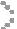
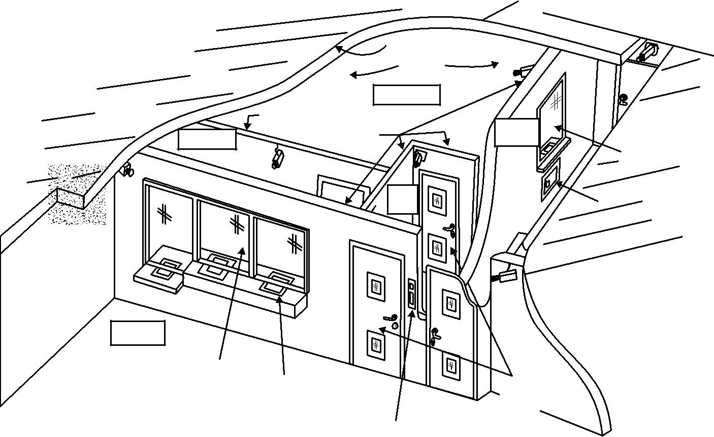
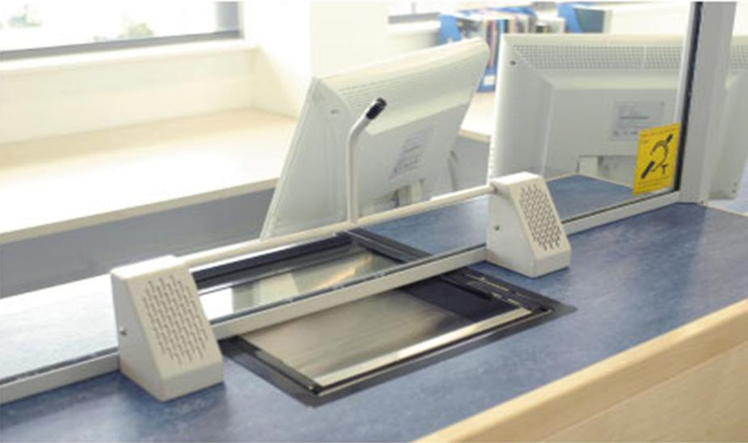
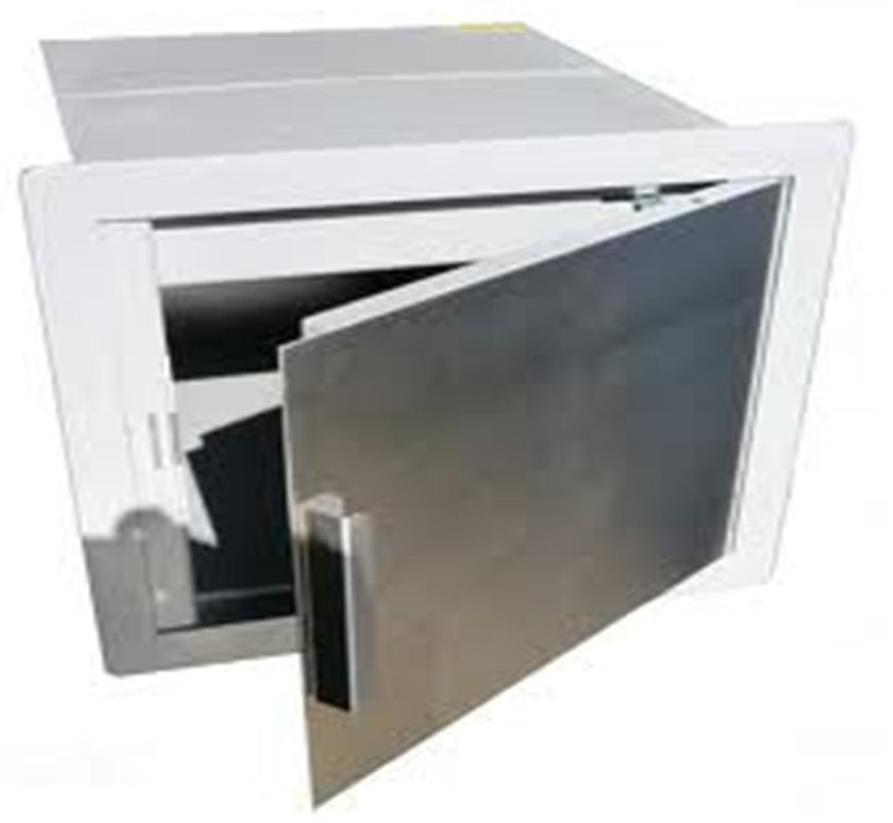
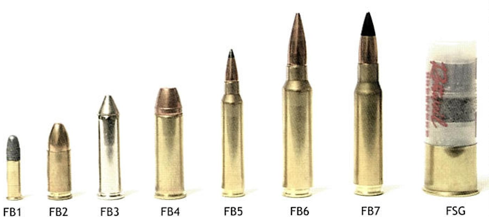

> 

First published 2012

> Version 01

Security

Cash risk assessment and security management – An insurers’ guide

administered by

 **IMPORTANT NOTICE**

> This document has been developed through the RISCAuthority and
> published by the Fire Protection Association (FPA). RISCAuthority
> membership comprises a group of UK insurers that actively support a
> number of expert working groups developing and promulgating best
> practice for the protection of people, property, business and the
> environment from loss due to fire and other risks. The technical
> expertise for this document has been provided by the Technical
> Directorate of the FPA, external consultants, and experts from the
> insurance industry who together form the various RISCAuthority Working
> Groups. Although produced with insurer input it does not (and is not
> intended to) represent a pan-insurer perspective. Individual insurance
> companies will have their own requirements which may be different from
> or not reflected in the content of this document.
> 
> The FPA has made extensive efforts to check the accuracy of the
> information and advice contained in this document and it is believed
> to be accurate at the time of printing. However, the FPA makes no
> guarantee, representation or warranty (express or implied) as to the
> accuracy or completeness of any information or advice contained in
> this document. All advice and recommendations are presented in good
> faith on the basis of information, knowledge and technology as at the
> date of publication of this document.
> 
> Without prejudice to the generality of the foregoing, the FPA makes no
> guarantee, representation or warranty (express or implied) that this
> document considers all systems, equipment and procedures or
> state-of-the-art technologies current at the date of this document.
> 
> Use of, or reliance upon, this document, or any part of its content,
> is voluntary and is at the user’s own risk. Anyone considering using
> or implementing any recommendation or advice within this document
> should rely on his or her own personal judgement or, as appropriate,
> seek the advice of a competent professional and rely on that
> professional’s advice. Nothing in this document replaces or excludes
> (nor is intended to replace or exclude), entirely or in part,
> mandatory and/or legal requirements howsoever arising (including
> without prejudice to the generality of the foregoing any such
> requirements for maintaining health and safety in the workplace).
> 
> Except to the extent that it is unlawful to exclude any liability, the
> FPA accepts no liability whatsoever for any direct, indirect or
> consequential loss or damage arising in any way from the publication
> of this document or any part of it, or any use of, or reliance placed
> on, the content of this
> 
> document or any part of it.

2

 **CONTENTS**

<table>
<tbody>
<tr class="odd">
<td>1.0</td>
<td><blockquote>

Introduction

</blockquote></td>
<td>4</td>
<td><blockquote>

5.0 Premises risk: out of business hours

</blockquote></td>
<td>14</td>
<td></td>
<td></td>
<td></td>
<td></td>
<td></td>
<td></td>
</tr>
<tr class="even">
<td></td>
<td><blockquote>

1.1

</blockquote></td>
<td><blockquote>

Purpose of guide

</blockquote></td>
<td>4</td>
<td></td>
<td><blockquote>

5.1

</blockquote></td>
<td><blockquote>

Premises security

</blockquote></td>
<td>14</td>
<td></td>
<td></td>
<td></td>
</tr>
<tr class="odd">
<td></td>
<td><blockquote>

1.2

</blockquote></td>
<td><blockquote>

Scope

</blockquote></td>
<td></td>
<td>4</td>
<td></td>
<td><blockquote>

5.2

</blockquote></td>
<td><blockquote>

Safes

</blockquote></td>
<td></td>
<td></td>
<td>15</td>
</tr>
<tr class="even">
<td>2.0</td>
<td><blockquote>

Money risk assessment

</blockquote></td>
<td>4</td>
<td></td>
<td></td>
<td><blockquote>

5.2.1

</blockquote></td>
<td><blockquote>

Resistance grades and overnight limits

</blockquote></td>
<td>15</td>
<td></td>
<td></td>
<td></td>
</tr>
<tr class="odd">
<td></td>
<td><blockquote>

2.1

</blockquote></td>
<td><blockquote>

Risk appreciation and assessment

</blockquote></td>
<td>4</td>
<td></td>
<td></td>
<td><blockquote>

5.2.2

</blockquote></td>
<td><blockquote>

Certification bodies

</blockquote></td>
<td>15</td>
<td></td>
<td></td>
</tr>
<tr class="even">
<td></td>
<td><blockquote>

2.2

</blockquote></td>
<td><blockquote>

Risk exposures and loss potentials

</blockquote></td>
<td>4</td>
<td></td>
<td></td>
<td><blockquote>

5.2.3

</blockquote></td>
<td><blockquote>

Product identification

</blockquote></td>
<td>15</td>
<td></td>
<td></td>
</tr>
<tr class="odd">
<td></td>
<td></td>
<td><blockquote>

2.2.1

</blockquote></td>
<td><blockquote>

Staff safety

</blockquote></td>
<td>4</td>
<td></td>
<td></td>
<td><blockquote>

5.2.4

</blockquote></td>
<td><blockquote>

Location and fixing

</blockquote></td>
<td>15</td>
<td></td>
</tr>
<tr class="even">
<td></td>
<td></td>
<td><blockquote>

2.2.2

</blockquote></td>
<td><blockquote>

Key risk scenarios

</blockquote></td>
<td>4</td>
<td></td>
<td></td>
<td><blockquote>

5.2.5

</blockquote></td>
<td><blockquote>

Locking arrangements

</blockquote></td>
<td>16</td>
<td></td>
</tr>
<tr class="odd">
<td></td>
<td><blockquote>

2.3

</blockquote></td>
<td><blockquote>

Risk reduction approaches – basic principles

</blockquote></td>
<td>5</td>
<td></td>
<td></td>
<td></td>
<td><blockquote>

5.2.5.1 Key locks and key security

</blockquote></td>
<td>16</td>
<td></td>
<td></td>
</tr>
<tr class="even">
<td>3.0</td>
<td><blockquote>

The protection of significant money risks

</blockquote></td>
<td>6</td>
<td></td>
<td></td>
<td></td>
<td><blockquote>

5.2.5.2

</blockquote></td>
<td><blockquote>

Combination locks, PIN locks

</blockquote></td>
<td></td>
<td></td>
<td></td>
</tr>
<tr class="odd">
<td></td>
<td><blockquote>

3.1

</blockquote></td>
<td><blockquote>

Security policy and management controls

</blockquote></td>
<td>6</td>
<td></td>
<td></td>
<td></td>
<td></td>
<td><blockquote>

and code security

</blockquote></td>
<td>16</td>
<td></td>
</tr>
<tr class="even">
<td></td>
<td><blockquote>

3.2

</blockquote></td>
<td><blockquote>

Staff recruitment

</blockquote></td>
<td>6</td>
<td></td>
<td></td>
<td></td>
<td><blockquote>

5.2.5.3

</blockquote></td>
<td><blockquote>

Dual locking

</blockquote></td>
<td>16</td>
<td></td>
</tr>
<tr class="odd">
<td></td>
<td><blockquote>

3.3

</blockquote></td>
<td><blockquote>

Staff training

</blockquote></td>
<td>6</td>
<td></td>
<td></td>
<td></td>
<td><blockquote>

5.2.5.4

</blockquote></td>
<td><blockquote>

Time locks

</blockquote></td>
<td>17</td>
<td></td>
</tr>
<tr class="even">
<td></td>
<td><blockquote>

3.4

</blockquote></td>
<td><blockquote>

Security installations

</blockquote></td>
<td>6</td>
<td></td>
<td></td>
<td></td>
<td><blockquote>

5.2.5.5 Electronic locks and safe

</blockquote></td>
<td></td>
<td></td>
<td></td>
</tr>
<tr class="odd">
<td></td>
<td><blockquote>

3.5

</blockquote></td>
<td><blockquote>

Operational procedures

</blockquote></td>
<td>6</td>
<td></td>
<td></td>
<td></td>
<td></td>
<td><blockquote>

management tools

</blockquote></td>
<td>17</td>
<td></td>
</tr>
<tr class="even">
<td></td>
<td></td>
<td><blockquote>

3.5.1

</blockquote></td>
<td><blockquote>

Opening and closing procedures

</blockquote></td>
<td></td>
<td></td>
<td></td>
<td><blockquote>

5.2.6

</blockquote></td>
<td><blockquote>

Deposit safes

</blockquote></td>
<td>17</td>
<td></td>
</tr>
<tr class="odd">
<td></td>
<td></td>
<td></td>
<td><blockquote>

(in normal circumstances)

</blockquote></td>
<td>6</td>
<td></td>
<td><blockquote>

5.3

</blockquote></td>
<td><blockquote>

Strong-rooms

</blockquote></td>
<td></td>
<td>17</td>
<td></td>
</tr>
<tr class="even">
<td></td>
<td></td>
<td><blockquote>

3.5.2

</blockquote></td>
<td><blockquote>

Opening and closing procedures

</blockquote></td>
<td></td>
<td></td>
<td><blockquote>

5.4

</blockquote></td>
<td><blockquote>

Cash out of safes / strong-rooms

</blockquote></td>
<td>18</td>
<td></td>
<td></td>
</tr>
<tr class="odd">
<td></td>
<td></td>
<td></td>
<td><blockquote>

(in response to an alarm)

</blockquote></td>
<td>7</td>
<td></td>
<td></td>
<td><blockquote>

5.4.1

</blockquote></td>
<td><blockquote>

ATMs

</blockquote></td>
<td></td>
<td>18</td>
</tr>
<tr class="even">
<td></td>
<td></td>
<td><blockquote>

3.5.3

</blockquote></td>
<td><blockquote>

Access management

</blockquote></td>
<td>7</td>
<td></td>
<td></td>
<td><blockquote>

5.4.2

</blockquote></td>
<td><blockquote>

Other customer interface and

</blockquote></td>
<td></td>
<td></td>
</tr>
<tr class="odd">
<td></td>
<td><blockquote>

3.6

</blockquote></td>
<td><blockquote>

Contractors and visitors

</blockquote></td>
<td>7</td>
<td></td>
<td></td>
<td></td>
<td><blockquote>

cashier support machines

</blockquote></td>
<td>19</td>
<td></td>
<td></td>
</tr>
<tr class="even">
<td>4.0</td>
<td><blockquote>

Premises risk: business hours

</blockquote></td>
<td>8</td>
<td><blockquote>

5.5 Intruder alarm protection and CCTV

</blockquote></td>
<td>19</td>
<td></td>
<td></td>
<td></td>
<td></td>
<td></td>
<td></td>
</tr>
<tr class="odd">
<td></td>
<td><blockquote>

4.1

</blockquote></td>
<td><blockquote>

Cash and wages offices

</blockquote></td>
<td>8</td>
<td></td>
<td><blockquote>

5.6

</blockquote></td>
<td><blockquote>

Security fog systems

</blockquote></td>
<td>19</td>
<td></td>
<td></td>
<td></td>
</tr>
<tr class="even">
<td></td>
<td></td>
<td><blockquote>

4.1.1

</blockquote></td>
<td><blockquote>

Location

</blockquote></td>
<td>8</td>
<td></td>
<td><blockquote>

5.7

</blockquote></td>
<td><blockquote>

Banknote degradation and

</blockquote></td>
<td></td>
<td></td>
<td></td>
</tr>
<tr class="odd">
<td></td>
<td></td>
<td><blockquote>

4.1.2

</blockquote></td>
<td><blockquote>

Construction and security

</blockquote></td>
<td>9</td>
<td></td>
<td></td>
<td><blockquote>

unique tagging systems

</blockquote></td>
<td>19</td>
<td></td>
<td></td>
</tr>
<tr class="even">
<td></td>
<td></td>
<td><blockquote>

4.1.3

</blockquote></td>
<td><blockquote>

Access control

</blockquote></td>
<td>10</td>
<td><blockquote>

6.0

</blockquote></td>
<td><blockquote>

External transits

</blockquote></td>
<td></td>
<td>20</td>
<td></td>
<td></td>
</tr>
<tr class="odd">
<td></td>
<td><blockquote>

4.2

</blockquote></td>
<td><blockquote>

Security control rooms

</blockquote></td>
<td>11</td>
<td></td>
<td><blockquote>

6.1

</blockquote></td>
<td><blockquote>

Professional carriers

</blockquote></td>
<td>20</td>
<td></td>
<td></td>
<td></td>
</tr>
<tr class="even">
<td></td>
<td><blockquote>

4.3

</blockquote></td>
<td><blockquote>

Hold-up alarms

</blockquote></td>
<td>11</td>
<td></td>
<td></td>
<td><blockquote>

6.1.1

</blockquote></td>
<td><blockquote>

Contractor credentials

</blockquote></td>
<td>20</td>
<td></td>
<td></td>
</tr>
<tr class="odd">
<td></td>
<td><blockquote>

4.4

</blockquote></td>
<td><blockquote>

Duress alarms

</blockquote></td>
<td>11</td>
<td></td>
<td></td>
<td><blockquote>

6.1.2

</blockquote></td>
<td><blockquote>

Contract terms

</blockquote></td>
<td>20</td>
<td></td>
<td></td>
</tr>
<tr class="even">
<td></td>
<td><blockquote>

4.5

</blockquote></td>
<td><blockquote>

Money in safes

</blockquote></td>
<td>11</td>
<td></td>
<td></td>
<td><blockquote>

6.1.3

</blockquote></td>
<td><blockquote>

Money transfer precautions

</blockquote></td>
<td>20</td>
<td></td>
<td></td>
</tr>
<tr class="odd">
<td></td>
<td><blockquote>

4.6

</blockquote></td>
<td><blockquote>

Cashier counters

</blockquote></td>
<td>12</td>
<td></td>
<td><blockquote>

6.2

</blockquote></td>
<td><blockquote>

Transits by own staff

</blockquote></td>
<td>20</td>
<td></td>
<td></td>
<td></td>
</tr>
<tr class="even">
<td></td>
<td><blockquote>

4.7

</blockquote></td>
<td><blockquote>

Till points

</blockquote></td>
<td>12</td>
<td></td>
<td></td>
<td><blockquote>

6.2.1

</blockquote></td>
<td><blockquote>

Transit limits

</blockquote></td>
<td>20</td>
<td></td>
<td></td>
</tr>
<tr class="odd">
<td></td>
<td><blockquote>

4.8

</blockquote></td>
<td><blockquote>

Customer interface cash payment, dispensing,

</blockquote></td>
<td></td>
<td></td>
<td></td>
<td><blockquote>

6.2.2

</blockquote></td>
<td><blockquote>

Personnel

</blockquote></td>
<td>20</td>
<td></td>
<td></td>
</tr>
<tr class="even">
<td></td>
<td></td>
<td><blockquote>

changing, gaming and vending machines

</blockquote></td>
<td>13</td>
<td></td>
<td></td>
<td><blockquote>

6.2.3

</blockquote></td>
<td><blockquote>

Conveyance methods and security

</blockquote></td>
<td>21</td>
<td></td>
<td></td>
</tr>
<tr class="odd">
<td></td>
<td><blockquote>

4.9

</blockquote></td>
<td><blockquote>

Cash transfers within the business premises

</blockquote></td>
<td>13</td>
<td></td>
<td></td>
<td><blockquote>

6.2.4

</blockquote></td>
<td><blockquote>

‘Roundsmen’ risks

</blockquote></td>
<td>21</td>
<td></td>
<td></td>
</tr>
<tr class="even">
<td></td>
<td><blockquote>

4.10

</blockquote></td>
<td><blockquote>

Additional hold-up defences and deterrents

</blockquote></td>
<td>13</td>
<td><blockquote>

7.0

</blockquote></td>
<td><blockquote>

References

</blockquote></td>
<td></td>
<td>22</td>
<td></td>
<td></td>
<td></td>
</tr>
<tr class="odd">
<td></td>
<td></td>
<td><blockquote>

4.10.1 CCTV

</blockquote></td>
<td>13</td>
<td></td>
<td></td>
<td></td>
<td></td>
<td></td>
<td></td>
<td></td>
</tr>
<tr class="even">
<td></td>
<td></td>
<td><blockquote>

4.10.2 Security fog systems

</blockquote></td>
<td>14</td>
<td><blockquote>

Appendix 1: Surveyors’ aide-memoire

</blockquote></td>
<td>23</td>
<td></td>
<td></td>
<td></td>
<td></td>
<td></td>
</tr>
<tr class="odd">
<td></td>
<td></td>
<td><blockquote>

4.10.3 Coded forensic identification

</blockquote></td>
<td></td>
<td><blockquote>

Appendix 2: Bullet resistance comparison guide

</blockquote></td>
<td>25</td>
<td></td>
<td></td>
<td></td>
<td></td>
<td></td>
</tr>
<tr class="even">
<td></td>
<td></td>
<td></td>
<td><blockquote>

(unique tagging) spray systems

</blockquote></td>
<td>14</td>
<td></td>
<td></td>
<td></td>
<td></td>
<td></td>
<td></td>
</tr>
<tr class="odd">
<td></td>
<td></td>
<td><blockquote>

4.10.4 Banknote degradation and

</blockquote></td>
<td></td>
<td></td>
<td></td>
<td></td>
<td></td>
<td></td>
<td></td>
<td></td>
</tr>
<tr class="even">
<td></td>
<td></td>
<td></td>
<td><blockquote>

unique tagging systems

</blockquote></td>
<td>14</td>
<td></td>
<td></td>
<td></td>
<td></td>
<td></td>
<td></td>
</tr>
<tr class="odd">
<td></td>
<td></td>
<td><blockquote>

4.10.5 Signage

</blockquote></td>
<td>14</td>
<td></td>
<td></td>
<td></td>
<td></td>
<td></td>
<td></td>
<td></td>
</tr>
</tbody>
</table>

3

 **1. INTRODUCTION**

> **1.1 Purpose of this guide**
> 
> This guide has been produced to assist commercial insurance
> underwriters and risk control surveyors in their assessment of
> UK-located risks presenting significant money exposures, and in their
> specifying of security precautions in order to improve those risks
> where existing loss prevention measures are considered to be
> inadequate.
> 
> A model *aide-memoire* has been included as Appendix 1 for use by risk
> control surveyors (with augmentation or adaptation according to
> individual insurers’ risk appetite and risk assessment practices).
> 
> **1.2 Scope**
> 
> The guide is focused upon the potential for significant loss (and the
> risk management of such potential) arising from the criminal actions
> of third parties, within the context of the cover typically provided
> by the money section of a commercial insurance policy. It thus does
> not extend to address those risks that are the subject of fidelity or
> theft by employee insurance policies; nor does it address the theft of
> money by fraud or electronic means.
> 
> For the purposes of this document, a significant money exposure is
> deemed to be one where there is the potential for the theft of money
> in excess of £30,000, and the guide is therefore intended to address
> the money-related risk management of businesses such as medium to
> large retailers, cash and carry outlets, visitor attractions,
> exhibition centres, sports stadia, cash centres, casinos, bureaux de
> change, banks, building societies and the like.
> 
> Whilst the guide has been produced with a clear focus on the security
> of cash, much of its content is equally relevant to significant
> exposures of vouchers, stamps, banker’s drafts and other negotiable
> instruments typically covered by commercial money insurances (though
> it is recognised that insurers will often apply tolerances in respect
> of non-cash negotiables, as regards the level of exposure permitted
> before enhanced security measures are required as a condition of
> cover).

 **2. MONEY RISK ASSESSMENT**

> **2.1 Risk appreciation and assessment**
> 
> When carrying out a money insurance survey, it is important that the
> surveyor appreciates the extent and detail of money insurance
> conditions applicable to the case in order to avoid the risk of
> unwittingly undermining the policy’s intent, for example by implying
> acceptance of circumstances that pertain at the time of survey which
> may breach those conditions.
> 
> Such conditions may typically relate to key security, use of intruder
> alarm systems, cash carrying precautions, money in vehicles, etc.
> 
> **2.2 Risk exposures and loss potentials**
> 
> The loss of money by theft can occur through a variety of methods and
> the key risk scenarios faced by large cash risk (which are described
> in paragraph 2.2.2 below) should be assessed in terms of cash loss
> potential, relative likelihood and adequacy of precautions currently
> in place to prevent or minimise losses.
> 
> In many cases, it will be determined that 100% cash losses are
> conceivable with some risk scenarios.
> 
> In addition to the loss of money, some criminal methods involve the
> risk of personal injury to staff (and perhaps also to the
> policyholder’s customers and other third parties at the scene of an
> attack) and/or significant interruption to the business for which
> 
> the insurer may provide indemnity under Employer’s Liability, Public
> Liability and Business Interruption covers.

***2.2.1 Staff safety***

All staff involved with cash exposures, whether front-line
customer-facing, back-room cash-office, managerial or security
personnel, face jeopardy and potential personal injury risks arising
from their duties. Even those with no direct custody of, or authority to
access, money could find themselves involved in a threatening situation
simply through their presence at the scene of a criminal attack.

The business is, of course, obliged by the Health and Safety at Work Act
to provide a safe place of work and safe systems of work, and also to
provide adequate training and instruction for employees. Furthermore,
the Management of Health and Safety at Work Regulations require risk
assessments to be undertaken and recorded for all significant and
reasonably foreseeable risks. Employee records should show the content
and date of the training provided and employees should sign an
acknowledgement to indicate they have received the training given.
Training records are to be maintained for all employees to assist in the
review process and also to provide evidence that training has duly been
provided as these may assist in defence of any potential civil claims.

The risks to staff safety arising from the threat of criminal attack
reflect the degree of target-appeal to criminals, but can be mitigated
very significantly if the policyholder adopts a responsible approach to
health and safety issues, carries out risk assessments in a professional
manner and ensures that security measures are in place that are
commensurate with the risk. In many cases, the safeguards that are
introduced to protect cash, particularly during working hours, will
generally also contribute to staff safety and vice versa, especially
when those safeguards are obviously robust, since an evidently high
standard of security will help to deter an attack.

***2.2.2 Key risk scenarios***

Each of the following key risk scenarios should be considered in any
risk assessment of a large money risk:

> *Robbery at the premises during working hours*

(i) During trading hours

Most cash-heavy businesses present an open-door welcome to the public,
and even those that restrict transactions to certain categories (eg
minimum age, trade-only or members-only) will generally not keep their
customer entrance doors secured during trading hours.

> A robbery during trading hours often involves minimal inside knowledge
> or planning, but can be very violent and frightening to both staff and
> customers.

(ii) Out of trading hours

The periods at the beginning and end of each working day, when staff are
on the premises but the business is closed to the public, may seem a
more attractive proposition to criminals who are able to research their
target since, provided they can gain access to the premises (eg by
‘tail-gating’ a member of staff as they arrive for work, or hiding
themselves within the premises during ‘open-hours’ and emerging from
hiding after the premises have been closed to customers), they then have
a better prospect of a more manageable raid, more time to maximise their
haul, and a better chance of escaping unchallenged.

4

*Theft from the premises out of business hours*

> For those criminals who have the skill, knowledge and organisation to
> successfully penetrate secured premises and tackle locked safes and
> other secured money containers whilst avoiding discovery ‘in the act’,
> a burglary out of business hours can offer maximum cash rewards
> without some of the attendant risks of violent crime (ie
> eye-witnesses, ‘have-a-go’ heroism, hold-up alarms, sentencing policy
> if caught and convicted, etc).
> 
> ***Staff duress and tiger kidnap***
> 
> It is not unknown for key-holding members of staff to be accosted
> outside or well away from the business premises (eg on the way home
> from work after the premises have been secured for the night) and
> forced under threat of violence to return to the premises and
> co-operate with robbers in opening up the premises, unsetting intruder
> alarms, and unlocking safes, etc.
> 
> Alternatively, though much less common an occurrence, with detailed
> ‘inside knowledge’ of a large cash risk’s procedures and
> protections, a well organised tiger kidnap might be planned by a
> criminal gang that is prepared to play for high stakes in pursuit of
> large rewards. A tiger kidnap generally involves the taking hostage of
> members of the family of personnel who have the means to permit access
> to cash or valuables, in order to coerce them into facilitating the
> theft (either by allowing access to the criminals or even by stealing
> the target themselves and handing it over subsequently).
> 
> ***Robbery during transit***
> 
> There is very seldom a perfect balance between on-site cash receipts
> and on-site cash payments for any business and there will therefore be
> a need for surplus cash to be banked or for cash depletions to be made
> good by bank withdrawals. For some businesses (eg bureaux de changes
> and amusement arcades) there can be a frequent need to re-stock
> particular currencies, denominations or coinage. All such money in
> transit exposures involves an element of risk which can often be
> severe, depending on a number of factors such as cash amounts carried,
> frequencies, pattern detectability, vulnerability of routes and
> transportation methods.
> 
> In addition to transfers to and from the bank, other transits – both
> routine and occasional – may feature in the course of business, and
> all should be considered as part of the risk assessment in terms of
> the potential for money loss and injury or trauma to staff.
> 
> ***Theft or collusion by employee, director or partner***
> 
> Whilst the scope of this guide does not extend to include the risks
> that are intended to be addressed by fidelity and theft by employee
> policies, it is recognised that money insurances will sometimes
> include an element of ‘fidelity’ cover as standard (ie without
> particular underwriting consideration or policy extension), subject to
> a discovery of loss restriction normally excluding thefts not
> discovered within a few days of the occurrence.
> 
> Where such cover is provided (whether explicitly or not) for a large
> money risk, the risk assessment should extend to address such
> contingencies (eg enquiries concerning recruitment and vetting
> procedures, cash-handling authorisation policies and staff supervision
> are advisable as are investigations into the extent of the separation
> of security responsibilities so that no one person acting alone can
> access large cash sums).
> 
> Furthermore, it must be recognised that many large theft losses
> (including thefts of money) involve ‘inside knowledge’ and sometimes
> also active participation on the part of a member of staff.
> 
> **  
> 2.3 Risk reduction approaches – basic principles**

Having determined the threats facing the business in terms of theft of
money, and the extent of any possible loss in the event of a determined
and successful criminal attack, it is necessary to evaluate existing
precautions aimed at mitigating such threats and preventing or reducing
such losses.

The various precautionary measures that should be adopted (or at least
considered) for the protection of both staff and money are examined in
the following sections of the guide, but the basic principles that need
to be addressed – in combination – are:

***Target hardening***

All significant cash risks must be defended against criminal attack to a
standard that is at least commensurate with the perceived level of
threat. For most large cash risks this will include a mix of physical,
electronic and organisational security measures aimed at protecting
staff against attack and money against theft. Target hardening can be
achieved by both passive and active defences. In terms of ‘physical’
defences, for example, cashiers may be protected by fixed
security-glazed screens or alternatively with button-operated rising
screens.

> ***Minimising the appeal***
> 
> Part of the risk management of significant money exposures has to do
> with the psychology of deterrence and threat diversion.

Large money losses generally involve a good deal of research and
planning on the part of the criminal and the risks of failure and arrest
will be important factors in determining whether an attack is launched.
If the premises appear to be well defended, the staff professional and
well disciplined, and there is considered to be a real possibility that
physical defences may prevail, that an alarm would be raised and
responded to before the raid is completed, or that other defensive
measures would be successfully deployed, then the criminal will
hopefully be deterred, and deflected towards apparently ‘softer’
targets.

> ***Minimising the reward***

Introducing measures that will significantly reduce the amount of cash
at risk of theft are not only of value in regard to minimising the size
of a potential claim, but also reduce the likelihood of an attack, at
least by criminals who research their targets beforehand.

In some cases, if the customer is able (and prepared) to introduce
significant changes, it may be possible to reduce cash exposure to zero
by, for example, switching to a cashless transaction trading model, at
least within some parts of the business operation, or at some key stages
of the business cycle. Where this can be successfully achieved, the
risks of injury and loss through violent attack will be significantly
reduced, and much of the cost of additional security measures can be
avoided.

Physical and procedural arrangements can be deployed which will, for
example, limit the amount of cash immediately available at vulnerable
cashier positions or on cash-collection rounds. Other security measures
can be installed that stain or otherwise degrade stolen banknotes, with
consequent impact on their disposal by thieves.

5

 **3.0 THE PROTECTION OF SIGNIFICANT MONEY**

> **RISKS**
> 
> **3.1 Security policy and management controls**
> 
> Insurers will wish to be satisfied that senior management takes
> seriously its responsibility for ensuring the safety of its staff and
> the security of the business’s cash and other assets, that there is a
> comprehensive and coherent policy addressing these responsibilities
> and that security measures and procedures are in place, enforced and
> regularly reviewed to ensure that the risks to staff and the business
> from criminal activity are continuously monitored and minimised.
> 
> The company’s Health and Safety Policy should take appropriate account
> of the risks to staff of criminal attack and there should be properly
> documented safe working procedures for all staff whose duties may
> expose them to such risks.
> 
> For large, well managed, cash risks, it should be expected that a
> security manual (or equivalent documentation) will be maintained
> detailing the security policy, and the various specific measures and
> procedures to be employed in support of the policy, such as:

  - > Access control arrangements: site (if relevant), building,
    > staff-only areas, restricted staff areas (eg cash office, vault,
    > etc)

  - > Procedures for daily unlocking and re-securing of departments and
    > buildings

  - > Specific precautions relating to the security of money both during
    > and out of business hours and whilst in transit

  - > Security equipment and systems: standards, extent, selection,
    > procurement, deployment, responsibilities and maintenance

  - > Control and security of keys and access codes to doors, gates,
    > safes, vaults, ATMs etc

  - > Security personnel selection, training, duties, supervision,
    > equipment and communications

  - > Incident management, alarm response procedures, post-incident
    > procedures and records

  - > Contingency plans to address failures and disruptions in security
    > provisions.

> Senior management should ensure that there are clearly understood
> security-related responsibilities and accountabilities at all
> managerial and staffing levels and ensure through continuous
> supervision that there is no neglect or breach of such
> responsibilities.
> 
> **3.2 Staff recruitment**
> 
> The policyholder’s staff recruitment process should ensure that all
> new staff (including temporary and agency staff) are subject to the
> following checks:

  - > Identity verification

  - > Right to work in the UK

  - > Employment history

  - > Previous employer and character references

  - > Criminal record (CRB basic disclosure)

  - > County court judgements, bankruptcy and credit reference.

> Staff recruited for security roles, and other staff in particularly
> sensitive positions, should be subject to extended screening, in line
> with BS 7858: Security screening of personnel employed in a security
> environment.
> 
> The licensing requirements of the Private Security Industry Act must
> be observed with regards to any staff directly employed in
> 
> licensable roles (eg door supervision in licensed premises) and all
> contractor-supplied manned security personnel.
> 
> **3.3 Staff training**
> 
> Crime awareness and incident procedure training should be provided to
> all staff employed at high cash exposure locations, together with
> generic crime prevention and security precautions training. In
> addition, security procedure and equipment training should be given as
> appropriate according to the needs of specific roles.
> 
> Topics to be addressed in the generic training should include:

  - An awareness of the potential risks faced in the work place (and
    away from the work place for certain roles such as key-holders and
    managers)

  - The company’s security policy

  - Avoiding breaches and lapses in security (eg security of access
    codes/tokens, visitor/contractor identification/ validation,
    improper use of fire exit doors, etc)

  - The identification and reporting of suspicious incidents, vehicles,
    persons and behaviour

  - Raising an alarm: means and correct circumstances

  - What to do during a robbery (noting descriptions, etc)

  - What to do after a robbery (preserving the crime scene, calling the
    police, persuading witnesses to remain until interviewed, attending
    to any first-aid needs of staff and customers, etc).

> Depending upon specific staff roles, further training should include:

  - Till-float management

  - Premises locking and unlocking protocols

  - Safe/vault locking and unlocking protocols

  - Alarm setting/unsetting, testing, fault/failure-to-set
    contingencies, keyholder duties/response procedures

  - Receiving and dispatching cash consignments by professional carriers
    
    4.  > **Security installations**

The security policy should make clear that the commissioning and
purchasing of security services, systems and hardware should take full
account of the safety and security risk assessments, and both the
general and specific requirements of insurers.

> **3.5 Operational procedures**
> 
> ***3.5.1 Opening and closing procedures (in normal circumstances)***
> 
> Criminal attacks are often planned for the beginning or end of the
> business day since there will be fewer staff and customers to contend
> with, less chance of an alarm being raised or other interruption, and
> fewer witnesses. Personnel carrying out opening and closing duties are
> at particular risk during such times and policyholders that employ
> security staff will often assign them these responsibilities.
> 
> There should be well defined, documented and observed procedures for
> the opening and closing of premises at the beginning and end of both
> (i) the working day, and (ii) customer-access hours. The procedures
> should stipulate that there must always be at least two persons
> (preferably more than two) present at both initial unlocking and final
> locking of the premises. Persons assigned premises unlocking and
> locking duties should not include those who have the means to unlock
> safes, vaults, ATMs or other cash containers.

6

> ***Premises opening***

Upon arrival at the premises, the outside of the premises should be
checked for any signs of intrusion or suspicious activity. If all
appears well, one (preferably two) personnel should unlock the entry
door, unset the intruder alarm and ensure that all appears to be in
order – both from a visual check of the interior, and according to the
alarm keypad display, whilst the second (preferably third) remains
outside the building, acting as look out and ready to call the police if
anything untoward occurs, whilst awaiting a message or signal from those
inside that all is well.

Entrance doors should remain locked until customer trading hours
commence, with access during the interim available only via supervised
entry doors to staff and authorised visitors/contractors.

Customer entry doors should be unlocked at the appointed time, but only
after checks are made to ensure that all internal doors from public to
staff-only areas are properly secured.

> ***Premises closing***

There should be a strict observance of closing times and a systematic
process for (i) denying public entry close to the end of trading hours,
(ii) clearing the building of remaining customers and (iii) searching
the premises for any unauthorised persons who may be in hiding. All
tills and other cash containers not suitable for holding money out of
business hours should be emptied, and all cash locked away in safes or
strong-rooms. Emptied tills and other day-time-only containers should be
left unlocked and open in order to minimise damage in the event of
overnight intrusion.

One or two personnel should leave the premises ahead of their colleagues
to check the environs outside the exit door for signs of suspicious
activity and then, from a safe distance, communicate the ‘safe to leave’
status to their colleagues within. They should then continue to watch
the locking-up process until it is safely concluded. The bulk of the
staff should leave together where possible, with one or two persons left
briefly inside to set the intruder alarm whilst a number of their
colleagues remain outside the final exit door until the duty keyholder
has locked the final exit door and the alarm setting procedure is
completed.

Note: More comprehensive advice concerning opening and closing
procedures is contained in the RISCAuthority guide S6: Electronic
security systems: Guidance on keyholder selection and duties.

***3.5.2 Opening and closing procedures (in response to an alarm)***

There should also be well defined, documented and observed procedures
for attendance at the premises outside normal working hours in response
to an alarm activation or some other reported emergency.

Calls purporting to be from an alarm receiving centre, the police or
some other authority requesting keyholder attendance should be validated
by ring-back to known (pre-stored) numbers before keyholders set out. A
minimum of two keyholders should attend in every instance.

Whether the policyholder appoints in-house staff to keyholder duties, or
contracts approved professional keyholding services, an on-call duty
security manager or other senior member of management should also be
contacted at the outset, appraised of the situation, and should then
remotely monitor developments via frequent telephone communications with
the attending keyholders until satisfied that the situation is resolved
and the premises have been re-secured.

> As with opening and closing responsibilities in normal operating
> circumstances, persons assigned to alarm/emergency keyholding duties
> should not include those who have the means to unlock safes, vaults,
> ATMs or other cash containers.
> 
> All of the best practice advice contained in the RISCAuthority guide
> S6: Electronic security systems: Guidance on keyholder selection and
> duties should be followed, with particular attention to those
> recommendations that relate to ‘target risks’.
> 
> ***3.5.3 Access management***
> 
> It is imperative that an access management system is in place that
> will prevent access to staff-only areas by unauthorised persons. The
> system should further restrict access to sensitive areas such as cash
> offices, cash transfer bays/routes and security control rooms to those
> personnel with appropriate job-holder responsibilities only.
> 
> The system should individually identify all users and should be
> actively managed and supervised so that:

  - All cards/tokens are accounted for at all times

  - Cards/tokens are retrieved from staff who leave the policyholder’s
    employment

  - Any lost or stolen cards/tokens are deleted from the system and
    rendered inoperative

• Activity records are regularly supervised for inappropriate or
unexpected usage patterns (eg those that may suggest borrowing/sharing
of cards/tokens, the propping-open of doors or tailgating)

> The relevant Standard to which any new electronic access control
> system should be installed is BS EN 50133-1 System requirements for
> access control systems and, depending on the security risk assessment
> a Security Classification of either 2-B or 3-B as defined in that
> Standard is likely to be the appropriate specification for
> access-controlled doors in most large cash risks. Note: Helpful
> guidance to the specifying of access control systems can be found in
> the BSIA publication Form No.132: A specifier’s guide to the security
> classification of access control systems which is freely downloadable
> from the BSIA’s website1.
> 
> The design of the access control system should take due account of the
> potential emergency escape needs of staff and customers and, depending
> upon the fire risk assessment, it could be that some access controlled
> doors would need to be fitted with panic exit devices or emergency
> exit devices and/or their access-controlled locking arrangements
> interfaced with, and overridden by, the premises fire alarm system.
> Great care must therefore be taken in the design of both the access
> control system and the designated emergency exit routes to ensure that
> unauthorised access into staff-only areas, and particularly high
> security areas such as cash offices, cannot be achieved by simply
> activating the fire alarm system.
> 
> Note: Helpful guidance on securing emergency exits can be found in
> RISCAuthority Guide S11: Security of emergency exit doors in
> non-residential premises.
> 
> Staff should be thoroughly trained in safe access control procedures,
> particularly as regards movement between customer and staff-only
> areas.
> 
> **3.6 Contractors and visitors**
> 
> Contractors and visitors (other than walk-in customers whose business
> can be transacted within customer-access areas) should
> 
> 1 www.bsia.co.uk

7

> only be received (i) by prior appointment, (ii) with appropriate
> management authority, and (iii) subject to identity verification upon
> arrival.
> 
> Contractors and visitors should be signed in and out, should be
> properly supervised/accompanied whilst on the premises and be required
> to wear visitor badges. They should also, as far as possible, be
> excluded from sensitive and secure areas. Where this is not possible,
> due to the nature of the contracted work or purpose of visit, special
> temporary precautions may need to be taken to minimise the
> ready-access to cash and cash containers for the duration of the work
> or visit.
> 
> The company’s security policy should anticipate and address such a
> contingency, setting out the precautions that should be deployed.

 **4.0 PREMISES RISK: BUSINESS HOURS**

> Any business with large sums of money in its custody must be
> considered to be at risk of attempted robbery during business hours.
> 
> The majority of such attacks are so-called ‘counter demands’ from
> publicly-accessible areas within the building and, alongside
> protecting vulnerable staff in such areas with screened counters and
> ‘safe havens’, another key precaution lies in tight cash exposure
> management. When till limits are maintained at a low figure, it not
> only serves to minimise the size of a money claim, it can also reduce
> the likelihood and frequency of counter demand robberies as the modest
> rewards available to raiders become known.
> 
> Every attempt should be made to keep cash exposures in customer-facing
> areas as low as possible, and to move excess sums to a better defended
> location well away from the ‘shop floor’.
> 
> Whilst large retailers, banks, and many other high cash exposure
> businesses necessarily trade with an open-door operating model, other
> businesses with a more manageable number of walk-in customers (eg some
> bureaux de change) may be able to apply a degree of customer access
> control, for example with

**4.1 Cash and wages offices**

For operational as well as security reasons, cash accumulations are
frequently best managed within a single office or suite at the
policyholder’s premises.

For the purposes of this document, reference to ‘cash office’ should be
taken to include ‘wage office/payroll office/cash payments department,
etc’ whilst acknowledging that such latter functions are comparative
rarities today, with most salaries, wages and other payments being made
by BACS, cheques and other cash-free means.

***4.1.1 Location***

Cash offices should ideally be located well away from areas where the
public have access, preferably on an upper floor (generally speaking,
the higher, the better, so maximising the deterrent effect to raiders of
having to negotiate several floors with the attendant risk of being
trapped within the premises by responding personnel/police).

If an upper floor location is not available, then the cash office
should, if possible, be located as centrally as possible within the
basement or ground floor, away from the building perimeter walls, and
maximising travel distances from external doors and from publicly
accessible parts of the premises.

It should not be possible for those outside the cash office to view its
interior. Where a cash room is situated against an outside wall
therefore, any windows (including upper floor windows that are
overlooked by other buildings) should be effectively screened in some
way (see 4.1.2).

<table>
<tbody>
<tr class="odd">
<td></td>
<td></td>
<td><blockquote>

Ceiling - solid concrete •oor

</blockquote></td>
<td></td>
</tr>
<tr class="even">
<td></td>
<td></td>
<td>215mm thick</td>
<td></td>
</tr>
<tr class="odd">
<td></td>
<td></td>
<td>external brick</td>
<td></td>
</tr>
<tr class="even">
<td></td>
<td></td>
<td>walls</td>
<td></td>
</tr>
<tr class="odd">
<td></td>
<td></td>
<td><blockquote>

Cash o ce

</blockquote></td>
<td></td>
</tr>
<tr class="even">
<td><blockquote>

Partition wall preventing

</blockquote></td>
<td></td>
<td></td>
<td></td>
</tr>
<tr class="odd">
<td><blockquote>

view of cash o ce from

</blockquote></td>
<td></td>
<td><blockquote>

CIT

</blockquote></td>
<td></td>
</tr>
<tr class="even">
<td><blockquote>

customer area

</blockquote></td>
<td>Full height</td>
<td></td>
<td></td>
</tr>
<tr class="odd">
<td>Cashier</td>
<td></td>
<td><blockquote>

collections

</blockquote></td>
<td></td>
</tr>
<tr class="even">
<td></td>
<td>215mm thick</td>
<td></td>
<td></td>
</tr>
<tr class="odd">
<td></td>
<td></td>
<td><blockquote>

and deliveries

</blockquote></td>
<td></td>
</tr>
<tr class="even">
<td>positions</td>
<td>brick walls</td>
<td></td>
<td></td>
</tr>
<tr class="odd">
<td></td>
<td></td>
<td></td>
<td></td>
</tr>
<tr class="even">
<td></td>
<td></td>
<td>Access</td>
<td></td>
</tr>
<tr class="odd">
<td></td>
<td></td>
<td>control</td>
<td></td>
</tr>
<tr class="even">
<td></td>
<td></td>
<td>lobby</td>
<td></td>
</tr>
</tbody>
</table>

<table>
<tbody>
<tr class="odd">
<td></td>
<td><blockquote>

Zero

</blockquote></td>
<td><blockquote>

aperture

</blockquote></td>
<td></td>
<td></td>
<td></td>
<td></td>
</tr>
<tr class="even">
<td></td>
<td></td>
<td><blockquote>

-resistant

</blockquote></td>
<td></td>
<td></td>
<td></td>
<td></td>
</tr>
<tr class="odd">
<td></td>
<td></td>
<td></td>
<td></td>
<td></td>
<td></td>
<td></td>
</tr>
<tr class="even">
<td></td>
<td><blockquote>

bullet

</blockquote></td>
<td>counter</td>
<td></td>
<td></td>
<td></td>
<td></td>
</tr>
<tr class="odd">
<td></td>
<td><blockquote>

screen,

</blockquote></td>
<td></td>
<td></td>
<td></td>
<td></td>
<td></td>
</tr>
<tr class="even">
<td></td>
<td></td>
<td></td>
<td>tray</td>
<td></td>
<td></td>
<td></td>
</tr>
<tr class="odd">
<td></td>
<td><blockquote>

and

</blockquote></td>
<td>transaction</td>
<td></td>
<td></td>
<td></td>
<td></td>
</tr>
<tr class="even">
<td></td>
<td></td>
<td></td>
<td></td>
<td></td>
<td></td>
<td></td>
</tr>
<tr class="odd">
<td>Cash</td>
<td>transfer</td>
<td></td>
<td></td>
<td></td>
<td></td>
<td></td>
</tr>
<tr class="even">
<td><blockquote>

hatch

</blockquote></td>
<td></td>
<td></td>
<td></td>
<td></td>
<td></td>
<td></td>
</tr>
</tbody>
</table>

> Customer
> 
> area

<table>
<tbody>
<tr class="odd">
<td>Zero-aperture</td>
<td></td>
<td></td>
<td></td>
</tr>
<tr class="even">
<td>bullet-resistant</td>
<td>Bullet-resistant</td>
<td><blockquote>

Interlocked security doors

</blockquote></td>
<td></td>
</tr>
<tr class="odd">
<td>cashier screens</td>
<td></td>
<td></td>
<td></td>
</tr>
<tr class="even">
<td></td>
<td>transaction trays</td>
<td><blockquote>

(inner door - at least -

</blockquote></td>
<td></td>
</tr>
<tr class="odd">
<td></td>
<td>and counters</td>
<td><blockquote>

should be to

</blockquote></td>
<td></td>
</tr>
<tr class="even">
<td></td>
<td></td>
<td><blockquote>

bullet-resistant standard)

</blockquote></td>
<td></td>
</tr>
</tbody>
</table>

<table>
<tbody>
<tr class="odd">
<td>Figure 1: An example of a cash</td>
<td><blockquote>

Video intercom

</blockquote></td>
<td></td>
</tr>
<tr class="even">
<td>office built to bullet resistant</td>
<td></td>
<td></td>
</tr>
<tr class="odd">
<td></td>
<td><blockquote>

panel for access

</blockquote></td>
<td></td>
</tr>
<tr class="even">
<td>standards.</td>
<td></td>
<td></td>
</tr>
</tbody>
</table>

CCTV cameras (images monitored from within cash o ce and from security
control room)

8

5, 6, 7

> ***4.1.2 Construction and security***
> 
> Depending upon the risk assessment, the cash room should be built to
> at least a ‘manual attack resistant’ (formerly referred to as
> ‘anti-bandit’) specification, with walls, ceilings, doors and other
> openings all constructed of solid, robust materials.
> 
> Where the assessment indicates that there is a reasonably foreseeable
> risk of a robbery involving firearms, the cash room design should take
> full account of the enhanced risk and it should be ensured that all
> potential attack or threat-facing elements (screens, counter tops and
> fronts, surround panels, transaction trays, transfer hatches, doors
> and partitions) are to an appropriate bullet resistant standard in
> order to protect staff within.
> 
> In either case, if the cash office incorporates a customer interface
> point (eg a transaction counter), the design should include a ‘safe
> haven’ retreat for cashiers so that they can instantly withdraw from
> an exposed position into the safety of a rear office into which a
> raider has no view.
> 
> Where the walls and ceilings offer insufficiently robust protection
> against penetration using sledge hammers, axes, wrecking bars and
> portable power tools, they should be either replaced (eg substituting
> lightweight prefabricated office walls with proprietary prefabricated
> ‘manual attack resistant’ walls) or reinforced by lining internally
> with either a proprietary ‘manual attack resistant’ lining, sheet
> steel, expanded metal sheeting, and/or plywood.
> 
> Where it is determined that cash office walls need to be bullet
> resistant, then any light partitioning (including light concrete block
> constructions, timber and virtually all composite materials) will need
> to be replaced by a more resilient barrier such as solid (minimum
> 215mm thick) brickwork or else lined with mild steel (minimum 6mm
> thick).2
> 
> If the cash office is fitted with a ‘false ceiling’ it should be
> ensured that the cash office walls (or alternative, effective
> barriers) continue up beyond it to a suitably substantial structural
> floor or roof above.
> 
> Whether the determined level of security is to be to manual attack
> resistant or bullet resistant, proprietary door-sets, cashier windows,
> screens, shutters and similar products should normally be specified by
> reference to appropriate published, testable standards.
> 
> An example of a cash office designed to bullet-resistant standards is
> illustrated in Figure 1.
> 
> *Cashier windows and other glazing*
> 
> Glazing used in counter screens or cash office partition walls which
> are required to protect staff against manual attack by robbers should
> normally be specified to an appropriate resistance category (typically
> P5A) of BS EN 356: Glass in building. Security glazing. Testing and
> classification of resistance against manual attack.3
> 
> Unfortunately, this standard does not address the attack resistance of
> non-glazed components, so where glazed structures, modules or
> assemblies are marketed with a claim of compliance with BS EN 356, it
> should be checked that the suppliers also confirm that the non-glass
> elements of the product

2.  Whilst a single-brick (100/110mm thick) wall might provide adequate
    bullet resistance (depending on the quality/density of the brick
    used) it is unlikely that it would provide sufficient manual-attack
    resistance.

3.  Existing glazed panels used in counter screens or cash office
    partition walls which are found to be to BS 5544: Specification for
    anti-bandit glazing (glazing resistant to manual attack) should
    generally be acceptable where required to protect staff against
    manual attack.

> (eg the surrounding frame-work) have been successfully tested to an
> equivalent (or close to equivalent) severity of impacts as those
> against which the glass itself has proven resistant during BS EN 356
> tests, in order to verify that the glass cannot easily be
> dislodged.4
> 
> If it is operationally practicable, such glazed areas should be fitted
> with internal blinds which should be kept closed to preserve privacy
> other than during necessary transaction times or for purposes of
> identity verification / access control.
> 
> Where the risk assessment suggests that bullet resistant screens are
> needed to protect staff, they should be specified to an appropriate
> class (typically BR4/SG1 NS or BR4/SG2 NS) of BS EN 1063: Glass in
> building. Security glazing. Testing and
> 
> classification of resistance against bullet attack.
> 
> It should be ensured that the bullet resistant barrier extends to at
> least a height of 2m.
> 
> Although ‘stepped glazing’ panels (allowing vertical and horizontal
> speech gaps) have sometimes been used in bullet resistant screens,
> they do not represent safest practice and, with the advances in
> electronic speech transfer technology, it is now the norm to use such
> systems as the preferred means of communication and to protect staff
> with a gap-free bullet resistant screen. An added bonus of such
> systems is that an induction loop can also be incorporated to assist
> those with a hearing disability.
> 
> Attention must also be paid to the design of any transaction trays in
> the cash window counter top. Shallow trays present a possible risk to
> staff as a low velocity bullet, or shot from a shotgun, fired into the
> tray could ricochet into staff on the secure side. On the other hand,
> a deep tray unit presents the possibility of a handgun being held in
> the tray and directed at the staff. The recommended compromise is a
> tray depth of approx. 100mm with a plastic slide (usually
> polycarbonate) that is normally kept closed on the staff side and is
> controlled by the staff. Below and around the tray there must be a
> suitable bullet catching box (usually constructed of minimum 6mm mild
> steel).
> 
> 4 Loss Prevention Standard (LPS) 1270: Requirements and
> testing procedures for the LPCB approval and listing of intruder
> resistant security glazing units was introduced in November 2010 to
> certify glass products in terms similar to those used in LPS 1175 (see
> footnote 8). As such, LPS 1270 is perhaps of particular value to
> insurers in relation to the protection of valuables against a
> sustained attack (eg glass used in ‘treasure’ showcases out of
> business hours) rather than in relation to day-time cash raids, where
> the need is generally simply to allow time for cashiers to retreat to
> a safer location and for the alarm to be raised.
> 
> Similar considerations apply with regard to BS EN 1627: Pedestrian
> doorsets, windows, curtain walling, grilles and shutters. Burglar
> resistance. Requirements and classification.
> 
> Any cash office glazing, screen assemblies, etc encountered in situ
> that meet an appropriate security rating under LPS 1270 and/or LPS
> 1175 and/ or BS EN 1627 would, however, normally be considered
> acceptable.

5.  The NS (‘no splinters’) suffix indicates that the glazing is minimum
    (or zero) spall, and this additional performance standard should be
    specified whenever staff are likely to be positioned within 2m of
    the inner face of the glass.

6.  Existing glazed panels used in counter screens or cash office
    partition walls which are found to be to Class G2/S86 of BS 5051:
    Bullet resistant glazing. Specification for glazing for interior use
    should generally be acceptable where required to protect staff
    against 44 magnum handgun and 12 bore shotgun attack.

7.  A helpful bullet resistance comparison guide is reproduced at
    Appendix 3 by kind permission of Stafford Bridge Doors Ltd.

9

Any external glazing to the cash room should, if it is accessible from
outside (eg situated at ground floor level, or accessible from a flat
roof, balcony or fire escape staircase), be to the same security
standard as applied to its internal glazed areas. Where the risk
assessment indicates such glazing to be ‘normally inaccessible’, the
risk of attack from the roof of the building (eg using window-cleaner
cradles, abseiling techniques, etc) should still be addressed, and fixed
(non-opening) security glazing should be considered. Furthermore, if
normally inaccessible windows offer the possibility of line-of-fire
threat from neighbouring properties, external fire escapes, etc into a
cash office that is otherwise protected to bullet resistant standard,
then such windows should also be fitted with bullet resistant glazing
(or alternatively bricked-up or shuttered with minimum 6mm mild steel).

Security glazing, whether bullet resistant or manual attack resistant
should be installed in accordance with BS 5357: Code of practice for
installation and application of security glazing.

*Doors*

Entry into the cash room should be via a proprietary security door-set
to either manual attack resistant or bullet resistant standard,
according to the risk assessment.8, 9

Where the desired standard is bullet resistance, the door-set should be
specified to an appropriate class (typically FB4/FSG NS of BS EN 1522:
Windows, doors, shutters and blinds. Bullet resistance. Requirements and
classification).

Wherever possible, access into the cash room should be via a security
lobby comprising a pair of ‘in series, interlocked’ security doors such
that neither door can be unlocked and opened unless the other door is
closed and locked, and passage into and out of the room is thus via a
quarantined area (often referred to as an ‘airlock’). Where such an
arrangement is in place, it is recommended that the ‘security line’ (ie
the barrier maintaining the manual attack or bullet resistant integrity
of the cash office) is focused on the inner door of the pair and the
inner partition of the lobby (separating it from the cash office
interior) so that cash office personnel can safely validate persons
within the lobby before releasing the inner door. The outer door, and
outer partition to the lobby, thus need not necessarily be constructed
to the same high resistance standard.

Access doors should normally open outwards from the cash room, so that
the door frame rebate can lend support to the door’s locks and bolts in
resisting any attempts to kick or hammer open the door. (Where such a
door must, for logistical or safety reasons, open inwards, it should be
ensured that the door-set has been certified against attack on the face
in question).

Any emergency exit door from the cash room should be to at least the
same standard as the access door(s), fitted with high quality
locks/bolts (whilst allowing for emergency egress during working hours,
see RISCAuthority guide S11: Security of emergency exit doors in
non-residential premises) and alarm protected on a 24-hour circuit.

8 Loss Prevention Standard (LPS) 1175: Requirements and
testing procedures for the LPCB approval and listing of intruder
resistant building components, strongpoints, security enclosures and
free-standing barriers.

9 Door-sets certified to the higher security classes (eg
Class 5 or 6) of BS EN 1627: Pedestrian doorsets, windows, curtain
walling, grilles and shutters. Burglar resistance. Requirements and
classification might also be considered acceptable for such applications
depending on the risk assessment.

> The cash room should be sufficiently equipped with hold-up alarm
> buttons that there can be a high level of confidence that at least one
> member of staff will be able to activate the alarm in the event of an
> attack (see paragraph 4.3).
> 
> *4.1.3 Access control*
> 
> It is absolutely vital that strict access control policies and
> protocols are established with regard to the cash office and that
> management controls are in place to ensure that they are rigorously
> adhered to.
> 
> The access control policy should establish that access is normally:

  - > available during specified working hours only

  - > restricted to cash office staff only

  - > denied to all persons other than those designated as ‘authorised’
    > by management

  - > controlled from within the cash office only, once occupied by an
    > adequate complement of staff

  - > permitted only following positive identification

> and protocols should entail the deployment and consistent use of
> fail-safe systems that:

  - > deliver each key element of the access control policy

  - > are operationally convenient

  - > produce an alert in the event of misuse or failure

  - > are easily monitored by management

  - > are regularly reviewed and audited.

> In practice, this will generally require the use of both (i) an
> electronic access control system and (ii) an operational procedure
> that relies upon authorised staff within the cash room positively
> identifying the person(s) seeking admission and unlocking the access
> door(s) for them (either directly or remotely).
> 
> Generally speaking, the interests of security are best served when the
> person seeking admission has both to use some form of unique
> possession (eg biometric ID or individually addressed card or token)
> *and* be visually identified and admitted by a colleague within the
> safe confines of the cash room. In the majority of cases however it
> will be found that only one such authorisation is required and the
> normally preferred procedure (which avoids the risk of entry using
> stolen tokens and minimises the risk of duress entry) is that during
> the working day, when the cash office is occupied by an adequate
> complement of staff, access via the cash office entry door will be
> under the virtually10 exclusive control of staff therein
> who will be able to identify the caller via CCTV or directly via a
> bullet resistant viewing panel. A sufficiently panoramic view should
> be available to cash office staff of the area outside the entry door
> so that they can establish that
> 
> (i) the authorised person requesting access is not under duress or
> liable to be tail-gated, and (ii) the area outside the door is safe,
> when they are about to leave the office.
> 
> Note: see also the recommendations within paragraph 4.1.2 concerning
> the use of a security lobby for controlling access into a cash room.

10 Note: for health and safety purposes, an emergency access
facility should be provided using means not readily available to
unauthorised personnel (eg a management-only code) so that assistance
may be provided to any person within the cash room who is unwell,
unconscious or otherwise indisposed.

10

> **4.2 Security control rooms**
> 
> Most large cash risk businesses will employ security personnel, either
> directly or contracted. Heavier risks will warrant a level of
> surveillance and security management that will necessitate the
> establishment of an on-site security control room from which security
> personnel can supervise the premises from a location that is itself
> well secured against criminal attack. The room should be equipped
> with:

  - CCTV management systems, monitors and recording/play-back facilities

  - alarm annunciation equipment (for the notification of non-alarm
    receiving centre (ARC)-transmitted alarm activations such as those
    from 24-hour circuits, and the ‘copying-in’ of ARC transmitted
    signals such as hold-up alarm activations, faults, etc)

  - access control system event alert facilities (to notify malfunction
    and misuse)

  - on-site and off-site communications equipment

  - hold-up alarm buttons (fixed devices within the control room and
    mobile personal attack alarms for patrolling, locking-up and other
    external duties).

> Since a major, well planned criminal raid may seek to neutralise the
> security control room at the outset of any attack, the control room
> should be afforded the same considerations as the cash office in terms
> of its location, construction, security and access control provisions
> (see paragraphs 4.1.1 to 4.1.3 above).
> 
> **4.3 Hold-up alarms**
> 
> A hold-up alarm system should be installed in all significant cash
> risks.
> 
> Due to an unacceptably high level of false calls from the incorrect
> use of hold-up alarms however, the police have introduced within the
> ACPO Security Systems Policy a lower false alarm threshold before
> withdrawing response and will then insist upon the adoption of ARC
> intervention measures (audio, visual or call-back) before response
> will be reinstated. It is thus necessary to ensure that all staff with
> access to the alarm receive full training in its use.
> 
> The hold-up alarm should be silent at the risk address, and the
> deliberately operated devices used to activate it should be
> distributed and positioned such that they can be readily accessed and
> operated discreetly by both those most at risk of personal threat and
> by their colleagues witnessing such threat from a safer location
> (including security personnel viewing the scene from within the
> security control room).
> 
> In addition to sending a hold-up alarm notification to the ARC, any
> activation of a hold-up alarm device should also register a discreet
> alert to senior staff at the risk address, away from the immediate
> threat area so that they can activate the hold-up contingency plan
> detailed in the company security manual.
> 
> **4.4 Duress alarms**
> 
> For very heavy cash risks, consideration should be given to the
> possible need for duress alarm facilities to be incorporated into
> electronic security systems such as the premises intruder alarm system
> and perhaps also any supervised digital locks on cash safes or
> strong-rooms, so that a member of staff unsetting an alarm or
> unlocking a safe or strong-room under duress can comply with the
> assailant’s instructions whilst at the same time sending a discreet
> duress signal to an ARC (and/or the in-house security control room).
> 
> It should be noted that the ACPO Policy states that duress alarm
> facilities are only permitted with BS EN 50131: Alarm systems.
> Intrusion systems and hold-up systems Grade 4 and BS 7042:
> Specification for high security intruder alarm systems in buildings
> alarm systems, although individual applications for duress facility
> may be considered for BS EN 50131 Grade 3 systems:

1.  > in premises that require high security, where duress has been
    > identified as an essential requirement from the risk assessment;
    
    2.  > where duress is notified separately from the hold-up alarm
        > signal; and
    
    3.  > where duress is not initiated by using a digital key (fob).

In practice (due to the technological solutions employed by the alarm
industry), duress facilities cannot be easily applied to some of the
unsetting arrangements permitted by BS 824311, and in most
instances, in order to achieve police response for a duress alarm and to
provide a sufficiently secure means of unsetting, the choice is limited
to unsetting option 6.4.3 of BS 8243, namely: “Prevention of entry to
the supervised premises before all means of intruder alarm confirmation
have been disabled”.

> Duress alarm facilities built into an electronic access control system
> or supervised digital safe lock would generally need to be ‘local’
> only (eg raising an alert at the policyholder’s security control room)
> and then separately ‘police-called’ after local verification (e.g
> using on-site CCTV), unless such facilities are confirmed as being BS
> EN 50131-compliant ‘ancillary control equipment’ and properly
> integrated with the premises IHAS in which case police response might
> be available without the need for verification.
> 
> **4.5 Money in safes**
> 
> Money that is not required to be immediately available to cashiers and
> other staff (ie in tills) should ideally be kept in locked safes
> (though practicalities and customer service issues often require some
> cash to be held in other types of container about the premises (see
> 4.8 below)).
> 
> Safes should always be installed in secure, staff-only, areas and, for
> any safes holding significant sums, only in areas to which designated
> staff (eg cashiers and/or managers) have access. Safes should never be
> positioned in locations to which the public have access.
> 
> They should be kept locked at all times other than when it is
> necessary for the safe door to be opened for purposes of removing or
> depositing money in the course of normal business operations.
> 
> A time-delay lock will provide an additional deterrent to criminals
> contemplating a day-time raid. Such locks, which introduce an
> electro-mechanical delay into the process of unlocking a safe door
> (whether legitimately or under duress) can be programmed for varying
> delay durations. The delay must be of sufficient duration not only to
> unnerve an unprepared criminal into aborting their raid, but also to
> deter those who have access to security-relevant ‘inside information’
> and may be prepared to plan for a moderately prolonged raid and
> delayed escape. The police often recommend a programmed delay of
> around 20 minutes, depending on
> 
> 11 BS 8243: Installation and configuration of intruder and
> hold-up alarm systems designed to generate confirmed alarm conditions.
> Code of practice. (Superseded DD 243: Installation and configuration
> of intruder alarm systems designed to generate confirmed alarm
> conditions. Code of practice in 2010).

11

anticipated maximum police attendance times, as ‘professional’ criminals
will normally factor-in a reasonable expectation of an alarm being
raised and the police being called to attend. Experience suggests
however that many policyholders will argue that a safe time delay of
20-minutes or more is impracticable with regard to the normal
operational needs of the business and it may be necessary to settle for
a shorter delay (possibly insufficient to maximise the chances of police
intervention but nevertheless sufficient to deter the majority of
potential raiders). An absolute minimum delay of 5-minutes is
recommended.

An alternative compromise solution is sometimes found with the use of a
safe ‘coffer’ built-in or retro-fitted within the safe which is used to
contain the bulk of the cash, and is fitted with the time delay device
whilst ‘on-call’ cash is left outside the coffer, though still within
the locked safe. Depending on trading patterns and other operational
factors, it may be possible with such an arrangement to introduce a more
significant time-delay in relation to the large loss scenario.

It is important to display clear signage in support of the intended
deterrent effect, confirming the deployment of such devices, and the
inability of staff to circumvent them (ie to avoid or shorten the
delay).

In cases where there will be frequent placements of cash into the safe
during the working day, but more than one or two withdrawals from the
safe are not needed, it may be advisable to install a ‘deposit safe’ so
that the person responsible for cash receipts can ‘post’ them into the
safe without opening the safe door, and thus need not be issued with a
key, combination number or PIN. Another member of staff (usually a more
senior person) is authorised and equipped to open the safe door to
remove deposited receipts, typically one per day or once per shift. If
practical, it is safer to do this when the premises are closed for
business, customers/visitors have left the building and the premises are
secured.

As with time-delay devices, good signage notifying potential raiders of
the fact that staff do not have the means to open the safe, will help to
maximise the deterrence value.

Note: see also paragraph 5.2.5.4 concerning the use of time locks as a
defence against hold-up.

**4.6 Cashier counters**

In some cases, cashier counters provide a direct transaction facility
between the staff within the cash office and others (staff or customers)
without, and the counter will be built into a wall of the office. In
these circumstances, it is vital that the counter maintains the
integrity of the surrounding wall in terms of its penetration resistance
(and may well need to exceed it in terms of bullet resistance). It
should thus comprise a proprietary cashier window with in-built
transaction tray (preventing ‘line of fire’ access beneath the screen).
Where transactions include the passage of large bags, a proprietary
cash-transfer hatch or hopper to the requisite resistance level should
also be provided. (Note: see also paragraph 4.1.2 concerning
construction and security of cash offices).

In other cases, for example in some casinos, there may be a need for
cashier counters with a significant cash exposure potential which are
remote from a central cash office. Such counters will also need to offer
a level of protection to cashiers (and the cash for which they are
responsible) that is commensurate with the assessed risk. It is
important that any screens installed to protect cashiers continue up to
the structural floor above (ie through any false ceiling). (Paragraph
4.1.2 describes the standards for

> Figure 2: Transaction tray

manual attack resistant and bullet resistant screens, etc.)

As an alternative to fixed screens, ‘open’ counters may be constructed
to incorporate fast-rising (normally bullet-resistant) screens,
activated by staff who may feel personally threatened or who witness a
colleague under threat. Such screens typically rise from the counter to
the ceiling within a fraction of a second, totally isolating cashiers
from customers. Further guidance on the deployment of rising screens is
available from the BSIA publication, Code of Practice for Rising Screens
(BSIA form No. 321).

Whether integral with the cash office, or remote from it, the design of
the cashier counter position should allow for a ‘safe haven’ retreat so
that cashiers can immediately retreat into a place of relative safety
away from customer view should they feel threatened.

As with cash offices, the denial of access by unauthorised persons, and
the attack resistive quality of construction of remote cashier counters
are matters requiring careful consideration taking full account of the
likelihood of attack. Where large amounts of money are at risk and, in
the view of the insurer, the protection afforded to the cashier by the
design and construction of the remote cashier counter is inadequate but
the policyholder insists upon maintaining an ‘open-counter’ or
‘open-plan banking’ style as an important facet of their corporate
image, it may still be possible to reach a compromise solution by
reducing the on-demand availability of cash at the counter to a level
that serves to reduce the likelihood of a violent or threatening attack.
This could be achieved by introducing a well-advertised (by means of
signage) transaction limit, supported by a secure and rigorously applied
cash transfer system (eg vacuum tube/air-pressure transfer – see
paragraph 4.9), or transaction-limiting system (eg teller-assist
technology).

**4.7 Till points**

Retail till positions should preferably be positioned well away from
external doors in order to minimise their vulnerability to both snatch
attacks and violent or threatening opportunist raiders.

Strict cash-in-till limits should be applied to minimise the potential
cash loss – and in consequence also reduce the likelihood of a till raid
by any criminal with inside information.

Cash-in-till exposures can be managed by the use of a secure cash
transfer system (eg vacuum tube/air-pressure transfer, or
transaction-limiting system (eg teller-assist technology) or by the use
of at-till or local-to-till secure deposit facilities, whereby staff can
post surplus receipts into a robust, anchored container the keys to
which, for the purposes of removing deposits, are held by other,
non-front-line staff, or by a cash-in-transit (CIT) firm who will make
collections at safe times of day (preferably during

12

non-trading hours). Such systems/containers (other than some of the more
robustly-made machines) are generally not intended to hold cash out of
business hours, and are not constructed to a standard that would
withstand a determined attack with simple hand-tools.

**4.8 Customer interface cash payment, dispensing, changing, gaming and
vending machines**

Many businesses (and particularly those within the financial services,
retail, leisure and entertainment sectors) provide customer accessed
services via stand-alone and/or networked cash payment, recycling,
dispensing, changing, gaming and vending machines. These may be owned or
leased by the business itself, or supplied and managed (including
replenishment and withdrawal services) by a third party. Ownership and
responsibility for the cash within such machines needs to be established
for insurance purposes.

Such machines are, of course, intended to hold sufficient cash funds for
projected daily use during normal working hours, and some (eg
‘through-the-wall’ ATMs and ticketing machines) may also be expected
to hold cash out of normal working hours. As such, the security issues
presented by cash-holding machines (including replenishment) are dealt
with as specific topics later in this guide (see paragraphs. 5.4.1 and
5.4.2).

**4.9 Cash transfers within the business premises**

Cash transfers within the premises during business hours are often
necessary to facilitate the normal operational requirements of the
business, optimising the cash office function and minimising the time
required for cash reconciliation at the end of the business day.

Figure 3: Cash transfer unit

Whilst all movements of cash during business hours present some risk,
they more often than not, handled correctly, serve to reduce the overall
threat posed by day-time raiders, as they help to lessen the crime
incentive at the most exposed vulnerable point: the customer-facing
cashier or till operator.

Automated point-to-point delivery systems (eg those based on localised
air-pressure tube installations) generally offer the safest and most
secure means of transferring cash between cash office and
cashier/till-operator, permitting frequent cash-float management
transactions with little risk of interception by unauthorised persons.

As a general principle, staff-accompanied cash transfers within the
premises during business hours should be designed to take

the safest (not necessarily the shortest) route, avoiding potential
high-risk areas (eg immediately adjacent to customer entrance doors,
emergency exit routes, shared or non-staff-only corridors and lifts –
unless they can be restricted to security and cash-office staff use
only). Agreement should be reached on the number of personnel that must
accompany each consignment, the means of transportation (see below) and
the maximum amount that may be transferred per journey, and such
limit(s) should be ensured through management supervision.

It is generally preferable for staff-accompanied cash transfers to be
transported within a proprietary (or otherwise purpose-designed) cash
trolley incorporating attack-resistant cash container(s) which are
either permanently bolted or securely locked into position, and with the
means to remove cash (with or without cash container) not available to
those accompanying it. There are a range of such products available,
some with anti-snatch alarm facilities, raising a local audible alarm in
the event that the trolley is separated from its custodian (normally
wrist-link operated), but generally speaking, the bulkier the trolley,
the more likely that it will be a deterrent to day-time snatches/raids.

In circumstances where the volume and weight of cash to be transferred
is not great, policyholders might transport the cash in bags. A wide
variety of bags will be encountered during site surveys ranging from
simple cotton coin bags to alarmed cases to security bags equipped with
smoke-and-dye packs. Depending upon the amounts of cash being
transferred, it may be necessary to ask the policyholder to introduce
additional or alternative security measures (more escorts, improved
means of transportation) or else to apply lower cash limits per transit
(by increasing the frequency of collections/deliveries).

**4.10 Additional hold-up defences and deterrents**

***4.10.1 CCTV***

All significant cash risks should include continuously-recorded (minimum
25 frames per second) CCTV as a component of the overall security
programme. In order to maximise both the deterrence value and the
post-event benefit of the CCTV system, camera coverage needs to be
comprehensive and recorded image quality should be of sufficiently high
standard for criminal evidence personal identification purposes, with
clear, high resolution head-and-shoulders images available from at least
one camera of all persons entering or leaving the premises. The advice
of the police should be obtained.

Prominent and sufficient warning notices should be posted appropriately
leaving all customers and visitors in no doubt that a comprehensive CCTV
system is in operation. Reference should be made to the Data Protection
Act 1998 and accompanying Code of Practice. A copy of the Code of
Practice can be obtained from the Information Commissioner’s Office.

Camera placement should ensure good coverage of all external doors
(internal and external views), customer access areas, cashier
counter/till positions, cash office and security control room
(interiors, entry doors and approaches).

For heavier cash risks there should be active monitoring of CCTV images
from within the security control room (preferably throughout business or
trading hours, but at least during parts or the working day when there
is judged to be an enhanced risk).

13

***4.10.2 Security fog systems***

Security fog systems have been used to good effect by a number of banks
and retail jewellers as a defence against day-time raids.
Cashier-activated using deliberately operated devices (normally personal
attack buttons), anti-raid security fog systems are designed to ‘push’
the attackers away from the cashiers’ counter and back towards the
street entrance door. Typically, the fog deployment will be accompanied
by an automated, pre-recorded verbal warning intended to reassure lawful
customers that the security system has been activated, that the fog is
harmless and that the police have been called and will arrive shortly.

However, policyholders, advisors and specifiers such as consultants and
insurers must carry out a very careful risk assessment before
sanctioning or lending any degree of support for the technology in this
application – an assessment that takes account not only of the rationale
and expectations of the system but also the impact on legitimate
occupiers of the premises (staff, visitors and customers).

It is suggested that satisfactory completion of a sufficiently thorough
assessment would require collaboration with the manufacturer’s
representative and the installer of any triggering (ie hold-up alarm)
system. The fog products differ in their operation and it will be
necessary to evaluate whether the operational requirement can be met by
the way the equipment is expected to operate including the required
pattern of fog emission and the time that elapses before the fog in the
intended area of operation reaches the required density. BS EN 50131-8:
Alarm systems. Intrusion and hold-up systems. Security fog
device/systems permits this to be different from the minimum performance
standard in that document and experience suggests that in the hold-up
(as opposed to intrusion) application significantly more rapid
obscuration is essential. (Steps are being taken to revise the standard
so that specific requirements are included for robbery prevention).

Steps should also be taken to establish that the installer of the
triggering system will integrate and connect both systems in accordance
with manufacturers’ instructions, will correctly commission the
equipment and will ensure that the equipment is fully functional at all
necessary times (eg is not left deactivated in error following
maintenance).

Factors to take into account during the risk assessment should include
the reality that (i) the police will not enter a fog-filled environment
but will wait until the fog has dissipated (which may take a
considerable time) and (ii) that all persons (including customers and
staff) leaving the area are potentially liable to be treated as
potentially dangerous suspects by any responding police officers waiting
outside.

In the event that the policyholder decides to proceed with deployment,
having been fully involved in the risk assessment process, it is
important that all staff are fully trained in the appropriate use of the
system and witness a test or demonstration discharge.

Note: see paragraph 5.6 regarding the use of fog security systems for
protection of cash out of business hours. See also RISCAuthority Guide
S7: Security fog devices, for fuller guidance concerning the selection,
design and installation of such systems.

***4.10.3 Coded forensic identification (unique tagging) spray
systems***

Coded forensic identification (otherwise known as unique tagging) spray
systems are sometimes installed by banks and other raid-

> target businesses as both a deterrent to hold-up attacks and to aid
> the police and courts in bringing criminals to justice following a
> raid. The system may be configured to discharge its spray in reaction
> to both a hold-up alarm (ie a cashier-activated personal attack
> button) and an intruder alarm (ie activation of a detection device
> when the alarm is set). In the case of the former, the spray would
> normally be discharged around anticipated raider escape routes (eg the
> front entrance door to a high street bank).
> 
> As with security fog systems, it is important that all staff are fully
> trained in the appropriate use of the system and have the opportunity
> to witness a test or demonstration discharge.
> 
> ***4.10.4 Banknote degradation and unique tagging systems***
> 
> Automatically detonated dye packs may be inserted into ‘dummy’ stacks
> of banknotes within cashiers’ cash-drawers. These particular stacks
> are intended only to be handed over in a raid situation and the system
> is designed to permanently mark all the stolen banknotes with a
> strongly coloured dye, rendering them unusable for future normal
> transactions.
> 
> Whilst in the cash drawer, the dummy stack is in a quiescent stand-by
> state, but once removed from the drawer, it is automatically ‘armed’.
> The dye-pack is typically then detonated via a radio transmitter
> positioned by the exit door (often with a further programmed delay of
> a few seconds in order to ensure that the raider is outside the
> premises when the ‘explosion’ occurs. Detonation is generally designed
> to be sufficient to deeply penetrate all banknotes in the robber’s bag
> and the dye sufficiently airborne to mark the robber’s clothing and
> skin. The dye may additionally include unique tagging properties to
> link the perpetrator to the crime for evidence purposes.
> 
> ***4.10.5 Signage***
> 
> Central to the aim of deterring attempts at robbery is the need to
> ensure, as far as possible, that potential raiders are aware that
> their chances of achieving a successful, lucrative crime are very low.
> There should thus be prominent signage at each public entrance to the
> premises indicating in brief and easily understood terms the range of
> security measures deployed.

 **5.0 PREMISES RISK: OUT OF BUSINESS HOURS**

> When the premises are closed for business, all cash should be locked
> away in suitable containers. In the vast majority of cases, this will
> mean that all (or virtually all) cash should be placed in locked safes
> or strong-rooms. There are, exceptionally, some other containers that
> an insurer might consider suitable for the overnight security of
> significant sums of money (eg some of the better quality ATMs) but,
> for the most part, containers such as vending, gaming, coin-change
> machines, etc offer little resistance to a determined attack by
> comparison with cash safes, and they should, wherever possible, either
> be emptied of cash at the end of the business day or else the value of
> cash therein out of business hours should be restricted to low figures
> (ie less than the limits normally applied by insurers to the most
> modest of cash safes).
> 
> **5.1 Premises security**
> 
> Any building within which large sums of money are kept should be
> secured out of business hours to a high standard. Whilst the main
> defence against out-of-hours theft of cash will be provided by high
> quality cash safes and strong-rooms, a good standard of physical
> security to the building itself is also warranted to deter and
> hopefully defeat attempts at forcible entry.

14

External doors should be of robust construction, particularly those in
more secluded, vulnerable positions such as at the rear of the premises.
Accessible windows and glazed panels in external doors should be
protected with steel security grilles, with the possible exception of
those at the front of the building where natural surveillance may render
a surreptitious intrusion attempt less likely.

The building should be fitted with good quality intruder alarm and CCTV
systems (see paragraph 5.5).

If the premises are protected by on-site security guards out of business
hours, it is imperative that they have no means to access (even under
duress) any part of the building containing money, or any other
sensitive areas, and that their presence does not in any way restrict
the coverage or hinder the operation of a comprehensive intruder alarm
system.

The most reliable means to ensure that the chosen guarding contractor
complies fully with the current edition of BS 7499:

Static site guarding and mobile patrol services. Code of practice, and
Security Industry Authority (SIA) rules, is to restrict the selection
field to those companies that are approved by the National Security
Inspectorate (NSI) or the Security Systems and Alarm Inspection Board
(SSAIB). If the customer’s preferred contractor is not approved under
the guarding scheme operated by either of these inspectorate bodies, it
should be ensured that it is at least approved under the Security
Industry Authority’s Approved Contractors Scheme (SIA-ACS).

**5.2 Safes**

Not all products marketed as safes are, in fact, intended for the
safeguarding of cash or valuables against theft, and those units that
are designed primarily to protect their contents against fire damage
(fire safes and data safes) are generally unlikely to warrant more (and
often rather less) than an insurer’s lowest nominal cash safe limit.

For significant cash exposures, the only safes likely to be sufficiently
robust to be acceptable to insurers are the higher-rated free-standing
(ie floor-standing) units, although some of the highest quality
under-floor safes might be accepted in some circumstances for moderately
high cash limits. Wall-safes are unlikely to be considered to offer
adequate security.

***5.2.1 Resistance grades and overnight limits***

Insurers normally expect cash safes, ATM safes, strong-rooms and
strong-room doors that are marketed within the UK to be certified by a
recognised certification body as having achieved a particular attack
resistance level as defined in BS EN 1143-1:

Secure storage units. Requirements, classification and methods of test
for resistance to burglary. Safes, ATM safes, strongroom doors and
strongrooms, or BS EN 14450: Secure storage units. Requirements,
classification and methods of test for resistance to burglary. Secure
safe cabinets, and will typically then award them a nominal overnight
cash limit according to their own underwriting policies and
categorisation models. These nominal overnight cash limits will,
depending upon the individual insurer’s underwriting philosophies,
normally range from the low £ thousands up to low 6-figure sums.
Case-specific limits may vary from nominal limits (again according to
underwriting philosophies) depending upon risk-specific factors such as
the extent and quality of intruder alarm protection and other security
measures.

Where a safe is encountered that has not been independently tested and
certified (eg because it was produced before the

> European standards became available, or because it has entered the UK
> market via a non-traditional route), the insurer will need either to
> make its own technical comparison with already rated safes, or rely
> upon a third-party’s technical assessment and recommended
> classification (eg AiS).12
> 
> ***5.2.2 Certification bodies***
> 
> Where a safe has been certified by a certification body that is not
> recognised by the insurer, there could be concerns that the product
> might not have been tested with the same rigour and expertise as would
> be expected of the testing houses used by recognised certification
> bodies and enquiries as to experience and competence should be made
> accordingly. (It should be noted in this context that, when testing
> safe units in accordance with European Standards, decisions concerning
> the focus of attacks, the choice of attack techniques and \[within
> each resistance grade\] the selection of attack tools to deploy, are
> at the discretion of those directing the tests, so the test outcome
> could, to a significant extent, depend upon the extent and relevance
> of the test team’s experience and expertise). In the absence of
> satisfactory reassurance, the insurer may wish to consider whether the
> product in question might be awarded the same nominal overnight cash
> limit that would apply had the certificate been issued by a recognised
> certification body.
> 
> Note: Organisations such as the European Fire and Security Group
> (EFSG), the European Certification Board (Security) (ECB-S) and
> Eurosafe UK aim to provide markets with a degree of confidence that
> testing has been carried out to rigorous standards by experts in the
> field through test house / certification body recognition schemes.
> 
> ***5.2.3 Product identification***
> 
> Identification of modern, certificated safes is generally
> straightforward, as the make, model, attack resistance Grade and
> certification body should be clearly presented on an identification
> plate or label which is normally fixed to the inside face of the safe
> door.
> 
> In the absence of such a plate or label (and/or helpful documentation
> in the policyholder’s possession, such as a product receipt or
> delivery note), identification can often be quite problematic and
> success will largely depend upon the insurance surveyor’s technical
> knowledge and experience and/or access to expert advice from within
> the safe industry. An expert might be able to identify a safe if
> provided with:

1.  > a serial number (which, depending on manufacturer and age, can
    > sometimes be found, for example, on one of the hinges, on one or
    > more of the bolt ends, on the inside of the door, on the top edge
    > or leading edge of the door or on the front of the safe body)

2.  > photographs of the unit showing (a) the front of the safe with the
    > door in the closed position, showing details of hinges, locks and
    > bolt-throwing handle, and (b) an isometric view of the inside face
    > of the door with the bolts in the thrown position, and

3.  > critical dimensions: (a) thickness of safe body, (b) thickness of
    > door barrier (ie excluding bolt-work enclosure) and (c) overall
    > outer dimensions (height, width and depth).

<!-- end list -->

4.  > ***Location and fixing***

> Safe design and barrier materials technology are of such quality
> within the high specification end of the safe industry that successful

12 The Association of Insurance Surveyors (AiS) is a UK-based
association of insurance survey professionals. Its Safe Rating List is
available to members of the AiS and to those Insurers who are licensed
by AiS to distribute it to their technical staff.

15

attacks on high-rated cash safes in situ are a comparative rarity. Even
with the necessary skills, knowledge and tools to overcome a high
specification cash safe, a safe-breaking expert would still also need to
factor-in the time required to penetrate the unit and the noise that may
be created in doing so.

Forcible opening of a high quality safe is a more favourable proposition
for the safe-breaker if the unit can be uplifted and removed to a
location where it can be attacked over a prolonged period without risk
of discovery.

The location and fixing of the safe are thus important features for
consideration in the risk assessment process. If the safe is positioned
deep within the premises, in a basement or on an upper floor and in a
location that does not lend itself to access with lifting equipment,
then it will be far less vulnerable to removal than a safe positioned on
the ground floor of (say) a megastore or retail park unit, within close
proximity to loading doors and with only light partitioning to prevent
access with the policyholder’s own fork lift trucks. Similarly, a 500kg
safe that has been securely anchored to a concrete floor by a competent
safe installation engineer in the manner prescribed by the safe
manufacturer will be far more difficult to uplift than an identical unit
that has simply been placed in position with no fixing to the floor or
walls.

Whilst all freestanding safes should be anchored in accordance with the
manufacturer’s recommendations, it is generally an imperative for safes
weighing less than 1,000kg. Even if the safe is positioned on a timber
or raised steel floor rather than on a solid concrete floor, a competent
safe engineer can normally deploy a compromise anchoring solution that
will achieve an acceptable degree of protection against removal.

Whilst retro-fit solutions can generally be freely specified when
unanchored safes are encountered on survey, a poorly located safe can
present greater difficulties, since relocating it will often be
impracticable. In particularly unfavourable circumstances, the surveyor
may need to consider the need for alternative compensatory protections
(eg a security fog system or enhanced surveillance) if the full
money-in-safe limit is to be awarded.

An argument sometimes encountered when specifying a heavy cash safe for
use on an upper floor is that the prescribed floor loading limit will
preclude it. Such concerns are often unfounded but, even if verified,
such restraints can usually be overcome by the use of floor-load
spreader plates, and a good safe supply company will be able to
determine (in consultation where necessary with a structural engineer)
the optimum solution in terms of safe and spreader plate sizes.

***5.2.5 Locking arrangements***

Cash safes are available with a variety of locks and most modern
products are available with the customer’s preferred lock type.

The minimum number and quality of locks required is specified within BS
EN 1143-1 according to grade of safe (eg a minimum of one EN
130013 Class B lock for a Grade 3 safe). All safes Graded 4
and above must be fitted with a minimum of 2 locks and, depending on
Grade, these locks are required to be Class B, C or D).

*5.2.5.1 Key locks and key security*

Where safes are fitted with mechanical key-operated locks it is
important to establish that the keys supplied with the safe

13 EN 1300: Secure storage units. Classification for high
security locks according to their resistance to unauthorized opening.

(they are always supplied in duplicate) can be accounted for. If the
whereabouts of any key (either supplied originally or as an additional
copy) can not be ascertained, the safe lock(s), lever set(s) or
equivalent, must be replaced by a qualified safe specialist and the
replacement keys assigned to the nominated keyholders.

Furthermore, safe keys must be retained in the custody of senior,
authorised personnel and be removed from the premises when they are left
unattended. Sometimes, for operational convenience, keys to good quality
cash safes are kept in another safe, often of lesser quality. Logically,
from a pure ‘exposure versus control’ perspective in such circumstances,
the maximum cash at risk in the better safe ought not to exceed the
overnight cash limit available for the poorer quality unit if overcoming
the latter will give thieves free entry to the former. Moreover, even
this figure should be reduced by the equivalent of any cash value held
in the poorer product.

The evaluation may be further complicated depending on whether the good
quality safe has more than one lock, whether the key lock in question is
the primary or secondary locking device, and what precautions are in
place to ensure the non-availability of the key – or the secrecy of the
combination – to the other lock.

Such arrangements are highly problematic and are very unlikely to
represent a satisfactory compromise to either the policyholder or the
insurer. It should be generally recognised that any arrangement whereby
safe keys are left on the premises (eg in key cabinets or in other
safes) when unattended is normally unacceptable and in all likelihood
would, in any event, be a breach of money insurance policy conditions.

*5.2.5.2 Combination locks, PIN locks and code security*

Mechanical combination locks and electronic PIN locks overcome the main
risks associated with key locks (ie the loss or misappropriation and
subsequent unauthorised use of keys), but introduce other potential
problems (ie the possibility that knowledge of the combination or PIN
number will become known by unauthorised persons).

It should thus be ensured that the combination number is made available
to the minimum number of suitably authorised personnel only (one PIN
number per authorised user in the case of electronic locks), that it is
not recorded anywhere in writing or electronically and that the number
is changed routinely (eg every 6 or 12 months) and every time that a
‘keyholder’ leaves the policyholder’s employment or a breach in
security is suspected. It is also necessary to ensure through
positioning of the safe, through staff training and through management
controls, that entry of the combination or PIN numbers cannot be
witnessed by other persons.

*5.2.5.3 Dual locking*

Any safe that is required to hold significant amounts of money (whether
or not it is a modern ‘BS EN Graded’ safe) should be equipped with at
least two locks and it should be ensured that

(i) both locks are secured whenever the safe is left unattended and (ii)
two persons are always required to be present in order to unlock the
safe (ie the means to release each lock is entrusted to distinct
keyholders, and no one person holds both keys, or key and combination,
etc).

As an added security measure, the safe ‘keyholders’ should not
themselves have the means to unlock the building or unset the premises
intruder alarm system .

16

> The separation of keyholding responsibilities in this way will
> significantly reduce the possibility of a collusion-linked loss as
> well as the likelihood of a duress or kidnap attack.
> 
> *5.2.5.4 Time locks*
> 
> The risk of duress and kidnap attack losses out of business hours can
> also be reduced by the use of a safe time lock. The time lock should
> be set to permit opening of the safe door only during normal working
> hours (and for maximum benefit, during ‘core hours’ only, thus
> reducing the risk of hold-up at either end of the working day when
> staffing levels may be lower).
> 
> Time locks are an available option with most good quality cash safe
> purchases and they can be retro-fitted to almost all existing
> freestanding units.
> 
> *5.2.5.5 Electronic locks and safe management tools*
> 
> A wide range of electronic safe locks is now available offering a
> multitude of different functions including allocation and deletion of
> individual PIN codes, deployment and adjustment of time-locking and
> time delay functions and event audit trail.

Greater management control can thus be exercised, without major cost or
inconvenience, over the security of safes than is possible with
traditional, mechanical key or combination locks. For risks with
multiple locations, it is also possible to fit remotely managed
electronic locks so that the various adjustable functions and parameters
may be configured over an entire estate of safes, audit trails may be
viewed from a central location, and event alerts or exception reports
(eg safe remaining open after set time) can be transmitted to a security
manager or response officer. Such remote functionality must, of course,
not extend to allow any ‘unlock’ commands.

> Additional enhancements such as duress alarm facilities and biometric
> (normally fingerprint recognition) can also be found in some product
> ranges. It is important to recognise, however, that besides offering a
> wide range of facilities, electronic safe locks are also available in
> a wide range of qualities with significantly differing vulnerabilities
> to compromise. Any such lock intended for use on a safe containing
> significant amounts of cash should be certified to at least Class B of
> EN 1300 (Class C or D for higher graded safes with very high amounts
> at risk).
> 
> An optimum solution can sometimes be found by twinning a modern
> electronic lock with a traditional high security mechanical key lock,
> with both devices in use out of business hours (maximising defences
> against a skilled technical attack on the safe and also a
> duress/kidnap attack – assuming that key and PIN custody are not
> vested in any one individual) but, for operational convenience, with
> perhaps just the electronic lock in use during working hours.
> 
> ***5.2.6 Deposit safes***
> 
> Safes with inbuilt cash deposit facilities can be specified to good
> effect with the intention of minimising the risk of hold-up (see
> section 4.5), particularly where large cash receipts can accumulate
> quickly and a cashier or till operator is more than normally exposed
> to risk (eg late evening shift, lone working and/ or unprotected by
> robust security screens).
> 
> As the primary aim is to deter hold-up attacks by denying raiders
> their target, the means to open the safe should not be available to
> the cashier and this should be emphasised by clear and concise signage
> at the point of threat.
> 
> When recommending the installation of a deposit safe, it

is important to do so by reference to the current edition of BS EN
1143-2: Secure storage units. Requirements, classification and methods
of test for resistance to burglary. Deposit systems.

If a safe is fitted with a deposit facility that has not been certified
to BS EN 1143-2, and it is left containing cash out of business hours,
the Insurer should consider whether the unit warrants the full
out-of-hours cash limit normally granted for the safe model in question,
or whether it should be reduced in recognition of a possibly
significantly lessened resistance to forcible entry. Some deposit
facilities, for example, comprise little more than a posting slot at the
top of a safe, with a baffle plate beneath to hamper ‘fishing’ attacks
(although such simplistic arrangements are normally confined to lower
grade products), and with the safe body’s integrity already compromised
to such a significant extent, a much reduced overnight limit might be
necessary.

On the other hand, if the deposit system has achieved a resistance Grade
under BS EN 1143-2 that matches the Grade achieved by the standard safe
model itself (and certification is by an organisation recognised by the
Insurer) then there should be no need to discount the out-of-hours limit
normally awarded for the particular safe model.

Safe deposit systems can sometimes be retro-fitted to existing cash
safes, but it can be a very disruptive and expensive process, and it is
generally preferable to replace the existing safe with a factory-made
deposit safe of at least similar Grade.

> **5.3 Strong-rooms**

Where the physical volume of cash (and/or other valuable property) at
risk is such that cash safes would be unable to provide sufficient
capacity, strongrooms can offer a viable alterative. Modern products
tend to be of the ‘demountable’ (pre-fabricated and assembled on site)
type rather than the more traditional ‘built-in-situ’ strong-room or
vault and, like cash safes, they should be independently tested and
certified against BS EN 1143-1.

Strong-room components, assemblies and doors that have been certified as
achieving a certain resistance grade under the standard are considered
to be acceptable for the same nominal cash limits that are awarded by
individual insurers to cash safes that have achieved the same grading.
Since strong-room doors may be purchased separately from wall, roof and
floor assemblies however, it is important to ensure that the grades are
identical. If not, the nominal cash limit awarded to the whole assembly
should be based on the lowest graded element.

Some strong-rooms and strong-room doors marketed in the UK have achieved
Underwriters’ Laboratories (UL) 608 ratings rather than BS EN 1143-1
gradings and Insurers will need to determine, when confronted with such
a product, where it should stand within their safes/strongrooms rating
tables. A comparison of the test specifications associated with each
standard by experts in the industry suggests the following approximate
equivalence. (The different approaches adopted within each standard mean
that a direct equivalence cannot be demonstrated, and alternative claims
of relative superiority might be argued):

|            |                  |
| ---------- | ---------------- |
| **UL 608** | **BS EN 1143-1** |
|            |                  |
| Class M    | Grade 1          |
|            |                  |
| Class 1    | Grade 5          |
|            |                  |
| Class 2    | Grade 7          |
|            |                  |
| Class 3    | Grade 9          |
|            |                  |

17

It is not uncommon to encounter strong-rooms or vaults in situ when
assessing heavy cash risks and, unless the unit is reasonably modern and
still bears its certification plate or other positive indicators, model
(or quality) identification can sometimes be as problematic as is often
the case with identifying older ‘anonymous’ safes, and the assistance of
an industry expert may need to be sought. On close inspection or
enquiry, many strong-room doors to built-in-situ strong-rooms or vaults
are found to be ‘book-quality’ doors of between 12 and 25mm steel plate,
and nominal cash limits typical of cash safes with such door
construction may thus be appropriate, provided that the walls, ceiling
and floor of the vault are assessed as offering at least broadly
equivalent resistance (which would generally mean cast-in-situ,
specially reinforced concrete rather than bricks or blocks).

> **5.4 Cash out of safes / strong-rooms**
> 
> Money policy schedules will normally limit the cover on cash out of
> locked safes or strongrooms out of business hours to a small amount
> only since, for the most part, other types of container are seldom
> constructed to offer any great resistance to a violent attack on the
> door, its lock, outer casings or even inner ‘strongboxes’.
> 
> Policyholders may, however, argue that for operational, logistical or
> simply practical reasons, it is not reasonable or possible to empty
> other containers at the close of business each day and request
> increased cover to address this particular exposure.
> 
> If Underwriters are prepared to consider such a request, particularly
> if the sums involved are significant in the aggregate, then the
> inherent resistance of the containers themselves, together with the
> out-of-hours security arrangements for their location should be
> assessed and evaluated for the exposure in question.
> 
> Automated teller machines (ATMs) are likely to be found in many
> cash-based or retail consumer focused business premises, but there are
> a host of other customer interface and cashier support machines that
> might also contain substantial amounts of cash out of business hours.
> It is probably true to say that most such machines and facilities can
> contain a great deal more cash than Insurers would normally cover out
> of safes out of business hours and it can be a challenge to arrive at
> a compromise solution, which might be based upon restricted exposure,
> restricted cover or additional security measures.
> 
> ***5.4.1 ATMs***
> 
> Some ATMs, particularly ‘through-the-wall’ and 24-hour ‘lobby’
> machines, when replenished will hold over £100,000 (and sometimes
> considerably more). Others, often encountered in small retail
> businesses (which fall outside the scope of this guide) but sometimes
> also in more sizeable cash-centred risks such as amusement arcades and
> casinos, are commonly referred to as ‘convenience’ ATMs14
> (intended for use by customers of a business during business hours
> only) and will typically hold from £4,000 or £5,000 up to perhaps
> £40,000 or £50,000.
> 
> The degree to which the cash-containing compartment (generally
> referred to as the ‘safe’) of an ATM can withstand a physical attack
> depends upon its construction and locking specification and, if cover
> is required on significant cash amounts left in the ATM when the
> premises are closed for business, it is necessary to understand to
> what standard the ATM safe has been constructed (and, hopefully,
> certified by a recognised certification body).
> 
> 14 See RISCAuthority guide S3: Convenience ATMs:
> Recommended security measures for further guidance.
> 
> The better quality ATMs will generally have been certified by one of
> the major certification bodies to either EN 1143-1 (or a parallel test
> specification produced by a certification body such as VdS in Germany,
> sometimes also referred to by ATM suppliers/ manufacturers as CEN
> grades), or to UL 29115 Level 2.

ATM safes certified by recognised certification bodies to EN 1143-1 may
reasonably be considered as deserving of similar out-of-hours cash
limits as are safes of similar Grade, provided that the Insurer is
satisfied as to positioning and anchoring (particularly in light of the
number of ram-raid attacks on through-the-wall and even lobby ATMs).

> ATMs certified to UL 291 may be classified as ‘Business hour service’,
> Level 1 or Level 2 and, of these, it is considered that only the
> highest class (Level 2) approximates in resistance terms to a
> mid-range cash safe. Indeed, ‘Business hour service’ ATMs are not
> intended (even by their manufacturers) to hold cash out of business
> hours.
> 
> It is, in any event, probably true to say that the majority of ATMs
> installed in the UK that hold cash out of business hours, are
> ‘overloaded’ when compared to the cash limits that most Insurers are
> prepared to give to cash safes of the same (or similar) Grade, and if
> cover is provided in accordance with customers’ wishes, some
> additional security measures are warranted to compensate to some
> degree for the relative vulnerability of ATMs. All such ATMs should be
> securely anchored to the structure of the building, preferably to a
> concrete floor in accordance with the manufacturers’ recommendations,
> and should be alarm protected to a high standard (see paragraph 5.5).
> They should also be protected with a good quality security fog system
> (see paragraph 5.6).
> 
> If the positioning of an ATM renders it vulnerable to a ram raid
> attack (eg a 24-hour ‘through the wall’ ATM in a high street
> location), it should be protected with robust steel bollards, heavy
> planters, or other barrier to deter any such attack. The RISCAuthority
> guide S10: Guidance for the protection of premises against attacks
> using vehicles (ram raids) provides helpful advice in this regard.
> Local Authority permission will normally be necessary for the
> installation of such defences however.
> 
> ATM cash replenishment should preferably be undertaken by operatives
> from a contracted professional CIT company (see Chapter 6) and only in
> strict ‘quarantine’ conditions, which will necessitate the
> installation of secure enclosures to the rear of ATMs within which the
> operatives can replenish the machines in safety. In the absence of
> such enclosures, for example where front-loading lobby or convenience
> ATMs are installed, replenishment should be undertaken at the
> beginning or end of the working day when the premises are closed to
> customers and external doors are secured.
> 
> In some cases, the terms of the contracted CIT service will involve
> the replenishment of ATMs outside of business hours when the premises
> are absent of staff as well as customers. In such circumstances,
> insurers will need to satisfy themselves that the procedures for
> unlocking the premises and unsetting the intruder alarm upon arrival,
> and resetting the alarm and locking-up the premises upon departure are
> sound and that key and PIN security issues are fully addressed, and an
> audit trail is available.
> 
> 15 Underwriters Laboratories Standard 291: Automated teller
> systems.

18

***5.4.2 Other customer interface and cashier support machines***

There are, in today’s financial, leisure and retail sectors especially,
a host of cash-handling, receiving, recycling, changing, gaming and
vending machines available and insurers will encounter many such devices
in use within policyholders’ premises, some in back-office and
customer-facing cashier situations, but more particularly, installed in
publicly-accessible areas for direct use by customers.

Depending on the number of such machines, their cash-loading and
unloading characteristics and the operational requirements in any
particular business location, it can sometimes prove impracticable to
routinely empty them at the close of business each day and reload them
at the start of following day. Where it is practicable however, it
should be encouraged since few of these machines offer much resistance
to violent attack. Furthermore, the cost of repairing or replacing the
machine following an attack can often exceed the value of cash contents
stolen, so emptying machines and advertising the fact (with signage,
leaving empty cash-containers unlocked and ajar) can sometimes save
significant claims payouts. Where large cash exposures (per unit or in
the aggregate) will remain in machines out of business hours (and the
Insurer has agreed to consider providing an element of cash cover beyond
the normal policy out-of-safe limit) it will be necessary to make an
assessment of the container’s ability to withstand an attack, of the
anchoring arrangements to prevent its removal and of additional security
arrangements that will help to deter, prevent or hinder an attack. It is
likely that in every case, a good standard of alarm protection will be
required and in many instances a security fog installation will be
necessary. Many containers will be found to be constructed essentially
of sheet steel, between 2mm and 5mm thick, with doors secured sometimes
with multiple bolts but often with only a single bolt thrown by a simple
low-grade lock (sometimes just a light cam-lock) and are thus vulnerable
to forcible opening using simple hand-tools and elementary knowledge
only.

Replenishment and removal of cash of and from such machines should,
wherever possible, be undertaken at the beginning and end of each
working day when the premises are closed to customers and external doors
are secured.

In an attempt to reconcile the relative vulnerability of some machines
with the customer’s wish to avoid the need for end-of-day removal of
contents, a recent development has seen the introduction of in-safe
banknote management (‘recycling’) machines, whereby the cash-handling
machine is positioned on a rail-mounted sliding platform that extends
from within an otherwise unmodified EN 1143-1 – certificated safe for
use during working hours, and is pushed back into the safe (the door to
which is then locked) until the start of the next working day. Provided
that the safe is suitable for the maximum cash limit anticipated and has
been properly anchored, etc, there should be no need for cash to be
removed from the machine overnight.

**5.5 Intruder alarm and CCTV protection**

All out-of-hours cash exposures of any significance should be intruder
alarm protected to a high standard. The system should be to Grade 3 or 4
of BS EN 50131: Alarm systems. Intrusion and hold-up systems with Level
1 police response. It should incorporate a dual path alarm transmission
system (ATS) suitable for use with EN 50131-1 compliant systems up to
and including security Grade 4, notification option C, ie with a
performance level of ATS5 (ideally independently certified). The system
design should

> ensure that a confirmed alarm will be generated before intruders reach
> any cash safes, ATMs or other cash containers within the premises. In
> addition to protecting normally envisaged access points (doors and
> windows) and routes, consideration should also, for such risks, be
> given to the possibility of intrusion through walls or floors,
> particularly from any neighbouring vacant properties.
> 
> Set and unset signals should be monitored by the ARC for compliance
> with notified closing and opening time windows, and any deviations (eg
> failure to set, or out-of-hours/early unset) should be immediately
> notified to the policyholder’s duty keyholders.
> 
> Safes, strong-rooms and ATMs holding significant amounts of cash
> should be additionally protected with safe ‘limpet’ or vault-guard
> detectors on a 24-hour circuit as an added defence against in-house
> thefts, collusion, alarm system compromise by masking movement
> detectors, etc.
> 
> Irrespective of the value of cash contents, all through-the-wall cash
> machines and safes (such as pavement-accessed ATMs and CIT company
> serviced cash transfer safes) and any lobby installed cash machines
> should be additionally protected with suitable shock-sensing detectors
> so that any attack from outside the alarm-protected portion of the
> premises will also be detected.
> 
> Vending, ticketing and other cash-holding machines that are installed
> in the open (eg in car parks, on station platforms or public
> pavements) should also be alarm-protected against violent attack,
> unauthorised opening of the casing or access doors and removal, and
> preferably with both local alarm sounder and network-borne alarm
> signal.
> 
> All ATMs and other machines holding, receiving and dispensing cash in
> publicly accessible places should also be supervised by CCTV systems
> with 24-hour recording facility as a minimum and preferably also
> alarm-activated real-time monitoring.
> 
> Note: More detailed guidance concerning the design and use of intruder
> alarm systems is available in RISCAuthority Guide S9:
> 
> Intrusion and hold-up alarm systems (I\&HAS): considerations for
> installers and other stakeholders.
> 
> **5.6 Security fog systems**
> 
> Security fog systems can be used to very good effect in protecting
> business premises against large, out-of-hours theft losses, and their
> deployment is of particular value when physical defences are
> insufficient to prevent or sufficiently delay a significant loss, and
> there is little practical prospect of improving those physical
> defences to an appropriate standard.
> 
> Such systems should be installed in accordance with BS EN 50131-8:
> Alarm systems. Intrusion and hold-up systems. Security fog
> device/systems and with RISCAuthority Guide S7: Security fog devices.
> (See also paragraph 4.10.2 regarding the use of security fog systems
> as a defence against hold-up).
> 
> **5.7 Banknote degradation and unique tagging systems**

As an added deterrent, safes, ATMs and other (banknote) cash containers
may be fitted with automated banknote degradation and unique tagging
systems (see paragraph 4.10.4) activated by attack-sensing devices
mounted within the unit. In addition to the familiar ‘smoke and dye’
note marking materials, systems are now available that aim to render
stacks of banknotes unusable by the use of an adhesive to solidify them
and prevent non-destructive separation.

19

 **6.0 EXTERNAL TRANSITS**

> Cash collections and deliveries to and from the business premises
> always present a risk and the larger the exposure, the greater the
> risk of a well-planned attack by organised criminals.
> 
> The transportation of large sums of money is a potentially hazardous
> process which is best undertaken by well trained and properly
> resourced professionals, rather than as an ancillary part-time
> function by in-house staff.
> 
> Health and Safety considerations alone should be sufficient to
> persuade most businesses with significant cash in transit needs to
> employ the services of a professional cash in transit (CIT) carrier.
> When the risks of cash loss, and post incident management, staff
> absence and trauma counselling costs are added to the equation, and
> the potential savings available to the business through contracting
> out cash carrying (and perhaps also other cash-related) functions are
> also taken into account, then a sound business case can generally be
> easily made in favour of contracted CIT services.
> 
> **6.1 Professional carriers**
> 
> Policyholders should be encouraged to use professional CIT services
> for all transits of cash to and from the business premises and when
> amounts in transit are sizeable (eg when they reach 5-figure sums) the
> use of such services becomes much more vital.
> 
> ***6.1.1 Contractor credentials***
> 
> The most reliable means to ensure that the chosen CIT contractor
> complies fully with the current edition of BS 7872: Manned security
> services – Cash and valuables in transit services (collection and
> delivery). Code of practice, and Security Industry Authority (SIA)
> rules, is to restrict the selection field to those companies that are
> approved by the National Security Inspectorate (NSI).
> 
> If the customer’s preferred contractor is not approved under the NSI
> scheme, it should be ensured that it is at least approved under the
> Security Industry Authority’s Approved Contractors Scheme (SIA-ACS).
> 
> (Note: the Security Systems and Alarm Inspection Board (SSAIB) do not
> operate their own scheme for the approval of CIT contractors, though
> they are an ACS assessing body for the SIA with regard to such firms).
> 
> ***6.1.2 Contract terms***
> 
> Aside from the very significant improvement in employees’ health and
> safety risks associated with a move from in-house to contracted CIT
> services, another important consideration is the fact that there will
> also be a substantial transfer of money insurance risk from the
> customer’s policy to the contractor’s since most CIT firms assume full
> responsibility for cash once it is in their custody, provided of
> course that their customers adhere to the terms of the CIT contract.
> 
> The contract will probably, amongst other things, set limits on the
> maximum amount of money per consignment (and per single cash bag), so
> it is important that the customer’s management procedures, standing
> instructions and staff training programmes ensure that such limits are
> adhered to and that other contract terms continue to be met.
> 
> ***6.1.3 Money transfer precautions***
> 
> Whilst the policyholder’s use of professional carriers reduces the
> employer’s liability and money risks to a considerable extent, the
> risk does not entirely disappear of course and attention must be paid
> to the arrangements for money transfer between customer
> 
> and contractor at the customer’s premises, in particular:

  - Use of an estimated time of arrival (ETA) notification procedure

  - Provision of a safe and secure environment for the transaction

  - Provision of a safe and secure route from the cash office (if the
    transaction point is remote from it)

  - Strict adherence to documented procedures, especially identity
    checking of CIT personnel, validation of the presented
    (daily-issued, day and duty-specific) collection authorisation card,
    clear marking and checking of cash amounts collected/delivered.
    
    2.  > **Transits by own staff**

> For large cash risks, the use of the policyholder’s own staff for the
> transportation of money is best avoided other than as an occasional
> and exceptional necessity.
> 
> Where circumstances are encountered that render the use of
> professional carriers impracticable or unavailable (eg default by the
> CIT contractor, strike action etc), it may be preferable to agree to a
> temporary increase in the ‘cash on premises’ policy cover, rather than
> the introduction of transits by own staff, pending the reinstatement
> of CIT services, provided that the interruption in service is not
> expected to continue for more than one or two days. The decision will,
> of course, be influenced by the capacity and quality of the safes and
> other protections in use at the business premises and, it might in
> some cases be considered that, in the particular circumstances, the
> risks associated with a well-planned staff transit are less than those
> incurred through a very significant increase in the daytime and
> overnight premises exposure. In most cases, however, particularly when
> it is known, or confidently expected that the service interruption
> will be for one day only, it is probably preferable to permit a
> temporarily increased accumulation at the risk address and a delayed
> CIT collection.
> 
> On the other hand, where the net flow of CIT cash is into rather than
> out of the business (eg currency exchange), an interruption in CIT
> service might have a more critical impact on the policyholder’s
> ability to trade, and an exceptional transit by staff might be a
> business imperative.
> 
> The following paragraphs address the precautions that should apply
> whenever cash transits are to be undertaken by the policyholder’s
> staff.
> 
> ***6.2.1 Transit limits***
> 
> The amount of money in transit, per consignment, should be agreed
> between the insurer and policyholder. The cash in transit by staff
> limit should generally be very much lower than the sums normally
> carried by the CIT firm in recognition of the comparative lack of
> training, experience, specialist vehicles, protective equipment and
> clothing, and would typically be restricted to four-figure sums.

There may, in consequence, need to be an increased number of transits in
order to meet the cash-flow needs of the business and to avoid exceeding
policy limits on cash on the premises.

> ***6.2.2 Personnel***
> 
> Whilst all transits of money involve an element of risk, that risk can
> be reduced to some extent by hardening the target in the eyes of any
> would-be assailants. Whilst legislation aimed at ensuring equal
> employment opportunities restricts the imposition by insurers of tight
> criteria for the selection of cash carriers, in terms of gender, age
> and physical capacity, another important risk reduction factor is the
> number of staff that would need to be

20

> confronted by street robbers and insurers should seek to agree a
> sensible minimum number with the policyholder.
> 
> Other than for very low sums (eg topping up petty cash floats) cash
> transits should always be accompanied by at least two members of staff
> and preferably more. Significant sums (approaching 5-figure sums) will
> often warrant 3 or 4 persons to accompany the money.
> 
> ***6.2.3 Conveyance methods and security***

Transits by staff should be as discreet as possible, with times, routes
and amounts known only to a minimum number of responsible personnel, and
with care taken to avoid, as far as possible, identifiable and
predictable routines.

> Although it is usually the case that the shorter the time that money
> is at risk in transit the better, the policyholder’s risk assessment
> should help to determine which bank branch should be used for
> collections and deliveries of money, bearing in mind that the closest
> bank may not be situated in the safest locality, and it could be
> preferable to drive to a more distant bank, particularly if the
> vehicle can exit from a policyholder’s secure and exclusive car park,
> rather than money being carried on foot through high risk
> neighbourhoods.
> 
> It is preferable for money to be carried on the person (eg in pockets)
> where it is practicable to do so, dividing the consignment between the
> escorts as necessary in order not to draw attention unnecessarily to
> the purpose of the journey. Where the volume of cash is such that bags
> have to be used, then these should be anonymous in appearance so that
> the nature of their content is not readily evident. For large sums in
> transit, proprietary cash-carrying bags (or alternatively security
> device bag-insert units) should be considered. A range of such
> products is available, offering audible alarms and/or ‘smoke and dye’
> banknote marking and degradation systems. Activation of the system can
> be initiated either mechanically by detachable wrist-strap or by radio
> (either actively sending a signal or by the cessation of a short-range
> holding-off signal). Observable wrist-straps are generally not
> favoured as they can attract unwanted attention, and in particular
> (for staff safety reasons) chains or straps that are not designed to
> detach when the bag is snatched should be avoided.
> 
> Any vehicle used for the transportation of money should also be as
> anonymous as possible. The route should be planned so as to avoid
> quiet isolated roads, there should be no other purpose in the journey
> than the delivery/collection of money to/from the bank and there
> should be no unnecessary other stops (eg for fuel). All doors, hatches
> and boot lids should be kept locked for the duration of the journey.
> 
> The vehicle must never be left unattended when containing money.
> 
> ***6.2.4 ‘Roundsmen’ risks***
> 
> Some risks may involve the collection of cash from a succession of
> remote locations (eg from sub-branches of the business or from car
> parking ticket machines) by the policyholder’s staff, with a
> consequent accumulation in money exposure during the course of the
> round.
> 
> Similar considerations to those described in paragraphs 6.2.1 to

3.  > apply to roundsmen’s transits except that:

<!-- end list -->

  - the vehicle used for such purposes will generally be making several
    stops before returning to base, with each one resulting in a
    steadily increasing temptation to robbers who are prepared to
    research their targets prior to launching an attack.

<!-- end list -->

  - the risk assessment carried out by the policyholder will probably
    have concluded that it would be safer for the accumulating payload
    to be secured within the vehicle, rather than being carried by an
    operative on foot in public areas whilst making further pick-ups.
    (Note: this may be a breach of a policy condition or exclusion
    relating to money in an unattended vehicle, unless there are two
    operatives carrying out the round and one remains on watch in the
    vehicle whilst the other attends to the pick-up).

> Cash collection rounds should be arranged so that an agreed maximum
> accumulated cash limit can be successfully managed. This may mean
> sub-dividing established rounds so that collected monies are deposited
> back to base more frequently during each shift. Wherever possible,
> arrangements should be in place to ensure that operatives can park the
> cash collection vehicle very close to the pick-up point.
> 
> As with transits between premises and bank, lone working operations
> should be avoided. Cash collection staff should be provided with
> adequate mobile communications, preferably using two-way radios
> providing continuously available contact with base, and with mobile
> telephones as back-up.

The vehicle should be fitted with a good quality vehicle deposit safe
(either securely bolted/welded in place or of the removable,
base-plate-mounted type), to which the collection staff have no keys,
and all cash should be put into the safe immediately upon collection.
The safe should not be visible from outside the vehicle when its doors,
hatches and boot are closed, and there should be clear signage on the
safe regarding the non-availability of keys to open or (if applicable)
remove the safe from its mounting.

21

 **7.0 REFERENCES**

> The following publications are referred to within this guide:
> 
> **Standards**

1.  > BS 5051 Bullet resistant glazing. Specification for glazing for
    > interior use. British Standards Institution.
    
    2.  > BS 5357: Code of practice for installation and application of
        > security glazing. British Standards Institution.
    
    3.  > BS 5544: Specification for anti-bandit glazing (glazing
        > resistant to manual attack). British Standards Institution.
    
    4.  > BS 7042: Specification for high security intruder alarm
        > systems in buildings. British Standards Institution.
    
    5.  > BS 7499: Static site guarding and mobile patrol services. Code
        > of practice. British Standards Institution.
    
    6.  > BS 7858: Security screening of personnel employed in a
        > security environment. British Standards Institution.

<!-- end list -->

7.  > BS 7872: Manned security services. Cash and valuables in transit
    > services (collection and delivery). Code of practice. British
    > Standards Institution.
    
    8.  > BS 8243: Installation and configuration of intruder and
        > hold-up alarm systems designed to generate confirmed alarm
        > conditions. Code of practice. British Standards Institution.
    
    9.  > DD 243: Installation and configuration of intruder alarm
        > systems designed to generate confirmed alarm conditions. Code
        > of practice. (Superseded by BS 8243 in 2010.) British
        > Standards Institution.

<!-- end list -->

10. > BS EN 356: Glass in building. Security glazing. Testing and
    > classification of resistance against manual attack. British
    > Standards Institution.

11. > BS EN 1063: Glass in building. Security glazing. Testing and
    > classification of resistance against bullet attack. British
    > Standards Institution.

12. > BS EN 1143-1: Secure storage units. Requirements, classification
    > and methods of test for resistance to burglary. Safes, ATM safes,
    > strongroom doors and strongrooms. British Standards Institution.

13. > BS EN 1143-2: Secure storage units. Requirements, classification
    > and methods of test for resistance to burglary. Deposit systems.
    > British Standards Institution.

14. > BS EN 1522: Windows, doors, shutters and blinds. Bullet
    > resistance. Requirements and classification. British Standards
    > Institution.

15. > BS EN 14450: Secure storage units. Requirements,

> classification and methods of test for resistance to burglary. Secure
> safe cabinets. British Standards Institution.

16. > BS EN 50131: Alarm systems. Intrusion and hold-up systems. British
    > Standards Institution.

17. > BS EN 50131-8: Alarm systems. Intrusion and hold-up systems.
    > Security fog device/systems. British Standards Institution.

18. > BS EN 50133-1: System requirements for access control systems.
    > British Standards Institution.

<!-- end list -->

19. EN 1300: Secure storage units. Classification for high security
    locks according to their resistance to unauthorised opening. British
    Standards Institution.
    
    20. > Loss Prevention Standard (LPS) 1175: Requirements and testing
        > procedures for the LPCB approval and listing of intruder
        > resistant building components, strongpoints, security
        > enclosures and free-standing barriers.
    
    21. > Loss Prevention Standard (LPS) 1270: Requirements and testing
        > procedures for the LPCB approval and listing of intruder
        > resistant security glazing units. BRE Certification.
    
    22. > Underwriters Laboratories (UL) Standard 291: Automated Teller
        > Systems.

> **Guides**

1.  RISCAuthority Guide S3: Convenience ATMs. Recommended security
    measures, 2007, Fire Protection Association.
    
    2.  > RISCAuthority Guide S6: Electronic security systems: Guidance
        > on keyholder selection and duties, 2009, Fire Protection
        > Association.
    
    3.  > RISCAuthority Guide S7: Security fog devices, 2007, Fire
        > Protection Association.
    
    4.  > RISCAuthority Guide S9: Intrusion and hold-up alarm systems
        > (I\&HAS): considerations for installers and other
        > stakeholders, 2009, Fire Protection Association.
    
    5.  > RISCAuthority Guide S10: Guidance for the protection of
        > premises against attacks using vehicles (ram raids), 2009,
        > Fire Protection Association.
    
    6.  > RISCAuthority Guide S11: Security of emergency exit doors in
        > non-residential premises, 2009, Fire Protection Association.

<!-- end list -->

7.  > RISCAuthority Guide - Cash Security (A guide for business
    
      - > in preparation)
    
    <!-- end list -->
    
    7.  > AiS Safe Rating List.
    
    8.  > BSIA publication, A specifier’s guide to the security
        > classification of access control systems (Form No.132).

<!-- end list -->

10. BSIA publication, Code of Practice for Rising Screens

> (BSIA form No. 321).

22

> 

<table>
<tbody>
<tr class="odd">
<td><blockquote>

<strong>Nature and size</strong>

</blockquote></td>
<td><blockquote>

Trade

</blockquote></td>
<td><blockquote>

Money exposure:

</blockquote></td>
<td></td>
</tr>
<tr class="even">
<td><blockquote>

<strong>of business</strong>

</blockquote></td>
<td><blockquote>

Head office/branch

</blockquote></td>
<td><blockquote>

normal maximum

</blockquote></td>
<td></td>
</tr>
<tr class="odd">
<td></td>
<td></td>
<td></td>
<td></td>
</tr>
<tr class="even">
<td></td>
<td><blockquote>

Staff numbers

</blockquote></td>
<td><blockquote>

exceptional maximum

</blockquote></td>
<td></td>
</tr>
<tr class="odd">
<td><blockquote>

<strong>Type and</strong>

</blockquote></td>
<td><blockquote>

Description of building and Policyholder’s occupation

</blockquote></td>
<td></td>
<td></td>
</tr>
<tr class="even">
<td><blockquote>

<strong>occupation of</strong>

</blockquote></td>
<td><blockquote>

Other occupants

</blockquote></td>
<td></td>
<td></td>
</tr>
<tr class="odd">
<td><blockquote>

<strong>building</strong>

</blockquote></td>
<td></td>
<td></td>
<td></td>
</tr>
<tr class="even">
<td></td>
<td></td>
<td></td>
<td></td>
</tr>
<tr class="odd">
<td><blockquote>

<strong>Business hours</strong>

</blockquote></td>
<td><blockquote>

Staff hours/shift patterns

</blockquote></td>
<td></td>
<td></td>
</tr>
<tr class="even">
<td></td>
<td><blockquote>

Trading (customer access) hours

</blockquote></td>
<td></td>
<td></td>
</tr>
<tr class="odd">
<td></td>
<td><blockquote>

Manned security shifts

</blockquote></td>
<td></td>
<td></td>
</tr>
<tr class="even">
<td><blockquote>

<strong>Location</strong>

</blockquote></td>
<td><blockquote>

Immediate environs

</blockquote></td>
<td></td>
<td></td>
</tr>
<tr class="odd">
<td></td>
<td><blockquote>

General neighbourhood

</blockquote></td>
<td></td>
<td></td>
</tr>
<tr class="even">
<td></td>
<td><blockquote>

Local crime rate

</blockquote></td>
<td></td>
<td></td>
</tr>
<tr class="odd">
<td><blockquote>

<strong>Loss history</strong>

</blockquote></td>
<td><blockquote>

Dates, amounts, circumstances, remedial action

</blockquote></td>
<td></td>
<td></td>
</tr>
<tr class="even">
<td><blockquote>

<strong>Building security</strong>

</blockquote></td>
<td><blockquote>

Door and window protection

</blockquote></td>
<td></td>
<td></td>
</tr>
<tr class="odd">
<td></td>
<td><blockquote>

Ram raid defences

</blockquote></td>
<td></td>
<td></td>
</tr>
<tr class="even">
<td></td>
<td><blockquote>

Intruder and hold-up alarm (+ duress?)

</blockquote></td>
<td></td>
<td></td>
</tr>
<tr class="odd">
<td></td>
<td><blockquote>

CCTV installation

</blockquote></td>
<td></td>
<td></td>
</tr>
<tr class="even">
<td></td>
<td><blockquote>

Guarding (incl. key-holding / alarm control restrictions)

</blockquote></td>
<td></td>
<td></td>
</tr>
<tr class="odd">
<td></td>
<td><blockquote>

Security fog

</blockquote></td>
<td></td>
<td></td>
</tr>
<tr class="even">
<td></td>
<td><blockquote>

Signage

</blockquote></td>
<td></td>
<td></td>
</tr>
<tr class="odd">
<td><blockquote>

<strong>Locking/</strong>

</blockquote></td>
<td><blockquote>

By whom/numbers

</blockquote></td>
<td></td>
<td></td>
</tr>
<tr class="even">
<td><blockquote>

<strong>unlocking</strong>

</blockquote></td>
<td><blockquote>

Separated key-holding responsibilities (not cashier staff / safe keyholders)

</blockquote></td>
<td></td>
<td></td>
</tr>
<tr class="odd">
<td></td>
<td></td>
<td></td>
<td></td>
</tr>
<tr class="even">
<td></td>
<td><blockquote>

Procedures/precautions

</blockquote></td>
<td></td>
<td></td>
</tr>
<tr class="odd">
<td></td>
<td><blockquote>

Key security

</blockquote></td>
<td></td>
<td></td>
</tr>
<tr class="even">
<td><blockquote>

<strong>Site security</strong>

</blockquote></td>
<td><blockquote>

Fences/gates

</blockquote></td>
<td></td>
<td></td>
</tr>
<tr class="odd">
<td></td>
<td><blockquote>

Lighting

</blockquote></td>
<td></td>
<td></td>
</tr>
<tr class="even">
<td></td>
<td><blockquote>

CCTV

</blockquote></td>
<td></td>
<td></td>
</tr>
<tr class="odd">
<td></td>
<td><blockquote>

External intruder alarm

</blockquote></td>
<td></td>
<td></td>
</tr>
<tr class="even">
<td><blockquote>

<strong>Cash office</strong>

</blockquote></td>
<td><blockquote>

Location

</blockquote></td>
<td><blockquote>

Money exposure:

</blockquote></td>
<td></td>
</tr>
<tr class="odd">
<td></td>
<td><blockquote>

Construction (resistance grade/materials)

</blockquote></td>
<td><blockquote>

normal maximum

</blockquote></td>
<td></td>
</tr>
<tr class="even">
<td></td>
<td><blockquote>

Staff numbers/shifts

</blockquote></td>
<td><blockquote>

exceptional maximum

</blockquote></td>
<td></td>
</tr>
<tr class="odd">
<td></td>
<td><blockquote>

Intruder and hold-up alarm

</blockquote></td>
<td></td>
<td></td>
</tr>
<tr class="even">
<td></td>
<td><blockquote>

Access control/door security/viewing and verification

</blockquote></td>
<td></td>
<td></td>
</tr>
<tr class="odd">
<td><blockquote>

<strong>Security control</strong>

</blockquote></td>
<td><blockquote>

Location

</blockquote></td>
<td></td>
<td></td>
</tr>
<tr class="even">
<td><blockquote>

<strong>room</strong>

</blockquote></td>
<td><blockquote>

Construction (resistance grade/materials)

</blockquote></td>
<td></td>
<td></td>
</tr>
<tr class="odd">
<td></td>
<td></td>
<td></td>
<td></td>
</tr>
<tr class="even">
<td></td>
<td><blockquote>

Staff numbers/shifts

</blockquote></td>
<td></td>
<td></td>
</tr>
<tr class="odd">
<td></td>
<td><blockquote>

Intruder and hold-up alarm

</blockquote></td>
<td></td>
<td></td>
</tr>
<tr class="even">
<td></td>
<td><blockquote>

Access control/door security/viewing and verification

</blockquote></td>
<td></td>
<td></td>
</tr>
<tr class="odd">
<td><blockquote>

<strong>Cashier</strong>

</blockquote></td>
<td><blockquote>

Number and location

</blockquote></td>
<td><blockquote>

Money exposure:

</blockquote></td>
<td></td>
</tr>
<tr class="even">
<td><blockquote>

<strong>counters</strong>

</blockquote></td>
<td><blockquote>

Construction (resistance grade/materials)

</blockquote></td>
<td><blockquote>

normal maximum

</blockquote></td>
<td></td>
</tr>
<tr class="odd">
<td></td>
<td></td>
<td></td>
<td></td>
</tr>
<tr class="even">
<td></td>
<td><blockquote>

Hold-up alarm

</blockquote></td>
<td><blockquote>

exceptional maximum

</blockquote></td>
<td></td>
</tr>
<tr class="odd">
<td></td>
<td><blockquote>

Fixed/rising screens

</blockquote></td>
<td></td>
<td></td>
</tr>
<tr class="even">
<td></td>
<td><blockquote>

Cash float management

</blockquote></td>
<td></td>
<td></td>
</tr>
<tr class="odd">
<td><blockquote>

<strong>Sales tills</strong>

</blockquote></td>
<td><blockquote>

Number and location

</blockquote></td>
<td><blockquote>

Money exposure:

</blockquote></td>
<td></td>
</tr>
<tr class="even">
<td></td>
<td><blockquote>

Construction (resistance grade/materials)

</blockquote></td>
<td><blockquote>

normal maximum

</blockquote></td>
<td></td>
</tr>
<tr class="odd">
<td></td>
<td><blockquote>

Hold-up alarm

</blockquote></td>
<td><blockquote>

exceptional maximum

</blockquote></td>
<td></td>
</tr>
<tr class="even">
<td></td>
<td><blockquote>

Fixed/rising screens

</blockquote></td>
<td></td>
<td></td>
</tr>
<tr class="odd">
<td></td>
<td><blockquote>

Cash float management

</blockquote></td>
<td></td>
<td></td>
</tr>
<tr class="even">
<td></td>
<td></td>
<td></td>
<td></td>
</tr>
</tbody>
</table>

23

<table>
<tbody>
<tr class="odd">
<td><blockquote>

<strong>Safes/</strong>

</blockquote></td>
<td><blockquote>

Makes, models, location

</blockquote></td>
<td><blockquote>

Money exposure:

</blockquote></td>
<td></td>
</tr>
<tr class="even">
<td><blockquote>

<strong>strong-rooms</strong>

</blockquote></td>
<td><blockquote>

Lock types/numbers

</blockquote></td>
<td><blockquote>

normal maximum

</blockquote></td>
<td></td>
</tr>
<tr class="odd">
<td></td>
<td></td>
<td></td>
<td></td>
</tr>
<tr class="even">
<td></td>
<td><blockquote>

Time locks

</blockquote></td>
<td><blockquote>

exceptional maximum

</blockquote></td>
<td></td>
</tr>
<tr class="odd">
<td></td>
<td><blockquote>

Time delay locks

</blockquote></td>
<td></td>
<td></td>
</tr>
<tr class="even">
<td></td>
<td><blockquote>

Anchoring

</blockquote></td>
<td></td>
<td></td>
</tr>
<tr class="odd">
<td></td>
<td><blockquote>

Single or dual control

</blockquote></td>
<td></td>
<td></td>
</tr>
<tr class="even">
<td></td>
<td><blockquote>

Day use/night use

</blockquote></td>
<td></td>
<td></td>
</tr>
<tr class="odd">
<td></td>
<td><blockquote>

Key/combination/PIN security

</blockquote></td>
<td></td>
<td></td>
</tr>
<tr class="even">
<td></td>
<td><blockquote>

Alarm protection (+ duress?)

</blockquote></td>
<td></td>
<td></td>
</tr>
<tr class="odd">
<td></td>
<td><blockquote>

Banknote degradation

</blockquote></td>
<td></td>
<td></td>
</tr>
<tr class="even">
<td><blockquote>

<strong>ATMs</strong>

</blockquote></td>
<td><blockquote>

Ownership and responsibility:

</blockquote></td>
<td><blockquote>

Money exposure:

</blockquote></td>
<td></td>
</tr>
<tr class="odd">
<td></td>
<td><blockquote>

(machines and contents)

</blockquote></td>
<td><blockquote>

normal maximum

</blockquote></td>
<td></td>
</tr>
<tr class="even">
<td></td>
<td><blockquote>

Makes, models, location

</blockquote></td>
<td><blockquote>

exceptional maximum

</blockquote></td>
<td></td>
</tr>
<tr class="odd">
<td></td>
<td><blockquote>

Lock types/numbers

</blockquote></td>
<td></td>
<td></td>
</tr>
<tr class="even">
<td></td>
<td><blockquote>

Anchoring

</blockquote></td>
<td></td>
<td></td>
</tr>
<tr class="odd">
<td></td>
<td><blockquote>

Single or dual control

</blockquote></td>
<td></td>
<td></td>
</tr>
<tr class="even">
<td></td>
<td><blockquote>

Key/combination/PIN security

</blockquote></td>
<td></td>
<td></td>
</tr>
<tr class="odd">
<td></td>
<td><blockquote>

Alarm protection (+ duress?)

</blockquote></td>
<td></td>
<td></td>
</tr>
<tr class="even">
<td></td>
<td><blockquote>

Banknote degradation

</blockquote></td>
<td></td>
<td></td>
</tr>
<tr class="odd">
<td></td>
<td><blockquote>

Replenishment procedures and precautions

</blockquote></td>
<td></td>
<td></td>
</tr>
<tr class="even">
<td><blockquote>

<strong>Other cash</strong>

</blockquote></td>
<td><blockquote>

Ownership and responsibility:

</blockquote></td>
<td><blockquote>

Money exposure:

</blockquote></td>
<td></td>
</tr>
<tr class="odd">
<td><blockquote>

<strong>machines/</strong>

</blockquote></td>
<td><blockquote>

(machines and contents)

</blockquote></td>
<td><blockquote>

normal maximum

</blockquote></td>
<td></td>
</tr>
<tr class="even">
<td><blockquote>

<strong>containers</strong>

</blockquote></td>
<td></td>
<td></td>
<td></td>
</tr>
<tr class="odd">
<td></td>
<td><blockquote>

Makes, models, location

</blockquote></td>
<td><blockquote>

exceptional maximum

</blockquote></td>
<td></td>
</tr>
<tr class="even">
<td></td>
<td></td>
<td></td>
<td></td>
</tr>
<tr class="odd">
<td></td>
<td><blockquote>

Lock types/numbers

</blockquote></td>
<td></td>
<td></td>
</tr>
<tr class="even">
<td></td>
<td><blockquote>

Anchoring

</blockquote></td>
<td></td>
<td></td>
</tr>
<tr class="odd">
<td></td>
<td><blockquote>

Single or dual control

</blockquote></td>
<td></td>
<td></td>
</tr>
<tr class="even">
<td></td>
<td><blockquote>

Key/combination/PIN security

</blockquote></td>
<td></td>
<td></td>
</tr>
<tr class="odd">
<td></td>
<td><blockquote>

Alarm protection

</blockquote></td>
<td></td>
<td></td>
</tr>
<tr class="even">
<td></td>
<td><blockquote>

Banknote degradation

</blockquote></td>
<td></td>
<td></td>
</tr>
<tr class="odd">
<td></td>
<td><blockquote>

Cash removal/replenishment procedures and precautions

</blockquote></td>
<td></td>
<td></td>
</tr>
<tr class="even">
<td><blockquote>

<strong>Transits within</strong>

</blockquote></td>
<td><blockquote>

Purpose

</blockquote></td>
<td><blockquote>

Money exposure:

</blockquote></td>
<td></td>
</tr>
<tr class="odd">
<td><blockquote>

<strong>the premises</strong>

</blockquote></td>
<td><blockquote>

By whom/numbers

</blockquote></td>
<td><blockquote>

normal maximum

</blockquote></td>
<td></td>
</tr>
<tr class="even">
<td></td>
<td></td>
<td></td>
<td></td>
</tr>
<tr class="odd">
<td></td>
<td><blockquote>

Methods/precautions/equipment

</blockquote></td>
<td><blockquote>

exceptional maximum

</blockquote></td>
<td></td>
</tr>
<tr class="even">
<td><blockquote>

<strong>External</strong>

</blockquote></td>
<td><blockquote>

Contractor name and credentials

</blockquote></td>
<td><blockquote>

Money exposure:

</blockquote></td>
<td></td>
</tr>
<tr class="odd">
<td><blockquote>

<strong>transits:</strong>

</blockquote></td>
<td><blockquote>

Contract liability limits

</blockquote></td>
<td><blockquote>

normal maximum

</blockquote></td>
<td></td>
</tr>
<tr class="even">
<td><blockquote>

<strong>Contracted CIT</strong>

</blockquote></td>
<td></td>
<td></td>
<td></td>
</tr>
<tr class="odd">
<td></td>
<td><blockquote>

Frequency of pick-ups/deliveries

</blockquote></td>
<td><blockquote>

exceptional maximum

</blockquote></td>
<td></td>
</tr>
<tr class="even">
<td><blockquote>

<strong>service</strong>

</blockquote></td>
<td></td>
<td></td>
<td></td>
</tr>
<tr class="odd">
<td></td>
<td><blockquote>

Hand-over location and access precautions

</blockquote></td>
<td></td>
<td></td>
</tr>
<tr class="even">
<td></td>
<td></td>
<td></td>
<td></td>
</tr>
<tr class="odd">
<td></td>
<td><blockquote>

Identification and verification procedures

</blockquote></td>
<td></td>
<td></td>
</tr>
<tr class="even">
<td><blockquote>

<strong>External</strong>

</blockquote></td>
<td><blockquote>

Purpose (banking, collection rounds?)

</blockquote></td>
<td><blockquote>

Money exposure:

</blockquote></td>
<td></td>
</tr>
<tr class="odd">
<td><blockquote>

<strong>transits: Own</strong>

</blockquote></td>
<td><blockquote>

By whom/numbers

</blockquote></td>
<td><blockquote>

normal maximum

</blockquote></td>
<td></td>
</tr>
<tr class="even">
<td><blockquote>

<strong>staff</strong>

</blockquote></td>
<td></td>
<td></td>
<td></td>
</tr>
<tr class="odd">
<td></td>
<td><blockquote>

Methods/precautions/equipment

</blockquote></td>
<td><blockquote>

exceptional maximum

</blockquote></td>
<td></td>
</tr>
<tr class="even">
<td></td>
<td></td>
<td></td>
<td></td>
</tr>
<tr class="odd">
<td></td>
<td><blockquote>

Frequency

</blockquote></td>
<td></td>
<td></td>
</tr>
<tr class="even">
<td><blockquote>

<strong>Management</strong>

</blockquote></td>
<td><blockquote>

Management of security and H&amp;S

</blockquote></td>
<td></td>
<td></td>
</tr>
<tr class="odd">
<td></td>
<td><blockquote>

Security policy/manual

</blockquote></td>
<td></td>
<td></td>
</tr>
<tr class="even">
<td></td>
<td><blockquote>

Health and safety policy/manual

</blockquote></td>
<td></td>
<td></td>
</tr>
<tr class="odd">
<td><blockquote>

<strong>Staff</strong>

</blockquote></td>
<td><blockquote>

CRB, references and other checks

</blockquote></td>
<td></td>
<td></td>
</tr>
<tr class="even">
<td><blockquote>

<strong>recruitment &amp;</strong>

</blockquote></td>
<td><blockquote>

Probationary and ongoing supervision

</blockquote></td>
<td></td>
<td></td>
</tr>
<tr class="odd">
<td><blockquote>

<strong>vetting</strong>

</blockquote></td>
<td></td>
<td></td>
<td></td>
</tr>
<tr class="even">
<td></td>
<td></td>
<td></td>
<td></td>
</tr>
<tr class="odd">
<td><blockquote>

<strong>Training</strong>

</blockquote></td>
<td><blockquote>

Normal security procedures

</blockquote></td>
<td></td>
<td></td>
</tr>
<tr class="even">
<td></td>
<td><blockquote>

Incident procedures (incl. hold-up, duress and tiger kidnap)

</blockquote></td>
<td></td>
<td></td>
</tr>
<tr class="odd">
<td></td>
<td><blockquote>

Correct use of hold-up alarm

</blockquote></td>
<td></td>
<td></td>
</tr>
<tr class="even">
<td></td>
<td><blockquote>

Intruder alarm response

</blockquote></td>
<td></td>
<td></td>
</tr>
<tr class="odd">
<td><blockquote>

<strong>Visitors/</strong>

</blockquote></td>
<td><blockquote>

Management, identification, signing in/out, badging, supervision

</blockquote></td>
<td></td>
<td></td>
</tr>
<tr class="even">
<td><blockquote>

<strong>contractors</strong>

</blockquote></td>
<td></td>
<td></td>
<td></td>
</tr>
<tr class="odd">
<td><blockquote>

<strong>Compliance with</strong>

</blockquote></td>
<td><blockquote>

eg concerning key security, use of intruder alarm systems, cash carrying

</blockquote></td>
<td></td>
<td></td>
</tr>
<tr class="even">
<td><blockquote>

<strong>policy conditions</strong>

</blockquote></td>
<td><blockquote>

precautions, money in vehicles, etc.

</blockquote></td>
<td></td>
<td></td>
</tr>
<tr class="odd">
<td></td>
<td></td>
<td></td>
<td></td>
</tr>
</tbody>
</table>

24

 **APPENDIX 2. BULLET RESISTANCE COMPARISON
GUIDE**

> Selection of the world’s ballistics

<table>
<tbody>
<tr class="odd">
<td>Ballistics data comparison</td>
<td></td>
<td></td>
<td></td>
<td></td>
<td></td>
<td></td>
<td></td>
<td></td>
<td></td>
<td></td>
</tr>
<tr class="even">
<td></td>
<td></td>
<td></td>
<td></td>
<td></td>
<td></td>
<td></td>
<td></td>
<td></td>
<td></td>
<td></td>
</tr>
<tr class="odd">
<td><strong>Doors</strong></td>
<td><strong>Glazing</strong></td>
<td></td>
<td></td>
<td></td>
<td></td>
<td></td>
<td></td>
<td></td>
<td></td>
<td></td>
</tr>
<tr class="even">
<td></td>
<td></td>
<td></td>
<td></td>
<td></td>
<td></td>
<td></td>
<td></td>
<td></td>
<td></td>
<td></td>
</tr>
<tr class="odd">
<td><strong>BS EN</strong></td>
<td></td>
<td><strong>BS EN</strong></td>
<td></td>
<td></td>
<td></td>
<td></td>
<td></td>
<td></td>
<td></td>
<td></td>
</tr>
<tr class="even">
<td><strong>1522:1999</strong></td>
<td><strong>BS</strong></td>
<td><strong>1063:2000</strong></td>
<td></td>
<td></td>
<td><strong>GOST</strong></td>
<td></td>
<td></td>
<td></td>
<td></td>
<td></td>
</tr>
<tr class="odd">
<td><strong>(Latest</strong></td>
<td><strong>5051:1998</strong></td>
<td><strong>(Latest</strong></td>
<td><strong>NIJ 0108-</strong></td>
<td></td>
<td><strong>R50963-</strong></td>
<td></td>
<td></td>
<td></td>
<td></td>
<td></td>
</tr>
<tr class="even">
<td></td>
<td></td>
<td></td>
<td><strong>01</strong></td>
<td><strong>UL752</strong></td>
<td><strong>96</strong></td>
<td></td>
<td></td>
<td></td>
<td></td>
<td></td>
</tr>
<tr class="odd">
<td><strong>European</strong></td>
<td><strong>(Old UK</strong></td>
<td><strong>European</strong></td>
<td></td>
<td></td>
<td></td>
<td></td>
<td></td>
<td></td>
<td></td>
<td></td>
</tr>
<tr class="even">
<td></td>
<td></td>
<td></td>
<td></td>
<td></td>
<td></td>
<td></td>
<td></td>
<td></td>
<td></td>
<td></td>
</tr>
<tr class="odd">
<td><strong>Standard)</strong></td>
<td><strong>Standard)</strong></td>
<td><strong>Standard)</strong></td>
<td><strong>(USA)</strong></td>
<td><strong>(USA)</strong></td>
<td><strong>(Russian)</strong></td>
<td><strong>TYPE OF</strong></td>
<td><strong>BULLET</strong></td>
<td><strong>BULLET</strong></td>
<td></td>
<td></td>
</tr>
<tr class="even">
<td></td>
<td></td>
<td></td>
<td></td>
<td></td>
<td></td>
<td></td>
<td></td>
<td></td>
<td></td>
<td></td>
</tr>
<tr class="odd">
<td>CLASS</td>
<td>CLASS</td>
<td>CLASS</td>
<td>CLASS</td>
<td>CLASS</td>
<td>CLASS</td>
<td><strong>WEAPON</strong></td>
<td><strong>CALIBRE</strong></td>
<td><strong>TYPE</strong></td>
<td></td>
<td></td>
</tr>
<tr class="even">
<td></td>
<td></td>
<td></td>
<td></td>
<td></td>
<td></td>
<td></td>
<td></td>
<td></td>
<td></td>
<td></td>
</tr>
<tr class="odd">
<td>FB1</td>
<td>N/A</td>
<td>BR1</td>
<td>1</td>
<td>N/A</td>
<td>N/A</td>
<td>Rifle</td>
<td>0.22 LR</td>
<td>L/RN</td>
<td></td>
<td></td>
</tr>
<tr class="even">
<td></td>
<td></td>
<td></td>
<td></td>
<td></td>
<td></td>
<td></td>
<td></td>
<td></td>
<td></td>
<td></td>
</tr>
<tr class="odd">
<td>FB2</td>
<td>GO</td>
<td>BR2</td>
<td>II</td>
<td>1</td>
<td>1</td>
<td>Hand gun</td>
<td>9MM</td>
<td><blockquote>

FJ 1)

</blockquote></td>
<td>RN/SC</td>
<td></td>
</tr>
<tr class="even">
<td></td>
<td></td>
<td></td>
<td></td>
<td></td>
<td></td>
<td></td>
<td>LUGER</td>
<td></td>
<td></td>
<td></td>
</tr>
<tr class="odd">
<td></td>
<td></td>
<td></td>
<td></td>
<td></td>
<td></td>
<td></td>
<td></td>
<td></td>
<td></td>
<td></td>
</tr>
<tr class="even">
<td></td>
<td></td>
<td></td>
<td></td>
<td></td>
<td></td>
<td></td>
<td></td>
<td></td>
<td></td>
<td></td>
</tr>
<tr class="odd">
<td>FB3</td>
<td>G1</td>
<td>BR3</td>
<td>II</td>
<td>2</td>
<td>N/A</td>
<td>Hand gun</td>
<td>0.357</td>
<td><blockquote>

FJ 1)

</blockquote></td>
<td>CB/SC</td>
<td></td>
</tr>
<tr class="even">
<td></td>
<td></td>
<td></td>
<td></td>
<td></td>
<td></td>
<td></td>
<td>MAGNUM</td>
<td></td>
<td></td>
<td></td>
</tr>
<tr class="odd">
<td></td>
<td></td>
<td></td>
<td></td>
<td></td>
<td></td>
<td></td>
<td></td>
<td></td>
<td></td>
<td></td>
</tr>
<tr class="even">
<td></td>
<td></td>
<td></td>
<td></td>
<td></td>
<td></td>
<td></td>
<td></td>
<td></td>
<td></td>
<td></td>
</tr>
<tr class="odd">
<td></td>
<td></td>
<td></td>
<td></td>
<td></td>
<td></td>
<td>Hand gun</td>
<td>0.357</td>
<td>FJ 1) CB/SC</td>
<td></td>
<td></td>
</tr>
<tr class="even">
<td>FB4</td>
<td>G2</td>
<td>BR4</td>
<td>III A</td>
<td>6+3</td>
<td>N/A</td>
<td></td>
<td>MAGNUM</td>
<td>FJ 2) FN/SC</td>
<td></td>
<td></td>
</tr>
<tr class="odd">
<td></td>
<td></td>
<td></td>
<td></td>
<td></td>
<td></td>
<td></td>
<td>0.44</td>
<td></td>
<td></td>
<td></td>
</tr>
<tr class="even">
<td></td>
<td></td>
<td></td>
<td></td>
<td></td>
<td></td>
<td></td>
<td></td>
<td></td>
<td></td>
<td></td>
</tr>
<tr class="odd">
<td></td>
<td></td>
<td></td>
<td></td>
<td></td>
<td></td>
<td></td>
<td>MAGNUM</td>
<td></td>
<td></td>
<td></td>
</tr>
<tr class="even">
<td></td>
<td></td>
<td></td>
<td></td>
<td></td>
<td></td>
<td></td>
<td></td>
<td></td>
<td></td>
<td></td>
</tr>
<tr class="odd">
<td>FB5</td>
<td>R1</td>
<td>BR5</td>
<td>N/A</td>
<td>7</td>
<td>3</td>
<td>Rifle</td>
<td>5.56 X 45</td>
<td>FJ 2) PB/SCP1</td>
<td></td>
<td></td>
</tr>
<tr class="even">
<td>FB6</td>
<td>R2</td>
<td>BR6</td>
<td>III</td>
<td>N/A</td>
<td>4</td>
<td>Rifle</td>
<td>5.56 X 45</td>
<td>FJ 2) PB/SCP1</td>
<td></td>
<td></td>
</tr>
<tr class="odd">
<td></td>
<td></td>
<td></td>
<td></td>
<td></td>
<td></td>
<td></td>
<td>7.62 X 51</td>
<td><blockquote>

FJ 2)

</blockquote></td>
<td>PB/SC</td>
<td></td>
</tr>
<tr class="even">
<td></td>
<td></td>
<td></td>
<td></td>
<td></td>
<td></td>
<td></td>
<td></td>
<td></td>
<td></td>
<td></td>
</tr>
<tr class="odd">
<td>FB7</td>
<td>N/A</td>
<td>BR7</td>
<td>M14</td>
<td>8</td>
<td>5</td>
<td>Rifle</td>
<td>7.62 X 51</td>
<td><blockquote>

FJ 2)

</blockquote></td>
<td>PB/HC1</td>
<td></td>
</tr>
<tr class="even">
<td>N/A</td>
<td>SB6</td>
<td>SG1</td>
<td>N/A</td>
<td>N/A</td>
<td>N/A</td>
<td>Shotgun</td>
<td>12/70</td>
<td>Solid lead</td>
<td></td>
<td></td>
</tr>
<tr class="odd">
<td></td>
<td></td>
<td></td>
<td></td>
<td></td>
<td></td>
<td></td>
<td></td>
<td>slug 1</td>
<td></td>
<td></td>
</tr>
<tr class="even">
<td></td>
<td></td>
<td></td>
<td></td>
<td></td>
<td></td>
<td></td>
<td></td>
<td></td>
<td></td>
<td></td>
</tr>
<tr class="odd">
<td></td>
<td></td>
<td></td>
<td></td>
<td></td>
<td></td>
<td></td>
<td></td>
<td></td>
<td></td>
<td></td>
</tr>
<tr class="even">
<td>FSG</td>
<td>N/A</td>
<td>SG2</td>
<td>N/A</td>
<td>Shotgun</td>
<td>N/A</td>
<td>Shotgun</td>
<td>12/70</td>
<td>Solid lead</td>
<td></td>
<td></td>
</tr>
<tr class="odd">
<td></td>
<td></td>
<td></td>
<td></td>
<td></td>
<td></td>
<td></td>
<td></td>
<td>slug 1</td>
<td></td>
<td></td>
</tr>
<tr class="even">
<td></td>
<td></td>
<td></td>
<td></td>
<td></td>
<td></td>
<td></td>
<td></td>
<td></td>
<td></td>
<td></td>
</tr>
<tr class="odd">
<td></td>
<td></td>
<td></td>
<td></td>
<td></td>
<td></td>
<td></td>
<td></td>
<td></td>
<td></td>
<td></td>
</tr>
</tbody>
</table>

> **Bullet Codes:**

L Lead

CB Coned lead

FJ 1) Full steel jacket (plated)

FJ 2) Full nose bullet

HC1 Steel hard core, mass 3.7g

0.1g, hardness more than 63 HRC

PB Pointed bullet

RN Round nose bullet

SC Soft core (lead)

> SCP1 - Soft core (lead) with steel penetrator (type SS109)

**General note:**

BS EN 1063:2000 supercedes BS 5051. Refer to relative standards for full
information.

Bullet resistance comparison guide reproduced by kind permission of
Stafford Bridge Doors Ltd.

25

Fire Protection Association London Road, Moreton in Marsh
Gloucestershire GL56 0RH, UK

Tel: +44 (0)1608 812500 Fax: +44 (0)1608 812501 Email:
administrator@riscauthority.co.uk

Website: www.riscauthority.co.uk

2012 © The Fire Protection Association on behalf of RISCAuthority

administered by

